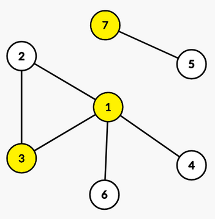

<h1 style='text-align: center;'> F. Babysitting</h1>

<h5 style='text-align: center;'>time limit per test: 7 seconds</h5>
<h5 style='text-align: center;'>memory limit per test: 256 megabytes</h5>

Theofanis wants to play video games, however he should also take care of his sister. Since Theofanis is a CS major, he found a way to do both. He will install some cameras in his house in order to make sure his sister is okay.

His house is an undirected graph with $n$ nodes and $m$ edges. His sister likes to play at the edges of the graph, so he has to install a camera to at least one endpoint of every edge of the graph. Theofanis wants to find a [vertex cover](https://en.wikipedia.org/wiki/Vertex_cover) that maximizes the minimum difference between indices of the chosen nodes.

More formally, let $a_1, a_2, \ldots, a_k$ be a vertex cover of the graph. Let the minimum difference between indices of the chosen nodes be the minimum $\lvert a_i - a_j \rvert$ (where $i \neq j$) out of the nodes that you chose. If $k = 1$ then we assume that the minimum difference between indices of the chosen nodes is $n$. 

Can you find the maximum possible minimum difference between indices of the chosen nodes over all vertex covers?

### Input

The first line contains a single integer $t$ ($1 \le t \le 10^4$) — the number of test cases.

The first line of each test case contains two integers $n$ and $m$ ($1 \le n \le 10^{5}, 1 \le m \le 2 \cdot 10^{5}$) — the number of nodes and the number of edges. 

The $i$-th of the following $m$ lines in the test case contains two positive integers $u_i$ and $v_i$ ($1 \le u_i,v_i \le n$), meaning that there exists an edge between them in the graph. 

It is guaranteed that the sum of $n$ over all test cases does not exceed $10^{5}$.

It is guaranteed that the sum of $m$ over all test cases does not exceed $2 \cdot 10^{5}$.

### Output

For each test case, print the maximum minimum difference between indices of the chosen nodes over all vertex covers.

## Example

### Input


```text
37 61 21 31 41 62 35 73 31 21 31 12 41 21 22 11 1
```
### Output

```text

2
3
2

```
## Note

In the first test case, we can install cameras at nodes $1$, $3$, and $7$, so the answer is $2$.

  In the second test case, we can install only one camera at node $1$, so the answer is $3$.


#### Tags 

#2500 #NOT OK #2-sat #binary_search #data_structures #graphs #trees 

## Blogs
- [All Contest Problems](../Codeforces_Round_912_(Div._2).md)
- [Announcement (en)](../blogs/Announcement_(en).md)
- [Tutorial (en)](../blogs/Tutorial_(en).md)
