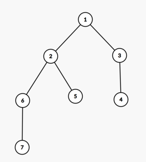
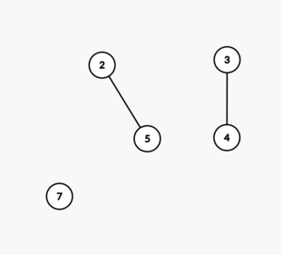

<h1 style='text-align: center;'> E. Tree Queries</h1>

<h5 style='text-align: center;'>time limit per test: 4 seconds</h5>
<h5 style='text-align: center;'>memory limit per test: 512 megabytes</h5>

Those who don't work don't eat. Get the things you want with your own power. But believe, the earnest and serious people are the ones who have the last laugh... But even then, I won't give you a present.—Santa, Hayate no Gotoku!Since Hayate didn't get any Christmas presents from Santa, he is instead left solving a tree query problem.

Hayate has a tree with $n$ nodes.

Hayate now wants you to answer $q$ queries. Each query consists of a node $x$ and $k$ other additional nodes $a_1,a_2,\ldots,a_k$. These $k+1$ nodes are guaranteed to be all distinct.

For each query, you must find the length of the longest simple path starting at node $x^\dagger$ after removing nodes $a_1,a_2,\ldots,a_k$ along with all edges connected to at least one of nodes $a_1,a_2,\ldots,a_k$.

$^\dagger$ A simple path of length $k$ starting at node $x$ is a sequence of distinct nodes $x=u_0,u_1,\ldots,u_k$ such that there exists a edge between nodes $u_{i-1}$ and $u_i$ for all $1 \leq i \leq k$.

#### Input

The first line contains two integers $n$ and $q$ ($1 \le n, q \le 2 \cdot 10^5$) — the number of nodes of the tree and the number of queries.

The following $n - 1$ lines contain two integers $u$ and $v$ ($1 \le u, v \le n$, $u \ne v$) — denoting an edge between nodes $u$ and $v$. It is guaranteed that the given edges form a tree.

The following $q$ lines describe the queries. Each line contains the integers $x$, $k$ and $a_1,a_2,\ldots,a_k$ ($1 \leq x \leq n$, $0 \leq k < n$, $1 \leq a_i \leq n$) — the starting node, the number of removed nodes and the removed nodes.

It is guaranteed that for each query, $x,a_1,a_2,\ldots,a_k$ are all distinct.

It is guaranteed that the sum of $k$ over all queries will not exceed $2 \cdot 10^5$.

#### Output

For each query, output a single integer denoting the answer for that query.

## Examples

#### Input


```text
7 7
1 2
1 3
3 4
2 5
2 6
6 7
2 0
2 1 1
2 2 1 6
3 1 4
3 1 1
5 0
5 2 1 6
```
#### Output


```text
3
2
1
4
1
4
1
```
#### Input


```text
4 4
1 2
1 3
2 4
2 1 3
3 1 4
2 1 4
2 3 1 3 4
```
#### Output


```text
1
2
2
0
```
## Note

In the first example, the tree is as follows: 

  In the first query, no nodes are missing. The longest simple path starting from node $2$ is $2 \to 1 \to 3 \to 4$. Thus, the answer is $3$.

In the third query, nodes $1$ and $6$ are missing and the tree is shown below. The longest simple path starting from node $2$ is $2 \to 5$. Thus, the answer is $1$. 

  

#### Tags 

#2500 #NOT OK #data_structures #dfs_and_similar #graphs #implementation #trees 

## Blogs
- [All Contest Problems](../Codeforces_Round_914_(Div._2).md)
- [Announcement (en)](../blogs/Announcement_(en).md)
- [Tutorial (en)](../blogs/Tutorial_(en).md)
