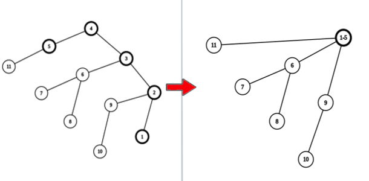

<h1 style='text-align: center;'> B. Begginer's Zelda</h1>

<h5 style='text-align: center;'>time limit per test: 1 second</h5>
<h5 style='text-align: center;'>memory limit per test: 256 megabytes</h5>

You are given a tree$^{\dagger}$. In one zelda-operation you can do follows:

* Choose two vertices of the tree $u$ and $v$;
* Compress all the vertices on the path from $u$ to $v$ into one vertex. In other words, all the vertices on path from $u$ to $v$ will be erased from the tree, a new vertex $w$ will be created. Then every vertex $s$ that had an edge to some vertex on the path from $u$ to $v$ will have an edge to the vertex $w$.

  Illustration of a zelda-operation performed for vertices $1$ and $5$. Determine the minimum number of zelda-operations required for the tree to have only one vertex.

$^{\dagger}$A tree is a connected acyclic undirected graph.

### Input

Each test consists of multiple test cases. The first line contains a single integer $t$ ($1 \le t \le 10^4$) — the number of test cases. The description of the test cases follows.

The first line of each test case contains a single integer $n$ ($2 \le n \le 10^5$) — the number of vertices.

$i$-th of the next $n − 1$ lines contains two integers $u_i$ and $v_i$ ($1 \le u_i, v_i \le n, u_i \ne v_i$) — the numbers of vertices connected by the $i$-th edge.

It is guaranteed that the given edges form a tree.

It is guaranteed that the sum of $n$ over all test cases does not exceed $10^5$.

### Output

For each test case, output a single integer — the minimum number of zelda-operations required for the tree to have only one vertex.

## Example

### Input


```text
441 21 33 493 13 53 25 66 77 87 96 471 21 32 44 53 62 761 21 31 44 52 6
```
### Output

```text

1
3
2
2

```
## Note

In the first test case, it's enough to perform one zelda-operation for vertices $2$ and $4$.

In the second test case, we can perform the following zelda-operations:

1. $u = 2, v = 1$. Let the resulting added vertex be labeled as $w = 10$;
2. $u = 4, v = 9$. Let the resulting added vertex be labeled as $w = 11$;
3. $u = 8, v = 10$. After this operation, the tree consists of a single vertex.


#### Tags 

#1100 #NOT OK #greedy #trees 

## Blogs
- [All Contest Problems](../Codeforces_Round_915_(Div._2).md)
- [Announcement (en)](../blogs/Announcement_(en).md)
- [Tutorial (en)](../blogs/Tutorial_(en).md)
