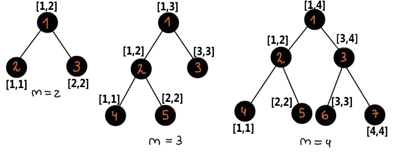

<h1 style='text-align: center;'> E. One-X</h1>

<h5 style='text-align: center;'>time limit per test: 3 seconds</h5>
<h5 style='text-align: center;'>memory limit per test: 512 megabytes</h5>

In this sad world full of imperfections, ugly segment trees exist.

A segment tree is a tree where each node represents a segment and has its number. A segment tree for an array of $n$ elements can be built in a recursive manner. Let's say function $\operatorname{build}(v,l,r)$ builds the segment tree rooted in the node with number $v$ and it corresponds to the segment $[l,r]$.

Now let's define $\operatorname{build}(v,l,r)$: 

* If $l=r$, this node $v$ is a leaf so we stop adding more edges
* Else, we add the edges $(v, 2v)$ and $(v, 2v+1)$. Let $m=\lfloor \frac{l+r}{2} \rfloor$. Then we call $\operatorname{build}(2v,l,m)$ and $\operatorname{build}(2v+1,m+1,r)$.

So, the whole tree is built by calling $\operatorname{build}(1,1,n)$.

Now Ibti will construct a segment tree for an array with $n$ elements. He wants to find the sum of $\operatorname{lca}^\dagger(S)$, where $S$ is a non-empty subset of leaves. Notice that there are exactly $2^n - 1$ possible subsets. Since this sum can be very large, output it modulo $998\,244\,353$.

$^\dagger\operatorname{lca}(S)$ is the number of the least common ancestor for the nodes that are in $S$.

### Input

Each test consists of multiple test cases. The first line contains a single integer $t$ ($1 \le t \le 10^3$) — the number of test cases. The description of the test cases follows.

The first line of each test case contains a single integer $n$ ($2 \le n \le 10^{18}$) — the length of the array for which the segment tree is built.

### Output

For each test case, output a single integer — the required sum modulo $998\,244\,353$.

## Example

### Input


```text
5234553278
```
### Output

```text

6
17
36
69
593324855

```
## Note

  In the first test case:

Let's look at all subsets of leaves.

* $\operatorname{lca}(\{2\})=2$;
* $\operatorname{lca}(\{3\})=3$;
* $\operatorname{lca}(\{2,3\})=1$.

Thus, the answer is $2+3+1=6$.

In the second test case:

Let's look at all subsets of leaves.

* $\operatorname{lca}(\{4\})=4$;
* $\operatorname{lca}(\{5\})=5$;
* $\operatorname{lca}(\{3\})=3$;
* $\operatorname{lca}(\{4,5\})=2$;
* $\operatorname{lca}(\{4,3\})=1$;
* $\operatorname{lca}(\{5,3\})=1$;
* $\operatorname{lca}(\{4,5,3\})=1$;

Thus, the answer is $4+5+3+2+1+1+1=17$.


#### Tags 

#2400 #NOT OK #combinatorics #dfs_and_similar #dp #math #trees 

## Blogs
- [All Contest Problems](../Codeforces_Round_915_(Div._2).md)
- [Announcement (en)](../blogs/Announcement_(en).md)
- [Tutorial (en)](../blogs/Tutorial_(en).md)
