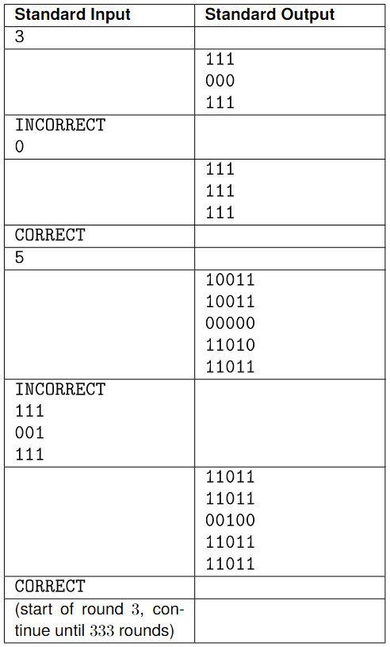
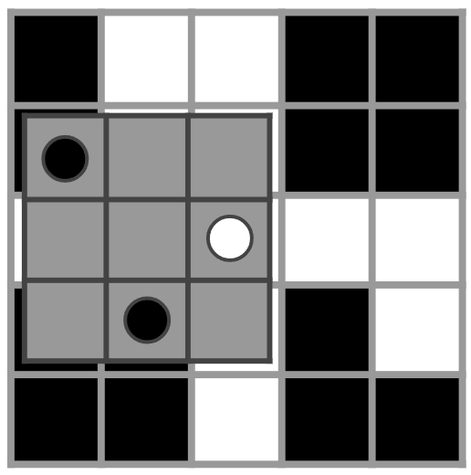

<h1 style='text-align: center;'> C. Cursed Game</h1>

<h5 style='text-align: center;'>time limit per test: 1 second</h5>
<h5 style='text-align: center;'>memory limit per test: 1024 megabytes</h5>

You found an antique box in your warehouse and decided to open it. The moment you open the box, it traps you into a cursed game where you are playing against a demon. The game consists of $333$ rounds and you have to win all rounds in order to escape. The demon also gives you $999$ coins that you can use throughout all rounds.

## Note

 that in this problem, denote cell $(r, c)$ of a grid as the cell in row $r$ and column $c$ of the grid.

Before the start of each round, the demon will prepare a secret paper, which can be represented as a grid with $3$ rows and $3$ columns, both numbered from $1$ to $3$. The demon will secretly put a hole in one or more cells, and you are not aware which cells have a hole in it. Then, the round starts with the demon giving you an odd integer $N$ ($3 \leq N \leq 33$).

Within each round, you can ask the demon several queries, each costing you one coin. For each query, you are allowed to give the demon your paper, which can be represented as a grid with $N$ rows and $N$ columns, both numbered from $1$ to $N$. Each cell is coloured either black or white by you.

For each of your query, the demon will calculate a binary result grid with $N - 2$ rows and $N - 2$ columns, both numbered from $1$ to $N - 2$. The value on cell $(r, c)$ of the result grid is filled as follows.

* The demon will put the secret paper on top of your paper such that the cell $(r + i - 1, c + j - 1)$ of your paper aligns with the cell $(i, j)$ of the secret paper, for $1 \leq i, j \leq 3$.
* The demon can only see the colour of the cell in your paper if the corresponding cell in the secret paper has a hole in it.
* The value on cell $(r, c)$ of the result grid is $1$ if there is an odd number of black cells that it can see through the holes, or $0$ otherwise.

You win the round if the result grid consists of only the values $1$. Otherwise, the demon will give you the result grid as a feedback, and the round continues.

If you have spent all the coins and still did not win all the rounds, then you will be trapped forever. Escape the cursed game!

## Interaction

Each round is started with an odd integer $N$ ($3 \leq N \leq 33$) which can be read through standard input.

Then, for each query that you give to the demon, you can output $N$ lines to standard output. Each of the $N$ lines consists of $N$ characters. The $c$-th character of the $r$-th line represents the colour of cell $(r, c)$ in your paper. The character should be 1 if $(r, c)$ is coloured black, or 0 if coloured white.

The demon will reply with one line consisting of a string, which can be read through standard input.

* If the string is CORRECT, then you win the current round and the next round (if exists) will immediately start.
* If the string is INCORRECT, then the demon will give you $N - 2$ more lines which can be read through standard input. Each of the $N - 2$ lines consists of $N - 2$ characters, representing the binary result grid as explained in the description.

The demon prepares the secret paper before the start of each round. In other words, the grader is NOT adaptive. There will be at least one hole in the secret paper.

The total number of queries across all $333$ rounds should not exceed $999$. If you exceed the maximum number of queries, you should terminate your program with $0$ to receive the verdict Wrong Answer. If you do not terminate, the judging result would be undefined because your program is reading from a closed stream.

Do not forget to flush output buffers after each output. In C you can use fflush(stdout). In C++ you can use fflush(stdout) or cout « flush. In Java you can use method flush for output stream, for example, System.out.flush(). In Python you can use stdout.flush().

## Note

Sample 
## Interaction

 #1

The following interaction only shows $2$ rounds. The actual interaction stays until you win all $333$ rounds or you run out of coins.

  Explanation for the sample interaction #1

For the first round, the following illustration shows how the demon finds the value in cell $(1, 1)$ of the result grid for the first and second queries. The grey-colored square represents the secret paper, and the circles represent the holes. In the first query, there are $4$ black cells that can be seen through the holes, therefore the value in cell $(1, 1)$ of the result grid is $0$. In the second query, there are $5$ black cells that can be seen through the holes, therefore the value in cell $(1, 1)$ of the result grid is $1$. As the result grid consists of only 1, the first round ends.

  For the second round, the following illustration shows how the demon find the value in cell $(2, 1)$ of the result grid for the first query. Since there are $2$ black cells that can be seen through the holes, the value in cell $(2, 1)$ is $0$.

  

#### Tags 

#3000 #NOT OK #interactive 

## Blogs
- [All Contest Problems](../2023-2024_ICPC,_Asia_Jakarta_Regional_Contest_(Online_Mirror,_Unrated,_ICPC_Rules,_Teams_Preferred).md)
- [Announcement (en)](../blogs/Announcement_(en).md)
