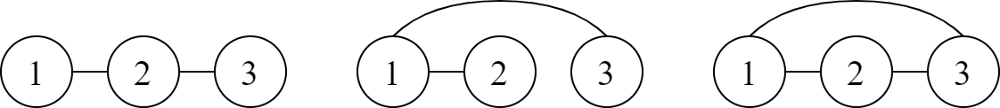

<h1 style='text-align: center;'> J. Count BFS Graph</h1>

<h5 style='text-align: center;'>time limit per test: 1 second</h5>
<h5 style='text-align: center;'>memory limit per test: 1024 megabytes</h5>

You are currently researching a graph traversal algorithm called the Breadth First Search (BFS). Suppose you have an input graph of $N$ nodes (numbered from $1$ to $N$). The graph is represented by an adjacency matrix $M$, for which node $u$ can traverse to node $v$ if $M_{u, v}$ is $1$, otherwise it is $0$. Your algorithm will output the order the nodes are visited in the BFS. The pseudocode of the algorithm is presented as follows.


```text
  
    BFS(M[1..N][1..N]):  
        let A be an empty array  
        let Q be an empty queue  
  
        append 1 to A  
        push 1 to Q  
  
        while Q is not empty:  
            pop the front element of Q into u  
            for v = 1 to N:  
                if M[u][v] == 1 and v is not in A:  
                    append v to A  
                    push v to Q  
  
        return A  

```
During your research, you are interested in the following problem. Given an array $A$ such that $A$ is a permutation of $1$ to $N$ and $A_1 = 1$. How many simple undirected graph with $N$ nodes and adjacency matrix $M$ such that $\text{BFS}(M) = A$? Since the answer can be very large, calculate the answer modulo $998\,244\,353$.

A simple graph has no self-loop ($M_{i, i} = 0$ for $1 \leq i \leq N$) and there is at most one edge that connects a pair of nodes. In an undirected graph, if node $u$ is adjacent to node $v$, then node $v$ is also adjacent to node $u$; formally, $M_{u, v} = M_{v, u}$ for $1 \leq u < v \leq N$.

Two graphs are considered different if there is an edge that exists in one graph but not the other. In other words, two graphs are considered different if their adjacency matrices are different.

###### Input

The first line consists of an integer $N$ ($2 \leq N \leq 5000$).

The second line consists of $N$ integers $A_i$. The array $A$ is a permutation of $1$ to $N$ and $A_1 = 1$.

###### Output

###### Output

 an integer representing the number of simple undirected graphs with $N$ nodes and adjacency matrix $M$ such that $\text{BFS}(M) = A$. Since the answer can be very large, output the answer modulo $998\,244\,353$.

## Examples

###### Input


```text
3
1 2 3
```
###### Output


```text
3
```
###### Input


```text
3
1 3 2
```
###### Output


```text
1
```
###### Input


```text
5
1 3 2 4 5
```
###### Output


```text
17
```
###### Input


```text
11
1 2 3 4 5 6 7 8 9 10 11
```
###### Output


```text
379394847
```
## Note

Explanation for the sample input/output #1

The following illustration shows all graphs that satisfy the requirements.

  Explanation for the sample input/output #2

The only graph that satisfies the requirements is a graph with two edges: one that connects nodes $1$ and $3$, and another one that connects nodes $3$ and $2$.


#### Tags 

#2100 #NOT OK #combinatorics #dp 

## Blogs
- [All Contest Problems](../2023-2024_ICPC,_Asia_Jakarta_Regional_Contest_(Online_Mirror,_Unrated,_ICPC_Rules,_Teams_Preferred).md)
- [Announcement (en)](../blogs/Announcement_(en).md)
