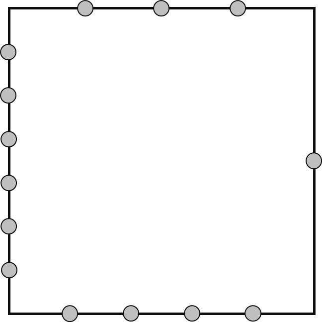
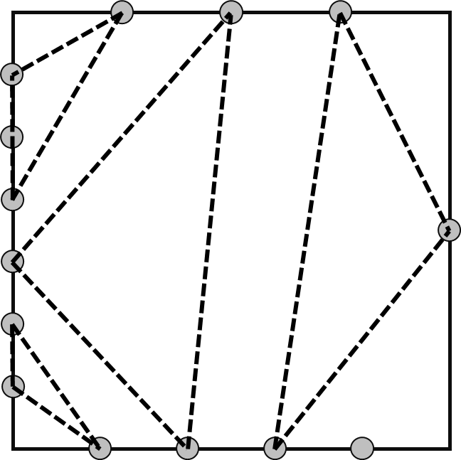
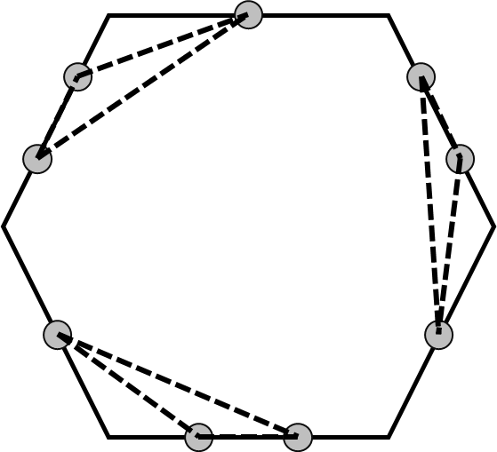

<h1 style='text-align: center;'> M. Triangle Construction</h1>

<h5 style='text-align: center;'>time limit per test: 1 second</h5>
<h5 style='text-align: center;'>memory limit per test: 1024 megabytes</h5>

You are given a regular $N$-sided polygon. Label one arbitrary side as side $1$, then label the next sides in clockwise order as side $2$, $3$, $\dots$, $N$. There are $A_i$ special points on side $i$. These points are positioned such that side $i$ is divided into $A_i + 1$ segments with equal length.

For instance, suppose that you have a regular $4$-sided polygon, i.e., a square. The following illustration shows how the special points are located within each side when $A = [3, 1, 4, 6]$. The uppermost side is labelled as side $1$.

  You want to create as many non-degenerate triangles as possible while satisfying the following requirements. Each triangle consists of $3$ distinct special points (not necessarily from different sides) as its corners. Each special point can only become the corner of at most $1$ triangle. All triangles must not intersect with each other.

Determine the maximum number of non-degenerate triangles that you can create.

A triangle is non-degenerate if it has a positive area.

##### Input

The first line consists of an integer $N$ ($3 \leq N \leq 200\,000$).

The following line consists of $N$ integers $A_i$ ($1 \leq A_i \leq 2 \cdot 10^9$).

##### Output

##### Output

 a single integer representing the maximum number of non-degenerate triangles that you can create.

## Examples

##### Input


```text
4
3 1 4 6
```
##### Output


```text
4
```
##### Input


```text
6
1 2 1 2 1 2
```
##### Output


```text
3
```
##### Input


```text
3
1 1 1
```
##### Output


```text
1
```
## Note

Explanation for the sample input/output #1

One possible construction which achieves maximum number of non-degenerate triangles can be seen in the following illustration. 

  Explanation for the sample input/output #2

One possible construction which achieves maximum number of non-degenerate triangles can be seen in the following illustration. 

  

#### Tags 

#1700 #NOT OK #greedy #math 

## Blogs
- [All Contest Problems](../2023-2024_ICPC,_Asia_Jakarta_Regional_Contest_(Online_Mirror,_Unrated,_ICPC_Rules,_Teams_Preferred).md)
- [Announcement (en)](../blogs/Announcement_(en).md)
