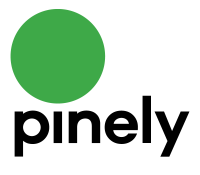
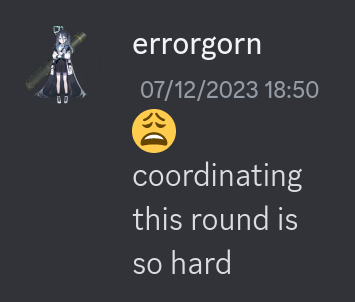

# Announcement_(en)

 Ciao, Codeforces! We're glad to invite you to take part in [Pinely Round 3 (Div. 1 + Div. 2)](https://codeforces.com/contest/1909), which will start on [Saturday, December 23, 2023 at 20:35UTC+6](https://codeforces.com/https://www.timeanddate.com/worldclock/fixedtime.html?day=23&month=12&year=2023&hour=17&min=35&sec=0&p1=166). You will be given **9 problems** and **3 hours** to solve them. One of the problems will be divided into two subtasks.

The problems were authored and prepared by me.

 **Spoiler**

We would like to thank

 * [errorgorn](https://codeforces.com/profile/errorgorn "International Grandmaster errorgorn") for his fun 🤌 🤡 🤓 😩 coordination;
* [Alexdat2000](https://codeforces.com/profile/Alexdat2000 "Master Alexdat2000") for Russian translation;
* [franv](https://codeforces.com/profile/franv "Candidate Master franv") for writing 173173 lines of checker of problem H correctly at the first try;
* [franv](https://codeforces.com/profile/franv "Candidate Master franv") for pictures in the editorial;
* [dario2994](https://codeforces.com/profile/dario2994 "International Grandmaster dario2994"), [Endagorion](https://codeforces.com/profile/Endagorion "International Grandmaster Endagorion"), [ffao](https://codeforces.com/profile/ffao "International Grandmaster ffao"), [Golovanov399](https://codeforces.com/profile/Golovanov399 "International Grandmaster Golovanov399"), [nor](https://codeforces.com/profile/nor "Master nor") for VIP testing;
* [Kaey](https://codeforces.com/profile/Kaey "Master Kaey"), [MrBrionix](https://codeforces.com/profile/MrBrionix "Master MrBrionix"), [lorenzoferrari](https://codeforces.com/profile/lorenzoferrari "Candidate Master lorenzoferrari"), [nicksms](https://codeforces.com/profile/nicksms "Master nicksms"), [fwitt](https://codeforces.com/profile/fwitt "Master fwitt"), [milind0110](https://codeforces.com/profile/milind0110 "Master milind0110"), [jamesbamber](https://codeforces.com/profile/jamesbamber "Master jamesbamber"), [alls](https://codeforces.com/profile/alls "Expert alls"), [dorijanlendvaj](https://codeforces.com/profile/dorijanlendvaj "Legendary Grandmaster dorijanlendvaj"), [sunsh1ne](https://codeforces.com/profile/sunsh1ne "Candidate Master sunsh1ne"), [BrehamPie](https://codeforces.com/profile/BrehamPie "Expert BrehamPie"), [31ballons](https://codeforces.com/profile/31ballons "Candidate Master 31ballons"), [gamegame](https://codeforces.com/profile/gamegame "Legendary Grandmaster gamegame"), [AndreySergunin](https://codeforces.com/profile/AndreySergunin "International Grandmaster AndreySergunin"), [zeliboba](https://codeforces.com/profile/zeliboba "Grandmaster zeliboba"), [Jarnsida](https://codeforces.com/profile/Jarnsida "Pupil Jarnsida"), [I_L0Ve_MySelF](https://codeforces.com/profile/I_L0Ve_MySelF "Specialist I_L0Ve_MySelF"), [1L1YA](https://codeforces.com/profile/1L1YA "Master 1L1YA"), [MrAndria](https://codeforces.com/profile/MrAndria "Expert MrAndria"), [TheRubbish](https://codeforces.com/profile/TheRubbish "Candidate Master TheRubbish"), [omsincoconut](https://codeforces.com/profile/omsincoconut "Expert omsincoconut"), [jerefigo](https://codeforces.com/profile/jerefigo "Expert jerefigo"), [dazlersan1](https://codeforces.com/profile/dazlersan1 "Specialist dazlersan1"), [t0rtik](https://codeforces.com/profile/t0rtik "Specialist t0rtik"), [nondeterministic](https://codeforces.com/profile/nondeterministic "Specialist nondeterministic"), [SetBackIsBest](https://codeforces.com/profile/SetBackIsBest "Newbie SetBackIsBest"), [vantaablackk](https://codeforces.com/profile/vantaablackk "Specialist vantaablackk"), [htetgm](https://codeforces.com/profile/htetgm "Candidate Master htetgm"), [BestCrazyNoob](https://codeforces.com/profile/BestCrazyNoob "Expert BestCrazyNoob"), [LaMatematica14](https://codeforces.com/profile/LaMatematica14 "Specialist LaMatematica14"), [OgradL](https://codeforces.com/profile/OgradL "Expert OgradL"), [bitset](https://codeforces.com/profile/bitset "Master bitset"), [magnus.hegdahl](https://codeforces.com/profile/magnus.hegdahl "Grandmaster magnus.hegdahl"), [Mirali777](https://codeforces.com/profile/Mirali777 "Master Mirali777"), [Nika533](https://codeforces.com/profile/Nika533 "Expert Nika533"), [silxi](https://codeforces.com/profile/silxi "Master silxi"), [ttamx](https://codeforces.com/profile/ttamx "Master ttamx"), [ApraCadabra](https://codeforces.com/profile/ApraCadabra "Master ApraCadabra"), [pera2008](https://codeforces.com/profile/pera2008 "Candidate Master pera2008"), [Sokol080808](https://codeforces.com/profile/Sokol080808 "Master Sokol080808"), [A_G](https://codeforces.com/profile/A_G "International Grandmaster A_G") for testing;
* [MikeMirzayanov](https://codeforces.com/profile/MikeMirzayanov "Headquarters, MikeMirzayanov") for creating Codeforces and Polygon.

Score distribution: 500−1000−1500−2000−2500−(1500+1500)−4000−6000−6000500−1000−1500−2000−2500−(1500+1500)−4000−6000−6000

We hope you'll like the problemset!

**Update 1**: the editorial is [here](Tutorial_(en).md).

**Update 2**: congratulations to the winners!

 **Winners and first solves**Winners:

 1. [zh0ukangyang](https://codeforces.com/profile/zh0ukangyang "Legendary Grandmaster zh0ukangyang")
2. [maroonrk](https://codeforces.com/profile/maroonrk "Legendary Grandmaster maroonrk")
3. [jiangly](https://codeforces.com/profile/jiangly "Legendary Grandmaster jiangly")
4. [FastFreeTask](https://codeforces.com/profile/FastFreeTask "International Grandmaster FastFreeTask")
5. [ksun48](https://codeforces.com/profile/ksun48 "Legendary Grandmaster ksun48")
6. [ugly2333](https://codeforces.com/profile/ugly2333 "International Grandmaster ugly2333")
7. [Um_nik](https://codeforces.com/profile/Um_nik "Legendary Grandmaster Um_nik")
8. [cnnfls_csy](https://codeforces.com/profile/cnnfls_csy "Legendary Grandmaster cnnfls_csy")
9. [maspy](https://codeforces.com/profile/maspy "International Grandmaster maspy")
10. [HaitangSuki](https://codeforces.com/profile/HaitangSuki "International Grandmaster HaitangSuki")

First solves:

 * A: [Barys](https://codeforces.com/profile/Barys "Expert Barys")
* B: [tourist](https://codeforces.com/profile/tourist "Legendary Grandmaster tourist")
* C: [Petr](https://codeforces.com/profile/Petr "Legendary Grandmaster Petr")
* D: [maspy](https://codeforces.com/profile/maspy "International Grandmaster maspy")
* E: [QueenOfDiamonds](https://codeforces.com/profile/QueenOfDiamonds "Master QueenOfDiamonds")
* F1: [ksun48](https://codeforces.com/profile/ksun48 "Legendary Grandmaster ksun48")
* F2: [menjihuang](https://codeforces.com/profile/menjihuang "International Master menjihuang")
* G: [zh0ukangyang](https://codeforces.com/profile/zh0ukangyang "Legendary Grandmaster zh0ukangyang")
* H: [maroonrk](https://codeforces.com/profile/maroonrk "Legendary Grandmaster maroonrk")
* I: [zh0ukangyang](https://codeforces.com/profile/zh0ukangyang "Legendary Grandmaster zh0ukangyang")
#### This round is made possible with the support of Pinely!

Pinely is an algorithmic trading firm, with its main focus set on high-frequency and ultra-low-latency trading. They have offices in Amsterdam, Limassol, Singapore, and Shanghai and are open for job discussions. Pinely is a team of winners, awardees, and medalists of various competitions in respective fields such as ICPC, IMC, HITB PRO CTF, and Google HashCode, etc. They constantly face various challenges such as developing strategies for trading, optimizing trading systems to achieve the lowest latency reactions to various market events, and saving and processing large volumes of historical data.

You can find out more about Pinely on their [website](https://codeforces.com/http://pinely.com) or from their employees registered [here](https://codeforces.com/ratings/organization/31353) on Codeforces. If you want to join the Pinely team, please send your CV to [hr@pinely.com](https://codeforces.com/hr@pinely.com) or fill in the form:

  [Apply](https://codeforces.com/userForm/ccf49a5fabd0a722) **Prizes**: top 30 contestants and 10 random contestants placed 31-100 will receive a branded Pinely hoodie :)

