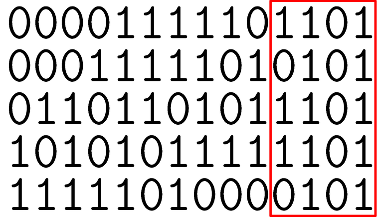
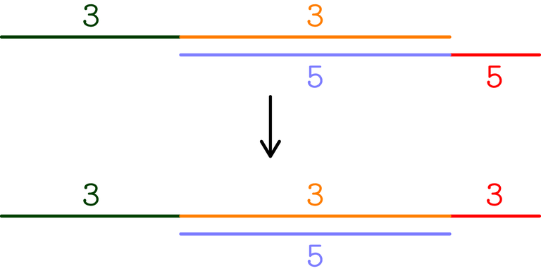
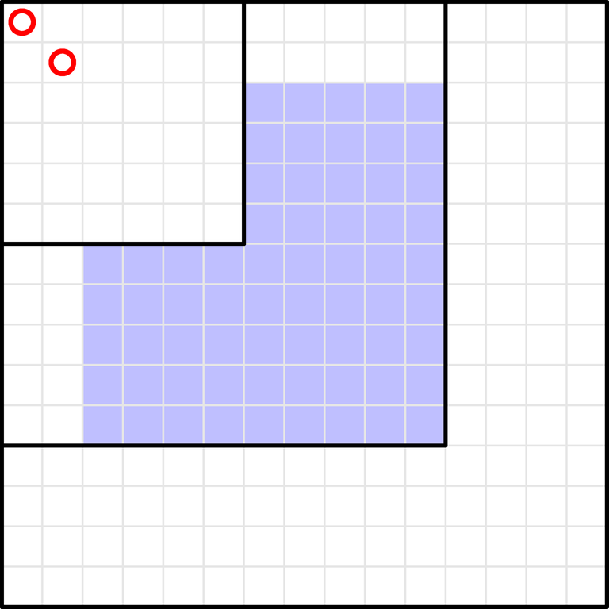
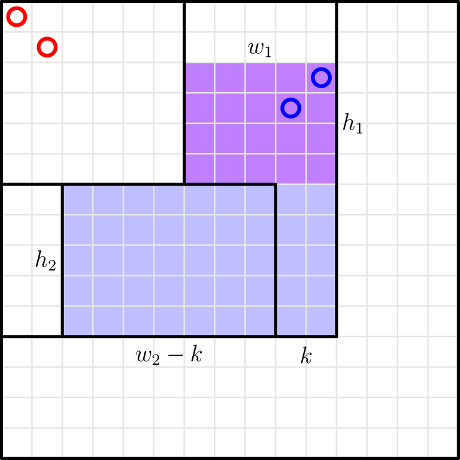

# Tutorial_(en)

The official implementations of all the problems are [here](https://codeforces.com/https://drive.google.com/file/d/1q2PHS9nJt84FRwfMoiMslQULFE4dTMU4/view?usp=sharing).

 **Timeline of the round proposal (may contain spoilers)**(problems D', H', etc. were not used)

 * Feb 19, 2022: I proposed problem D' to [Codeforces Round 778 (Div. 1 + Div. 2, based on Technocup 2022 Final Round)](https://codeforces.com/contest/1654), but it was not used.
* Mar 13, 2023: I invented problem A.
* May 16: I invented problem H'.
* May 19: I realized problem G can be solved in O(n) time and we used it in the Italian team selection test for IOI.
* Jul 04: I opened a Div. 1 proposal containing A, D', G, H' and other problems which are not going to be used.
* Aug 09: I invented problem I, with intended solution in O(n3).
* Sep 27: I invented problem C.
* Oct 14: [errorgorn](https://codeforces.com/profile/errorgorn "International Grandmaster errorgorn") replied to my contest proposal.
* Nov 02: I invented problem D''. [errorgorn](https://codeforces.com/profile/errorgorn "International Grandmaster errorgorn") solved problem I in O(n2logn).
* Nov 08: I invented problems E and F. I didn't propose problem F because I thought it was too easy.
* Nov 10: I invented problem H with O(nlogn) operations. We had a preliminary problemset, with problems A, D', C, D'', E, H1, G, H', I. I started preparing the problems.
* Nov 14: I finished preparing the problems, and the round was ready for testing. [dario2994](https://codeforces.com/profile/dario2994 "International Grandmaster dario2994") tested and didn't solve problem D''. I realized the official solution of problem D'' was wrong (and now I don't have any solution).
* Nov 15: I removed problem D'' from the contest and replaced it with problem F.
* Nov 17: I invented problem E'.
* Nov 19: I invented problem F', which was rejected because it was proposed independently to [errorgorn](https://codeforces.com/profile/errorgorn "International Grandmaster errorgorn") by the authors of another round.
* Nov 22: [gamegame](https://codeforces.com/profile/gamegame "Legendary Grandmaster gamegame") tested and said problem H' is well-known in China. I removed it.
* Nov 26: we realized problem D' was too hard for position B.
* Nov 28: I invented problem D with k=1 and ai≥2, and I proposed it as B.
* Nov 29: I invented problem B. [Endagorion](https://codeforces.com/profile/Endagorion "International Grandmaster Endagorion") solved problem H in 2n operations.
* Dec 07: the problemset was A, B, C, D', F1, F2, E, G, H1, H2, I, but there was a huge gap between D' and the next problems. We ended up using A, B, C, D, E', E, F2, G, H2, I (i.e., 10 problems). D still had k=1 and ai≥2.
* Dec 13: we removed the constraints k=1 and ai≥2 from problem D.
* Dec 18: problem E' appeared in [Educational Codeforces Round 160 (Rated for Div. 2)](https://codeforces.com/contest/1913 "Educational Codeforces Round 160 (Rated for Div. 2)"). We removed it and we decided to use subtasks on problem F.
[1909A - Distinct Buttons](../problems/A._Distinct_Buttons.md)

Author: [TheScrasse](https://codeforces.com/profile/TheScrasse "Grandmaster TheScrasse")  
 Preparation: [TheScrasse](https://codeforces.com/profile/TheScrasse "Grandmaster TheScrasse")

 **Hint 1**Suppose you can only use U, R, D. Which cells can you reach?

 **Solution**If you only use buttons U, R, D, you can never reach the points with x<0. However, if all the special points have x≥0, you can reach all of them with the following steps:

 * visit all the special points with x=0, using the buttons U, D;
* press the button R to reach x=1;
* visit all the special points with x=1, using the buttons U, D;
* …
* visit all the special points with x=100, using the buttons U, D.

Similarly, if you use at most 3 buttons in total, you can reach all the special points if at least one of the following conditions is true:

 * all xi≥0;
* all xi≤0;
* all yi≥0;
* all yi≤0.

Complexity: O(n)

[1909B - Make Almost Equal With Mod](../problems/B._Make_Almost_Equal_With_Mod.md)

Author: [TheScrasse](https://codeforces.com/profile/TheScrasse "Grandmaster TheScrasse")  
 Preparation: [TheScrasse](https://codeforces.com/profile/TheScrasse "Grandmaster TheScrasse")

 **Hint 1**Find a value of k that works in many cases.

 **Hint 2**k=2 works in many cases. What if it does not work?

 **Hint 3**If k=2 does not work, either all the numbers are even or all the numbers are odd. Which k can you try now?

 **Solution**Let f(k) be the number of distinct values after the operation, using k.

Let's try k=2. It works in all cases, except when either all the numbers are even or all the numbers are odd.

Let's generalize. If ai mod k=x, one of the following holds:

 * ai mod 2k=x;
* ai mod 2k=x+k;

It means that, if f(k)=1 (i.e., all the values after the operations are x), either f(2k)=1 (if either all the values become x, or they all become x+k), or f(2k)=2.

Therefore, it is sufficient to try k=21,…,257. In fact, f(1)=1 and f(257)=n, so there must exist m<57 such that f(2m)=1 and f(2m+1)≠1⟹f(2m+1)=2.

Alternative (more intuitive?) interpretation:

 * ai mod 2j corresponds to the last j digits in the binary representation of ai. There must exist j such that the last j digits make exactly 2 distinct blocks.

In the following picture, a=[1005,2005,7005,11005,16005] and k=16:

 **Picture**

Complexity: O(nlog(maxai))

[1909C - Heavy Intervals](../problems/C._Heavy_Intervals.md)

Author: [TheScrasse](https://codeforces.com/profile/TheScrasse "Grandmaster TheScrasse")  
 Preparation: [TheScrasse](https://codeforces.com/profile/TheScrasse "Grandmaster TheScrasse")

 **Hint 1**Assign bigger costs to shorter intervals.

 **Hint 2**Solve the problem with n=2.

 **Hint 3**Solve the following case: l=[1,2], r=[3,4], c=[1,2]. Can you generalize it?

 **Solution**You have to match each li with some rj>li.

Construct v=l1,l2,…,ln,r1,r2,…,rn and sort it. If you replace every li with the symbol ( and every ri with the symbol ), you get a [regular bracket sequence](https://codeforces.com/https://cp-algorithms.com/combinatorics/bracket_sequences.html) (sketch of proof: li<ri for each i, so each prefix of symbols contains at least as many ( as ), so the bracket sequence is regular).

Now match each ( with the [corresponding](https://codeforces.com/https://en.wikipedia.org/wiki/Bracket_matching) ). You can show that this is the optimal way to rearrange the li and the ri. (From now, let the li, ri and ci be the values after your rearrangement.)

Proof:

 * If you match the brackets in any other way, you get two intervals such that their intersection is non-empty but it is different from both intervals (i.e., you get li<lj<ri<rj).
* You have also assigned some cost ci to [li,ri] and cj to [lj,rj]. Without loss of generality, ci≤cj (the other case is symmetrical).
* If you swap ri and rj, the cost does not increase.
* Keep swapping endpoints until you get the "regular" bracket matching. You can show that the process ends in a finite number of steps. For example, you can show that ∑((ri−li)2) strictly increases after each step, and it is an integer ≤∑(r2i).

 **Picture**

Now, you can get the minimum cost by sorting the intervals by increasing length and sorting the ci in decreasing order.

Alternative (more intuitive?) interpretation:

 * If you solve the problem with n=2 and try to generalize, you can notice that it seems optimal to match every ri with the largest unused li (if you iterate over ri in increasing order).

You can implement the solution by using either a stack (to simulate the bracket matching) or a set (to find the largest unused li).

Complexity: O(nlogn)

[1909D - Split Plus K](../problems/D._Split_Plus_K.md)

Author: [TheScrasse](https://codeforces.com/profile/TheScrasse "Grandmaster TheScrasse")  
 Preparation: [TheScrasse](https://codeforces.com/profile/TheScrasse "Grandmaster TheScrasse")

 **Hint 1**Solve the problem with k=0.

 **Hint 2**Solve the problem with generic k. When is the answer −1?

 **Hint 3**Do you notice any similarities between the cases with k=0 and with generic k?

 **Solution**Consider the "shifted" problem, where each x on the blackboard (at any moment) is replaced with x′=x−k.

Now, the operation becomes "replace x with y+z such that y+z=x+k⟹(y′+k)+(z′+k)=(x′+k)+k⟹y′+z′=x′". Therefore, in the shifted problem, k′=0.

Now you can replace every a′i:=ai−k with any number of values with sum a′i, and the answer is the amount of numbers on the blackboard at the end, minus n.

If we want to make all the values equal to m′, it must be a divisor of every a′i.

 * If all the a′i are positive, it is optimal to choose m′=gcda′i.
* If all the a′i are zero, the answer is 0.
* If all the a′i are negative, it is optimal to choose m′=−gcd−a′i.
* Otherwise, the answer is −1.

Alternative way to get this result:

 * You have to split each ai into pi pieces equal to m, and their sum must be equal to ai+k(pi−1)=(ai−k)+kpi=mpi. Then, (ai−k)=(m−k)pi, so m′=m−k must be a divisor of every a′i=ai−k.

In both the positive and the negative case, you will only write positive elements (in the original setup), as wanted.

 * If all the a′i are positive, the numbers you will write on the shifted blackboard are positive, so they will be positive also in the original blackboard.
* If all the a′i are negative, the numbers you will write on the shifted blackboard are greater than the numbers you will erase, so they will be greater than the numbers in input (and positive) in the original blackboard.

Complexity: O(n+log(maxai))

[1909E - Multiple Lamps](../problems/E._Multiple_Lamps.md)

Author: [TheScrasse](https://codeforces.com/profile/TheScrasse "Grandmaster TheScrasse")  
 Preparation: [TheScrasse](https://codeforces.com/profile/TheScrasse "Grandmaster TheScrasse")

 **Hint 1**Find a strategy that turns "few" lamps on in most cases.

 **Hint 2**Pressing all the buttons turns ⌊√n⌋ lamps on.

 **Hint 3**If the strategy in Hint 2 does not work, at most 3 lamps must be on at the end.

 **Hint 4**Iterate over all subsets of at most 3 lamps that must be on at the end.

 **Solution**If you press all the buttons, lamp i is toggled by all the divisors of i, so it will be on if i has an odd number of divisors, i.e., if i is a perfect square.

Then, the strategy of pressing all the buttons works if ⌊√n⌋≤⌊n/5⌋, which is true for n≥20.

If n≤19, at most ⌊19/5⌋=3 lamps must be turned on at the end.

If you know which lamps must be turned on at the end, you can iterate over the buttons from 1 to n and press button i if and only if lamp i is in the wrong state. So you can iterate over all subsets of at most 3 lamps, and check if the corresponding choice of buttons is valid (i.e., the m constraints hold). You can remove a logn factor by precalculating the choice of buttons for all small subsets before running the testcases.

Complexity for each test: O(∑n+(∑m⋅k2k−4)) (if ⌊n/k⌋ lamps must be on; in this case, k=5).

[1909F1 - Small Permutation Problem (Easy Version)](../problems/F1._Small_Permutation_Problem_(Easy_Version).md), [1909F2 - Small Permutation Problem (Hard Version)](../problems/F2._Small_Permutation_Problem_(Hard_Version).md)

Author: [TheScrasse](https://codeforces.com/profile/TheScrasse "Grandmaster TheScrasse")  
 Preparation: [TheScrasse](https://codeforces.com/profile/TheScrasse "Grandmaster TheScrasse")

 **Hint 1**Find a clean way to visualize the problem.

 **Hint 2**Draw a n×n grid, with tokens in (i,pi). Which constraints on the tokens do you have?

 **Hint 3**You have some "L" shapes, and each of them must contain a fixed number of tokens (in [1909F1 - Small Permutation Problem (Easy Version)](../problems/F1._Small_Permutation_Problem_(Easy_Version).md) the shapes are 1 cell wide and must contain at most 2 tokens). Iterate over the shapes in increasing order of i.

 **Hint 4**Split each shape into 2 rectangles and iterate over the number of tokens in the first rectangle.

 **Solution**Draw a n×n grid, with tokens in (i,pi).

Consider any ai≠−1 and the nearest aj≠−1 on the left (if it does not exist, let's set j=aj=0). Then, there must be ai tokens in the subgrid [1,i]×[1,i]. We can suppose we have already inserted the aj tokens in [1,j]×[1,j], and we have to insert ai−aj tokens in the remaining cells of [1,i]×[1,i] (they make an "L" shape).

WLOG, the aj tokens in [1,j]×[1,j] are in the cells (1,1),…,(aj,aj). Then, we can put tokens in the blue cells in the picture.

 **Picture**

The blue shape can be further split into these two rectangles:

 **Picture**

Iterate over k, the number of tokens in the first rectangle (0≤k≤ai−aj). Then, you have to insert k tokens into a h1×w1 rectangle, and the remaining ai−aj−k tokens into a h2×(w2−k) rectangle.

The number of ways to insert k tokens into a h×w rectangle is equal to the product of the number of ways to choose k rows, the number of ways to choose k columns, and the number of ways to fill the resulting k×k subgrid: the result is (hk)(wk)k!.

an=n automatically (if an≠n and an≠−1, the answer is 0). If the non-negative ai are non-decreasing, the sum of the ai−aj+1 (i.e., the k over which you have to iterate) is O(n), so the algorithm is efficient enough. Otherwise, the answer is 0.

Complexity: O(n)

[1909G - Pumping Lemma](../problems/G._Pumping_Lemma.md)

Author: [TheScrasse](https://codeforces.com/profile/TheScrasse "Grandmaster TheScrasse")  
 Preparation: [TheScrasse](https://codeforces.com/profile/TheScrasse "Grandmaster TheScrasse")

 **Hint 1**If you remove the condition s=x+y+z, the problem becomes harder.

 **Hint 2**Solve for a fixed |y| (length of y).

 **Hint 3**Suppose you have found a valid y. Shift it one position to the right. When is it still valid?

 **Hint 4**The valid y with |y|=l start in consecutive positions.

 **Hint 5**Using the same idea of the proof of Hint 4, you can find all the valid y.

 **Solution**Let's use s[l,r] to indicate the substring [l,r] of s. Let's use (a,b) to indicate the triple of strings (s[1,a],s[a+1,b],s[b+1,n]).

Suppose (a,b) is valid. Then, (a+1,b+1) is valid if and only if sb+1=tb+1.

If (a,b) is valid, s[1,b]=t[1,b]; so if sb≠tb, (a+k,b+k) is invalid for k≥0. Therefore, if (a,b) is the first valid pair with b−a=l (i.e., with |y|=l), and k is the smallest positive integer such that (a+k,b+k) is invalid, then sb+k≠tb+k, so the only valid pairs with |y|=l are the (a+j,b+j) with 0≤j<k (i.e., the valid y with |y|=l start in consecutive positions).

Now let's find all the valid y with |y|=l. Suppose (a,b) is valid, and c is the minimum index such that sc≠tc. Then, b<c, and (a+k,b+k) is valid for all b≤b+k<c. Similarly, if d is the minimum integer such that sn−d≠tm−d, (a+k,b+k) is valid for all n−d<a+k≤a⟹n−d+l<b+k≤b.

Therefore, it's enough to check only one pair for each length, with b in [n−d+l+1,c−1] (because either all these pairs are valid or they are all invalid). This is possible by precomputing the rolling hash of the two strings. Alternatively, you can use z-function.

Complexity: O(n)

[1909H - Parallel Swaps Sort](../problems/H._Parallel_Swaps_Sort.md)

Author: [TheScrasse](https://codeforces.com/profile/TheScrasse "Grandmaster TheScrasse")  
 Full solution: [Endagorion](https://codeforces.com/profile/Endagorion "International Grandmaster Endagorion"), [errorgorn](https://codeforces.com/profile/errorgorn "International Grandmaster errorgorn")  
 Preparation: [TheScrasse](https://codeforces.com/profile/TheScrasse "Grandmaster TheScrasse"), [franv](https://codeforces.com/profile/franv "Candidate Master franv")

 **Hint 1**Find a strategy which is as simple and "easy to handle" as possible.

 **Hint 2**Only perform operations such that all swapped pairs have ai>ai+1. Let's call such subarrays "swappable".

 **Hint 3**First, for each i from left to right, do the operation on [j,i], where j is the minimum index such that [j,i] is swappable.

 **Hint 4**Repeat the same algorithm from right to left.

 **Hint 5**After Hints 3 and 4, the array is sorted. Prove it (it will be useful).

 **Hint 6**Assign B to the indices i such that ai<ai−1 and A to the other indices. During the process in Hint 3, after the operation on index i, which properties do A, B have in the prefix [1,i]?

 **Hint 7**Answer to Hint 6:

 * the values of type A are increasing;
* there are no two consecutive elements of type B.
 **Hint 8**The rest of the proof (i.e., what happens during the process in Hint 4) is relatively easy.

Now let's find an efficient implementation. We have to use the properties in Hint 7.

 **Hint 9**You have to find the longest AB…AB ending in position i, and perform the operation on it. What happens during the operation?

 **Hint 10**A will always remain A. For each B, you have to detect when it becomes A.

 **Hint 11**For each B, you can precompute the number of moves needed to make it A.

 **Hint 12**For example, you can use a segment tree with the following information: the type of each element, the positions of the elements of type B, and the number of moves required for each B to become A.

 **Solution**Let's only perform operations such that all swapped pairs have ai>ai+1. Let's call such subarrays "swappable".

 * First, for each i from left to right, do the operation on [j,i], where j is the minimum index such that [j,i] is swappable (let's call it "operation 1.i").
* Then, for each i from right to left, do the operation on [j,i], where j is the minimum index such that [j,i] is swappable (let's call it "operation 2.i").

After these operations, the array is sorted. Let's prove it.

Assign B to the indices i such that ai<ai−1 and A to the other indices. After operation 1.i, only assign letters in the prefix [1,i] and ignore the other elements. During the operations 2.i, assign letters to all the elements.

Most of the following proofs are by induction. After the operation 1.i (supposing the properties were true after the operation 1.(i−1)):

 * An element of type A will always remain of type A. Proof: the only elements of type A whose previous element changes are the ones in the subarray [j,i], which are swapped with a smaller element of type B.
* There are no two consecutive elements of type B. Proof: if you swap [j,i], pj−1 (if it exists) must be of type A (otherwise [j−2,i] is swappable).
* The elements of type A are increasing. Proof: it's true if no Bs become As, and it's also true if some Bs become As because any of them is adjacent to two As.

After the operation 2.i:

 * The three properties above are still true.
* The suffix [i,n] contains the values in [i,n] in order. Proof: ai is an A, so it must be the largest pi in [1,i], which is i.

Now let's understand how we can implement the algorithm. Example implementation:

 * We maintain a segment tree. The i-th position of the segment tree contains information about the element which was initially pi. Note that the relative position of Bs never changes: for example, if you want information about the last k Bs in the current permutation, and you search them in the segment tree, you will find exactly the last k Bs, even though their indices will not correspond to the current indices.
* We have to find the longest swappable subarray ending at i. It means we need the current positions of the Bs. For each B maintain the current position, and assume the position of all the As is 0. Also maintain, for each element, if it is a B or not. Note that the Bs that are affected by each operation can be found in a suffix of the segment tree.
* In this way, finding the longest swappable subarray can be done with a binary search on the segment tree: since Bs cannot be consecutive, you have to find the longest suffix such that the sum of the positions of the Bs is the maximum possible (i.e., if there are k Bs and the last of them is in position i, the sum of their positions must be k(i−k+1)).
* After finding the longest subarray in the segment tree, you have to perform the operation on it, i.e., subtract 1 from all the nonzero positions.
* Some Bs may become As. How to detect them? Since As never become Bs, a B becomes A after it is swapped with all the elements greater than it on its left. So you can precompute the number of swaps that every B needs to become A, and put it in the segment tree as well. Again, the operation is "subtract 1 from a range".
* Detecting As means detecting elements which need 0 swaps to become As. You can find them after each operation by traversing the segment tree (which must support "range min" on the number of swaps needed), and set their position to 0 and the number of swaps needed to ∞.

Complexity: 2n−3 moves, O(nlogn) time.

[1909I - Short Permutation Problem](../problems/I._Short_Permutation_Problem.md)

Author: [TheScrasse](https://codeforces.com/profile/TheScrasse "Grandmaster TheScrasse")  
 Full solution: [errorgorn](https://codeforces.com/profile/errorgorn "International Grandmaster errorgorn")  
 Preparation: [TheScrasse](https://codeforces.com/profile/TheScrasse "Grandmaster TheScrasse")

 **Hint 1**Insert the elements into the permutation in some comfortable order.

 **Hint 2**Suppose m is even. You can insert elements in the order [m/2,m/2−1,m/2+1,m/2−2,…].

 **Hint 3**You can solve for a single m with DP. Can you calculate the DP for multiple m simultaneously?

 **Hint 4**The first part of the DP (where you insert both "small" and "big" elements) is the same for each m (but with a different length), and for the second part (where you only insert "small" elements) you don't need DP.

 **Hint 5**The second part of the DP can be replaced with combinatorics formulas.

 **Hint 6**Binomials are compatible with NTT.

 **Solution**Let's solve for a single m. Suppose m is even. Start from an empty array, and insert the elements in the order [m/2,m/2−1,m/2+1,m/2−2,…]. At any moment, all the elements are concatenated, and you can insert new elements either at the beginning, at the end or between two existing elements.

 * When you insert an element ≥m/2, the sum with any of the previous inserted elements is ≥m.
* Otherwise, the sum is <m.

So you can calculate dpi,j= number of ways to insert the first i elements (of [m/2,m/2−1,m/2+1,m/2−2,…]) and make j "good" pairs (with sum ≥m).

You can split the ordering [m/2,m/2−1,m/2+1,m/2−2,…] into two parts:

 * small and big elements alternate;
* there are only small elements.

For the second part, you don't need DP. Suppose you have already inserted i elements, and there are j good pairs, but when you will have inserted all elements you want k good pairs. The number of ways to insert the remaining elements can be computed with combinatorics in O(1) after precomputing factorials and inverses (you have to choose which pairs to break and use stars and bars; we skip exact formulas because they are relatively easy to find).

If you rearrange the factorials correctly, you can get that all the answers for a fixed m can be computed by multiplying two polynomials, one of which contains the dpi,j, where i is equal to the length of the "alternating" prefix. NTT is fast enough.

Complexity: O(n2logn)

