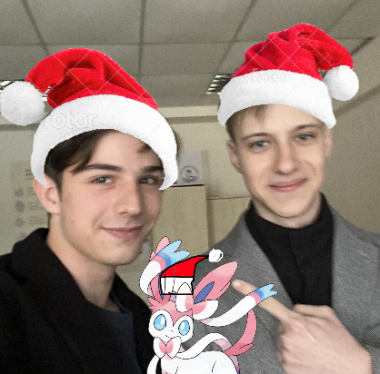

# Announcement_(en)

Happy Holidays Codeforces! 🎅

[mesanu](https://codeforces.com/profile/mesanu "Candidate Master mesanu"), [flamestorm](https://codeforces.com/profile/flamestorm "Master flamestorm") and I are very excited to invite you to [Codeforces Round 918 (Div. 4)](https://codeforces.com/contest/1915 "Codeforces Round 918 (Div. 4)")! It starts on [Thursday, December 28, 2023 at 20:35UTC+6](https://codeforces.com/https://www.timeanddate.com/worldclock/fixedtime.html?day=28&month=12&year=2023&hour=17&min=35&sec=0&p1=166).

The format of the event will be identical to Div. 3 rounds:

 * 5-8 tasks;
* ICPC rules with a penalty of 10 minutes for an incorrect submission;
* 12-hour phase of open hacks after the end of the round (hacks do not give additional points)
* after the end of the open hacking phase, all solutions will be tested on the updated set of tests, and the ratings recalculated
* by default, only "trusted" participants are shown in the results table (but the rating will be recalculated for all with initial ratings less than 1400 or you are an unrated participant/newcomer).

We urge participants whose rating is 1400+ not to register new accounts for the purpose of narcissism but to take part unofficially. Please do not spoil the contest for the official participants.

Only *trusted participants of the fourth division* will be included in the official standings table. This is a forced measure for combating unsporting behavior. To qualify as *a trusted participant of the fourth division*, you must:

 * take part in at least five rated rounds (and solve at least one problem in each of them),
* do not have a point of 1400 or higher in the rating.

**Regardless of whether you are a trusted participant of the fourth division or not, if your rating is less than 1400 (or you are a newcomer/unrated), then the round will be rated for you.**

Special thanks to the VIP testers: [AlperenT](https://codeforces.com/profile/AlperenT "Master AlperenT"), [KrowSavcik](https://codeforces.com/profile/KrowSavcik "Master KrowSavcik")!

Thanks a lot to the testers: [Qualified](https://codeforces.com/profile/Qualified "Expert Qualified"), [Kaushal_26](https://codeforces.com/profile/Kaushal_26 "Expert Kaushal_26"), [htetgm](https://codeforces.com/profile/htetgm "Candidate Master htetgm"), [MADE_IN_HEAVEN](https://codeforces.com/profile/MADE_IN_HEAVEN "Expert MADE_IN_HEAVEN"), [sandry24](https://codeforces.com/profile/sandry24 "Specialist sandry24"), [hbarp](https://codeforces.com/profile/hbarp "Candidate Master hbarp"), [Vladosiya](https://codeforces.com/profile/Vladosiya "Expert Vladosiya"), [LucaLucaM](https://codeforces.com/profile/LucaLucaM "Expert LucaLucaM"), [Gheal](https://codeforces.com/profile/Gheal "Master Gheal"), [tvladm](https://codeforces.com/profile/tvladm "Candidate Master tvladm"), [Dominater069](https://codeforces.com/profile/Dominater069 "Grandmaster Dominater069"), [haochenkang](https://codeforces.com/profile/haochenkang "Specialist haochenkang"), [xiaowuc1](https://codeforces.com/profile/xiaowuc1 "Grandmaster xiaowuc1"), [pashka](https://codeforces.com/profile/pashka "International Grandmaster pashka"), [vrintle](https://codeforces.com/profile/vrintle "Master vrintle"), [BucketPotato](https://codeforces.com/profile/BucketPotato "Grandmaster BucketPotato")!

And many thanks to [Vladosiya](https://codeforces.com/profile/Vladosiya "Expert Vladosiya") for translating the statements!

We suggest reading all of the problems and hope you will find them interesting!

🎄 🎄 🎄 **Good luck to everyone and enjoy the holidays!!!** 🎄 🎄 🎄

