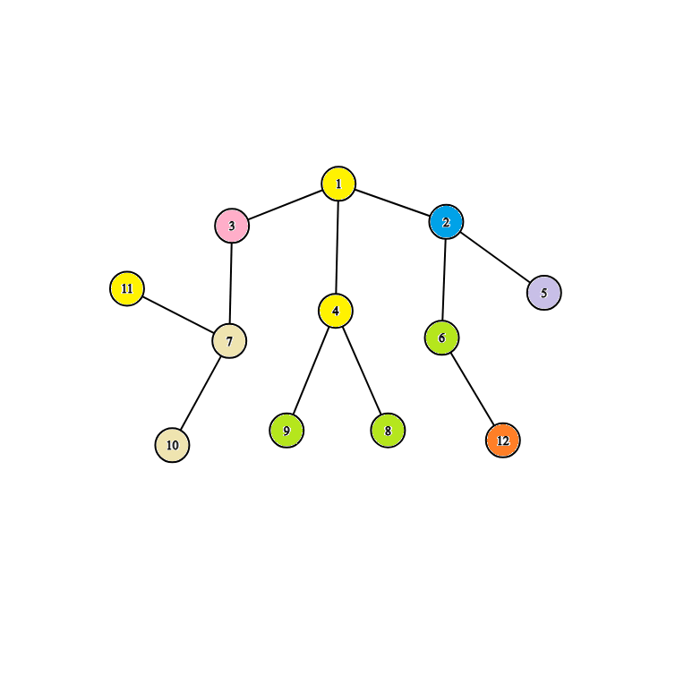

<h1 style='text-align: center;'> E. Happy Life in University</h1>

<h5 style='text-align: center;'>time limit per test: 1 second</h5>
<h5 style='text-align: center;'>memory limit per test: 512 megabytes</h5>

Egor and his friend Arseniy are finishing school this year and will soon enter university. And since they are very responsible guys, they have started preparing for admission already.

First of all, they decided to take care of where they will live for the long four years of study, and after visiting the university's website, they found out that the university dormitory can be represented as a root tree with $n$ vertices with the root at vertex $1$. In the tree, each vertex represents a recreation with some type of activity $a_i$. The friends need to choose $2$ recreations (not necessarily different) in which they will settle. The guys are convinced that the more the value of the following function $f(u, v) = diff(u, lca(u, v)) \cdot diff(v, lca(u, v))$, the more fun their life will be. Help Egor and Arseniy and find the maximum value of $f(u, v)$ among all pairs of recreations!

$^{\dagger} diff(u, v)$ — the number of different activities listed on the simple path from vertex $u$ to vertex $v$.

$^{\dagger} lca(u, v)$ — a vertex $p$ such that it is at the maximum distance from the root and is a parent of both vertex $u$ and vertex $v$.

### Input

Each test consists of several test cases. The first line contains a single integer $t$ ($1 \le t \le 10^5$) — the number of test cases. Then follows the description of the test cases.

The first line of each test case contains a single integer $n$ ($1 \le n \le 3 \cdot 10^{5}$).

The second line of each test case contains ${n - 1}$ integers $p_2, p_3, \ldots,p_n$ ($1 \le p_i \le i - 1$), where $p_i$ — the parent of vertex $i$.

The third line of each test case contains ${n}$ integers $a_1, a_2, \ldots,a_n$ ($1 \le a_i \le n$), where $a_i$ — the number of the activity located at vertex $i$.

It is guaranteed that the sum of $n$ over all test cases does not exceed $3 \cdot 10^5$.

### Output

For each test case, output the maximum value of $f(u, v)$ for all pairs of recreations $(u, v)$.

## Example

### Input


```text
4211 271 1 2 2 3 36 5 2 3 6 5 6131 1 1 2 2 2 3 3 4 5 6 62 2 2 1 4 9 7 2 5 2 1 11 2121 1 1 2 2 3 4 4 7 7 611 2 1 11 12 8 5 8 8 5 11 7
```
### Output

```text

2
9
9
12

```
## Note

Consider the fourth test case. The tree has the following structure: 

   All recreations are colored. The same colors mean that the activities in the recreations match. Consider the pair of vertices $(11, 12)$, $lca(11, 12) = 1$. Write down all activities on the path from $11$ to $1$ — $[11, 5, 1, 11]$, among them there are $3$ different activities, so $diff(11, 1) = 3$. Also write down all activities on the path from $12$ to $1$ — $[7, 8, 2, 11]$, among them there are $4$ different activities, so $diff(12, 1) = 4$. We get that $f(11, 12) = diff(12, 1) \cdot diff(11, 1) = 4 \cdot 3 = 12$, which is the answer for this tree. It can be shown that a better answer is impossible to obtain.

#### Tags 

#2300 #NOT OK #data_structures #dfs_and_similar #greedy #trees 

## Blogs
- [All Contest Problems](../Good_Bye_2023.md)
- [Good Bye 2023](../blogs/Good_Bye_2023.md)
- [Good Bye 2023 tutorial (en)](../blogs/Good_Bye_2023_tutorial_(en).md)
