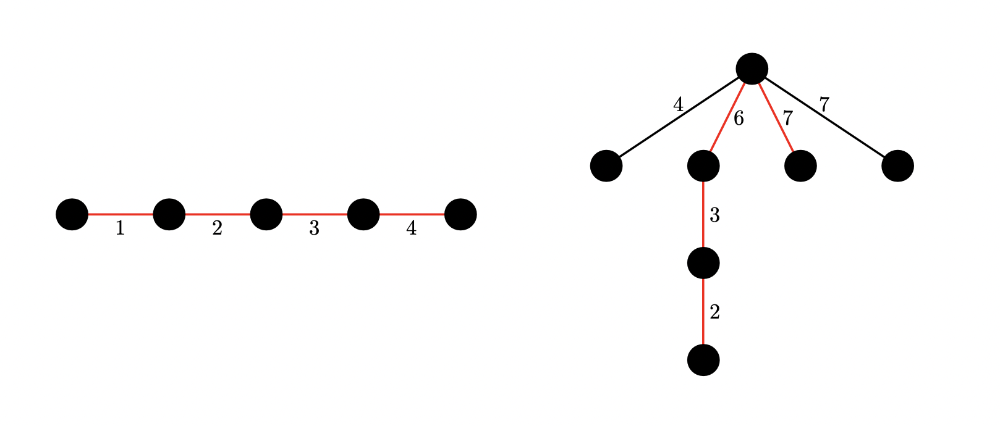

<h1 style='text-align: center;'> F. Construct Tree</h1>

<h5 style='text-align: center;'>time limit per test: 2 seconds</h5>
<h5 style='text-align: center;'>memory limit per test: 256 megabytes</h5>

You are given an array of integers $l_1, l_2, \dots, l_n$ and an integer $d$. Is it possible to construct a tree satisfying the following three conditions?

* The tree contains $n + 1$ nodes.
* The length of the $i$-th edge is equal to $l_i$.
* The (weighted) diameter of the tree is equal to $d$.
### Input

Each test consists of multiple test cases. The first line contains a single integer $t$ ($1 \leq t \leq 250$) — the number of test cases. The description of the test cases follows.

The first line of each test case contains two integers $n$, $d$ ($2 \leq n \leq 2000, 1 \leq d \leq 2000$).

The second line of each test case contains $n$ integers $l_1, l_2, \dots, l_n$ ($1 \leq l_i \leq d$).

It is guaranteed that the sum of $n$ over all test cases does not exceed $2000$.

### Output

For each test case, output $\texttt{Yes}$ if it is possible to construct a tree that satisfies all the conditions, and $\texttt{No}$ otherwise.

You can print the letters in any case (upper or lower).

## Example

### Input


```text
34 101 2 3 44 71 4 3 46 182 4 3 7 6 7
```
### Output

```text

Yes
No
Yes

```
## Note

Below, you are given the illustrations of trees for the first and third test cases. One of the diameters is highlighted by coloring its edges in red.

  

#### Tags 

#2500 #NOT OK #bitmasks #constructive_algorithms #dp #trees 

## Blogs
- [All Contest Problems](../Codeforces_Round_917_(Div._2).md)
- [Announcement (en)](../blogs/Announcement_(en).md)
- [Tutorial (en)](../blogs/Tutorial_(en).md)
