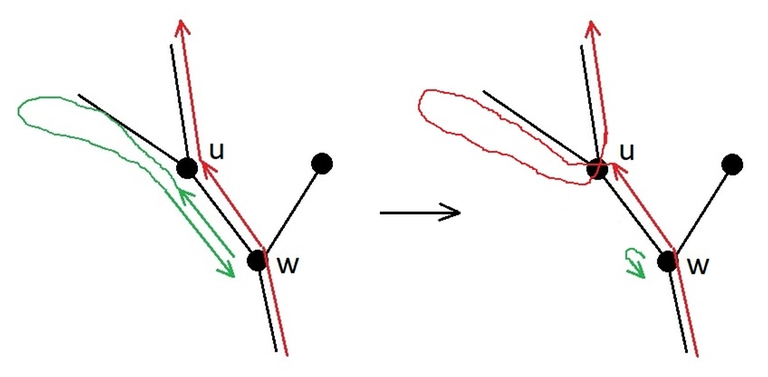
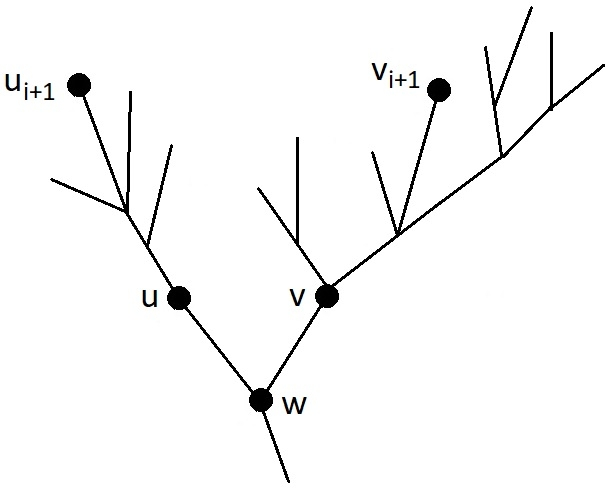

# Tutorial

Hello, everyone!

We hope you like our problems!

Thank you for participation!

[1918A — Brick Wall](../problems/A._Brick_Wall.md)

Author: [ooaa](https://codeforces.com/profile/ooaa "Master ooaa")

 **Tutorial**The stability of the wall is the number of horizontal bricks minus the number of vertical bricks. Since a horizontal brick has a length of at least 2, no more than ⌊m2⌋ horizontal bricks can be placed in one row. Therefore, the answer does not exceed n⋅⌊m2⌋. On the other hand, if horizontal bricks of length 2 are placed in a row, and when m is odd, the last brick has a length of 3, then in each row there will be exactly ⌊m2⌋ horizontal bricks, and there will be no vertical bricks in the wall at all. This achieves the maximum stability of n⋅⌊m2⌋. The solution is one formula, so it works in O(1) time.

 **Solution**
```cpp
#include <bits/stdc++.h>

using namespace std;


int main()
{
    ios_base::sync_with_stdio(false);
    cin.tie(0);
    int t;
    cin >> t;
    while(t--)
    {
        int64_t n,m;
        cin >> n >> m;
        cout << n*(m/2) << 'n';
    }
    return 0;
}
```
[1918B — Minimize Inversions](../problems/B._Minimize_Inversions.md)

Author: [ace5](https://codeforces.com/profile/ace5 "International Grandmaster ace5")

 **Tutorial**Notice that by performing operations of the form: swap ai with aj and bi with bj simultaneously, we can rearrange the array a how we want, but the same ai will correspond to the same bi (because we are changing both ai and bi at the same time). Let's sort the array a using these operations. Then the sum of the number of inversions in a and b will be the number of inversions in b, since a is sorted. It is claimed that this is the minimum sum that can be achieved.

Proof: Consider two pairs of elements ai with aj and bi with bj (i < j). In each of these pairs, there can be either 0 or 1 inversions, so among the two pairs, there can be 0, 1, or 2 inversions. If there were 0 inversions before the operation, then there will be 2 after the operation; if there was 1, then there will still be 1; if there were 2, then it will become 0. If the permutation ai is sorted, then in each pair of indices i and j there will be a maximum of 1 inversion, so any pair of indices will give no more inversions than if they were swapped. Since the number of inversions in each pair is the minimum possible, the total number of inversions is also the minimum possible.

Time complexity: O(nlogn) per test case.

 **Solution**
```cpp
#include <bits/stdc++.h>

using namespace std;

int main()
{
    ios_base::sync_with_stdio(false);
    cin.tie(0);
    int t;
    cin >> t;
    while(t--)
    {
        int n;
        cin >> n;
        pair<int,int> ab[n];
        for(int i = 0;i < n;++i)
        {
            cin >> ab[i].first;
        }
        for(int i = 0;i < n;++i)
        {
            cin >> ab[i].second;
        }
        sort(ab,ab+n);
        for(int i = 0;i < n;++i)
        {
            cout << ab[i].first << ' ';
        }
        cout << "n";
        for(int i = 0;i < n;++i)
        {
            cout << ab[i].second << ' ';
        }
        cout << "n";
    }
}
```
[1918C — XOR-distance](../problems/C._XOR-distance.md)

Author: [ace5](https://codeforces.com/profile/ace5 "International Grandmaster ace5")

 **Tutorial**Let's consider the bitwise representation of numbers a, b, x. Let's look at any 2 bits at the same position in a and b, if they are the same, then regardless of what is in x on this position, the number |(a⊕x)−(b⊕x)| will have a 0 at this position. Therefore, it is advantageous to set 0 at all such positions in x (since we want x≤r, and the answer does not depend on the bit). If the bits in a and b at the same position are different, then at this position there will be a 1 either in a⊕x or in b⊕x depending on what is at this position in x.

Let a < b, if not, then we will swap them. Then at the highest position, where the bits differ, there is a 0 in a and a 1 in b. There are 2 options, either to set a 1 at this position in x (and then there will be a 1 in a⊕x), or to set a 0 in x (and then there will be a 0 in a⊕x).

Suppose we set 0 in x, then a⊕x will definitely be less than b⊕x (because in the highest differing bit, a⊕x has 0, and b⊕x has 1). Therefore, it is advantageous to set 1 in a⊕x on all next positions, as this will make their difference smaller. Therefore, we can go through the positions in descending order, and if the position is differing, then we will set a 1 in a⊕x at this position if possible (if after this x does not exceed r).

The second case (when we set 1 in x at the position of the first differing bit) is analyzed similarly, but in fact it is not needed, because the answer will not be smaller, and x will become larger.

Time complexity: O(log1018) per test case.

 **Solution**
```cpp
#include <bits/stdc++.h>

using namespace std;

const int maxb = 60;

bool get_bit(int64_t a,int i)
{
    return a&(1ll<<i);
}

int main()
{
    ios_base::sync_with_stdio(false);
    cin.tie(0);
    int t;
    cin >> t;
    while(t--)
    {
        int64_t a,b,r;
        cin >> a >> b >> r;
        int64_t x = 0;
        bool first_bit = 1;
        if(a > b)
            swap(a,b);
        for(int i = maxb-1;i >= 0;--i)
        {
            bool bit_a = get_bit(a,i);
            bool bit_b = get_bit(b,i);
            if(bit_a != bit_b)
            {
                if(first_bit)
                {
                    first_bit = 0;
                }
                else
                {
                    if(!bit_a && x+(1ll<<i) <= r)
                    {
                        x += (1ll<<i);
                        a ^= (1ll<<i);
                        b ^= (1ll<<i);
                    }
                }
            }
        }
        cout << b-a << "n";
    }
}
```
[1918D — Blocking Elements](../problems/D._Blocking_Elements.md)

Author: [ace5](https://codeforces.com/profile/ace5 "International Grandmaster ace5")

 **Tutorial**Let's do a binary search. Suppose we know that the minimum possible cost is at least l and not greater than r. Let's choose m=(l+r)/2. We need to learn how to check if the answer is less than or equal to m. We will calculate dpi–the minimum sum of blocked elements in the prefix up to i if position i is blocked, and on each of the subsegments without blocked elements, the sum of elements is less than or equal to m. Then dpi=ai+min(dpj) for all j such that the sum on the subsegment from j+1 to i−1 is less than or equal to m. Such j form a segment, since aj is positive. We will maintain the boundaries of this segment. We will also maintain all dpj for j inside this subsegment in the set. When moving from i to i+1, we will move the left boundary of the subsegment until the sum on it becomes less than or equal to m, and remove dpj from the set, and also add dpi to the set. The minimum sum of blocked elements under the condition that the sum on all subsegments without blocked elements is less than or equal to m can be found as the minimum among all dpi such that the sum from i to n is less than or equal to m. If this answer is less than or equal to m, then the answer to the problem is less than or equal to m, otherwise the answer is greater than m.

Time complexity: O(nlognlog109) per test case.

 **Solution**
```cpp
#include <bits/stdc++.h>

using namespace std;

int main()
{
    ios_base::sync_with_stdio(false);
    cin.tie(0);
    int t;
    cin >> t;
    while(t--)
    {
        int n;
        cin >> n;
        int64_t a[n+1];
        for(int i = 0;i < n;++i)
        {
            cin >> a[i];
        }
        int64_t l = 0,r = int64_t(1e9)*n;
        while(l < r)
        {
            int64_t m = (l+r)/2;
            set<pair<int64_t,int>> pos;
            int64_t dp[n+1];
            int p2 = n;
            dp[n] = 0;
            pos.insert({dp[n],n});
            int64_t sum = 0;
            for(int j = n-1;j >= 0;--j)
            {
                while(sum > m)
                {
                    sum -= a[p2-1];
                    pos.erase({dp[p2],p2});
                    p2--;
                }
                dp[j] = pos.begin()->first + a[j];
                pos.insert({dp[j],j});
                sum += a[j];
            }
            sum = 0;
            int yes = 0;
            for(int j =0;j < n;++j)
            {
                if(sum <= m && dp[j] <= m)
                    yes = 1;
                sum += a[j];
            }
            if(yes)
                r = m;
            else
                l = m+1;
        }
        cout << l << "n";
    }
}
```
[1918E — ace5 and Task Order](../problems/E._ace5_and_Task_Order.md)

Author: [ace5](https://codeforces.com/profile/ace5 "International Grandmaster ace5")

 **Tutorial****Randomized solution:** We will use the quicksort algorithm. We will choose a random element from the array, let its index be i, and we will perform ? i until we get the answer = (i.e., x=ai). Now we will ask about all the other elements, thereby finding out whether they are greater than or less than ai (don't forget to return x=ai, i.e., perform ? i after each query about the element). After this, we will divide all the elements into two parts, where ai>x and ai<x. We will recursively run the algorithm on each part. The parts will become smaller and smaller, and in the end, we will sort our permutation, allowing us to guess it.

**Non-randomized solution:** We will find the element 1 in the array in 3n queries. To do this, we will go through the array, asking about each element each time. If the answer is <, we will continue asking until the answer becomes =, and if the answer is = or >, we will move on to the next element. Then the last element on which the answer was < is the element 1. x will increase by a maximum of n in the process (a maximum of 1 from each element), so it will decrease by a maximum of 2n, i.e., a maximum of 3n queries. Similarly, we will find the element n. Now we will run an algorithm similar to the randomized solution, but now we can set x=n/2 instead of taking x as a random element.

Both solutions comfortably fit within the limit of 40n queries.

 **Randomized solution**
```cpp
#include <bits/stdc++.h>

using namespace std;

mt19937 rnd(593);

char query(int i)
{
    cout << "? " << i+1 << endl;
    char c;
    cin >> c;
    return c;
}

void quicksort(vector<int> &a,vector<int> &ord)
{
    if(a.size() == 0)
        return ;
    int mid = rnd()%a.size();
    while(query(a[mid]) != '=')
        ;
    vector<int> l,r;
    for(int i = 0;i < a.size();++i)
    {
        if(i == mid)
            continue;
        if(query(a[i]) == '<')
        {
            l.push_back(a[i]);
        }
        else
        {
            r.push_back(a[i]);
        }
        query(a[mid]);
    }
    vector<int> l_ord;
    vector<int> r_ord;
    quicksort(l,l_ord);
    quicksort(r,r_ord);
    for(int i = 0;i < l_ord.size();++i)
    {
        ord.push_back(l_ord[i]);
    }
    ord.push_back(a[mid]);
    for(int i = 0;i < r_ord.size();++i)
    {
        ord.push_back(r_ord[i]);
    }
    return ;
}


int main()
{
    int t;
    cin >> t;
    while(t--)
    {
        int n;
        cin >> n;
        vector<int> a;
        vector<int> ord;
        for(int i = 0;i < n;++i)
        {
            a.push_back(i);
        }
        quicksort(a,ord);
        cout << "! ";
        vector<int> ans(n);
        for(int i = 0;i < n;++i)
        {
            ans[ord[i]] = i;
        }
        for(int i = 0;i < n;++i)
        {
            cout << ans[i]+1 << ' ';
        }
        cout << endl;
    }
}

```
 **Non-randomized solution**
```cpp
#include <bits/stdc++.h>

using namespace std;

char query(int pos)
{
    cout << "? " << pos << endl;
    char ans;
    cin >> ans;
    return ans;
}

void dnq(int l,int r,vector<int> pos,vector<int> & res,int pos1,int posn)
{
    int m = (l+r)/2;
    vector<int> lh;
    vector<int> rh;
    for(int i = 0;i < pos.size();++i)
    {
        char x = query(pos[i]);
        if(x == '>')
        {
            rh.push_back(pos[i]);
            query(pos1);
        }
        else if(x == '<')
        {
            lh.push_back(pos[i]);
            query(posn);
        }
        else
        {
            res[pos[i]] = m;
        }
    }
    if(lh.size() != 0)
    {
        int m2 = (l+m-1)/2;
        for(int j = 0;j < m-m2;++j)
            query(pos1);
        dnq(l,m-1,lh,res,pos1,posn);
        query(posn);
    }
    if(rh.size() != 0)
    {
        int m2 = (m+1+r)/2;
        for(int j = 0;j < m2-m;++j)
            query(posn);
        dnq(m+1,r,rh,res,pos1,posn);
    }
    return ;
}


int main()
{
    int t;
    cin >> t;
    while(t--)
    {
        int n;
        cin >> n;
        int pos1 = -1;
        for(int i = 1;i <= n;++i)
        {
            char ans = query(i);
            if(ans == '<')
            {
                i--;
            }
            else if(ans == '=')
            {
                pos1 = i;
            }
            else
            {
                if(pos1 != -1)
                {
                    query(pos1);
                }
            }
        }
        int posn = -1;
        for(int i = 1;i <= n;++i)
        {
            char ans = query(i);
            if(ans == '>')
            {
                i--;
            }
            else if(ans == '=')
            {
                posn = i;
            }
            else
            {
                if(posn != -1)
                {
                    query(posn);
                }
            }
        }
        vector<int> res(n+1);
        vector<int> pos(n);
        for(int j = 0;j < n;++j)
            pos[j] = j+1;
        int m = (1+n)/2;
        for(int k = 0;k < n-m;++k)
        {
            query(pos1);
        }
        dnq(1,n,pos,res,pos1,posn);
        cout << "! ";
        for(int j = 1;j <= n;++j)
            cout << res[j] << ' ';
        cout << endl;
    }
}
```
[1918F — Caterpillar on a Tree](../problems/F._Caterpillar_on_a_Tree.md)

Author: [ooaa](https://codeforces.com/profile/ooaa "Master ooaa")

 **Tutorial**First, it can be noticed that it is enough to visit all the leaves of the tree. After all, if the caterpillar skips some internal node, then it will not be able to reach the subtree of this node and visit the leaves in it. Therefore, it makes no sense to teleport to the root from a non-leaf (otherwise it would be more profitable to move to the root earlier, and all the leaves would remain visited).

The optimal path of the caterpillar on the tree can be divided into movements from the root to a leaf, movements from one leaf to another, and teleportations from a leaf to the root. Let the order of visiting the leaves in the optimal path be fixed. Then it makes no sense to teleport from the last leaf, as all the leaves have already been visited. In addition, it is not profitable to move not along the shortest path in the sections of transition from the root to a leaf without visiting other leaves, or in movements from one leaf to another without visiting other leaves. If the leaf v is visited after the leaf u, then teleporting from u saves time of transition from u to v minus the time of moving to v from the root. It is possible to choose k leaves, without the last visited leaf, which give the maximum savings (if there are fewer leaves in the tree, or the savings become negative, then take fewer than k leaves), and teleport from them. Thus, if the order of visiting the leaves is known, the optimal time can be found.

It turns out that if you take the tree and sort the children of each node in ascending (not descending) order of the depth of the subtree, and then write down all the leaves from left to right (in depth-first order), then this will be one of the optimal leaf orders. This order of sorting the tree and its leaves will be called the order of sorting by the subtree depth.

The tree can be sorted in this way in one depth-first traversal. For each leaf, it is possible to calculate how much time teleporting from it saves. To do this, it is enough to move from this leaf to the root until the first node, for which the previous node is not the rightmost child. Then the savings are the length of the path traveled minus the remaining distance to the root. Such paths for different leaves do not intersect along the edges, and the remaining distance to the root can be precalculated in a depth-first search for all nodes at once. Therefore, the algorithm works in O(nlogn) time, where the logarithm arises from sorting the children of each node by the depth of the subtree.

**Theorem.**

There exists a shortest route for the caterpillar, in which the leaves are visited in the order of sorting the children of each node by the depth of the subtree.

 **Proof**Let u1,…,um be all the leaves of the tree in the order that will result if the children of each node are sorted in ascending order of the depth of the subtree. Consider the shortest route of the caterpillar visiting all the nodes of the tree. Let v1,…,vm be the leaves of the tree, in the order of visiting in this route. Consider the maximum prefix of leaves that coincides with the order of sorting by the depth of the subtree: v1=u1,…,vi=ui. If i=m, then the theorem is proven. Now, let's assume that the next leaf is the incorrect leaf vi+1≠ui+1.

The goal is to change the route in such a way that the time of traversing the tree does not increase, so that the first i visited leaves do not change and remain in the same order, and so that the leaf ui+1 is encountered earlier in the route than before the change. Then it is possible to move the leaf ui+1 to its $(i+1)$s place, while maintaining the order of the first i visited leaves. Then, in the same way, one can put all the leaves ui+1,…,um in their places one by one and get the shortest route of the caterpillar with the desired order of visiting leaves.



**Lemma.**

Let the node w be the ancestor of the node u. Let the caterpillar in the shortest route on the tree crawl from u to w. Then the caterpillar enters the subtree of the node u only once, traverses this subtree depth-first, and returns to w.

Proof of the lemma.

If the caterpillar crawls from w to u only once, then it cannot leave the subtree of u until all the nodes in this subtree are visited, and it cannot jump on a trampoline, as it still needs to move from u to w. All this cannot be done faster than the number of steps equal to twice the number of nodes in the subtree of u, because the caterpillar needs to reach each node via an edge from the ancestor and to return to the ancestor. And any route without teleportations, which uses each edge twice, is one of the depth-first traversals.

If the caterpillar crawls from w to u two or more times, then the route can be shortened, as shown in figure.

The lemma is proven.

At the moment, the leaf vi+1 lies in the order of visiting the leaves in the optimal route of the caterpillar in the place of the leaf ui+1. The goal is to move the leaf ui+1 closer to the beginning of the route, without changing the first i visited leaves: u1,…,ui.



Let w be the least common ancestor of the leaves ui+1 and vi+1, let u be the child of w, in the subtree of which the node ui+1 is located, and v be the child of w, in the subtree of which the node vi+1 is located, as shown in figure. To move the leaf ui+1 closer to the beginning of the route, let us consider cases.

**Case 1:** The caterpillar in the current version of the optimal route crawls from u to w.

In this case, according to the lemma, the caterpillar enters the subtree of vertex u only once, and traverses it in the depth-first manner before returning to w. There are no leaves u1,…,ui in the subtree of u, because all the leaves of the subtree of u are visited consecutively during the depth-first traversal, and the leaf vi+1 not from the subtree of u is visited after u1,…,ui, but before ui+1. Then the route can be changed as follows: the cycle w→ (traversal of the subtree of u) →w is cut out from where it is located, and inserted at the moment of the first visit to w after the visit to the leaf ui. The leaf ui is not in the subtree of the node v, because the subtree of u has a smaller depth (ui+1 is earlier in the desired leaf order than vi+1), and there are still unvisited leaves in it. Then, before entering vi+1, the caterpillar will have to come from the leaf ui to the node w, and at that moment a depth-first traversal of the subtree of u with the visit to the leaf ui+1 will occur. This traversal was moved to an earlier time, before visiting vi+1, which means that in the order of visiting the leaves in the caterpillar's route, the leaf ui+1 has been moved closer to the beginning.

**Case 2:** The caterpillar in the current version of the optimal route does not crawl from u to w, but crawls from v to w.

Then the entire subtree of v is traversed in a depth-first traversal. Since the leaf ui+1 is earlier in the desired order than vi+1, the subtree of v is deeper than the subtree of u, and in the desired order all the leaves of v come after ui+1. Moreover, since the caterpillar does not crawl from u to w, it is impossible to leave the subtree of u except by teleporting to the root. The last jump on the trampoline from the subtree of the node u is considered (or stopping at the end of the route). At this moment, all the leaves of the subtree of u are visited. The route can be changed as follows: cut out the depth-first traversal of the subtree of v, cancel the last jump or stop in the subtree of u, descend from there to w, perform a depth-first traversal of the subtree of v in such a way that the deepest node of this subtree is visited last, and teleport to the root (or stop at the end of the route). This will not be longer, because a section of transition from a leaf in the subtree of u to w has been added, and a section of movement from the deepest leaf in the subtree of v to w has disappeared, here it is important that the subtree of v is deeper than the subtree of u. And the node ui+1 has become closer to the beginning of the list of visited leaves, because all the leaves of the subtree of v, including vi+1, have moved somewhere after all the leaves of the subtree of u.

**Case 3:** The caterpillar in the current version of the optimal route does not crawl either from u to w, nor from v to w.

Then all the sections of the route that move into the subtrees of the nodes u and v do not leave these subtrees and end with teleportation to the root or stopping at the end of the route. Among them, there is a section that starts with a step from w to u, in which the leaf ui+1 is visited, and a section that starts with a step from w to v, in which the leaf vi+1 is visited. In the current route, the section with vi+1 comes earlier. The route can be changed very simply: swap the section visiting the leaf ui+1 and the section visiting the leaf vi+1. If both sections end with teleportations, then a correct caterpillar route will result. If the caterpillar stopped at the end of the section visiting ui+1, and teleported to the root from the section with vi+1, then now it will teleport after completing the section with ui+1 and stop at the end of the section with vi+1. The positions of the leaves u1,…,ui in the route will not change: they are not in the subtree of v, and they are not in the section with ui+1, visited after vi+1. And the leaf ui+1 will get a place closer to the beginning in the order of visiting the leaves, because the section with its visit now occurs earlier in the route.

In all cases, it was possible to move the leaf ui+1 in the optimal route of the caterpillar closer to the beginning, while maintaining the order of the first i visited leaves, which means that there exists an optimal route of the caterpillar in which the leaves are visited in the order of sorting the subtrees of the tree by depth. The theorem is proven.

 **Solution**
```cpp
#include <bits/stdc++.h>

using namespace std;

const int maxn = 200005;
int d[maxn];
int h[maxn];
int p[maxn];
vector<int> leaf_jump_gains;
vector<vector<int> > children;

bool comp_by_depth(int u,int v)
{
    return d[u] < d[v];
}

void sort_subtrees_by_depth(int v)
{
    d[v] = 0;
    if(v == 1)
        h[v] = 0;
    else
        h[v] = h[p[v]]+1;
    for(int i = 0; i < int(children[v].size()); ++i)
    {
        int u = children[v][i];
        sort_subtrees_by_depth(u);
        d[v] = max(d[v],d[u]+1);
    }
    sort(children[v].begin(),children[v].end(),comp_by_depth);
}

int main()
{
    ios_base::sync_with_stdio(false);
    cin.tie(0);
    int n,k;
    cin >> n >> k;
    children.resize(n+1);
    for(int i = 2; i <= n; ++i)
    {
        cin >> p[i];
        children[p[i]].push_back(i);
    }
    sort_subtrees_by_depth(1);
    for(int i = 1; i <= n; ++i)
    {
        if(children[i].size() == 0)
        {
            int jump_gain = 0;
            int v = i;
            while(v != 1)
            {
                int s = children[p[v]].size();
                if(children[p[v]][s-1] == v)
                {
                    v = p[v];
                    ++jump_gain;
                }
                else
                {
                    jump_gain = jump_gain+1-h[p[v]];
                    break;
                }
            }
            leaf_jump_gains.push_back(jump_gain);
        }
    }
    sort(leaf_jump_gains.begin(),leaf_jump_gains.end());
    int s = leaf_jump_gains.size();
    ++k; //non-returning from the last leaf is like one more jump
    int res = 2*(n-1);
    for(int i = s-1; i >= max(0,s-k); --i)
        res -= max(leaf_jump_gains[i],0);
    cout << res << 'n';
    return 0;
}
```
[1918G — Permutation of Given](../problems/G._Permutation_of_Given.md)

Author: [ace5](https://codeforces.com/profile/ace5 "International Grandmaster ace5")

 **Tutorial**At first, you can manually find answers for small values of n. For n=2,4,6, the answer will be "YES" and the arrays will be [−1,1], 

Unable to parse markup [type=CF_MATHJAX]

, [−1,−2,2,1,−1,1]. It is not difficult to prove by case analysis that the answer is "NO" for 3 and 5. It can be assumed that for all odd n, the answer is "NO", but if you try to prove the absence of an array or find an array for n=7, it turns out that the array exists: [−5,8,1,−3,−4,−2,5]. In fact, an array exists for all n except 3 and 5.It would be easy if it were possible to make the number in each cell unchanged. But the presence of array edges and the prohibition of zeros make this impossible. Furthermore, it can be noticed that an infinite array in which the sequence of six numbers 1,−3,−4,−1,3,4 is repeated, generates the same number in each cell as it was there. In general, any sequence of six numbers of the form a,−b,−a−b,−a,b,a+b will have this property. Thus, it is possible to transform the internal cells of the array into cells with the same numbers, the question is what to do at the edges. In the author's solution, suitable edges (possibly consisting of several numbers) were manually selected for each remainder of division by 6. And then the solution for each value of n was created as follows: take the edges for nmod6 and insert into the middle as many sequences of six numbers that transition into themselves as needed.

Solution by [green_gold_dog](https://codeforces.com/profile/green_gold_dog "Grandmaster green_gold_dog"):

The idea is that any correct array can be extended by 2 elements to remain correct. Let the array end with the numbers a and b. Then it can be extended by two elements as follows: […,a,b]→[…,a,b,−b,a−b] This array transitions into its permutation: the entire old array, except for a, is generated by the old array; the last three cells generate a−b, a, −b, i.e., two new elements, and the missing element a. It is also necessary for the new elements to be non-zero. If the last two elements of the old array were different, then the new elements are non-zero; moreover, the new elements cannot be the same, as a and b are non-zero, so this operation can be repeated many times.

To start, two arrays are sufficient: [1,2] for n=2 and [1,2,−3,2,4,−5,−2] for n=7. Then these arrays can be extended by 2 to obtain the answer for even or odd n.

Both solutions print an array using simple rules and work in O(n) time.

 **Solution by ooaa**
```cpp
#include <bits/stdc++.h>

using namespace std;

int main()
{
    ios_base::sync_with_stdio(false);
    cin.tie(0);
    int n;
    cin >> n;
    if(n%6 == 0)
    {
        cout << "YESn";
        cout << "2 1 -1 ";
        for(int j = 0;j < n/6-1;++j)
        {
            cout << "1 -1 -2 -1 1 2 ";
        }
        cout << "1 -1 -2" << "n";
        return 0;
    }
    else if(n%6 == 1)
    {
        cout << "YESn";
        cout << "-5 8 1 -3 -4 ";
        for(int j = 0;j < n/6-1;++j)
        {
            cout << "-1 3 4 1 -3 -4 ";
        }
        cout << "-2 5" << "n";
        return 0;
    }
    else if(n%6 == 2)
    {
        cout << "YESn";
        for(int j = 0;j < n/6;++j)
        {
            cout << "1 -1 -2 -1 1 2 ";
        }
        cout << "1 -1" << "n";
        return 0;
    }
    else if(n%6 == 3)
    {
        if(n == 3)
            cout << "NOn";
        else
        {
            cout << "YESn";
            cout << "2 1 1 -3 -4 -1 3 ";
            for(int j = 0;j < n/6-1;++j)
            {
                cout << "4 1 -3 -4 -1 3 ";
            }
            cout << "3 -2" << "n";
            return 0;
        }
    }
    else if(n%6 == 4)
    {
        cout << "YESn";
        for(int j = 0;j < n/6;++j)
        {
            cout << "1 -1 -2 -1 1 2 ";
        }
        cout << "1 -1 1 2" << "n";
        return 0;
    }
    else if(n%6 == 5)
    {
        if(n == 5)
        {
            cout << "NOn";
        }
        else
        {
            cout << "YESn";
            cout << "-2 1 1 -3 -4 -1 3 ";
            for(int j = 0;j < n/6-1;++j)
            {
                cout << "4 1 -3 -4 -1 3 ";
            }
            cout << "2 -1 2 4" << "n";
            return 0;
        }
    }

}
```
 **Solution by green_gold_dog**
```cpp
//#pragma GCC optimize("Ofast")
//#pragma GCC target("avx,avx2,sse,sse2,sse3,ssse3,sse4,abm,popcnt,mmx")
#include <bits/stdc++.h>
 
using namespace std;
 
typedef long long ll;
typedef double db;
typedef long double ldb;
typedef complex<double> cd;
 
constexpr ll INF64 = 9'000'000'000'000'000'000, INF32 = 2'000'000'000, MOD = 1'000'000'007;
constexpr db PI = acos(-1);
constexpr bool IS_FILE = false, IS_TEST_CASES = false;
 
random_device rd;
mt19937 rnd32(rd());
mt19937_64 rnd64(rd());
 
template<typename T>
bool assign_max(T& a, T b) {
	if (b > a) {
		a = b;
		return true;
	}
	return false;
}
 
template<typename T>
bool assign_min(T& a, T b) {
	if (b < a) {
		a = b;
		return true;
	}
	return false;
}
 
template<typename T>
T square(T a) {
	return a * a;
}
 
template<>
struct std::hash<pair<ll, ll>> {
	ll operator() (pair<ll, ll> p) const {
		return ((__int128)p.first * MOD + p.second) % INF64;
	}
};
 
void solve() {
	ll n;
	cin >> n;
	if (n == 5 || n == 3) {
		cout << "NOn";
		return;
	}
	cout << "YESn";
	vector<ll> arr;
	if (n % 2 == 0) {
		arr.push_back(1);
		arr.push_back(2);
	} else {
		arr.push_back(1);
		arr.push_back(2);
		arr.push_back(-3);
		arr.push_back(2);
		arr.push_back(4);
		arr.push_back(-5);
		arr.push_back(-2);
	}
	while (arr.size() != n) {
		ll x = arr[arr.size() - 2];
		ll y = x - arr.back();
		ll z = y - x;
		arr.push_back(z);
		arr.push_back(y);
	}
	for (auto i : arr) {
		cout << i << ' ';
	}
	cout << 'n';
}
 
int main() {
	if (IS_FILE) {
		freopen("", "r", stdin);
		freopen("", "w", stdout);
	}
    	ios_base::sync_with_stdio(false);
    	cin.tie(0);
    	cout.tie(0);
	ll t = 1;
	if (IS_TEST_CASES) {
		cin >> t;
	}
	for (ll i = 0; i < t; i++) {
		solve();
	}
}
```
