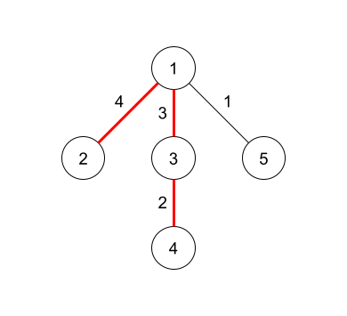

<h1 style='text-align: center;'> H. Tree Diameter</h1>

<h5 style='text-align: center;'>time limit per test: 2 seconds</h5>
<h5 style='text-align: center;'>memory limit per test: 256 megabytes</h5>

There is a hidden tree with $n$ vertices. The $n-1$ edges of the tree are numbered from $1$ to $n-1$. You can ask the following queries of two types:

1. Give the grader an array $a$ with $n - 1$ positive integers. For each edge from $1$ to $n - 1$, the weight of edge $i$ is set to $a_i$. Then, the grader will return the length of the diameter$^\dagger$.
2. Give the grader two indices $1 \le a, b \le n - 1$. The grader will return the number of edges between edges $a$ and $b$. In other words, if edge $a$ connects $u_a$ and $v_a$ while edge $b$ connects $u_b$ and $v_b$, the grader will return $\min(\text{dist}(u_a, u_b), \text{dist}(v_a, u_b), \text{dist}(u_a, v_b), \text{dist}(v_a, v_b))$, where $\text{dist}(u, v)$ represents the number of edges on the path between vertices $u$ and $v$.

Find any tree isomorphic$^\ddagger$ to the hidden tree after at most $n$ queries of type 1 and $n$ queries of type 2 in any order.

$^\dagger$ The distance between two vertices is the sum of the weights on the unique simple path that connects them. The diameter is the largest of all those distances.

$^\ddagger$ Two trees, consisting of $n$ vertices each, are called isomorphic if there exists a permutation $p$ containing integers from $1$ to $n$ such that edge ($u$, $v$) is present in the first tree if and only if the edge ($p_u$, $p_v$) is present in the second tree.

### Input

The first and only line of input contains a single integer $n$ ($3 \le n \le 1000$) — the number of vertices in the tree.

## Interaction

Begin the interaction by reading $n$.

You are allowed to make queries in the following way:

1. "$\mathtt{?}\,1\,a_1\,a_2 \ldots a_{n-1}$" ($1 \le a_i \le 10^9$). Then, you should read an integer $k$ which represents the length of the diameter. You are only allowed to ask this query at most $n$ times.
2. "$\mathtt{?}\,2\,a\,b$" ($1 \le a, b \le n - 1$). Then, you should read an integer $k$ which represents the number of edges between edges $a$ and $b$. You are only allowed to ask this query at most $n$ times.

In case your query is invalid. the program will terminate immediately and you will receive Wrong answer verdict.

To give the final answer, print "!" on a single line, followed by $n - 1$ lines where line $i$ contains "$u_i\,v_i$" ($1 \le u_i, v_i \le n$) which represents that for each $i$ from $1$ to $n-1$, there is an edge between $u_i$ and $v_i$.

After printing a query do not forget to output end of line and flush the output. Otherwise, you will get Idleness limit exceeded. To do this, use:

* fflush(stdout) or cout.flush() in C++;
* System.out.flush() in Java;
* flush(output) in Pascal;
* stdout.flush() in Python;
* see documentation for other languages.

Hacks

The first line contains a single integer $n$ ($3 \le n \le 1000$) — the number of vertices in the tree.

The next $n - 1$ lines contain two integers each $u_i, v_i$ ($1 \le u_i, v_i \le n$) — the edges of the tree.

## Example

### Input


```text
5

3

1

9

0
```
#Output
```text


? 1 1 1 1 1

? 2 1 3

? 1 4 3 2 1

? 2 4 2

!
3 1
4 2
1 2
2 5
```
## Note


The hidden tree in the example is shown above. The number on the vertices represents the vertex number while the number on the edges represents the edge number.


In the first query, all the edges are set to weight $1$, so the diameter has length $3$ as shown in the diagram.

In the second query, there is $1$ edge between edges $1$ and $3$.



In the third query, the diameter is $9$ by taking edges $1$, $2$ and $3$.

In the fourth query, there are no edges between edges $4$ and $2$.


The answer given in the example is shown in the above diagram. Since it is isomorphic to the hidden tree, it is accepted as a correct answer. 
## Note

 that the edges can be printed in any order.


#### Tags 

#2000 #NOT OK #interactive #trees 

## Blogs
- [All Contest Problems](../Hello_2024.md)
- [Hello 2024 (en)](../blogs/Hello_2024_(en).md)
- [Editorial for Hello 2024 (en)](../blogs/Editorial_for_Hello_2024_(en).md)
