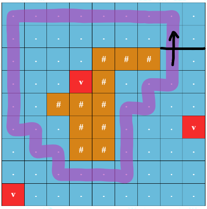

# Tutorial_(en)

Information about the round
---------------------------

 **Rating predictions (inspired by BucketPotato's editorial)**

| Person | A | B | C | D | E | F1 | F2 |
| --- | --- | --- | --- | --- | --- | --- | --- |
| [sum](https://codeforces.com/profile/sum "Мастер sum") | 800 | 1300 | 1500 | 1900 | 2000 | 2200 | 2900 |
| [oursaco](https://codeforces.com/profile/oursaco "Гроссмейстер oursaco") | 800 | 1100 | 1300 | 1600 | 1800 | 2100 | 3100 |
| [omeganot](https://codeforces.com/profile/omeganot "Мастер omeganot") | 900 | 1000 | 1400 | 1700 | 1900 | 2200 | 2800 |
| [SriniV](https://codeforces.com/profile/SriniV "Кандидат в мастера SriniV") |  |  |  | 1900 | 2000 | 1900 |  |
| [Apple_Method](https://codeforces.com/profile/Apple_Method "Гроссмейстер Apple_Method") | 1000 | 1200 | 1400 | 1900 | 1600 |  |  |
| [awesomeguy856](https://codeforces.com/profile/awesomeguy856 "Мастер awesomeguy856") | 800 | 1100 | 1400 | 1800 | 1900 | 2000 | 2800 |
| [nonrice](https://codeforces.com/profile/nonrice "Эксперт nonrice") | 900 | 1000 | 1400 | 1750 |  |  |  |
| [null_awe](https://codeforces.com/profile/null_awe "Гроссмейстер null_awe") | 800 | 1100 | 1300 | 1700 | 1900 | 2000 | 2600 |
| [htetgm](https://codeforces.com/profile/htetgm "Кандидат в мастера htetgm") | 900 | 1000 | 1200 | 1700 | 2000 |  |  |
| [thehunterjames](https://codeforces.com/profile/thehunterjames "Кандидат в мастера thehunterjames") | 900 | 1300 | 1600 | 1900 |  |  |  |
| [Yam](https://codeforces.com/profile/Yam "Гроссмейстер Yam") | 800 | 1100 | 1500 | 1800 | 2000 | 2100 |  |
| [GusterGoose27](https://codeforces.com/profile/GusterGoose27 "Гроссмейстер GusterGoose27") |  |  |  |  |  |  | 3000 |

 

|  | A | B | C | D | E | F1 | F2 |
| --- | --- | --- | --- | --- | --- | --- | --- |
| Average | 860 | 1120 | 1400 | 1786 | 1900 | 2071 | 2867 |
| Actual | 800 | 1100 | 1500 | 1800 | 2100 | 2500 | 3000 |

 **Who did what**We would like to thank [Artyom123](https://codeforces.com/profile/Artyom123 "Гроссмейстер Artyom123") for feedback on every problem and immense help with problem preparation. We would also like to thank all the testers for their valuable feedback which greatly improved the round. The editorial was prepared by [sum](https://codeforces.com/profile/sum "Мастер sum") and [omeganot](https://codeforces.com/profile/omeganot "Мастер omeganot").

 

|  | Problem | Preparation |
| --- | --- | --- |
| A | [sum](https://codeforces.com/profile/sum "Мастер sum") | [sum](https://codeforces.com/profile/sum "Мастер sum") |
| B | [sum](https://codeforces.com/profile/sum "Мастер sum") | [sum](https://codeforces.com/profile/sum "Мастер sum") |
| C | [omeganot](https://codeforces.com/profile/omeganot "Мастер omeganot") | [omeganot](https://codeforces.com/profile/omeganot "Мастер omeganot") |
| D | [sum](https://codeforces.com/profile/sum "Мастер sum") | [sum](https://codeforces.com/profile/sum "Мастер sum"), [omeganot](https://codeforces.com/profile/omeganot "Мастер omeganot") |
| E | [sum](https://codeforces.com/profile/sum "Мастер sum") | [sum](https://codeforces.com/profile/sum "Мастер sum") |
| F1 & F2 | [sum](https://codeforces.com/profile/sum "Мастер sum") | [sum](https://codeforces.com/profile/sum "Мастер sum"), [omeganot](https://codeforces.com/profile/omeganot "Мастер omeganot") |

Solutions
---------

##### [1920A - Выполнение условий](../problems/A._Satisfying_Constraints.md "Codeforces Round 919 (Div. 2)")

 **Hint 1**Suppose there are no ≠ constraints. How would you solve the problem? How would you then factor in the ≠ constraints into your solution?

 **Solution**Let's first only consider the ≥ and ≤ constraints. The integers satisfying those two constraints will be some contiguous interval [l,r]. To find [l,r], for each ≥x constraint, we do l:=max(l,x) and for each ≤x constraint, we do r:=min(r,x).

Now, for each, ≠x constraint, we check if x is in [l,r]. If so, we subtract one from the answer (remember that there are no duplicate constraints). Let the total number of times we subtract be s. Then our answer is max(r−l+1−s,0). The time complexity of this solution is O(n).

 **Code**
```cpp
#include <bits/stdc++.h>
using namespace std; 

void solve(){
    int n;
    cin >> n;

    int l = 1;
    int r = 1e9;
    int s = 0;
    
    vector<int> neq;

    for (int i = 0; i < n; i++){
        int a, x;
        cin >> a >> x;

        if (a == 1)
            l = max(l, x);
        if (a == 2)
            r = min(r, x);
        if (a == 3)
            neq.push_back(x);
    }
    for (int x : neq)
        if (x >= l and x <= r)
            s++;
    
    cout<<max(r - l + 1 - s, 0)<<"n";
}

int main(){
    ios_base::sync_with_stdio(0); cin.tie(0); 
    int tc; 
    cin >> tc;

    while (tc--)
        solve();
}
```
##### [1920B - Игра в суммирование](../problems/B._Summation_Game.md "Codeforces Round 919 (Div. 2)")

 **Hint 1**What is the optimal strategy for Bob?

 **Hint 2**It is optimal for Bob to negate the x largest elements of the array. So what should Alice do?

 **Solution**It is optimal for Bob to negate the x largest elements of the array. So in order to minimize the damage Bob will do, Alice should always remove some number of largest elements. 

To solve the problem, we can sort the array and iterate over i (0≤i≤k) where i is the number of elements Alice removes. For each i, we know that Alice will remove the i largest elements of the array and Bob will then negate the x largest remaining elements. So the sum at the end can be calculated quickly with prefix sums. The time complexity is O(nlogn) because of sorting.

 **Code**
```cpp
#include <bits/stdc++.h>
using namespace std; 

void solve(){
    int n, k, x;
    cin >> n >> k >> x;
    
    int A[n + 1] = {};
    for (int i = 1; i <= n; i++)
        cin >> A[i];
    
    sort(A + 1, A + n + 1, greater<int>());

    for (int i = 1; i <= n; i++)
        A[i] += A[i - 1];
    
    int ans = -1e9;
    for (int i = 0; i <= k; i++)
        ans = max(ans, A[n] - 2 * A[min(i + x, n)] + A[i]);
    
    cout<<ans<<"n";
}

int main(){
    ios_base::sync_with_stdio(0); cin.tie(0); 
    int tc; 
    cin >> tc;
    
    while (tc--) 
        solve();
}
```
##### [1920C - Разбиение массива](../problems/C._Partitioning_the_Array.md "Codeforces Round 919 (Div. 2)")

 **Hint 1**Try to solve the problem for just two integers x and y. Under what m are they equal (modulo m)?

 **Hint 2**How can we use the previous hint and gcd to solve the problem?

 **Solution**For some x and y, let's try to find all m such that xmodm≡ymodm. We can rearrange the equation into (x-y) \equiv 0 \pmod m. Thus, if m is a factor of |x-y|, then x and y will be equal modulo m.

Let's solve for some k. A valid partition exists if there exists some m>1 such that the following is true:

 * a_1 \equiv a_{1+k} \pmod m
* a_2 \equiv a_{2+k} \pmod m
* ...
* a_{n-k} \equiv a_{n} \pmod m

The first condition a_1 \equiv a_{1+k} \pmod m is satisfied if m is a factor of |a_1-a_{1+k}|. The second condition a_2 \equiv a_{2+k} \pmod m is satisfied if m is a factor of |a_2-a_{2+k}|. And so on...

Thus, all conditions are satisfied if m is a factor of: 

 |a_1-a_{1+k}|, |a_2-a_{2+k}|,...,|a_{n-k}-a_n|In other words, all conditions are satisfied if m is a factor of: 

 \gcd(|a_1-a_{1+k}|, |a_2-a_{2+k}|,...,|a_{n-k}-a_n|)So a valid m exists for some k if the aforementioned \gcd is greater than 1. 

We can iterate over all possible k (remember that k is a divisor of n) and solve for each k to get our answer. The time complexity of this will be O((n + \log n) \cdot \text{max divisors of n}). Note that each pass through the array takes n + \log n time because of how the gcd will either be halved or stay the same at each point.

 **Code**
```cpp
#include <bits/stdc++.h>
using namespace std; 

void solve(){
    int n; 
    cin >> n;

    int A[n];
    for (int &i : A)
        cin >> i;
    
    int ans = 0;
    for (int k = 1; k <= n; k++){
        if (n % k == 0){
            int g = 0;
            for (int i = 0; i + k < n; i++)
                g = __gcd(g, abs(A[i + k] - A[i]));
            ans += (g != 1);
        }
    }
    cout<<ans<<"n";
}

int main(){
    ios_base::sync_with_stdio(0); cin.tie(0); 
    int tc; 
    cin >> tc;

    while (tc--) 
        solve();
}
```
##### [1920D - Повторение в массиве](../problems/D._Array_Repetition.md "Codeforces Round 919 (Div. 2)")

 **Hint 1**For some query try to trace your way back to where the k-th number was added.

 **Hint 2**Here's an example of tracing back:

  \underbrace{[l_1, l_2,...l_{x}]}_{\text{length } x} \underbrace{[l_1, l_2,...l_{x}]}_{\text{length } x} \underbrace{[l_1, l_2,...l_{x}]}_{\text{length } x} ... \underbrace{[l_1, \textbf{l_2},...l_{x}]}_{\text{length } x} Suppose the k-th element is the bolded l_2. Finding the k-th element is equivalent to finding the (k \bmod x)-th element (unless if k \bmod x is 0).

 **Solution**First, let's precalculate some things:

 lst_i=\text{last element after performing the first $i$ operations} dp_i=\text{number of elements after the first i operations}Now, let's try answering some query k. If we have some dp_i=k then the answer is lst_i.

Otherwise, let's find the first i such that dp_i > k. This i will be a repeat operation and our answer will lie within one of the repetitions. Our list at this point will look like:

  \underbrace{[l_1, l_2,...l_{dp_{i-1}}]}_{\text{length } dp_{i-1}} \underbrace{[l_1, l_2,...l_{dp_{i-1}}]}_{\text{length } dp_{i-1}} \underbrace{[l_1, l_2,...l_{dp_{i-1}}]}_{\text{length } dp_{i-1}} ... \underbrace{[l_1, \textbf{l_2},...l_{dp_{i-1}}]}_{\text{length } dp_{i-1}} Let the k-th element be the bolded l_2 of the final repetition. As you can see, finding the k-the element is equivalent to finding the (k \bmod dp_{i-1})-th element. Thus, we should do k:=k \bmod dp_{i-1} and repeat! But there is one more case! If k \equiv 0 \pmod {dp_{i-1}} then the answer is lst_{i-1}.

At this point there are 2 ways we can go about solving this:

 **Way 1**Notice that after \log{(\max{k})} operations of the second type, the number of elements will exceed \max{k}. So we only care about the first \log{(\max{k})} operations of the second type. Thus, iterate through the \log{(\max{k})} operations of the second type backwards and perform the casework described above. This leads to a O(n+q\log{(\max{k})}) solution or a O(n+q(\log{(\max{k})}+\log n)) solution depending on implementation details.

 **Way 2**Observe that k:=k \bmod dp_{i-1} will reduce k by at least half. If we repeatedly binary search for the first i such that dp_i \geq k, and then do k:=k \bmod dp_{i-1} (or stop if it's one of the other cases), then each query will take O(\log n\log k) time so the total time complexity will be O(n+q\log n\log {(\max{k})}).

 **Code (iterating over second type operations)**
```cpp
#include <bits/stdc++.h>
using namespace std; 

#define ll long long

void solve(){
    int n, q;
    cin >> n >> q;

    ll dp[n + 1] = {};
    int lstAdd[n + 1] = {};
    vector<int> pos;

    for (int i = 1, doAdd = true; i <= n; i++){
        int a, v; 
        cin >> a >> v;

        if (a == 1){
            lstAdd[i] = v;
            dp[i] = dp[i - 1] + 1;
        }
        else{
            lstAdd[i] = lstAdd[i - 1];
            dp[i] = ((v + 1) > 2e18 / dp[i - 1]) ? (ll)2e18 : dp[i - 1] * (v + 1);

            if (doAdd)
                pos.push_back(i);
        }
        // No need to consider any more repetitions after this point
        if (dp[i] == 2e18)
            doAdd = false;
    }
    while (q--){
        ll k; 
        cin >> k;

        for (int i = pos.size() - 1; ~i; i--){
            int idx = pos[i];

            if (dp[idx] > k and dp[idx - 1] < k){
                if (k % dp[idx - 1] == 0){
                    k = dp[idx - 1];
                    break;
                }
                k %= dp[idx - 1];
            }
        }
        cout<<lstAdd[lower_bound(dp + 1, dp + n + 1, k) - dp]<<" n"[q == 0];
    }
}

int main(){
    ios_base::sync_with_stdio(0); cin.tie(0); 
    int tc; 
    cin >> tc;
    
    while (tc--) 
        solve();
}
```
 **Code (repeated binary searches)**
```cpp
#include <bits/stdc++.h>
using namespace std; 

#define ll long long

void solve(){
    int n, q;
    cin >> n >> q;

    ll dp[n + 1] = {};
    int lstAdd[n + 1] = {};

    for (int i = 1; i <= n; i++){
        int a, v; 
        cin >> a >> v;

        if (a == 1){
            lstAdd[i] = v;
            dp[i] = dp[i - 1] + 1;
        }
        else{
            lstAdd[i] = lstAdd[i - 1];
            dp[i] = ((v + 1) > 2e18 / dp[i - 1]) ? (ll)2e18 : dp[i - 1] * (v + 1);
        }
    }
    while (q--){
        ll k; 
        cin >> k;

        while (true){
            int pos = lower_bound(dp + 1, dp + n + 1, k) - dp;
            
            if (dp[pos] == k){
                cout<<lstAdd[pos]<<" n"[q == 0];
                break;
            }
            if (k % dp[pos - 1] == 0){
                cout<<lstAdd[pos - 1]<<" n"[q == 0];
                break;
            }
            k %= dp[pos - 1];
        }
    }
}

int main(){
    ios_base::sync_with_stdio(0); cin.tie(0); 
    int tc; 
    cin >> tc;
    
    while (tc--) 
        solve();
}
```
##### [1920E - Подсчёт бинарных строк](../problems/E._Counting_Binary_Strings.md "Codeforces Round 919 (Div. 2)")

 **Hint 1**How do you count the number of good substrings in a string?

 **Hint 2**We can count the number of good substrings in a string with the counting contribution technique. Now try to solve this problem with dynamic programming.

 **Hint 3**\frac{n}{1} + \frac{n}{2} + \cdots + \frac{n}{n} = O(n\log n)

 **Solution**Let's first solve the problem where we are given some string s and must count the number of good substrings. To do this we use the technique of counting contributions. For every 1 in s, we find the number of good substrings containing that 1. Consider the following example:

  \underbrace{00001}_{a_1} \! \! \! \, \underbrace{ \; \, \! 0001}_{a_2} \! \! \! \, \underbrace{ \; \, \! 00000001}_{a_3} \! \! \! \, \underbrace{ \; \, \! 0001}_{a_4} \! \! \! \, \underbrace{ \; \, \! 000}_{a_5} The number of good substrings in this example is a_1 a_2 + a_2 a_3 + a_3 a_4 + a_4 a_5. We can create such array for any string s and the number of good substrings of s is the sum of the products of adjacent elements of the array.

This motivates us to reformulate the problem. Instead, we count the number of arrays a_1,a_2,...,a_m such that every element is positive and the sum of the products of adjacent elements is exactly equal to n. Furthermore, every pair of adjacent elements should have sum minus 1 be less than or equal to k. We can solve this with dynamic programming.

  dp_{i,j} = \text{number of arrays with sum $i$ and last element $j$}   \displaystyle dp_{i, j} = \sum_{p=1}^{\min({\lfloor \frac{i}{j} \rfloor},\, k-j+1)}{dp_{i - j \cdot p,p}} The key observation is that we only have to iterate p up to \lfloor \frac{i}{j} \rfloor (since if p is any greater, j \cdot p will exceed i). At j=1, we will iterate over at most \lfloor \frac{i}{1} \rfloor values of p. At j=2, we will iterate over at most \lfloor \frac{i}{2} \rfloor values of p. In total, at each i, we will iterate over at most \lfloor \frac{i}{1} \rfloor + \lfloor \frac{i}{2} \rfloor +\cdots + \lfloor \frac{i}{i} \rfloor \approx i \log i values of p. Thus, the time complexity of our solution is O(nk\log n).

 **Code**
```cpp
#include <bits/stdc++.h>
using namespace std; 
 
const int md = 998244353;
 
void solve(){
    int n, k;
    cin >> n >> k;
 
    int dp[n + 1][k + 1] = {};
    int ans = 0;
    
    fill(dp[0] + 1, dp[0] + k + 1, 1);
 
    for (int sum = 1; sum <= n; sum++){
        for (int cur = 1; cur <= k; cur++){
            for (int prv = 1; cur * prv <= sum and cur + prv - 1 <= k; prv++)
                dp[sum][cur] = (dp[sum][cur] + dp[sum - cur * prv][prv]) % md;
 
            if (sum == n)
                ans = (ans + dp[sum][cur]) % md;
        }
    }
    cout<<ans<<"n";
}
 
int main(){
    ios_base::sync_with_stdio(0); cin.tie(0); 
    int tc; 
    cin >> tc;
 
    while (tc--)
        solve();
}
```
##### [1920F1 - Спокойное плавание (простая версия)](../problems/F1._Smooth_Sailing_(Easy_Version).md "Codeforces Round 919 (Div. 2)")

 **Hint 1**Use the fact that a good some path p fully encircles the island if it is impossible to go from an island cell to a cell on the border by only travelling to adjacent or diagonal cells without touching a cell on path p.

 **Hint 2**Binary search!

 **Solution**For each non-island cell (i, j), let d_{i,j} be the minimum Manhattan distance of cell (i, j) to an underwater volcano. We can find all d_{i,j} with a multisource BFS from all underwater volcanos. The danger of a round trip is the smallest value of d_{u,v} over all (u, v) in the path.

For each query, binary search on the answer k — we can only visit cell (i, j) if d_{i,j} \geq k. Now, let's **mark** all cells (i, j) (d_{i,j} \geq k) **reachable** from (x, y). There exists a valid round trip if it is not possible to go from an island cell to a border cell without touching a **marked** cell.

The time complexity of this solution is O(nm \log{(n+m)}).

 **Code**
```cpp
#include <bits/stdc++.h>
using namespace std;

const int mx = 3e5 + 5;
const int diAdj[4] = {-1, 0, 1, 0}, djAdj[4] = {0, -1, 0, 1};
const int diDiag[8] = {0, 0, -1, 1, -1, -1, 1, 1}, djDiag[8] = {-1, 1, 0, 0, -1, 1, 1, -1};

int n, m, q, islandi, islandj; string A[mx]; vector<int> dist[mx]; vector<bool> reachable[mx], islandVis[mx]; queue<pair<int, int>> bfsQ;

bool inGrid(int i, int j){
    return i >= 0 and i < n and j >= 0 and j < m;
}
bool onBorder(int i, int j){
    return i == 0 or i == n - 1 or j == 0 or j == m - 1;
}
void getReach(int i, int j, int minVal){
    if (!inGrid(i, j) or reachable[i][j] or dist[i][j] < minVal or A[i][j] == '#')
        return;
    
    reachable[i][j] = true;

    for (int dir = 0; dir < 4; dir++)
        getReach(i + diAdj[dir], j + djAdj[dir], minVal);
}
bool reachBorder(int i, int j){
    if (!inGrid(i, j) or reachable[i][j] or islandVis[i][j])
        return false;
    
    if (onBorder(i, j))
        return true;
    
    islandVis[i][j] = true;

    bool ok = false;
    for (int dir = 0; dir < 8; dir++)
        ok |= reachBorder(i + diDiag[dir], j + djDiag[dir]);
    return ok;
}
bool existsRoundTrip(int x, int y, int minVal){
    // Reset
    for (int i = 0; i < n; i++){
        reachable[i] = vector<bool>(m, false);
        islandVis[i] = vector<bool>(m, false);
    }
    // Get all valid cells you can reach from (x, y)
    getReach(x, y, minVal);

    // Check if the valid cells you can reach from (x, y) blocks the island from the border
    return !reachBorder(islandi, islandj);
}

int main(){
    ios_base::sync_with_stdio(0); cin.tie(0); 
    cin >> n >> m >> q;

    for (int i = 0; i < n; i++){
        cin >> A[i];
        dist[i] = vector<int>(m, 1e9);

        for (int j = 0; j < m; j++){
            if (A[i][j] == 'v'){
                dist[i][j] = 0;
                bfsQ.push({i, j});
            }
            if (A[i][j] == '#'){
                islandi = i;
                islandj = j;
            }
        }
    }

    // Multisource BFS to find min distance to volcano
    while (bfsQ.size()){
        auto [i, j] = bfsQ.front(); bfsQ.pop();

        for (int dir = 0; dir < 4; dir++){
            int ni = i + diAdj[dir], nj = j + djAdj[dir];

            if (inGrid(ni, nj) and dist[i][j] + 1 < dist[ni][nj]){
                dist[ni][nj] = dist[i][j] + 1;
                bfsQ.push({ni, nj});
            }
        }
    }
    while (q--){
        int x, y;
        cin >> x >> y;
        x--; y--;

        int L = 0, H = n + m;
        while (L < H){
            int M = (L + H + 1) / 2;
            existsRoundTrip(x, y, M) ? L = M : H = M - 1;
        }
        cout<<L<<"n";
    }
}
```
##### [1920F2 - Спокойное плавание (сложная версия)](../problems/F2._Smooth_Sailing_(Hard_Version).md "Codeforces Round 919 (Div. 2)")

 **Hint 1**How do we check if a point is inside a polygon using a ray?

 **Hint 2**If u draw line from island cell extending all the way right, an optimal round trip will cross this line an odd number of times.

    **Hint 3**What can your state be? How can we simplify this problem down into finding the path that maximizes the minimum node? How can we solve this classic problem?

 **Solution**For each non-island cell (i, j), let d_{i,j} be the minimum Manhattan distance of cell (i, j) to an underwater volcano. We can find all d_{i,j} with a multisource BFS from all underwater volcanos. The danger of a round trip is the smallest value of d_{u,v} over all (u, v) in the path.

Consider any island cell. We can take inspiration from how we check whether a point is in a polygon — if a point is inside the polygon then a ray starting from the point and going in any direction will intersect the polygon an odd number of times. Draw an imaginary line along the top border of the cell and extend it all the way to the right of the grid. 

   We can observe that **an optimal round trip will always cross the line an odd number of times.**

Using this observation, we can let our state be (\text{row}, \, \text{column}, \, \text{parity of the number of times we crossed the line}). Naively, we can binary search for our answer and BFS to check if (x, y, 0) and (x, y, 1) are connected. This solves the easy version of the problem.

To fully solve this problem, we can add states (and their corresponding edges to already added states) one at a time from highest d to lowest d. For each query (x, y), we want to find the first time when (x, y, 0) and (x, y, 1) become connected. This is a classic DSU with small to large merging problem. In short, we drop a token labeled with the index of the query at both (x, y, 0) and (x, y, 1). Each time we merge, we also merge the sets of tokens small to large and check if merging has caused two tokens of the same label to be in the same component. The time complexity of our solution is O(nm \log{(nm)} + q\log^2 q) with the \log{(nm)} coming from sorting the states or edges. Note that there exists a O((nm \cdot \alpha{(nm)} + q) \cdot \log{(n+m)}) parallel binary search solution as well as a O(nm \log{(nm)} + q\log{(nm)}) solution that uses LCA queries on the Kruskal's reconstruction tree or min path queries on the MSTs. In fact, with offline LCA queries, we can reduce the complexity to O(nm \cdot \alpha{(nm)} + q).

 **Code (small to large)**
```cpp
#include <bits/stdc++.h>
using namespace std; 

const int mx = 3e5 + 5, di[4] = {-1, 0, 1, 0}, dj[4] = {0, -1, 0, 1};

int n, m, q, linei, linej, par[mx * 2], ans[mx]; string A[mx]; 
queue<pair<int, int>> bfsQ; vector<int> dist[mx]; vector<array<int, 3>> edges; set<int> S[mx * 2]; 

int enc(int i, int j, bool crossParity){
    return i * m + j + crossParity * n * m;
}
bool inGrid(int i, int j){
    return i >= 0 and i < n and j >= 0 and j < m;
}
int getR(int i){ 
    return i == par[i] ? i : par[i] = getR(par[i]); 
}
void merge(int a, int b, int w){
    a = getR(a); b = getR(b); 
    
    if (a == b) 
        return;

    if (S[a].size() > S[b].size()) 
        swap(S[a], S[b]);

    for (int i : S[a]){
        if (S[b].count(i)){
            ans[i] = w; 
            S[b].erase(i);
        }
        else 
            S[b].insert(i);
    }
    par[a] = b;
}

int main(){
    ios_base::sync_with_stdio(0); cin.tie(0); 
    cin >> n >> m >> q;

    for (int i = 0; i < n; i++){
        cin >> A[i];
        for (int j = 0; j < m; j++){
            dist[i].push_back(1e9);

            if (A[i][j] == 'v'){
                dist[i][j] = 0;
                bfsQ.push({i, j});
            }
            if (A[i][j] == '#'){
                linei = i;
                linej = j;
            }
        }
    }
    for (int i = 0; i < q; i++){
        int x, y; cin >> x >> y;
        x--; y--;
        S[enc(x, y, 0)].insert(i);
        S[enc(x, y, 1)].insert(i);
    }

    // Multisource BFS to find min distance to volcano
    while (bfsQ.size()){
        auto [i, j] = bfsQ.front(); bfsQ.pop();

        for (int dir = 0; dir < 4; dir++){
            int ni = i + di[dir], nj = j + dj[dir];

            if (inGrid(ni, nj) and dist[i][j] + 1 < dist[ni][nj]){
                dist[ni][nj] = dist[i][j] + 1;
                bfsQ.push({ni, nj});
            }
        }
    }

    // Get the edges
    for (int i = 0; i < n; i++){
        for (int j = 0; j < m; j++){
            // Look at cells to the up and left (so dir = 0 and dir = 1)
            for (int dir = 0; dir < 2; dir++){
                int ni = i + di[dir], nj = j + dj[dir];

                if (inGrid(ni, nj) and A[i][j] != '#' and A[ni][nj] != '#'){
                    int w = min(dist[i][j], dist[ni][nj]);
                    
                    // Crosses the line
                    if (i == linei and ni == linei - 1 and j > linej){
                        edges.push_back({w, enc(i, j, 0), enc(ni, nj, 1)});
                        edges.push_back({w, enc(i, j, 1), enc(ni, nj, 0)});
                    }
                    // Doesn't cross the line
                    else{
                        edges.push_back({w, enc(i, j, 0), enc(ni, nj, 0)});
                        edges.push_back({w, enc(i, j, 1), enc(ni, nj, 1)});
                    }
                }
            }
        }
    }

    // Sort in reverse and merge to solve offline
    sort(edges.begin(), edges.end(), greater<array<int, 3>>());

    // Init DSU stuff
    iota(par, par + mx * 2, 0);

    for (auto [w, u, v] : edges)
        merge(u, v, w);
    
    for (int i = 0; i < q; i++)
        cout<<ans[i]<<"n";
}
```
 **Code (LCA queries)**
```cpp
#include <bits/stdc++.h>
using namespace std; 

const int mx = 3e5 + 5, di[4] = {-1, 0, 1, 0}, dj[4] = {0, -1, 0, 1};

int n, m, q, id, linei, linej, par[mx * 4], dep[mx], up[mx * 4][21], val[mx * 4]; 
string A[mx]; queue<pair<int, int>> bfsQ; vector<int> dist[mx], adj[mx * 4]; vector<array<int, 3>> edges; 

int enc(int i, int j, bool crossParity){
    // Note that nodes are 1 indexed
    return 1 + i * m + j + crossParity * n * m;
}
bool inGrid(int i, int j){
    return i >= 0 and i < n and j >= 0 and j < m;
}
int getR(int i){ 
    return i == par[i] ? i : par[i] = getR(par[i]); 
}
void merge(int a, int b, int w){
    a = getR(a); b = getR(b); 

    if (a == b)
        return;
    
    adj[id].push_back(a);
    adj[id].push_back(b);
    val[id] = w;

    par[a] = par[b] = id;
    id++;
}
void dfs(int i){
    for (int l = 1; l < 21; l++)
        up[i][l] = up[up[i][l - 1]][l - 1];
    
    for (int to : adj[i]){
        if (to != up[i][0]){
            up[to][0] = i;
            dep[to] = dep[i] + 1;
            dfs(to);
        }
    }
}
int qry(int x, int y){
    if (dep[x] < dep[y]) 
        swap(x, y);

    for (int l = 20, jmp = dep[x] - dep[y]; ~l; l--){
        if (jmp & (1 << l)){
            x = up[x][l];
        }
    }
    if (x == y)
        return val[x];
    
    for (int l = 20; ~l; l--){
        if (up[x][l] != up[y][l]){
            x = up[x][l]; 
            y = up[y][l];
        }
    }
    return val[up[x][0]];
}

int main(){
    ios_base::sync_with_stdio(0); cin.tie(0); 
    cin >> n >> m >> q;

    for (int i = 0; i < n; i++){
        cin >> A[i];
        for (int j = 0; j < m; j++){
            dist[i].push_back(1e9);

            if (A[i][j] == 'v'){
                dist[i][j] = 0;
                bfsQ.push({i, j});
            }
            if (A[i][j] == '#'){
                linei = i;
                linej = j;
            }
        }
    }

    // Multisource BFS to find min distance to volcano
    while (bfsQ.size()){
        auto [i, j] = bfsQ.front(); bfsQ.pop();

        for (int dir = 0; dir < 4; dir++){
            int ni = i + di[dir], nj = j + dj[dir];

            if (inGrid(ni, nj) and dist[i][j] + 1 < dist[ni][nj]){
                dist[ni][nj] = dist[i][j] + 1;
                bfsQ.push({ni, nj});
            }
        }
    }

    // Get the edges
    for (int i = 0; i < n; i++){
        for (int j = 0; j < m; j++){
            // Look at cells to the up and left (so dir = 0 and dir = 1)
            for (int dir = 0; dir < 2; dir++){
                int ni = i + di[dir], nj = j + dj[dir];

                if (inGrid(ni, nj) and A[i][j] != '#' and A[ni][nj] != '#'){
                    int w = min(dist[i][j], dist[ni][nj]);
                    
                    // Crosses the line
                    if (i == linei and ni == linei - 1 and j > linej){
                        edges.push_back({w, enc(i, j, 0), enc(ni, nj, 1)});
                        edges.push_back({w, enc(i, j, 1), enc(ni, nj, 0)});
                    }
                    // Doesn't cross the line
                    else{
                        edges.push_back({w, enc(i, j, 0), enc(ni, nj, 0)});
                        edges.push_back({w, enc(i, j, 1), enc(ni, nj, 1)});
                    }
                }
            }
        }
    }

    // We merge from largest w to smallest
    sort(edges.begin(), edges.end(), greater<array<int, 3>>());

    // Init DSU stuff
    id = n * m * 2 + 1;
    iota(par, par + mx * 4, 0);

    // Merge
    for (auto [w, u, v] : edges)
        merge(u, v, w);
    
    // DFS to construct the Kruskal's reconstruction trees
    for (int i = n * m * 4; i; i--)
        if (!up[i][0])
            dfs(i);
    
    // Answer queries via LCA queries
    for (int i = 0; i < q; i++){
        int x, y; cin >> x >> y;
        x--; y--;
        cout<<qry(enc(x, y, 0), enc(x, y, 1))<<"n";
    }
}
```
