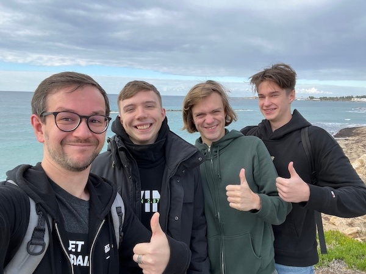

# Announcement

Hello! On [Monday, January 15, 2024 at 20:35UTC+6](https://codeforces.com/https://www.timeanddate.com/worldclock/fixedtime.html?day=15&month=1&year=2024&hour=17&min=35&sec=0&p1=166) will start [Codeforces Round 920 (Div. 3)](https://codeforces.com/contest/1921 "Codeforces Round 920 (Div. 3)"), the next Codeforces round for the third division.

The round was coordinated by [Vladosiya](https://codeforces.com/profile/Vladosiya "Expert Vladosiya"), and prepared by me and the students of [Neapolis University Pafos](https://codeforces.com/https://lp.jetbrains.com/academy/csai-program/): [Vitaly503](https://codeforces.com/profile/Vitaly503 "Expert Vitaly503"), [goncharovmike](https://codeforces.com/profile/goncharovmike "Candidate Master goncharovmike"), [ikrpprppp](https://codeforces.com/profile/ikrpprppp "Master ikrpprppp"), [step_by_step](https://codeforces.com/profile/step_by_step "International Grandmaster step_by_step").

Thank you very much [Alexdat2000](https://codeforces.com/profile/Alexdat2000 "Master Alexdat2000"), [dan_dolmatov](https://codeforces.com/profile/dan_dolmatov "Expert dan_dolmatov"), [fastmath](https://codeforces.com/profile/fastmath "Grandmaster fastmath"), [FBI](https://codeforces.com/profile/FBI "Expert FBI"), [Nickir](https://codeforces.com/profile/Nickir "Master Nickir"), [nikhil97agra](https://codeforces.com/profile/nikhil97agra "Pupil nikhil97agra"), [pavlekn](https://codeforces.com/profile/pavlekn "Master pavlekn"), [PMiguelez](https://codeforces.com/profile/PMiguelez "Expert PMiguelez"), [SashaT9](https://codeforces.com/profile/SashaT9 "Expert SashaT9"), [senjougaharin](https://codeforces.com/profile/senjougaharin "Candidate Master senjougaharin"), [Sergey140146659](https://codeforces.com/profile/Sergey140146659 "Specialist Sergey140146659"), [Sparrow_Guo](https://codeforces.com/profile/Sparrow_Guo "Specialist Sparrow_Guo"), [Toy_mouse](https://codeforces.com/profile/Toy_mouse "Pupil Toy_mouse"), [vladmart](https://codeforces.com/profile/vladmart "Master vladmart") for testing the round.

As usual for the third division rounds:

 * there will be 6-8 tasks in a round
* round duration is 2 hours 15 minutes
* the round follows the ICPC rules, penalty for an incorrect submission is 10 minutes
* round is rated for participants with ratings up to 1600
* after the round there will be a 12-hour open hacking phase

[Remember](https://codeforces.com/blog/entry/59228) that only the trusted participants of the third division will be included in the official standings table. As it is written by link, this is a compulsory measure for combating unsporting behaviour. To qualify as a trusted participant of the third division, you must:

 * take part in at least five rated rounds (and solve at least one problem in each of them)
* do not have a point of 1900 or higher in the rating.

**Regardless of whether you are a trusted participant of the third division or not, if your rating is less than 1600, then the round will be rated for you.**

Good luck to all!

UPD: [Editorial](Tutorial.md)

