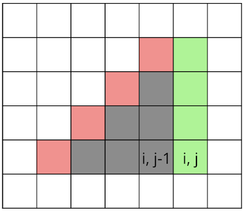

# Tutorial

[1921A - Square](../problems/A._Square.md "Codeforces Round 920 (Div. 3)")

Idea: [goncharovmike](https://codeforces.com/profile/goncharovmike "Candidate Master goncharovmike"), prepared: [pashka](https://codeforces.com/profile/pashka "International Grandmaster pashka")

 **Tutorial**
### [1921A - Square](../problems/A._Square.md "Codeforces Round 920 (Div. 3)")

There are many ways to solve this problem, the simplest way is as follows. Let's find the minimum and maximum coordinate x among all the corners of the square. The difference of these coordinates will give us the length of the square side d=xmax−xmin. After that, we can calculate the area of the square as s=d2.

 **Solution**
```cpp
t = int(input())
for _ in range(t):
    a = [[int(x) for x in input().split()] for i in range(4)]
    x = [p[0] for p in a]
    dx = max(x) - min(x)
    print(dx * dx)
```
[1921B - Arranging Cats](../problems/B._Arranging_Cats.md "Codeforces Round 920 (Div. 3)")

Idea: [pashka](https://codeforces.com/profile/pashka "International Grandmaster pashka"), prepared: [ikrpprppp](https://codeforces.com/profile/ikrpprppp "Master ikrpprppp")

 **Tutorial**
### [1921B - Arranging Cats](../problems/B._Arranging_Cats.md "Codeforces Round 920 (Div. 3)")

Denote the amount of indices i such that si=0 and fi=1 as add_amnt. Since it is impossible to change 0 to 1 at two different positions in one turn, the answer is not less than add_amnt. Analogously, if rmv_amnt is amount of indices such that si=1 and fi=0, the answer is not less than rmv_amnt.

It turns out that the answer is actually equal to max(add_amnt,rmv_amnt). We can simply apply move operation from the index i with si=1,fi=0 to j with sj=0,fj=1 while there are both of these types of indices (that will be min(rmv_amnt,add_amnt) operations) and then add or remove the rest of unsatisfied indices (that is exactly |rmv_amnt−add_amnt| operations). 

 **Solution**
```cpp
t = int(input())

for _ in range(t):
    n = int(input())
    start = [int(x) for x in input()]
    finish = [int(x) for x in input()]
    pairs = list(zip(start, finish))
    add_amnt = sum(int(a < b) for a, b in pairs)
    rmv_amnt = sum(int(a > b) for a, b in pairs)
    print(max(add_amnt, rmv_amnt))
```
[1921C - Sending Messages](../problems/C._Sending_Messages.md "Codeforces Round 920 (Div. 3)")

Idea: [step_by_step](https://codeforces.com/profile/step_by_step "International Grandmaster step_by_step"), prepared: [step_by_step](https://codeforces.com/profile/step_by_step "International Grandmaster step_by_step"), [Vladosiya](https://codeforces.com/profile/Vladosiya "Expert Vladosiya")

 **Tutorial**
### [1921C - Sending Messages](../problems/C._Sending_Messages.md "Codeforces Round 920 (Div. 3)")

The most challenging part of this problem was probably carefully understanding the problem statement.

The problem can be reduced to the following. There are n time intervals: from 0 to m1, from m1 to m2, ..., from mn−1 to mn. For each interval, we need to find a way to spend as little charge of the phone as possible, and check that the total amount of charge we spend is less than the initial charge of the phone.

To spend the minimum amount of charge for one time interval, we can act in one of two ways. Let the length of the interval be t. We either leave the phone on and spend a⋅t units of charge, or turn off the phone at the very beginning of the interval and turn it on at the very end, spending b units of charge.

The total time complexity of this solution is O(n).

 **Solution**
```cpp
t = int(input())
for _ in range(t):
    n, f, a, b = map(int, input().split())
    m = [0] + [int(x) for x in input().split()]
    for i in range(1, n + 1):
        f -= min(a * (m[i] - m[i - 1]), b)
    print('YES' if f > 0 else 'NO')
```
[1921D - Very Different Array](../problems/D._Very_Different_Array.md "Codeforces Round 920 (Div. 3)")

Idea: [Vitaly503](https://codeforces.com/profile/Vitaly503 "Expert Vitaly503"), prepared: [pashka](https://codeforces.com/profile/pashka "International Grandmaster pashka")

 **Tutorial**
### [1921D - Very Different Array](../problems/D._Very_Different_Array.md "Codeforces Round 920 (Div. 3)")

Let's sort the array a in ascending order, and the array b in descending order. Notice that small elements of array a need to be matched with large elements of array b and vice versa. Thus, for some k, we need to take a prefix of array b of length k and a suffix of length n−k, and form array c from them. We iterate over the value of k from 0 to n, and each time k changes by 1, only one element of array c changes, so we can recalculate the value of D in O(1). We select the maximum value of D from the obtained values to get the answer. This solution works in O(n) time plus the initial sorting in O(nlogn).

There are other ways to solve the problem in the same time complexity.

 **Solution**
```cpp
#include <bits/stdc++.h>
using namespace std;

struct test {
   void solve() {
        int n, m;
        cin >> n >> m;
        vector<int> a(n);
        for (int i = 0; i < n; i++) cin >> a[i];
        vector<int> b(m);
        for (int i = 0; i < m; i++) cin >> b[i];
        sort(a.begin(), a.end());
        sort(b.rbegin(), b.rend());
        vector<int> c(n);
        long long s = 0;
        for (int i = 0; i < n; i++) {
            c[i] = b[m &mdash; n + i];
            s += abs(c[i] &mdash; a[i]);
        }
        long long res = 0;
        for (int k = 0; k <= n; k++) {
            res = max(res, s);
            if (k < n) {
                s -= abs(c[k] &mdash; a[k]);
                c[k] = b[k];
                s += abs(c[k] &mdash; a[k]);
            }
        }
        cout << res << "n";
    }
};

int main() {
    ios::sync_with_stdio(false);
    int n;
    cin >> n;
    for (int i = 0; i < n; i++) {
        test().solve();
    }
    return 0;
}
```
[1921E - Eat the Chip](../problems/E._Eat_the_Chip.md "Codeforces Round 920 (Div. 3)")

Idea: [ikrpprppp](https://codeforces.com/profile/ikrpprppp "Master ikrpprppp"), prepared: [ikrpprppp](https://codeforces.com/profile/ikrpprppp "Master ikrpprppp")

 **Tutorial**
### [1921E - Eat the Chip](../problems/E._Eat_the_Chip.md "Codeforces Round 920 (Div. 3)")

First, let's note that the difference xb−xa decreases exactly by one each (both Alice's and Bob's) turn. In the end, if one of the players was able to win, xb−xa=0. In particular, that means that if xa−xb is initially odd then only Alice has a chance of winning the match and vice versa.

Suppose that xa−xb is initially even (the outcome of the match could be either Bob's win or draw). If xa≥xb the answer is immediately draw. Otherwise, the players will make t=(xb−xa)/2 moves each before xa=xb.

If at some point during these 2t moves Bob can achieve ya=yb, he is winning as he can continue with symmetrical responses to Alice's turns.

If ya>yb and Bob cannot reach right border (w>yb+t), Alice can always choose the rightmost option for her and after each of 2t moves ya will be greater than yb which means Bob cannot win. Otherwise, if Bob always chooses the rightmost option for him, he will eventually achieve ya=yb.

The case when ya is initially less than yb as well as the case when Alice has a chance to win (xb−xa is odd) can be covered in a similar way.

 **Solution**
```cpp
def solve():
    h, w, xA, yA, xB, yB = map(int, input().split())

    if (xA - xB) % 2 == 0:
        winner = "Bob"
        if xA >= xB:
            win = False
        elif yA == yB:
            win = True
        else:
            if yA < yB:
                n_turns = yB - 1
            else:
                n_turns = w - yB
            win = xB - 2 * n_turns >= xA

    else:
        winner = "Alice"

        xA += 1
        yA += 0 if yB - yA == 0 else 1 if yB - yA > 0 else -1

        if xA > xB:
            win = False
        elif yA == yB:
            win = True
        else:
            if yA < yB:
                n_turns = w - yA
            else:
                n_turns = yA - 1
            win = xB - 2 * n_turns >= xA

    print(winner if win else "Draw")


t = int(input())

for _ in range(t):
    solve()
```
[1921F - Sum of Progression](../problems/F._Sum_of_Progression.md "Codeforces Round 920 (Div. 3)")

Idea: [Vitaly503](https://codeforces.com/profile/Vitaly503 "Expert Vitaly503"), prepared: [Vitaly503](https://codeforces.com/profile/Vitaly503 "Expert Vitaly503")

 **Tutorial**
### [1921F - Sum of Progression](../problems/F._Sum_of_Progression.md "Codeforces Round 920 (Div. 3)")

The key idea is that we know how to calculate the sum (i−l+1)⋅ai for l≤i≤r fast – we need to calculate all prefix sums i⋅ai and ai for 1≤i≤k, then take the difference between the r-th and (l−1)-th of i⋅ai and subtract the difference between the r-th and (l−1)-th multiplied by l−1. This way queries with step 1 will be processed in O(n+q) time, where q is the total amount of queries with step 1. 

But this idea can be generalized to the following: we can precalculate all the prefix sums and all the prefix sums with multiplication by index for every d0≤d in O(n⋅d) time, and then process all queries with step d0≤d in O(1) time. 

However, for all other queries we can process a single query in O(n/d) time, because the difference between consecutive elements in the resulting sequence is greater than d. 

Combining these two ideas, we get a solution with a time complexity O(n⋅d+q⋅n/d). Setting d=√q, we get a solution with a time complexity O(n√q). The model solution fixes the value of d=322, which is equal to √MAX.

Interestingly, this solution can be generalized to calculate the sums (i+1)2⋅as+d⋅i.

 **Solution**
```cpp
#include <bits/stdc++.h>

using namespace std;

long long precalc[322][200322];
long long precalci[322][200322];

void solve() {
    int n, q;
    cin >> n >> q;
    vector<long long> a(n);
    int pivot = 1;
    while (pivot * pivot < n) {
        pivot++;
    }
    for (int i = 0; i < n; i++) {
        cin >> a[i];
    }
    for (int i = 0; i < pivot; i++) {
        for (int j = 0; j <= i; j++) {
            precalc[i][j] = 0LL;
            precalci[i][j] = 0LL;
        }
        for (int j = 0; j < n; j++) {
            precalci[i][j + i + 1] = precalci[i][j] + a[j] * (j / (i + 1) + 1);
            precalc[i][j + i + 1] = precalc[i][j] + a[j];
        }
    }
    while (q--) {
        int s, d;
        long long k;
        long long ans = 0;
        cin >> s >> d >> k;
        s--;
        if (d > pivot) {
            for (int i = s; i <= s + (k - 1) * d; i += d) {
                ans += a[i] * ((i - s) / d + 1);
            }
            cout << ans << " ";
            continue;
        }
        long long last = s + d * k - d;
        int first = s;
        cout << precalci[d - 1][last + d] - precalci[d - 1][first] -
                (precalc[d - 1][last + d] - precalc[d - 1][first]) * (first / d) << ' ';
    }
}

int main() {
    ios_base::sync_with_stdio(false);
    cin.tie(nullptr);
    cout.tie(nullptr);
    int tests;
    cin >> tests;
    while (tests--) {
        solve();
        if (tests) cout << "n";
    }
    return 0;
}
```
[1921G - Mischievous Shooter](../problems/G._Mischievous_Shooter.md "Codeforces Round 920 (Div. 3)")

Idea: [Vitaly503](https://codeforces.com/profile/Vitaly503 "Expert Vitaly503"), prepared: [goncharovmike](https://codeforces.com/profile/goncharovmike "Candidate Master goncharovmike")

 **Tutorial**
### [1921G - Mischievous Shooter](../problems/G._Mischievous_Shooter.md "Codeforces Round 920 (Div. 3)")

First of all, notice that we can consider only the case where the triangle of affected cells is oriented left-up. To solve the remaining cases, we can solve the problem for four different board orientations and choose the maximum result from the obtained results.

We will store several arrays with prefix sums: for the sum of all numbers in the cells of the current column above the given one, as well as for the sum of all numbers in the cells up and to the right of the given one. Using such prefix sums, we can easily recalculate the answer in cell (i,j) through the answer in cell (i,j−1) in O(1). To do this, we need to add the sum of the cells marked in green and subtract the sum of the cells marked in red.

  The total time complexity of this solution is O(nm).

Note that the problem could also be solved in time O(nmmin(n,m)) by computing prefix sums in the minimum of the directions and calculating the sums in the triangle in O(min(n,m)). This solution also fits within the time limit.

 **Solution**
```cpp
//ciao_chill
#include<bits/stdc++.h>
using namespace std;
#define int long long

int n, m, k;
vector<vector<int>> a;


bool prov(int i, int j) {
    return 0 <= i && i < n && 0 <= j && j < m;
}

int ans() {
    int cnt = 0;
    int dp[n][m];
    int pref[n][m];
    int pref_up[n][m];
    for (int i = 0; i < n; i++) {
        for (int j = 0; j < m; j++) {
            pref_up[i][j] = a[i][j];
            if (prov(i - 1, j))
                pref_up[i][j] += pref_up[i - 1][j];
        }
    }

    for (int i = 0; i < n; i++) {
        for (int j = m - 1; j >= 0; j--) {
            pref[i][j] = a[i][j];
            if (prov(i - 1, j + 1))
                pref[i][j] += pref[i - 1][j + 1];
        }
    }

    for (int i = 0; i < n; i++) {
        for (int j = 0; j < m; j++) {
            dp[i][j] = pref_up[i][j];
            if (prov(i - k, j))
                dp[i][j] -= pref_up[i - k][j];
            if (prov(i, j - 1))
                dp[i][j] += dp[i][j - 1];
            if (j < k) {
                int i1 = j - k + i;
                if (i1 >= 0)
                    dp[i][j] -= pref[i1][0];
            }
            else
                dp[i][j] -= pref[i][j - k];
            if (prov(i - k, j))
                dp[i][j] += pref[i - k][j];
            cnt = max(cnt, dp[i][j]);
        }
    }

    return cnt;
}

void solve() {
    cin >> n >> m >> k;
    k++;
    char c;
    bool st[n][m];
    a.resize(n);
    for (int i = 0; i < n; i++) {
        a[i].resize(m);
    }
    for (int i = 0; i < n; i++) {
        for (int j = 0; j < m; j++)
        {
            cin >> c;
            st[i][j] = (c == '#');
            a[i][j] = st[i][j];
        }
    }

    int mx = ans();
    for (int i = 0; i < n; i++) {
        for (int j = 0; j < m; j++) {
            a[i][j] = st[n - i - 1][j];
        }
    }
    mx = max(mx, ans());
    for (int i = 0; i < n; i++) {
        for (int j = 0; j < m; j++) {
            a[i][j] = st[i][m - j - 1];
        }
    }
    mx = max(mx, ans());
    for (int i = 0; i < n; i++) {
        for (int j = 0; j < m; j++) {
            a[i][j] = st[n - i - 1][m - j - 1];
        }
    }
    mx = max(mx, ans());

    cout << mx << 'n';

}

signed main() {
    cin.tie(nullptr);
    cout.tie(nullptr);
    ios_base::sync_with_stdio(false);

    int tt;
    cin >> tt;
    while (tt--)
        solve();

    return 0;
}
```
