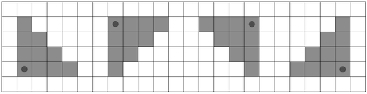
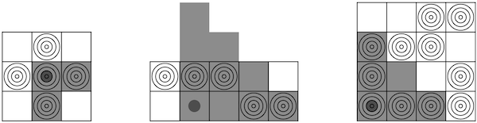

<h1 style='text-align: center;'> G. Mischievous Shooter</h1>

<h5 style='text-align: center;'>time limit per test: 2 seconds</h5>
<h5 style='text-align: center;'>memory limit per test: 256 megabytes</h5>

Once the mischievous and wayward shooter named Shel found himself on a rectangular field of size $n \times m$, divided into unit squares. Each cell either contains a target or not.

Shel only had a lucky shotgun with him, with which he can shoot in one of the four directions: right-down, left-down, left-up, or right-up. When fired, the shotgun hits all targets in the chosen direction, the Manhattan distance to which does not exceed a fixed constant $k$. The Manhattan distance between two points $(x_1, y_1)$ and $(x_2, y_2)$ is equal to $|x_1 - x_2| + |y_1 - y_2|$.

  Possible hit areas for $k = 3$. Shel's goal is to hit as many targets as possible. Please help him find this value.

### Input

Each test consists of several test cases. The first line contains a single integer $t$ ($1 \le t \le 1000$) — the number of test cases. Then follows the description of the test cases.

The first line of each test case contains field dimensions $n$, $m$, and the constant for the shotgun's power $k$ ($1 \le n, m, k \le 10^5, 1 \le n \cdot m \le 10^5$).

Each of the next $n$ lines contains $m$ characters — the description of the next field row, where the character '.' means the cell is empty, and the character '#' indicates the presence of a target. 

It is guaranteed that the sum of $n \cdot m$ over all test cases does not exceed $10^5$.

### Output

For each test case, output a single integer on a separate line, which is equal to the maximum possible number of hit targets with one shot.

## Example

### Input


```text
43 3 1.#.###.#.2 5 3###.....##4 4 2..#####.#..#####2 1 3##
```
### Output

```text

3
4
5
2

```
## Note

Possible optimal shots for the examples in the statement:

  

#### Tags 

#2200 #NOT OK #brute_force #data_structures #divide_and_conquer #dp #implementation 

## Blogs
- [All Contest Problems](../Codeforces_Round_920_(Div._3).md)
- [Announcement](../blogs/Announcement.md)
- [Tutorial](../blogs/Tutorial.md)
