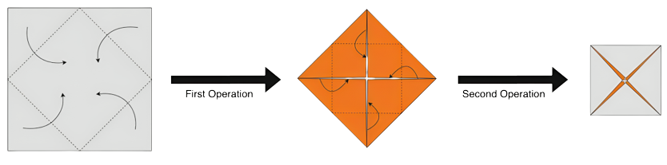

<h1 style='text-align: center;'> C. Fractal Origami</h1>

<h5 style='text-align: center;'>time limit per test: 1 second</h5>
<h5 style='text-align: center;'>memory limit per test: 256 megabytes</h5>

You have a square piece of paper with a side length equal to $1$ unit. In one operation, you fold each corner of the square to the center of the paper, thus forming another square with a side length equal to $\dfrac{1}{\sqrt{2}}$ units. By taking this square as a new square, you do the operation again and repeat this process a total of $N$ times.

  Performing operations for $N = 2$. After performing the set of operations, you open the paper with the same side up you started with and see some crease lines on it. Every crease line is one of two types: a mountain or a valley. A mountain is when the paper folds outward, and a valley is when the paper folds inward.

You calculate the sum of the length of all mountain crease lines on the paper and call it $M$. Similarly, you calculate for valley crease lines and call it $V$. You want to find the value of $\dfrac{M}{V}$.

It can be proved that this value can be represented in the form of $A + B\sqrt{2}$, where $A$ and $B$ are rational numbers. Let this $B$ be represented as an irreducible fraction $\dfrac{p}{q}$, your task is to print $p*inv(q)$ modulo $999\,999\,893$ (note the unusual modulo), where $inv(q)$ is the [modular inverse](https://en.wikipedia.org/wiki/Modular_multiplicative_inverse) of $q$.

### Input

Each test contains multiple test cases. The first line contains the number of test cases $t$ ($1 \leq t \leq 10^4$). Description of the test cases follows.

The only line of each test case contains an integer $N$ ($1 \leq N \leq 10^9$), the number of operations you perform on the square paper.

### Output

For each test case, print on a new line the required answer.

## Example

### Input


```text
3123
```
### Output

```text

0
1
714285638

```
## Note

The blue lines in the given figures represent mountain crease lines, and the green lines represent valley crease lines.

 

|  |  |
| --- | --- |
| Crease lines after $1$ operation $(\dfrac{M}{V} = 0)$. | Crease lines after $2$ operations $(\dfrac{M}{V} = \sqrt{2} - 1)$. |

 

#### Tags 

#2400 #NOT OK #geometry #math #matrices 

## Blogs
- [All Contest Problems](../Codeforces_Round_921_(Div._1).md)
- [Announcement (en)](../blogs/Announcement_(en).md)
- [Tutorial (en)](../blogs/Tutorial_(en).md)
