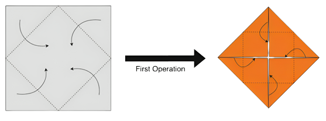
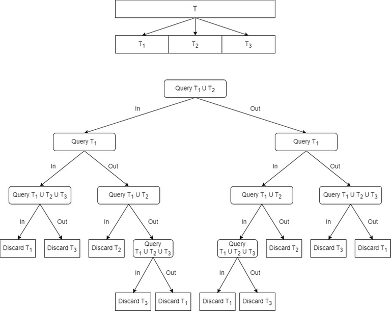

# Tutorial_(en)

I hope you enjoyed the round. Here is the editorial. Do provide your feedback on each problem so that we can improve upon them the next time.

#### [2A. We Got Everything Covered!](../problems/A._We_Got_Everything_Covered!.md)

Author: [JaySharma1048576](https://codeforces.com/profile/JaySharma1048576 "Master JaySharma1048576")

 **Hint 1**The smallest length for such a string is n⋅k.

 **Tutorial**The smallest length possible for such a string is n⋅k.

 **Why?**To have the string aaa…a as a subsequence, you need to have at least n characters in the string as a. Similarly for all k different characters. So, that gives a total length of at least n⋅k.

In fact, it is always possible to construct a string of length n⋅k that satisfies this property. One such string is (a1a2a3…ak)(a1a2a3…ak)(a1a2a3…ak)…n times where ai is the ith letter of English alphabet. For example, the answer for n=3,k=4 can be abcdabcdabcd. It is not hard to see that the first letter of the subsequence can be from the first group of k letters, second letter from the second group and so on.

 **Solution**
```cpp
#include <bits/stdc++.h>
using namespace std;

int main()
{
    int tc;
    cin >> tc;
    while(tc--)
    {
        int n,k;
        cin >> n >> k;
        for(int i=0;i<n;i++)
            for(char c='a';c<'a'+k;c++)
                cout << c;
        cout << 'n';
    }
}
```
 **Feedback*** Good problem: 


[*468*](https://codeforces.com/data/like?action=like "I like this")
* Ok problem: 

 
[*82*](https://codeforces.com/data/like?action=like "I like this")
* Bad problem: 

 
[*36*](https://codeforces.com/data/like?action=like "I like this")
* Did not attempt: 

 
[*9*](https://codeforces.com/data/like?action=like "I like this")
#### [2B. A Balanced Problemset?](../problems/B._A_Balanced_Problemset_.md)

Author: [JaySharma1048576](https://codeforces.com/profile/JaySharma1048576 "Master JaySharma1048576")

 **Hint 1**GCD(a1,a2,a3,…,an)=GCD(a1,a1+a2,a1+a2+a3,…,a1+a2+a3+…+an)

 **Hint 2**The maximum GCD that can be achieved is always a divisor of x.

 **Tutorial**Let the difficulties of the n sub-problems be a1,a2,a3,…,an. By properties of GCD, GCD(a1,a2,a3,…,an) =GCD(a1,a1+a2,a1+a2+a3,…,a1+a2+a3+…+an) =GCD(a1,a1+a2,a1+a2+a3,…,x). So, the final answer will always be a divisor of x. 

Now, consider a divisor d of x. If n⋅d≤x, you can choose the difficulties of the sub-problems to be d,d,d,…,x−(n−1)d each of which is a multiple of d and hence, the balance of this problemset will be d. Otherwise you cannot choose the difficulties of n sub-problems such that each of them is a multiple of d. 

Find the maximum d for which this condition holds. This can be done in O(√x) using trivial factorization.

 **Solution**
```cpp
#include <bits/stdc++.h>
using namespace std;

int main()
{
    int tc;
    cin >> tc;
    while(tc--)
    {
        int x,n;
        cin >> x >> n;
        int ans = 1;
        for(int i=1;i*i<=x;i++)
        {
            if(x%i==0)
            {
                if(n<=x/i)
                    ans=max(ans,i);
                if(n<=i)
                    ans=max(ans,x/i);
            }
        }
        cout << ans << 'n';
    }
}
```
 **Feedback*** Good problem: 

 
[*630*](https://codeforces.com/data/like?action=like "I like this")
* Ok problem: 

 
[*92*](https://codeforces.com/data/like?action=like "I like this")
* Bad problem: 

 
[*133*](https://codeforces.com/data/like?action=like "I like this")
* Did not attempt: 

 
[*22*](https://codeforces.com/data/like?action=like "I like this")
#### [2C/1A. Did We Get Everything Covered?](https://codeforces.com/contest/1924/problem/A)

Author: [JaySharma1048576](https://codeforces.com/profile/JaySharma1048576 "Master JaySharma1048576")

 **Hint 1**Try to build the counter-case greedily.

 **Hint 2**While building the counter-case, it is always optimal to choose the first character as the one whose first index of occurrence in the given string is the highest.

 **Tutorial**We will try to construct a counter-case. If we can't the answer is `YES` otherwise `NO`.

We will greedily construct the counter-case. It is always optimal to choose the first character of our counter-case as the character (among the first k English alphabets) whose first index of occurrence in s is the highest. Add this character to our counter-case, remove the prefix up to this character from s and repeat until the length of the counter-case reaches n or we reach the end of s.

If the length of the counter-case is less than n, find a character which does not appear in the last remaining suffix of s. Keep adding this character to the counter-case until its length becomes n. This is a valid string which does not occur as a subsequence of s.

Otherwise, all possible strings of length n formed using the first k English alphabets occur as a subsequence of s.

 **Solution**
```cpp
#include <bits/stdc++.h>                   
using namespace std;

int main()
{
    std::ios::sync_with_stdio(false); cin.tie(NULL);cout.tie(NULL);
    int t;
    cin>>t;
    while(t--)
    {
        int n, k, m;
        cin>>n>>k>>m;
        string s;
        cin>>s;
        string res="";
        bool found[k];
        memset(found, false, sizeof(found));
        int count=0;
        for(char c:s)
        {
            if(res.size()==n)
                break;
            count+=(!found[c-'a']);
            found[c-'a']=true;
            if(count==k)
            {
                memset(found, false, sizeof(found));
                count=0;
                res+=c;
            }
        }
        if(res.size()==n)
            cout<<"YESn";
        else
        {
            cout<<"NOn";
            for(int i=0;i<k;i++)
            {
                if(!found[i])
                {
                    while(res.size()<n)
                        res+=(char)('a'+i);
                }
            }
            cout<<res<<"n";
        }
    }
}
```
 **Fun fact**This problem is essentially "Implement the checker for Div. 2A". It was not among the problems that were initially proposed for the round. While preparing problem 2A, I realized that writing the checker in itself might be a more interesting problem compared to 2A.

 **Feedback*** Good problem: 

 
[*967*](https://codeforces.com/data/like?action=like "I like this")
* Ok problem: 

 
[*59*](https://codeforces.com/data/like?action=like "I like this")
* Bad problem: 

 
[*107*](https://codeforces.com/data/like?action=like "I like this")
* Did not attempt: 

 
[*26*](https://codeforces.com/data/like?action=like "I like this")
#### [2D. Good Trip](../problems/D._Good_Trip.md)

Author: [yash_daga](https://codeforces.com/profile/yash_daga "Grandmaster yash_daga")

 **Hint 1**Since expected value is linear, we can consider the contribution of initial friendship values and the contribution of increase in friendship values by repeated excursions independently.

 **Hint 2**Contribution of the initial friendship values will be k×∑ni=1fi(n2).

 **Hint 3**Now we can assume that there are m pair of friends out of a total of (n2) pairs of students whose initial friendship value is 0.

 **Tutorial**Since expected value is linear, we can consider the contribution of initial friendship values and the contribution of increase in friendship values by repeated excursions independently.

Let d=(n2) denote the total number of pairs of students that can be formed.

Contribution of the initial friendship values will be s=k⋅∑ni=1fid.

Now, to calculate the contribution to the answer by the increase in friendship values due to excursions, for each pair of friends, it will be ∑kx=0x(x−1)2⋅P(x) where P(x) is the probability of a pair of friends to be selected for exactly x out of the k excursions which is given by P(x)=(kx)⋅(1d)x⋅(d−1d)k−x.

Since the increase is uniform for all pair of friends, we just have to multiply this value by m and add it to the answer.

The time complexity is O(m+klogk) per test case.

 **Solution**
```cpp
#include <bits/stdc++.h>                
#define int long long   
#define IOS std::ios::sync_with_stdio(false); cin.tie(NULL);cout.tie(NULL);
#define mod 1000000007ll
using namespace std;
const long long N=200005, INF=2000000000000000000;

int power(int a, int b, int p)
{
    if(b==0)
    return 1;
    if(a==0)
    return 0;
    int res=1;
    a%=p;
    while(b>0)
    {
        if(b&1)
        res=(1ll*res*a)%p;
        b>>=1;
        a=(1ll*a*a)%p;
    }
    return res;
}
int fact[N],inv[N];
void pre()
{
    fact[0]=1;
    inv[0]=1;
    for(int i=1;i<N;i++)
    fact[i]=(i*fact[i-1])%mod;
    for(int i=1;i<N;i++)
    inv[i]=power(fact[i], mod-2, mod);
}
int nCr(int n, int r, int p) 
{ 
    if(r>n || r<0)
    return 0;
    if(n==r)
    return 1;
    if (r==0) 
    return 1; 
    return (((fact[n]*inv[r]) % p )*inv[n-r])%p;
} 
int32_t main()
{
    IOS;
    pre();
    int t;
    cin>>t;
    while(t--)
    {
        int n, m, k;
        cin>>n>>m>>k;
        int sum=0;
        for(int i=0;i<m;i++)
        {
            int a, b, f;
            cin>>a>>b>>f;
            sum=(sum + f)%mod;
        }
        int den=((n*(n-1))/2ll)%mod;
        int den_inv=power(den, mod-2, mod);
        int base=(((sum*k)%mod)*den_inv)%mod;
        int avg_inc=0;
        for(int i=1;i<=k;i++)
        {
            // Extra sum added to ans if a particular pair of friends is picked i times. 
            int sum=((i*(i-1))/2ll)%mod; 
            int prob = (nCr(k, i, mod)*power(den_inv, i, mod))%mod;
            // Probablity that a particular pair in unpicked for a given excursion.
            int unpicked_prob = ((den-1)*den_inv)%mod;
            // Probability that a particular pair is picked exactly i times.
            prob=(prob * power(unpicked_prob, k-i, mod))%mod;
            avg_inc = (avg_inc + (sum*prob)%mod)%mod;
        }
        int ans = (base + (m*avg_inc)%mod)%mod;
        cout<<ans<<'n';
    }
}
```
 **Feedback*** Good problem: 

 
[*183*](https://codeforces.com/data/like?action=like "I like this")
* Ok problem: 

 
[*59*](https://codeforces.com/data/like?action=like "I like this")
* Bad problem: 

 
[*152*](https://codeforces.com/data/like?action=like "I like this")
* Did not attempt: 

 
[*34*](https://codeforces.com/data/like?action=like "I like this")
#### [2E/1B. Space Harbour](https://codeforces.com/contest/1924/problem/B)

Author: [yash_daga](https://codeforces.com/profile/yash_daga "Grandmaster yash_daga")

 **Hint**Segment Tree with Lazy Propogation

 **Tutorial**We can maintain a segment tree of size n which initially stores the cost of all the ships.

Now there are 2 types of updates when we add an harbour:

 * The ships to the left of the new harbour have their cost decreased by a fixed amount.
* The ships to the right of the harbour have their cost changed by the value equivalent to product of distance from the harbour on their right (which remains unchanged) and the difference in values of the previous and new harbour to their left.

 **Example of updates**Let n=8 and there be harbours on point 1 and 8 with values 10 and 15 respectively.  
Now we add a harbour at point x=4 with value 5.

 * Case 1: (x=2,3) Cost for both ships get decreased by 10×(8−4)
* Case 2: (x=5,6,7) Cost for the ships get increased by (5−10)×3,(5−10)×2,(5−10)×1 respectively.
There are multiple ways to handle both the updates simultaneously, a simple way would be to use a struct simulating an arithmetic progression. It can contain two values 

 * Base: Simply a value which has to be added to all values belonging to the segment.
* Difference: For each node of the segment, dif×dist will be added to the node, where dist is the distance of node from the end of the segment.

Using summation of arithmetic progression we can make sure that the updates on Difference can be applied to an entire segment lazily. You can see the code for more details.

 **Solution**
```cpp
#include <bits/stdc++.h>                 
#define int long long    
#define IOS std::ios::sync_with_stdio(false); cin.tie(NULL);cout.tie(NULL);
using namespace std;
const long long N=300005;

struct ap {
    int base, dif;
};

ap add(ap a, ap b)
{
    ap res;
    res.base = a.base + b.base;
    res.dif = a.dif + b.dif;
    return res;
}

int convert(ap a, int n)
{
    int res = (n*a.base);
    res += ((n*(n-1))/2ll)*a.dif;
    return res;
}

int st[4*N], cost[N];
ap lazy[4*N];
ap zero = {0, 0};

void propogate(int node, int l, int r)
{
    st[node] += convert(lazy[node], r-l+1);
    if(l!=r)
    {
        lazy[node*2+1] = add(lazy[node*2+1], lazy[node]);
        int mid = (l+r)/2;
        int rig = (r-mid);
        lazy[node].base += (rig*lazy[node].dif);
        lazy[node*2] = add(lazy[node*2], lazy[node]);
    }
    lazy[node] = zero;
}
void build(int node, int l, int r)
{
    if(l==r)
    {
        st[node] = cost[l];
        lazy[node] = zero;
        return;
    }
    int mid=(l+r)/2;
    build(node*2, l, mid);
    build(node*2+1, mid+1, r);
    st[node] = (st[node*2] + st[node*2+1]);
    lazy[node] = zero; 
    return;
}
void update(int node, int l, int r, int x, int y, ap val)
{
    if(lazy[node].base != 0 || lazy[node].dif != 0)
    propogate(node, l, r);
    if(y<x||x>r||y<l)
    return;
    if(l>=x&&r<=y)
    {
        st[node] += convert(val, r-l+1);
        if(l!=r)
        {
            lazy[node*2+1] = add(lazy[node*2+1], val);
            int mid = (l+r)/2;
            int rig = (r-mid);
            val.base += (rig*val.dif);
            lazy[node*2] = add(lazy[node*2], val);
        }
        return;
    }
    int mid=(l+r)/2;
    update(node*2+1, mid+1, r, x, y, val);
    if(y>mid)
    {
        int rig = (min(y, r)-mid);
        val.base += (rig*val.dif);
    }
    update(node*2, l, mid, x, y, val);
    st[node] = st[node*2] + st[node*2+1];
    return;
}
int query(int node, int l, int r, int x, int y)
{
    if(lazy[node].base != 0 || lazy[node].dif != 0)
    propogate(node, l, r);
    if(y<x||y<l||x>r)
    return 0;
    if(l>=x&&r<=y)
    return st[node];
    int mid=(l+r)/2;
    return query(node*2, l, mid, x, y) + query(node*2+1, mid+1, r, x, y);
}

int32_t main()
{
    IOS;
    int n, m, q;
    cin>>n>>m>>q;
    set <int> harbours;
    int X[m], V[n+1];
    for(int i=0;i<m;i++)
    {
        cin>>X[i];
        harbours.insert(X[i]);
    }
    for(int i=0;i<m;i++)
    {
        int v;
        cin>>v;
        cost[X[i]] = v;
        V[X[i]] = v;
    }
    for(int i=1;i<=n;i++)
    {
        if(cost[i] == 0)
        cost[i] = cost[i-1];
    }
    int dist=0;
    for(int i=n;i>0;i--)
    {
        if(harbours.find(i) != harbours.end())
        dist=0;
        else
        dist++;
        cost[i] *= dist;
    }
    build(1, 1, n);
    while(q--)
    {
        int typ;
        cin>>typ;
        if(typ == 1)
        {
            int x, v;
            cin>>x>>v;
            V[x] = v;
            auto it = harbours.lower_bound(x);
            int nxt = (*it);
            it--;
            int prev = (*it);
            ap lef = {(V[prev]*(x-nxt)), 0};
            ap rig = {0, V[x]-V[prev]};
            update(1, 1, n, prev+1, x, lef);
            update(1, 1, n, x+1, nxt, rig);
            harbours.insert(x);
        }
        else
        {
            int l, r;
            cin>>l>>r;
            cout<<query(1, 1, n, l, r)<<'n';
        }
    }
}
```
 **Feedback*** Good problem: 

 
[*72*](https://codeforces.com/data/like?action=like "I like this")
* Ok problem: 

 
[*49*](https://codeforces.com/data/like?action=like "I like this")
* Bad problem: 

 
[*200*](https://codeforces.com/data/like?action=like "I like this")
* Did not attempt: 

 
[*16*](https://codeforces.com/data/like?action=like "I like this")
#### [2F/1C. Fractal Origami](https://codeforces.com/contest/1924/problem/C)

Author: [mexomerf](https://codeforces.com/profile/mexomerf "Candidate Master mexomerf")

 **Hint 1**You need more math and less paper :)

 **Hint 2**The length of mountain crease lines and valley crease lines created in each operation is the same, except for the first operation.

 **Tutorial**Let there be an upside of the paper and a downside of the paper, initially the upside of the paper is facing up. With a little imagination, we can see that the mountain crease lines on the upside of the paper will be valley crease lines on the downside of the paper, and vice versa.

 

Grey is the upside and orange is the downside

After the first operation, what once was a single layer of square paper turns into a square with two overlapping layers of paper. The layer at the bottom has its upside facing up, and the layer at the top has its downside facing up.

After this first operation, whatever crease lines are formed on the upside of the bottom layer will be the same as the ones formed on the bottom layer of the top layer, which means when the paper is unfolded and the upside of the entire paper is facing up, the mountain crease lines and the valley crease lines created after the first operation will be equal.

Let M be the length of mountain crease lines and V be the length of valley crease lines after N moves, and the side of the square paper is 1.

Let diff=V−M= Length of valley crease lines created in the first operation =2√2.

It is easy to calculate the total crease lines that are created (mountain and valley) in N operations. It is the sum of a GP.

Let sum=V+M=N∑i=12i−1⋅2√2⋅(1√2)i−1=N∑i=1(√2)i+2

Now to find MV, we use the age-old componendo and dividendo.

MV=sum−diffsum+diff

And then rationalize it to find the coefficient of √2.

 **Why unusual modulo?**The reason for the uncommon modulo in the problem is that the irrational part of MV is of the form a√2b2−2, where a and b are some integers. If there exists any b such that b2≡2(modm), then the denominator becomes 0.

To avoid this situation, such a prime modulo m was taken for which 2 is not a [quadratic residue](https://codeforces.com/https://en.wikipedia.org/wiki/Quadratic_residue) modulo m. It can be seen that 999999893mod8=5 and so, the [Legendre symbol](https://codeforces.com/https://en.m.wikipedia.org/wiki/Legendre_symbol) (2999999893)=−1 meaning that 2 is a quadratic non-residue modulo 999999893.

 **Solution**
```cpp
// library link: https://github.com/manan-grover/My-CP-Library/blob/main/library.cpp
#include <bits/stdc++.h>
#include <ext/pb_ds/assoc_container.hpp>
#include <ext/pb_ds/tree_policy.hpp>
using namespace std;
using namespace __gnu_pbds;
#define asc(i,a,n) for(I i=a;i<n;i++)
#define dsc(i,a,n) for(I i=n-1;i>=a;i--)
#define forw(it,x) for(A it=(x).begin();it!=(x).end();it++)
#define bacw(it,x) for(A it=(x).rbegin();it!=(x).rend();it++)
#define pb push_back
#define mp make_pair
#define fi first
#define se second
#define lb(x) lower_bound(x)
#define ub(x) upper_bound(x)
#define fbo(x) find_by_order(x)
#define ook(x) order_of_key(x)
#define all(x) (x).begin(),(x).end()
#define sz(x) (I)((x).size())
#define clr(x) (x).clear()
#define U unsigned
#define I long long int
#define S string
#define C char
#define D long double
#define A auto
#define B bool
#define CM(x) complex<x>
#define V(x) vector<x>
#define P(x,y) pair<x,y>
#define OS(x) set<x>
#define US(x) unordered_set<x>
#define OMS(x) multiset<x>
#define UMS(x) unordered_multiset<x>
#define OM(x,y) map<x,y>
#define UM(x,y) unordered_map<x,y>
#define OMM(x,y) multimap<x,y>
#define UMM(x,y) unordered_multimap<x,y>
#define BS(x) bitset<x>
#define L(x) list<x>
#define Q(x) queue<x>
#define PBS(x) tree<x,null_type,less<I>,rb_tree_tag,tree_order_statistics_node_update>
#define PBM(x,y) tree<x,y,less<I>,rb_tree_tag,tree_order_statistics_node_update>
#define pi (D)acos(-1)
#define md 999999893
#define rnd randGen(rng)
I modex(I a,I b,I m){
  a=a%m;
  if(b==0){
    return 1;
  }
  I temp=modex(a,b/2,m);
  temp=(temp*temp)%m;
  if(b%2){
    temp=(temp*a)%m;
  }
  return temp;
}
I mod(I a,I b,I m){
  a=a%m;
  b=b%m;
  I c=__gcd(a,b);
  a=a/c;
  b=b/c;
  c=modex(b,m-2,m);
  return (a*c)%m;
}
int main(){
  mt19937_64 rng(chrono::steady_clock::now().time_since_epoch().count());
  uniform_int_distribution<I> randGen;
  ios_base::sync_with_stdio(false);cin.tie(NULL);cout.tie(NULL);
  #ifndef ONLINE_JUDGE
  freopen("input.txt", "r", stdin);
  freopen("out04.txt", "w", stdout);
  #endif
  I temp=md;
  I t;
  cin>>t;
  while(t--){
    I n;
    cin>>n;
    I b=modex(2,n/2,md)-1;
    I a;
    if(n%2){
      a=modex(2,n/2+1,md)-1;
    }else{
      a=modex(2,n/2,md)-1;
    }
    I temp=(a+1)*(a+1);
    temp%=md;
    temp-=2*b*b;
    temp%=md;
    I ans=mod(2*b,temp,md);
    ans+=md;
    ans%=md;
    cout<<ans<<"n";
  }
  return 0;
}
```
 **Feedback*** Good problem: 

 
[*73*](https://codeforces.com/data/like?action=like "I like this")
* Ok problem: 

 
[*19*](https://codeforces.com/data/like?action=like "I like this")
* Bad problem: 

 
[*156*](https://codeforces.com/data/like?action=like "I like this")
* Did not attempt: 

 
[*12*](https://codeforces.com/data/like?action=like "I like this")
#### [1D. Balanced Subsequences](https://codeforces.com/contest/1924/problem/D)

Author: [yash_daga](https://codeforces.com/profile/yash_daga "Grandmaster yash_daga")

 **Hint 1**Consider a function f(n,m,k) which returns the number of permutations such that length of longest regular bracket subsequence is at most 2⋅k where n is the number of '(' and m is the number of ')'.

 **Hint 2**Answer to the problem is f(n,m,k)−f(n,m,k−1)

 **Tutorial**Now to compute f(n,m,k), we can consider the following cases:

 * Case 1: k≥min(n,m)→ Here, the answer is (n+mm), since none of the strings can have a subsequence of length greater than k.
* Case 2: k<min(n,m)→ Here we can write f(n,m,k)=f(n−1,m,k−1)+f(n,m−1,k) since all strings will either start with:  
a) ')' → Here, count is equal to f(n,m−1,k).  
b) '(' → Here, count is equal to f(n−1,m,k−1), the first opening bracket will always add 1 to the optimal subsequence length because all strings where each of the m ')' is paired to some '(' don't contribute to the count since k<m.

After this recurrence relation we have 2 base cases:

 * k=0→ Here, count is 1 which can also be written as (n+mk).
* k=min(n,m)→ Here, count is (n+mm) (as proved in Case 1) which can also be written as (n+mk).

Now using induction we can prove that the value of f(n,m,k) for Case 2 is (n+mk).

 **Solution**
```cpp
#include <bits/stdc++.h>                   
#define int long long      
using namespace std;
const long long N=4005, mod=1000000007;

int power(int a, int b, int p)
{
    if(a==0)
    return 0;
    int res=1;
    a%=p;
    while(b>0)
    {
        if(b&1)
        res=(1ll*res*a)%p;
        b>>=1;
        a=(1ll*a*a)%p;
    }
    return res;
}

int fact[N], inv[N];
void pre()
{
    fact[0]=inv[0]=1;
    for(int i=1;i<N;i++)
    fact[i]=(fact[i-1]*i)%mod;
    for(int i=1;i<N;i++)
    inv[i]=power(fact[i], mod-2, mod);
}
int nCr(int n, int r)
{
    if(min(n, r)<0 || r>n)
    return 0;
    if(n==r)
    return 1;
    return (((fact[n]*inv[r])%mod)*inv[n-r])%mod;
}
int f(int n, int m, int k)
{
    if(k>=min(n, m))
        return nCr(n+m, m);
    return nCr(n+m, k);
}
int32_t main()
{
    pre();
    int t;
    cin>>t;
    while(t--)
    {
        int n, m, k;
        cin>>n>>m>>k;
        cout<<(f(n, m, k) - f(n, m, k-1) + mod)%mod<<"n";
    }
}
```
 **Feedback*** Good problem: 

 
[*65*](https://codeforces.com/data/like?action=like "I like this")
* Ok problem: 

 
[*15*](https://codeforces.com/data/like?action=like "I like this")
* Bad problem: 

 
[*27*](https://codeforces.com/data/like?action=like "I like this")
* Did not attempt: 

 
[*8*](https://codeforces.com/data/like?action=like "I like this")
#### [1E. Paper Cutting Again](https://codeforces.com/contest/1924/problem/E)

Author: [yash_daga](https://codeforces.com/profile/yash_daga "Grandmaster yash_daga")

 **Hint 1**Can you solve it for k=2?

 **Hint 2**Using linearity of expectation, we can say that expected number of cuts is same as sum of probability of each line being cut and for k=2, we need to cut the paper until we achieve a 1×1 piece of paper.

Probability of each horizontal line being cut is 1countoflinesaboveit+1 Probability of each vertical line being cut is 1countoflineslefttoit+1 

Now for k=2 we just have to calculate the sum of all these probabilities.

 **Tutorial**For the given problem we can solve it by dividing it into 4 cases:

 1. Only Vertical Cuts:  
 Let the largest integer y for which n⋅y<k be reqv.  
  
 The probability of achieving the goal using only vertical cuts is reqvreqv+n−1 since one of the reqv lines needs to be cut before all the horizontal lines. Now we will multiply this with the sum of conditional probabilities for each of the vertical line.  
  
 Sum of conditional probabilities of being cut for all lines from 1 to reqv is exactly 1, since for area to be smaller than k, one of them needs to be cut and as soon as one is cut, the area becomes less than k so no further cuts are required. Now for the lines from reqv+1 to m−1, their conditional probabilities will form the following harmonic progression:  
  
 1n+reqv+1n+reqv+1+....+1n+m−2  
This is due to the fact that for a line to be cut it needs to occur before all horizontal lines and all vertical lines smaller than it.
2. Case with only horizontal cuts can be handled similarly.
3. Case when the overall last cut is a horizontal one and there is at least one vertical cut:  
  
 For this, we iterate over the last cut among all the vertical cuts.  
  
 Let the last vertical cut be x. We now find the largest y such that (y⋅x)<k. Let this value be reqh.  
  
 The objective can be achieved using this case if the vertical line x occurs before all the horizontal lines from 1 to reqh and all the vertical lines from 1 to x−1, and after that any one of the horizontal line from 1 to reqh occur before all the vertical lines from 1 to x−1.  
  
 The probability of this happening is 1x+reqh×reqhreqh+x−1.  
  
 Now we just add the the conditional probabilities of being cut for every line and multiply this with the above probability to find the contribution of this case to the final answer.  
  
 a. Firstly the conditional probability of the vertical line x being cut is 1.  
  
 b. The sum of conditional probabilities for horizontal lines 1 to reqh is also 1.  
  
 The order of the first x vertical cuts and the first reqh horizontal cuts for the given case would look like:  
xv, y1h, ((x−1) vertical lines and (reqh−1) horizontal lines in any relative ordering) [Total x+reqh elements in the sequence].  
  
 xv denotes the xth vertical cut.  
 y1h denotes the horizontal cut which occurs first among all the first reqh horizontal cuts.  
  
 c. Vertical cuts from x+1 to m−1:  
  
 For the (x+1)th cut, we can look at this like it needs to occur before the xth vertical cut (or it has one gap in the sequence to choose from a total of (x+reqh+1) gaps).  
  
 So the probability is 1x+reqh+1.  
  
 For the (x+2)th cut, we can first place the (x+2)th cut with probability 1x+reqh+1 now we need to place the (x+1)th cut after of this which will happen with the probability of x+reqh+1x+reqh+2.  
  
 So the overall probability is the product i.e., 1x+reqh+2.  
  
 Similarly, the probability for (x+i)th cut is 1x+reqh+i.  
  
 The sum of this Harmonic Progression can be computed in O(1) using pre computation.  
  
 d. Horizontal cuts from reqh+1 to n−1 (Trickiest Case imo)  
  
 Let us see the case for the (reqh+1)th cut → It has 2 optimal gaps (before xv and the gap between xv and y1h) so the probability is 2x+reqh+1.  
  
 Now for finding the probability for (reqh+i)th cut, we first place this cut into one of the 2 gaps and handle both cases separately.  
  
 Gap before xv: this case is similar to case 3c and the answer is just 1x+reqh+i.  
  
 Gap between xv and y1h. Here we again have to ensure that all lines from reqh+1 to reqh+i−1 occur after reqh+i.  
  
 So we multiply reqh+xreqh+x+2×reqs+x+1reqh+x+3 since after we place the (reqh+i)th cut, we have (reqh+x) good gaps among a total of (reqh+x+2) and so on for all the other lines we place (Their relative ordering does not matter since we are only concerned with (reqh+i)th cut).  
  
 The final term for (reqh+i)th cut occurs out to be: x+reqh(x+reqh+i)⋅(x+reqh+i−1).  
  
  
This forms a quadratic Harmonic Progression, the sum of which can be computed in O(1) using precomputation.
4. Case when the overall last cut is a vertical one and there is at least one horizontal cut:  
 This case can be handled in a similar way as the previous case.
 **Solution**
```cpp
#include <bits/stdc++.h>                    
#define int long long    
using namespace std;
const long long N=2000005, mod=1000000007;

int power(int a, int b, int p)
{
    if(a==0)
    return 0;
    int res=1;
    a%=p;
    while(b>0)
    {
        if(b&1)
        res=(1ll*res*a)%p;
        b>>=1;
        a=(1ll*a*a)%p;
    }
    return res;
}

int pref[N], inv[N], pref2[N], hp2[N];

// Returns (1/l + 1/(l+1) + ... + 1/r)
int cal(int l, int r)
{
    if(l>r)
        return 0;
    return (pref[r]-pref[l-1]+mod)%mod;
}

// Returns (1/(l*(l+1)) + ... + 1/(r(r+1)))
int cal2(int l, int r)
{
    if(l>r)
        return 0;
    return (pref2[r]-pref2[l-1]+mod)%mod;
}
void pre()
{
    pref[0]=0;
    pref2[0]=0;
    for(int i=1;i<N;i++)
    {
        inv[i]=power(i, mod-2, mod);
        pref[i]=(pref[i-1]+inv[i])%mod;
        int mul2=(i*(i+1))%mod;
        pref2[i]=(pref2[i-1] + power(mul2, mod-2, mod))%mod;
        hp2[i]=((i*(i-1))%mod)%mod;
    }
}
int solve2(int n, int m, int k)
{
    if((n*m)<k)
        return 0;
    int ans=0;
    int reqv=(k-1)/n;
    if(reqv<m)
    {
        int prob=(reqv*inv[reqv+n-1])%mod;
        int exp=(prob*(1ll + cal(n+reqv, m+n-2)))%mod;
        ans=(ans + exp)%mod;
    }
    int reqh=(k-1)/m;
    if(reqh<n)
    {
        int prob=(reqh*inv[reqh+m-1])%mod;
        int exp=(prob*(1ll + cal(m+reqh, m+n-2)))%mod;
        ans=(ans + exp)%mod;
    }
    for(int i=1;i<min(n, k);i++)
    {
        reqv=(k-1)/i;
        if(reqv>=m)
            continue;
        int prob=(inv[i+reqv]*reqv)%mod;
        prob=(prob*inv[i-1+reqv])%mod;
        int num1=(hp2[i+reqv+1]*cal2(i+reqv, i+m-2))%mod;
        int num2=((i+reqv+1)*cal(i+reqv+1, i+m-1))%mod;
        int num=((num1+num2)*inv[i+reqv+1])%mod;
        int exp=(prob*(2ll + cal(i+reqv+1, reqv+(n-1))+num))%mod;
        ans=(ans + exp)%mod;
    }
    for(int i=1;i<min(m, k);i++)
    {
        reqh=(k-1)/i;
        if(reqh>=n)
            continue;
        int prob=(inv[i+reqh]*reqh)%mod;
        prob=(prob*inv[i-1+reqh])%mod;
        // Sum for cases when the (reqh+i)th horizontal line occurs in the gap b/w x_v and y1_h
        int num1=(hp2[i+reqh+1]*cal2(i+reqh, i+n-2))%mod;
        // Sum for cases when the (reqh+i)th horizontal line occurs in the gap to the left of x_v
        int num2=((i+reqh+1)*cal(i+reqh+1, i+n-1))%mod;
        int num=((num1+num2)*inv[i+reqh+1])%mod;
        int exp=(prob*(2ll + cal(i+reqh+1, reqh+(m-1))+num))%mod;
        ans=(ans + exp)%mod;
    }
    return ans;
}
int32_t main()
{
    pre();
    int t;
    cin>>t;
    while(t--)
    {
        int n, m, k;
        cin>>n>>m>>k;
        cout<<solve2(n, m, k)<<"n";
    }
}
```
 **Feedback*** Good problem: 

 
[*41*](https://codeforces.com/data/like?action=like "I like this")
* Ok problem: 

 
[*0*](https://codeforces.com/data/like?action=like "I like this")
* Bad problem: 

 
[*10*](https://codeforces.com/data/like?action=like "I like this")
* Did not attempt: 

 
[*12*](https://codeforces.com/data/like?action=like "I like this")
#### [1F. Anti-Proxy Attendance](https://codeforces.com/contest/1924/problem/F)

Author: [JaySharma1048576](https://codeforces.com/profile/JaySharma1048576 "Master JaySharma1048576")

 **Hint 1**4√1.5=1.1069

 **Hint 2**Try to do a 3→2 reduction in 4 queries.

 **Hint 3**Try to do a 3→2 reduction in such a way that if the middle part is eliminated 3 queries are used otherwise 4 queries are used.

 **Hint 4**Instead of dividing the search space into 3 equal parts, divide it into parts having size 36%, 28% and 36%.

 **Tutorial**There might be multiple strategies to solve this problem. I will describe one of them.

First, let's try to solve a slightly easier version where something like ⌈log1.1n⌉ queries are allowed and subset queries are allowed instead of range queries.

The main idea is to maintain a search space of size S and reduce it to a search space of size ⌈2S3⌉ using atmost 4 queries. At the end, there will be exactly 2 elements remaining in the search space which can be guessed. The number of queries required to reduce a search space of size n to a search space of size 2 using the above strategy will be equal to 4⋅log32n2 =lnn20.25ln1.5 =lnn−ln2ln1.1067 <lnn−ln2ln1.1 =log1.1n−9.01 <⌈log1.1n⌉. 

Given below is one of the strategies how this can be achieved. Let the current search space be T. Divide T into 3 disjoint exhaustive subsets T1, T2 and T3 of nearly equal size. Then follow the decision tree given below to discard one of the three subsets using at most 4 queries.



It can seen that all the leaf nodes discard at least one-third of the search space based on the previous three queries. 

Now, coming back to the problem where only ranges are allowed to be queried. This can be easily solved by choosing T1, T2 and T3 in such a way that all elements of T1 are less than all elements of T2 and all elements of T2 are less than all elements of T3. Then all queries used in the above decision tree can be reduced to range queries since it really doesn't matter what are the actual elements of T1, T2 and T3.

Finally, there is just one small optimization left to be done. Notice that when T2 gets eliminated, only 3 queries are used and when T1 and T3 get eliminated, 4 queries are used. So, it must be more optimal to keep the size of T2 smaller than T1 and T3 but by how much? The answer is given by the equation (1−x)3=(2x)4. It has two imaginary and two real roots out of which only one is positive x=0.35843. So by taking the size of the segments approximately 36%, 28% and 36%, you can do it in lesser number of queries which is less than max(⌈log4√0.64−1n⌉,⌈log3√0.72−1n⌉)−log1.1162 which is less than ⌈log1.116n⌉−1.

 **Harder bonus tasks**During testing, the testers were able to come up with harder versions requiring lesser number of queries. Specifically, try to solve the problem under the following constraints assuming n≤105:

 * Harder version: 70 queries by [dario2994](https://codeforces.com/profile/dario2994 "International Grandmaster dario2994")
* Even harder version: 55 queries by [kevinsogo](https://codeforces.com/profile/kevinsogo "Grandmaster kevinsogo")
 **Solution**
```cpp
#include <bits/stdc++.h>
using namespace std;

void assemble(vector<int> &x,vector<int> &x1,vector<int> &x2,vector<int> &x3,string mask)
{
    x.clear();
    if(mask[0]=='1')
    {
        for(int i=0;i<x1.size();i++)
            x.push_back(x1[i]);
    }
    if(mask[1]=='1')
    {
        for(int i=0;i<x2.size();i++)
            x.push_back(x2[i]);
    }
    if(mask[2]=='1')
    {
        for(int i=0;i<x3.size();i++)
            x.push_back(x3[i]);
    }
}

bool query(vector<int> &x1,vector<int> &x2,vector<int> &x3,string mask)
{
    vector<int> x;
    assemble(x,x1,x2,x3,mask);
    int l=x[0],r=x.back();
    cout << "? " << l << " " << r << endl;
    int y;
    cin >> y;
    return (y==r-l);
}

void guess(int x)
{
    cout << "! " << x << endl;
    int y;
    cin >> y;
}

void finish()
{
    cout << "#" << endl;
}

int main()
{
    int tc;
    cin >> tc;
    while(tc--)
    {
        int n;
        cin >> n;
        vector<int> x;
        for(int i=1;i<=n;i++)
            x.push_back(i);
        while(x.size()>2)
        {
            int m = x.size();
            int k = round(0.36*m);
            vector<int> x1,x2,x3;
            for(int i=0;i<k;i++)
                x1.push_back(x[i]);
            for(int i=k;i<m-k;i++)
                x2.push_back(x[i]);
            for(int i=m-k;i<m;i++)
                x3.push_back(x[i]);
            if(query(x1,x2,x3,"110"))
            {
                if(query(x1,x2,x3,"100"))
                {
                    if(query(x1,x2,x3,"111"))
                    {
                        assemble(x,x1,x2,x3,"011");
                    }
                    else
                    {
                        assemble(x,x1,x2,x3,"110");
                    }
                }
                else
                {
                    if(query(x1,x2,x3,"110"))
                    {
                        assemble(x,x1,x2,x3,"101");
                    }
                    else
                    {
                        if(query(x1,x2,x3,"111"))
                        {
                            assemble(x,x1,x2,x3,"110");
                        }
                        else
                        {
                            assemble(x,x1,x2,x3,"011");
                        }
                    }
                }
            }
            else
            {
                if(query(x1,x2,x3,"100"))
                {
                    if(query(x1,x2,x3,"110"))
                    {
                        if(query(x1,x2,x3,"111"))
                        {
                            assemble(x,x1,x2,x3,"011");
                        }
                        else
                        {
                            assemble(x,x1,x2,x3,"110");
                        }
                    }
                    else
                    {
                        assemble(x,x1,x2,x3,"101");
                    }
                }
                else
                {
                    if(query(x1,x2,x3,"111"))
                    {
                        assemble(x,x1,x2,x3,"110");
                    }
                    else
                    {
                        assemble(x,x1,x2,x3,"011");
                    }
                }
            }
        }
        guess(x[0]);
        guess(x[1]);
        finish();
    }
}
```
 **Feedback*** Good problem: 

 
[*44*](https://codeforces.com/data/like?action=like "I like this")
* Ok problem: 

 
[*3*](https://codeforces.com/data/like?action=like "I like this")
* Bad problem: 

 
[*8*](https://codeforces.com/data/like?action=like "I like this")
* Did not attempt: 

 
[*28*](https://codeforces.com/data/like?action=like "I like this")
