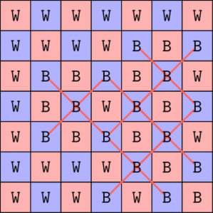

# Tutorial_(en)

Thank you for participating!

[1926A - Vlad and the Best of Five](../problems/A._Vlad_and_the_Best_of_Five.md "Codeforces Round 928 (Div. 4)")

Idea: [flamestorm](https://codeforces.com/profile/flamestorm "Candidate Master flamestorm")

 **Tutorial**
### [1926A - Vlad and the Best of Five](../problems/A._Vlad_and_the_Best_of_Five.md "Codeforces Round 928 (Div. 4)")

Since the string is of an odd length, we know that the number of As can't be equal to the number of Bs. So, there is always only one possible answer.

Denote variables a_counter and b_counter — the count of As and Bs in the string respectively. Let's just iterate through all 5 characters of the string and increase the a_counter every time we see an A and the b_counter every time we see a B. If the a_counter is greater than the b_counter we output A, and B otherwise.

 **Solution**
```cpp
#include <bits/stdc++.h>
 
using namespace std;
 
const int MAX = 200'007;
const int MOD = 1'000'000'007;
 
void solve() {
	string s;
	cin >> s;
	int a = 0, b = 0;
	for (char c : s) {
		if (c == 'A') {a++;}
		else {b++;}
	}	
	cout << (a > b ? 'A' : 'B') << 'n';
}
 
int main() {
	ios::sync_with_stdio(false);
	cin.tie(nullptr);
	int tt; cin >> tt; for (int i = 1; i <= tt; i++) {solve();}
	// solve();
}

```
[1926B - Vlad and Shapes](../problems/B._Vlad_and_Shapes.md "Codeforces Round 928 (Div. 4)")

Idea: [mesanu](https://codeforces.com/profile/mesanu "Candidate Master mesanu")

 **Tutorial**
### [1926B - Vlad and Shapes](../problems/B._Vlad_and_Shapes.md "Codeforces Round 928 (Div. 4)")

Let's draw some examples on paper and notice a pattern. What we notice is that in the case of a triangle there is a row with exactly one 1, but not a square. So, this is what we need to check. 

Iterate through all rows, and check if there is a row with exactly one 1. If it was the case for at least one, then the answer is "TRIANGLE", and "SQUARE" otherwise.

Another solution. Check if any 2×2 square has sum 3. If it does, then we must be at one of the sloped sides of a triangle, so the answer is "TRIANGLE". If there is no such square, the answer is "SQUARE". Why does it work?

 **Solution**
```cpp
 #include <iostream>
#include <algorithm>
#include <vector>
#include <array>
#include <set>
#include <map>
#include <queue>
#include <stack>
#include <list>
#include <chrono>
#include <random>
#include <cstdlib>
#include <cmath>
#include <ctime>
#include <cstring>
#include <iomanip>
#include <bitset>
#include <cassert>
 
using namespace std;
 
void solve()
{
    int n;
    cin >> n;
    vector<string> g;
    for(int i = 0; i < n; i++)
    {
        string s;
        cin >> s;
        g.push_back(s);
    }
    bool triangle = false;
    for(int i = 0; i < n; i++)
    {
        int cnt = 0;
        for(int j = 0; j < n; j++)
        {
            if(g[i][j] == '1')
            {
                cnt++;
            }
        }
        if(cnt == 1)
        {
            triangle = true;
        }
        else if(cnt > 1)
        {
            break;
        }
    }
    reverse(g.begin(), g.end());
    for(int i = 0; i < n; i++)
    {
        int cnt = 0;
        for(int j = 0; j < n; j++)
        {
            if(g[i][j] == '1')
            {
                cnt++;
            }
        }
        if(cnt == 1)
        {
            triangle = true;
        }
        else if(cnt > 1)
        {
            break;
        }
    }
    if(triangle)
    {
        cout << "TRIANGLE" << endl;
    }
    else
    {
        cout << "SQUARE" << endl;
    }
}
 
int32_t main(){
    int t = 1;
    cin >> t;
    while (t--) {
        solve();
    }
}
 
 
 

```
[1926C - Vlad and a Sum of Sum of Digits](../problems/C._Vlad_and_a_Sum_of_Sum_of_Digits.md "Codeforces Round 928 (Div. 4)")

Idea: [flamestorm](https://codeforces.com/profile/flamestorm "Candidate Master flamestorm")

 **Tutorial**
### [1926C - Vlad and a Sum of Sum of Digits](../problems/C._Vlad_and_a_Sum_of_Sum_of_Digits.md "Codeforces Round 928 (Div. 4)")

Let's denote S(x) as the sum of digits of number x. Since n≤2⋅105, for a single test case, we can brute force S(1)+S(2)+S(3)+⋯+S(n) and output the answer. However, since the number of test cases is large, we can't compute this value for n each time. 

This needs a standard idea of precomputation: we will compute the answer for each value from 1 to n and store it in an array ans: ans(n)=S(n)+ans(n−1). Then to answer each test case we just output ans(n). No math is needed!

The precomputation takes O(nlogn) time (it takes O(logn) time to find sum of digits), but now we can answer queries in O(1) per test case, so overall the complexity is O(nlogn+t).

 **Solution**
```cpp
#include <bits/stdc++.h>
 
using namespace std;
 
const int MAX = 200'007;
const int MOD = 1'000'000'007;
 
int res[MAX];
 
int S(int x) {
	int res = 0;
	while (x) {
		res += (x % 10);
		x /= 10;
	}
	return res;
}
 
void solve() {
	int x;
	cin >> x;
	cout << res[x] << 'n';
}
 
int main() {
	res[0] = 0;
	for (int i = 1; i < MAX; i++) {
		res[i] = res[i - 1] + S(i);
	}
	int tt; cin >> tt; for (int i = 1; i <= tt; i++) {solve();}
	// solve();
}

```
[1926D - Vlad and Division](../problems/D._Vlad_and_Division.md "Codeforces Round 928 (Div. 4)")

Idea: [mesanu](https://codeforces.com/profile/mesanu "Candidate Master mesanu")

 **Tutorial**
### [1926D - Vlad and Division](../problems/D._Vlad_and_Division.md "Codeforces Round 928 (Div. 4)")

We can notice that a group contains either one or two numbers. Now, we check how many numbers we can pair together. The condition that all bits in a pair differ is equivalent to the pair resulting in a number which has all bits set as 1 when we XOR the 2 numbers. So, we need to see the number of pairs for which their XOR is equal to 231−1 (As this is the number with all bits set). 

Now, we iterate through the numbers in order from left to right, we check if we can pair the current number with some existing previous one. We can check if the number can be paired with some previous one if we encountered the value of (231−1) XOR ai in the past. If we have, we mark that value and the current value as taken, and don't start a new group, otherwise we start a new group and continue the process.

 **Solution**
```cpp
#include "bits/stdc++.h"
using namespace std;
 
void solve() {
    int n; cin >> n;
    map<int, int> cnt;
    int ans = 0;
    for(int i = 0, x; i < n; ++i) {
        cin >> x;
        if(!cnt[x]) ++ans, ++cnt[((1 << 31) - 1) ^ x];
        else --cnt[x];
    }
    cout << ans << "n";
}   
 
main() {
    int t = 1; cin >> t;
    while(t--) {
        solve();
    }
}

```
[1926E - Vlad and an Odd Ordering](../problems/E._Vlad_and_an_Odd_Ordering.md "Codeforces Round 928 (Div. 4)")

Idea: [flamestorm](https://codeforces.com/profile/flamestorm "Candidate Master flamestorm")

 **Tutorial**
### [1926E - Vlad and an Odd Ordering](../problems/E._Vlad_and_an_Odd_Ordering.md "Codeforces Round 928 (Div. 4)")

Idea. The problem is very recursive; after we lay all the odd cards down, we have the same problem as we started with, but every card is multiplied by 2. Can you solve the problem from here?

We present two different solutions, which are actually the same idea, but presented a little differently, so you can understand the problem better ;).

Solution 1. Note that we will never lay cards down on moves that are not powers of 2. Why? Well, for example, if a number is 3×odd, then this number is also 1×odd, and similarly for 5×odd, 7×odd, …. This same logic shows that 6×odd numbers will be laid down in the 2×odd step, etc.

This means that all our cards are divided into "blocks": 

* 1×odd numbers (odd numbers),
* 2×odd numbers (multiples of 2 but not 4),
* 4×odd numbers (multiples of 4 but not 8),
* 8×odd numbers (multiples of 8 but not 16),
* and so on.

 We can see that the number of cards in the first group is ⌈n2⌉, and there are ⌊n2⌋ cards left. Call this number m. Then in the second group, there are ⌈m2⌉ cards, and so on.This leads to the solution. We can find the number of cards in each of these groups by repeatedly finding the number of odd cards, removing them, and continuing the process on the remaining deck. So to find the k-th card, we find the first prefix sum that exceeds k, and find the k-th card in this block.

Solution 2. Let's make some observations: 

* Of the cards 1,2,…,n, there are ⌈n2⌉ odd ones.
* The even-numbered cards cannot be laid down on an odd-numbered step (1×odd, 3×odd, 5×odd, …), because all those values are odd.
	+ In other words, even-numbered cards can only be laid down at even-numbered steps 2×odd, 4×odd, 6×odd, ….

 This means that we can do the following: if k≤⌈n2⌉, then output the k-th odd number. Otherwise, once we are finished laying down all the odd numbers, ⌈n2⌉ turns have passed, and our remaining cards are the numbers 2,4,6,… and we will only lay down cards in the steps 2×odd, 4×odd, 6×odd, …. 

Since all the remaining numbers have a factor of 2, we will divide it out and get the following equivalent problem: and our remaining cards are the numbers 1,2,3,… and we will only lay down cards in the steps 1×odd, 2×odd, 3×odd, …. But this is exactly the same as the original problem! Thus we can solve this problem recursively.

More formally, let the answer be ans(n,k). Then if k≤⌈n2⌉, output the k-th odd number; otherwise, output 2⋅ans(⌊n2⌋,k−⌈n2⌉). This works in O(logn) per test case.

 **Solution**
```cpp
#include <bits/stdc++.h>
 
using namespace std;
 
const int MAX = 200'007;
const int MOD = 1'000'000'007;
 
void solve() {
	int n, k;
	cin >> n >> k;
	vector<int> v;
	while (n) {
		v.push_back((n + 1) / 2);
		n /= 2;
	}
	int tot = 0, pow2 = 1;
	for (int x : v) {
		if (tot < k && k <= tot + x) {
			cout << pow2 * (2 * (k - tot) - 1) << 'n';
			return;
		}
		tot += x;
		pow2 *= 2;
	}
}
 
int main() {
	int tt; cin >> tt; for (int i = 1; i <= tt; i++) {solve();}
	// solve();
}

```
[1926F - Vlad and Avoiding X](../problems/F._Vlad_and_Avoiding_X.md "Codeforces Round 928 (Div. 4)")

Idea: [flamestorm](https://codeforces.com/profile/flamestorm "Candidate Master flamestorm")

 **Tutorial**
### [1926F - Vlad and Avoiding X](../problems/F._Vlad_and_Avoiding_X.md "Codeforces Round 928 (Div. 4)")

Notice that we can split the grid into two parts, red and blue, in a chessboard coloring fashion as shown, and that Xs from one color only influence cells of that color.

  This means that we can solve the problem for the red and blue parts independently, and combine them at the end. 

Let's brute force the number of cells in the blue part that we need to flip using backtracking (i.e. let's brute force all ways we can flip 0 cells and see if all the black cells work, then try flipping 1, then 2, and so on). In fact, it can be shown that this number does not exceed 4, by running this algorithm on an all-black grid. Similarly, we see that the number of cells in the red part that we need to flip is also not more than 4.

The backtracking will try ∼(254)+(244) flips, and each takes around 50 operations to check the whole grid, which not more than 115000. This is not very big, and even with 200 test cases, it does not take more than 140 milliseconds. You can run the worst-case locally to check.

Bonus. Can this problem be solved in polynomial time?

 **Solution**
```cpp
#include <bits/stdc++.h>
 
using namespace std;
 
const int MAX = 200'007;
const int MOD = 1'000'000'007;
 
vector<pair<int, int>> odd, even;
 
bool valid(int gc[7][7], bool odd) {
	for (int r = 1; r < 6; r++) {
		for (int c = 1; c < 6; c++) {
			if (gc[r][c] && ((r + c) % 2 == odd)) {
				if (gc[r - 1][c - 1] && gc[r - 1][c + 1] && gc[r + 1][c - 1] && gc[r + 1][c + 1]) {
					return false;
				}
			}
		}
	}
	return true;
}
 
bool check(int g[7][7], int flips_left, int idx, vector<pair<int, int>>& vec, int valid_val) {
    if (flips_left == 0) {
        return valid(g, valid_val);
    }
    if (idx == vec.size()) {
        return false;
    }
    bool ok = false;
    ok |= check(g, flips_left, idx + 1, vec, valid_val);
    g[vec[idx].first][vec[idx].second] ^= 1;
    ok |= check(g, flips_left - 1, idx + 1, vec, valid_val);
    g[vec[idx].first][vec[idx].second] ^= 1;
    return ok;
}
 
void solve() {
    int g[7][7];
    for (int i = 0; i < 7; i++) {
        for (int j = 0; j < 7; j++) {
            char c;
            cin >> c;
            g[i][j] = (c == 'B');
        }
    }   
    int res = 0;
    for (int i = 0; i <= 4; i++) {
        if (check(g, i, 0, odd, 1)) {res += i; break;}
    }
    for (int i = 0; i <= 4; i++) {
        if (check(g, i, 0, even, 0)) {res += i; break;}
    }
    cout << res << 'n';
}
int main() {
	
	for (int i = 0; i < 7; i++) {
		for (int j = 0; j < 7; j++) {
			if ((i + j) % 2) {
				odd.emplace_back(i, j);
			}
			else {
				even.emplace_back(i, j);
			}
		}
	}
	
	int tt; cin >> tt; for (int i = 1; i <= tt; i++) {solve();}
}

```
[1926G - Vlad and Trouble at MIT](../problems/G._Vlad_and_Trouble_at_MIT.md "Codeforces Round 928 (Div. 4)")

Idea: [mesanu](https://codeforces.com/profile/mesanu "Candidate Master mesanu")

 **Tutorial**
### [1926G - Vlad and Trouble at MIT](../problems/G._Vlad_and_Trouble_at_MIT.md "Codeforces Round 928 (Div. 4)")

Let's think of the problem as trying to separate some rooms(with P and possibly some C) that will hear music and the other ones(with S and possibly some C) that will not hear music. Imagine red "water" from the P nodes and blue "water" flowing from the S nodes flowing freely until hitting a thick wall. We don't want these two "waters" to mix.

Let's rotate the tree upside down so that on top are all the leaves and end with the root node at the bottom and start letting blue and red water flow down. We want to check so that, at any point, these waters don't mix. Let's go through them layer by layer and do dynamic programming dpi,3 where for each node i, we remember the minimum number of walls we have to add such that only red water flows there, only blue water flows, or no water flows, ensuring there is no mixing in nodes above. Using the dp values for the nodes above, we can calculate the dp value of the node below. Of course, the dp value for the "pumping" nodes (P or S) will have the dp of other colors infinite. 

The final answer will be the minimum of dp1,0, dp1,1, dp1,2, the minimum number of walls needed for the root to not reach "water"(and no mixing above), to reach only red "water"(and no mixing above) or reach only blue "water"(and no mixing above).

Final complexity is O(n)

Solution coded by [Dominater069](https://codeforces.com/profile/Dominater069 "Grandmaster Dominater069"), thanks!

 **Solution**
```cpp
 #include <bits/stdc++.h>
using namespace std;
#define int long long
#define INF (int)1e18
 
int n;
const int N = 1e5 + 69;
int dp[N][3];
string s; 
vector <int> adj[N];
 
void dfs(int u){
    // dp[u][0] = nothing open 
    // dp[u][1] = P open 
    // dp[u][2] = S open 
    
    dp[u][0] = INF;
    if (s[u] != 'S') dp[u][1] = 0;
    else dp[u][1] = INF;
    if (s[u] != 'P') dp[u][2] = 0;
    else dp[u][2] = INF;
    int tot = 0;
    
    for (int v : adj[u]){
        dfs(v);
        dp[u][1] = dp[u][1] + min({dp[v][1], dp[v][2] + 1, dp[v][0]});
        dp[u][2] = dp[u][2] + min({dp[v][2], dp[v][1] + 1, dp[v][0]});
        tot += dp[v][0];
    }
    
    if (s[u] != 'C') tot = INF;
    
    dp[u][0] = min({tot, dp[u][1] + 1, dp[u][2] + 1});
    
    //cout << u << " " << dp[u][0] << " " << dp[u][1] << " " << dp[u][2] << "n";
}
 
void Solve() 
{
    cin >> n;
    for (int i = 1; i <= n; i++) adj[i].clear();
    for (int i = 2; i <= n; i++){
        int x; cin >> x;
        adj[x].push_back(i);
    }
    
    cin >> s; s = "0" + s;
    
    dfs(1);
    
    cout << min({dp[1][0], dp[1][1], dp[1][2]}) << "n";
}
 
int32_t main() 
{
    int t = 1;
    // freopen("in",  "r", stdin);
    // freopen("out", "w", stdout);
    
    cin >> t;
    for(int i = 1; i <= t; i++) 
    {
        //cout << "Case #" << i << ": ";
        Solve();
    }
    return 0;
}

```
