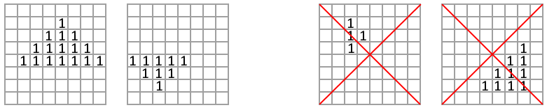
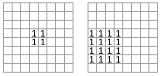

<h1 style='text-align: center;'> B. Vlad and Shapes</h1>

<h5 style='text-align: center;'>time limit per test: 1 second</h5>
<h5 style='text-align: center;'>memory limit per test: 256 megabytes</h5>

Vladislav has a binary square grid of $n \times n$ cells. A triangle or a square is drawn on the grid with symbols $\texttt{1}$. As he is too busy being cool, he asks you to tell him which shape is drawn on the grid.

* A triangle is a shape consisting of $k$ ($k>1$) consecutive rows, where the $i$-th row has $2 \cdot i-1$ consecutive characters $\texttt{1}$, and the central 1s are located in one column. An upside down triangle is also considered a valid triangle (but not rotated by 90 degrees).

  Two left pictures contain examples of triangles: $k=4$, $k=3$. The two right pictures don't contain triangles. * A square is a shape consisting of $k$ ($k>1$) consecutive rows, where the $i$-th row has $k$ consecutive characters $\texttt{1}$, which are positioned at an equal distance from the left edge of the grid.

  
## Example

s of two squares: $k=2$, $k=4$. For the given grid, determine the type of shape that is drawn on it.

### Input

The first line contains a single integer $t$ ($1 \leq t \leq 100$) — the number of test cases.

The first line of each test case contains a single integer $n$ ($2 \leq n \leq 10$) — the size of the grid.

The next $n$ lines each contain $n$ characters $\texttt{0}$ or $\texttt{1}$.

The grid contains exactly one triangle or exactly one square that contains all the $\texttt{1}$s in the grid. It is guaranteed that the size of the triangle or square is greater than $1$ (i.e., the shape cannot consist of exactly one 1).

### Output

For each test case, output "SQUARE" if all the $\texttt{1}$s in the grid form a square, and "TRIANGLE" otherwise (without quotes).

## Example

### Input


```text
630000110114000000000100111021111500111000100000000000000001000000000000000000000000000000000000000000000000000111111111001111111000011111000000111000000001000003111111111
```
### Output

```text

SQUARE
TRIANGLE
SQUARE
TRIANGLE
TRIANGLE
SQUARE

```


#### Tags 

#800 #NOT OK #geometry #implementation 

## Blogs
- [All Contest Problems](../Codeforces_Round_928_(Div._4).md)
- [Announcement (en)](../blogs/Announcement_(en).md)
- [Tutorial (en)](../blogs/Tutorial_(en).md)
