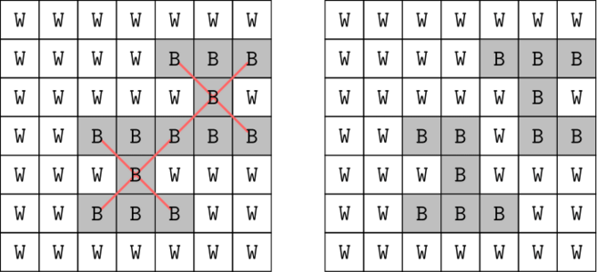
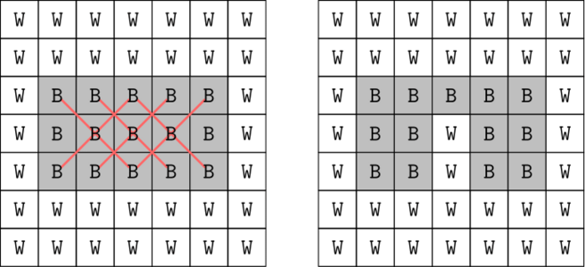

<h1 style='text-align: center;'> F. Vlad and Avoiding X</h1>

<h5 style='text-align: center;'>time limit per test: 4 seconds</h5>
<h5 style='text-align: center;'>memory limit per test: 256 megabytes</h5>

Vladislav has a grid of size $7 \times 7$, where each cell is colored black or white. In one operation, he can choose any cell and change its color (black $\leftrightarrow$ white).

Find the minimum number of operations required to ensure that there are no black cells with four diagonal neighbors also being black.

 The left image shows that initially there are two black cells violating the condition. By flipping one cell, the grid will work. 

### Input

The first line of input contains a single integer $t$ ($1 \leq t \leq 200$) — the number of test cases. Then follows the description of the test cases.

Each test case consists of $7$ lines, each containing $7$ characters. Each of these characters is either $\texttt{W}$ or $\texttt{B}$, denoting a white or black cell, respectively.

### Output

For each test case, output a single integer — the minimum number of operations required to ensure that there are no black cells with all four diagonal neighbors also being black.

## Example

### Input


```text
4WWWWWWWWWWWBBBWWWWWBWWWBBBBBWWWBWWWWWBBBWWWWWWWWWWWWWWWWWWWWWWWWBBBBBWWBBBBBWWBBBBBWWWWWWWWWWWWWWWWWWWWWWWWWWWWWWWWWWWWWWWWWWWWWWWWWWWWWWWWWWWWWWWWWBBBBBWBBBBBBBBBBBBBBWWWWWWWBBBBBBBBBBBBBBBBBBBBB
```
### Output

```text

1
2
0
5

```
## Note

The first test case is illustrated in the statement.

The second test case is illustrated below: 

  In the third test case, the grid already satisfies the condition.


#### Tags 

#2200 #NOT OK #bitmasks #brute_force #dfs_and_similar #dp #implementation 

## Blogs
- [All Contest Problems](../Codeforces_Round_928_(Div._4).md)
- [Announcement (en)](../blogs/Announcement_(en).md)
- [Tutorial (en)](../blogs/Tutorial_(en).md)
