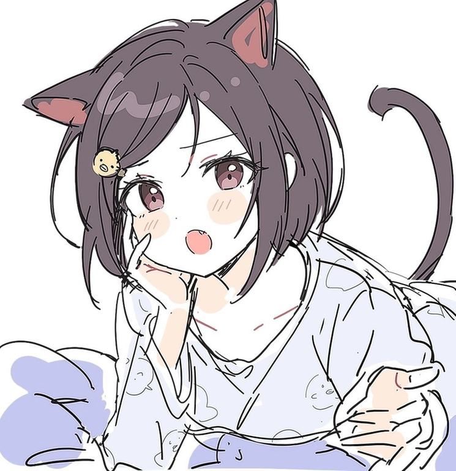

# Announcement

Neko Nya, Кодефорсес =＾● ⋏ ●＾=
--------------------------------

 I'm happy to invite you to participate in [Codeforces Round 926 (Div. 2)](https://codeforces.com/contest/1929 "Codeforces Round 926 (Div. 2)"). It will take place on [Thursday, February 15, 2024 at 20:35UTC+6](https://codeforces.com/https://www.timeanddate.com/worldclock/fixedtime.html?day=15&month=2&year=2024&hour=17&min=35&sec=0&p1=166) and in it, you will help a boy named Sasha win over a girl's heart. The round will be rated for all participants with a rating strictly less than 2100. You will have 2 hours to solve 6 problems.

Here is a big thank you to everyone involved in the round:

 * The cutest coordinator [Artyom123](https://codeforces.com/profile/Artyom123 "Grandmaster Artyom123"). (No offense to the others)
* [KAN](https://codeforces.com/profile/KAN "Legendary Grandmaster KAN"), [geranazavr555](https://codeforces.com/profile/geranazavr555 "Headquarters, geranazavr555"), [MikeMirzayanov](https://codeforces.com/profile/MikeMirzayanov "Headquarters, MikeMirzayanov") for the BEST platform.
* Legion of testers: [A_G](https://codeforces.com/profile/A_G "Legendary Grandmaster A_G"), [AgafonovArtem](https://codeforces.com/profile/AgafonovArtem "International Master AgafonovArtem"), [Alexdat2000](https://codeforces.com/profile/Alexdat2000 "Master Alexdat2000"), [Vladithur](https://codeforces.com/profile/Vladithur "Master Vladithur"), [wuhudsm](https://codeforces.com/profile/wuhudsm "Candidate Master wuhudsm"), [petyb](https://codeforces.com/profile/petyb "Candidate Master petyb"), [induk_v_tsiane](https://codeforces.com/profile/induk_v_tsiane "Grandmaster induk_v_tsiane"), [sevlll777](https://codeforces.com/profile/sevlll777 "Master sevlll777"), [mz1](https://codeforces.com/profile/mz1 "Specialist mz1"), [SomethingNew](https://codeforces.com/profile/SomethingNew "International Grandmaster SomethingNew"), [AVdovin](https://codeforces.com/profile/AVdovin "Expert AVdovin"), [NewLul](https://codeforces.com/profile/NewLul "Candidate Master NewLul"), [damirsit](https://codeforces.com/profile/damirsit "Candidate Master damirsit"), [skylak3_3](https://codeforces.com/profile/skylak3_3 "Newbie skylak3_3"), [Andreasyan](https://codeforces.com/profile/Andreasyan "Grandmaster Andreasyan").
* Also to this wonderful person for his invaluable contribution to the round [teraqqq](https://codeforces.com/profile/teraqqq "International Grandmaster teraqqq").

Looking forward to seeing everyone at the contest >~<

**UPD:** Scoring distribution: **500 — 1000 — 1500 — 2000 — 2500 — 3000**

**UPD2:** [Editorial](Tutorial_(en).md)

