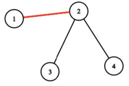
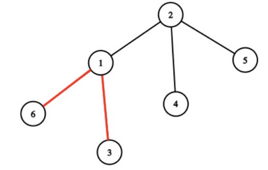

<h1 style='text-align: center;'> E. Sasha and the Happy Tree Cutting</h1>

<h5 style='text-align: center;'>time limit per test: 2 seconds</h5>
<h5 style='text-align: center;'>memory limit per test: 256 megabytes</h5>

Sasha was given a tree$^{\dagger}$ with $n$ vertices as a prize for winning yet another competition. However, upon returning home after celebrating his victory, he noticed that some parts of the tree were missing. Sasha remembers that he colored some of the edges of this tree. He is certain that for any of the $k$ pairs of vertices $(a_1, b_1), \ldots, (a_k, b_k)$, he colored at least one edge on the simple path$^{\ddagger}$ between vertices $a_i$ and $b_i$.

Sasha does not remember how many edges he exactly colored, so he asks you to tell him the minimum number of edges he could have colored to satisfy the above condition.

$^{\dagger}$A tree is an undirected connected graph without cycles.

$^{\ddagger}$A simple path is a path that passes through each vertex at most once.

### Input

Each test consists of multiple test cases. The first line contains a single integer $t$ ($1 \le t \le 10^4$) — the number of test cases. The description of the test cases follows.

The first line of each test case contains a single integer $n$ ($2 \leq n \leq 10^5$) — the number of vertices in the tree.

The next $(n - 1)$ lines describe the edges of the tree. The $i$-th line contains two integers $u_i$ and $v_i$ ($1 \leq u_i, v_i \leq n$, $u_i \ne v_i$) — the numbers of the vertices connected by the $i$-th edge.

The next line contains a single integer $k$ ($1 \leq k \leq 20$) — the number of pairs of vertices between which Sasha colored at least one edge on a simple path.

The next $k$ lines describe pairs. The $j$-th line contains two integers $a_j$ and $b_j$ ($1 \leq a_j, b_j \leq n, a_j \neq b_j$) — the vertices in the $j$-th pair.

It is guaranteed that the sum of $n$ over all test cases does not exceed $10^5$. It is guaranteed that the sum of $2^k$ over all test cases does not exceed $2^{20}$.

### Output

For each test case, output a single integer — the minimum number of edges Sasha could have colored.

## Example

### Input


```text
341 22 32 421 34 161 23 16 15 24 233 13 62 651 22 33 44 541 22 33 44 5
```
### Output

```text

1
2
4

```
## Note

In the first test case, Sasha could have colored only one edge $(1, 2)$. Then, there would be at least one colored edge on the simple path between vertices $1$ and $3$, and vertices $4$ and $1$.

  In the second test case, Sasha could have colored the edges $(1, 6)$ and $(1, 3)$.

  

#### Tags 

#2300 #NOT OK #bitmasks #brute_force #dfs_and_similar #dp #graphs #greedy #math #trees 

## Blogs
- [All Contest Problems](../Codeforces_Round_926_(Div._2).md)
- [Announcement](../blogs/Announcement.md)
- [Tutorial (en)](../blogs/Tutorial_(en).md)
