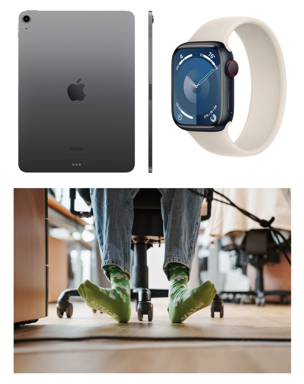

# think-cell_Round_1_(en)

Hello, Codeforces!

Welcome to the [think-cell Round 1](https://codeforces.com/contest/1930 "think-cell Round 1") supported by think-cell, which will start on [Saturday, February 17, 2024 at 20:35UTC+6](https://codeforces.com/https://www.timeanddate.com/worldclock/fixedtime.html?day=17&month=2&year=2024&hour=17&min=35&sec=0&p1=166). It will be a combined rated round for both divisions. All problems were authored and prepared by [Elegia](https://codeforces.com/profile/Elegia "Legendary Grandmaster Elegia") and [satyam343](https://codeforces.com/profile/satyam343 "Master satyam343").

We would like to thank: 

 * [errorgorn](https://codeforces.com/profile/errorgorn "International Grandmaster errorgorn") for round coordination and help with preparation
* [KAN](https://codeforces.com/profile/KAN "Legendary Grandmaster KAN") for helping with the preparation of problems
* [Alexdat2000](https://codeforces.com/profile/Alexdat2000 "Master Alexdat2000") for Russian translation
* [GoatTamer](https://codeforces.com/profile/GoatTamer "Candidate Master GoatTamer") and [Non-origination](https://codeforces.com/profile/Non-origination "Expert Non-origination") for discussing problems with us while our proposal was in review and testing the round.
* [Kaitokid](https://codeforces.com/profile/Kaitokid "Grandmaster Kaitokid"), [antekb](https://codeforces.com/profile/antekb "International Grandmaster antekb"), [vgtcross](https://codeforces.com/profile/vgtcross "Grandmaster vgtcross"), [riano_](https://codeforces.com/profile/riano_ "Grandmaster riano_"), [mtw](https://codeforces.com/profile/mtw "Master mtw"), [AboAbdoMC](https://codeforces.com/profile/AboAbdoMC "Candidate Master AboAbdoMC"), [Vladithur](https://codeforces.com/profile/Vladithur "Master Vladithur"), [BERNARD](https://codeforces.com/profile/BERNARD "Master BERNARD"), [milind0110](https://codeforces.com/profile/milind0110 "Candidate Master milind0110"), [conqueror_of_tourist](https://codeforces.com/profile/conqueror_of_tourist "Legendary Grandmaster conqueror_of_tourist"), [Um_nik](https://codeforces.com/profile/Um_nik "Legendary Grandmaster Um_nik"), [gamegame](https://codeforces.com/profile/gamegame "Legendary Grandmaster gamegame"), [htetgm](https://codeforces.com/profile/htetgm "Candidate Master htetgm"), [brobat](https://codeforces.com/profile/brobat "Master brobat"), [LucaLucaM](https://codeforces.com/profile/LucaLucaM "Expert LucaLucaM"), [the_hyp0cr1t3](https://codeforces.com/profile/the_hyp0cr1t3 "Candidate Master the_hyp0cr1t3"), [tibinyte](https://codeforces.com/profile/tibinyte "Newbie tibinyte"), [18o3](https://codeforces.com/profile/18o3 "Master 18o3"), [ExpensiveAC](https://codeforces.com/profile/ExpensiveAC "Expert ExpensiveAC"), [MateiKing80](https://codeforces.com/profile/MateiKing80 "Expert MateiKing80"), [udhavvarma03](https://codeforces.com/profile/udhavvarma03 "Master udhavvarma03"), [Non-origination](https://codeforces.com/profile/Non-origination "Expert Non-origination"), [RDDCCD](https://codeforces.com/profile/RDDCCD "International Grandmaster RDDCCD"), [Kuroni](https://codeforces.com/profile/Kuroni "International Grandmaster Kuroni"), [Brovko](https://codeforces.com/profile/Brovko "International Grandmaster Brovko"), [LipArcanjo](https://codeforces.com/profile/LipArcanjo "Grandmaster LipArcanjo"), [andrei_boaca](https://codeforces.com/profile/andrei_boaca "Grandmaster andrei_boaca"), [nok0](https://codeforces.com/profile/nok0 "International Grandmaster nok0"), [oursaco](https://codeforces.com/profile/oursaco "Grandmaster oursaco"), [ffao](https://codeforces.com/profile/ffao "International Grandmaster ffao"), [prvocislo](https://codeforces.com/profile/prvocislo "Grandmaster prvocislo"), [SmolBrain](https://codeforces.com/profile/SmolBrain "Grandmaster SmolBrain"), [dario2994](https://codeforces.com/profile/dario2994 "International Grandmaster dario2994"), [brunovsky](https://codeforces.com/profile/brunovsky "Grandmaster brunovsky"), [tabr](https://codeforces.com/profile/tabr "International Grandmaster tabr"), [PurpleCrayon](https://codeforces.com/profile/PurpleCrayon "International Grandmaster PurpleCrayon"), [IceKnight1093](https://codeforces.com/profile/IceKnight1093 "Master IceKnight1093"), [aryanc403](https://codeforces.com/profile/aryanc403 "International Master aryanc403") and [Golovanov399](https://codeforces.com/profile/Golovanov399 "International Grandmaster Golovanov399") for testing the round
* [MikeMirzayanov](https://codeforces.com/profile/MikeMirzayanov "Headquarters, MikeMirzayanov") for great systems Codeforces and Polygon.

You will be given **$9$ problems** and **$3$ hours** to solve them. One of the problems will be divided into two subtasks. One of the problems will be **interactive**. Make sure to read [this blog](https://codeforces.com/blog/entry/45307) and familiarize yourself with these types of problems before the round!

We hope you'll like the problemset!

**UPD 1** : The score distribution is $500 - 1000 - 1500 - (1250 + 1000) - 2500 - 2750 - 3500 - 3500 - 5000$.

Congratulations to the winners!

 1. [cnnfls_csy](https://codeforces.com/profile/cnnfls_csy "Legendary Grandmaster cnnfls_csy")
2. [Geothermal](https://codeforces.com/profile/Geothermal "Legendary Grandmaster Geothermal")
3. [Benq](https://codeforces.com/profile/Benq "Legendary Grandmaster Benq")
4. [gyh20](https://codeforces.com/profile/gyh20 "Legendary Grandmaster gyh20")
5. [Ormlis](https://codeforces.com/profile/Ormlis "Legendary Grandmaster Ormlis")
6. [jiangly](https://codeforces.com/profile/jiangly "Legendary Grandmaster jiangly")
7. [tourist](https://codeforces.com/profile/tourist "Legendary Grandmaster tourist")
8. [ksun48](https://codeforces.com/profile/ksun48 "Legendary Grandmaster ksun48")
9. [Petr](https://codeforces.com/profile/Petr "Legendary Grandmaster Petr")
10. [maroonrk](https://codeforces.com/profile/maroonrk "Legendary Grandmaster maroonrk")

Congratulations to the first solves as well!

 * A : [SSerxhs](https://codeforces.com/profile/SSerxhs "International Grandmaster SSerxhs")
* B : [SSerxhs](https://codeforces.com/profile/SSerxhs "International Grandmaster SSerxhs")
* C : [M_A](https://codeforces.com/profile/M_A "Newbie M_A")
* D1 : [hitonanode](https://codeforces.com/profile/hitonanode "International Grandmaster hitonanode")
* D2 : [hitonanode](https://codeforces.com/profile/hitonanode "International Grandmaster hitonanode")
* E : [ksun48](https://codeforces.com/profile/ksun48 "Legendary Grandmaster ksun48")
* F : [MAOooOAM](https://codeforces.com/profile/MAOooOAM "International Grandmaster MAOooOAM")
* G : [gyh20](https://codeforces.com/profile/gyh20 "Legendary Grandmaster gyh20")
* H : [maroonrk](https://codeforces.com/profile/maroonrk "Legendary Grandmaster maroonrk")
* I : [Kapt](https://codeforces.com/profile/Kapt "International Grandmaster Kapt") [upsolved]

**UPD 2**: [Editorial](Tutorial_(en).md) is out.

**And now a word from our round partner – [think-cell](https://www.think-cell.com/codeforces):**

think-cell is the leading data visualization software for business presentations. Our mission is to offer the most intuitive user interface for generating complex data-driven charts and slides, while at the same time ensuring seamless integration with Microsoft Office. We work on challenging visualization problems, reverse-engineer Microsoft’s code, and reinvent how slides are created. think-cell is the only German company funding the C++ ISO committee delegation, so there is a good chance that components we invent will find their way into the standard.

Right now, **we are looking for smart, creative C++ engineers** with a solid theoretical background to join our engineering team.

**Highlights of the role:** 

 * We use the latest C++ features as soon as the compilers support them.
* We’re not afraid of advanced template metaprogramming or macros when they avoid code duplication or lead to cleaner, more readable code.
* We prefer algorithms and ranges (esp. [ours](https://codeforces.com/https://github.com/think-cell/think-cell-library)!) over raw loops.
* We take the time to deliver perfect code.
* We love refactoring and modernizing old code and introducing our own libraries.
* If we can do better than the standard library, we write our own!
* If we have done something cool, we talk about it at C++ conferences.
* If we are missing a C++ language feature, we write a proposal and present it to the C++ standard committee.

**Here is what we offer:** 

 * A competitive salary from the start and **a raise to EUR 130,000 annually** after only one year.
* **Full support with relocation to Berlin or the option to work fully remotely**.
* An apartment for the first month if relocating to Berlin.
* Lifestyle-friendly working hours, **no deadlines, no overtime**.
* **No scheduled meetings.**
* An international team of brilliant minds.
* A flat organisation with respectful colleagues and plenty of room for your ideas.
* A working environment that is driven by the strive for excellence.

**Already convinced?** 

  [Learn more](https://www.think-cell.com/codeforces) **P.S. don't forget to check out our [developer blog](https://codeforces.com/https://www.think-cell.com/en/career/devblog/overview) to learn more about our commitment to the tech world!** 

Join [think-cell Round 1](https://codeforces.com/contest/1930 "think-cell Round 1") that will start on [Saturday, February 17, 2024 at 20:35UTC+6](https://codeforces.com/https://www.timeanddate.com/worldclock/fixedtime.html?day=17&month=2&year=2024&hour=17&min=35&sec=0&p1=166) for a chance to challenge your skills among other developers and win the following prizes. 

**- First place:** Apple iPad Air (10.9-inch iPad Air Wi-Fi 256GB),  
**- Second and Third place:** Apple Watch (Apple Watch Series 9 GPS + Cellular, 41mm Aluminum Case with Solo Loop),  
**- 4-50 places:** think-cell branded socks  
**- 200 additional socks will be distributed randomly** among the rest of the participants who solved at least one problem and for whom this is not the first rated round!

