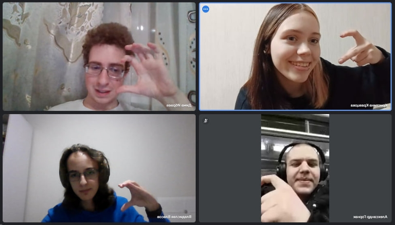

# Announcement

Hello! [Codeforces Round 925 (Div. 3)](https://codeforces.com/contest/1931 "Codeforces Round 925 (Div. 3)") will start at [Tuesday, February 13, 2024 at 20:35UTC+6](https://codeforces.com/https://www.timeanddate.com/worldclock/fixedtime.html?day=13&month=2&year=2024&hour=17&min=35&sec=0&p1=166). You will be offered 6-8 problems with expected difficulties to compose an interesting competition for participants with ratings up to 1600. However, all of you who wish to take part and have a rating of 1600 or higher, can register for the round unofficially.

The round will be hosted by rules of educational rounds (extended ICPC). Thus, solutions will be judged on preliminary tests during the round, and after the round, it will be a 12-hour phase of **open hacks**.

You will be given **7 problems** and **2 hours and 15 minutes** to solve them.

Note that the **penalty** for the wrong submission in this round is **10 minutes**.

[Remember](https://codeforces.com/blog/entry/59228) that only the trusted participants of the third division will be included in the official standings table. As it is written by link, this is a compulsory measure for combating unsporting behavior. To qualify as a *trusted participant of the third division*, you must:

 * take part in at least five rated rounds (and solve at least one problem in each of them)
* do not have a point of 1900 or higher in the rating.

**Regardless of whether you are a trusted participant of the third division or not, if your rating is less than 1600, then the round will be rated for you.**

Problems have been created and written by our team: [myav](https://codeforces.com/profile/myav "Pupil myav"), [Gornak40](https://codeforces.com/profile/Gornak40 "Expert Gornak40"), [senjougaharin](https://codeforces.com/profile/senjougaharin "Master senjougaharin") and [Vladosiya](https://codeforces.com/profile/Vladosiya "Expert Vladosiya").

We would like to thank: 

 1. [MikeMirzayanov](https://codeforces.com/profile/MikeMirzayanov "Headquarters, MikeMirzayanov") for help with ideas and Polygon and Codeforces platforms.
2. [nigus](https://codeforces.com/profile/nigus "Grandmaster nigus") for red testing.
3. [vladmart](https://codeforces.com/profile/vladmart "Master vladmart"), [Gheal](https://codeforces.com/profile/Gheal "Master Gheal"), [KseniaShk](https://codeforces.com/profile/KseniaShk "Master KseniaShk") for yellow testing.
4. [htetgm](https://codeforces.com/profile/htetgm "Candidate Master htetgm") for purple testing.
5. [natalina](https://codeforces.com/profile/natalina "Expert natalina"), [SashaT9](https://codeforces.com/profile/SashaT9 "Expert SashaT9"), [lockdown](https://codeforces.com/profile/lockdown "Expert lockdown"), [bma20006](https://codeforces.com/profile/bma20006 "Expert bma20006") for blue testing.
6. [RedDreams](https://codeforces.com/profile/RedDreams "Specialist RedDreams") for cyan testing.
7. [the_Incharge](https://codeforces.com/profile/the_Incharge "Pupil the_Incharge"), [Aurora__](https://codeforces.com/profile/Aurora__ "Pupil Aurora__"), [Longqiang](https://codeforces.com/profile/Longqiang "Pupil Longqiang") for green testing

Good luck!

**P.S.** Happy Valentine's Day!

**UPD**: Let's continue streak of announces with photo of the authors :)

**UPD2**: [Editorial](Tutorial.md)

