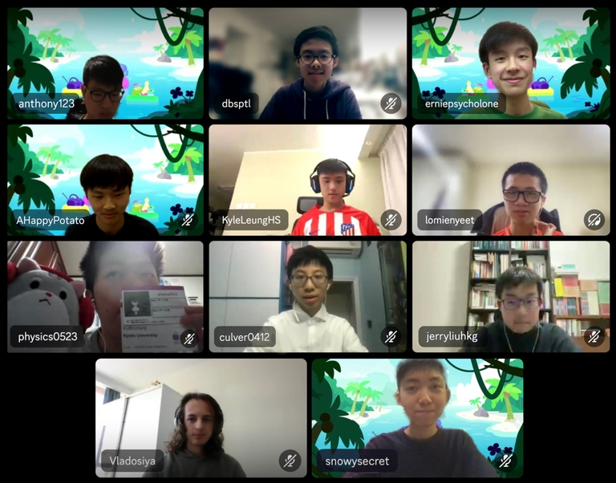

# Announcement_(en)

*“It is not important to be better than someone else, but to be better than you were yesterday.”* — Master Oogway, Kung Fu Panda

Hello, Codeforces! We are proud to present [Codeforces Round 929 (Div. 3)](https://codeforces.com/contest/1933 "Codeforces Round 929 (Div. 3)"), and we hereby invite all of you to take part in it. This round will start on [Tuesday, February 27, 2024 at 20:35UTC+6](https://codeforces.com/https://www.timeanddate.com/worldclock/fixedtime.html?day=27&month=2&year=2024&hour=17&min=35&sec=0&p1=166). You will have **2 hours and 15 minutes** to solve **7 problems**. The **penalty** for a wrong submission is equal to **10 minutes**.

This round will be rated for participants with ratings lower than 1600. However, all of you who wish to take part and have a rating of 1600 or higher, are welcome to register for the round unofficially.

The round will be hosted by rules of educational rounds (extended ICPC). Thus, solutions will be judged on preliminary tests during the round, and after the round, it will be a 12-hour phase of open hacks.

Remember that only the trusted participants of the third division will be included in the official standings table. As stated in [this blog](https://codeforces.com/blog/entry/59228), this is a compulsory measure for combating unsporting behaviour and upholding **gracious professionalism**. To qualify as a trusted participant of the third division, you must:

 * take part in at least five rated rounds (and solve at least one problem in each of them)
* do not have a point of 1900 or higher in the rating.

**Regardless of whether you are a trusted participant of the third division or not, if your rating is less than 1600, then the round will be rated for you.**

The problems were authored and prepared by [erniepsycholone](https://codeforces.com/profile/erniepsycholone "Expert erniepsycholone"), [snowysecret](https://codeforces.com/profile/snowysecret "Master snowysecret"), [dbsbs](https://codeforces.com/profile/dbsbs "Pupil dbsbs"), [jerryliuhkg](https://codeforces.com/profile/jerryliuhkg "Expert jerryliuhkg"), [lomienyeet](https://codeforces.com/profile/lomienyeet "Pupil lomienyeet"), and our beloved coordinator [Vladosiya](https://codeforces.com/profile/Vladosiya "Expert Vladosiya").

We would like to thank:

 * [Vladosiya](https://codeforces.com/profile/Vladosiya "Expert Vladosiya") for his high-speed coordination;
* [arvindf232](https://codeforces.com/profile/arvindf232 "Legendary Grandmaster arvindf232") for Legendary Grandmaster testing;
* [step_by_step](https://codeforces.com/profile/step_by_step "International Grandmaster step_by_step") for International Grandmaster testing;
* [physics0523](https://codeforces.com/profile/physics0523 "Grandmaster physics0523"), [culver0412](https://codeforces.com/profile/culver0412 "Grandmaster culver0412"), [AHappyPotato](https://codeforces.com/profile/AHappyPotato "Grandmaster AHappyPotato") for Grandmaster testing;
* [pavlekn](https://codeforces.com/profile/pavlekn "Master pavlekn") for Master testing;
* [moonpie24](https://codeforces.com/profile/moonpie24 "Candidate Master moonpie24"), [anthony123](https://codeforces.com/profile/anthony123 "Candidate Master anthony123"), [mariowong123](https://codeforces.com/profile/mariowong123 "Candidate Master mariowong123") for Candidate Master testing;
* [peshkoff](https://codeforces.com/profile/peshkoff "Expert peshkoff"), [ksodp](https://codeforces.com/profile/ksodp "Expert ksodp"), [SashaT9](https://codeforces.com/profile/SashaT9 "Expert SashaT9"), [Elison](https://codeforces.com/profile/Elison "Expert Elison"), [MoLotfi](https://codeforces.com/profile/MoLotfi "Expert MoLotfi") for Expert testing;
* [DBSHoShunNgai](https://codeforces.com/profile/DBSHoShunNgai "Specialist DBSHoShunNgai"), [Doncho_Bonboncho](https://codeforces.com/profile/Doncho_Bonboncho "Specialist Doncho_Bonboncho") for Specialist testing;
* [myvaluska](https://codeforces.com/profile/myvaluska "Pupil myvaluska"), [dbsMarco](https://codeforces.com/profile/dbsMarco "Pupil dbsMarco"), [dbsptl](https://codeforces.com/profile/dbsptl "Pupil dbsptl") for Pupil testing;
* [CannotPupil](https://codeforces.com/profile/CannotPupil "Newbie CannotPupil"), [KyleLeungHS](https://codeforces.com/profile/KyleLeungHS "Newbie KyleLeungHS") for Newbie testing;
* [MikeMirzayanov](https://codeforces.com/profile/MikeMirzayanov "Headquarters, MikeMirzayanov") for creating Codeforces and Polygon.

We hope that this contest, regardless of your background, rating and result, will increase your exposure to competitive programming and make you *better than you were yesterday*. Have fun!

**UPD**: Let's continue the streak of announcements with photos of the authors. This time with our coordinator and testers :) 

**UPD2**: We discovered the screencast from [Um_nik](https://codeforces.com/profile/Um_nik "Legendary Grandmaster Um_nik") a short while before the end of the contest, and it had around 400 views by the end of the contest. Round is **still rated**, however, people who have used his solutions will be **punished**.

**UPD3**: [Editorial is out](Tutorial_(en).md)

