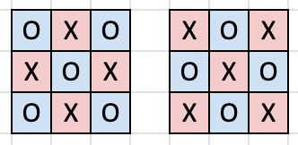

# Tutorial_(en)

[1933A - Turtle Puzzle: Rearrange and Negate](../problems/A._Turtle_Puzzle:_Rearrange_and_Negate.md "Codeforces Round 929 (Div. 3)")

Idea: [snowysecret](https://codeforces.com/profile/snowysecret "Master snowysecret"), prepared: [snowysecret](https://codeforces.com/profile/snowysecret "Master snowysecret")

 **Tutorial**
### [1933A - Turtle Puzzle: Rearrange and Negate](../problems/A._Turtle_Puzzle:_Rearrange_and_Negate.md "Codeforces Round 929 (Div. 3)")

Neither of the operations change the absolute value of any $a_i$. Therefore, the maximum answer we can get is $|a_1| + |a_2| + \ldots + |a_n|$. Now we will show there is a way to obtain this sum.

The way is simple. Firstly use operation 1 to sort the array, so all the negative elements come before the non-negative elements. Then use operation 2 to invert the prefix of negative elements (or not perform the operation if all the elements are non-negative initially). Then we obtain an array of non-negative integers, hence the answer is indeed $|a_1| + |a_2| + \ldots + |a_n|$.

 **Solution**
```cpp
#include <bits/stdc++.h>
using namespace std;

int main() {
    int t;
    cin >> t;
    while (t--) {
        int n;
        cin >> n;
        vector<int> arr(n);
        for (int i = 0; i < n; i++) {
            cin >> arr[i];
        }
        int sum = 0;
        for (int i = 0; i < n; i++) {
            sum += abs(arr[i]);
        }
        cout << sum << endl;
    }
    return 0;
}

```
[1933B - Turtle Math: Fast Three Task](../problems/B._Turtle_Math:_Fast_Three_Task.md "Codeforces Round 929 (Div. 3)")

Idea: [snowysecret](https://codeforces.com/profile/snowysecret "Master snowysecret"), prepared: [snowysecret](https://codeforces.com/profile/snowysecret "Master snowysecret"), [erniepsycholone](https://codeforces.com/profile/erniepsycholone "Expert erniepsycholone")

 **Tutorial**
### [1933B - Turtle Math: Fast Three Task](../problems/B._Turtle_Math:_Fast_Three_Task.md "Codeforces Round 929 (Div. 3)")

Let's denote the sum of elements as $s$. If $s$ is already divisible by $3$, then the answer is $0$.

The answer is $1$ in the following cases:

* If $s \bmod 3 = 2$, then we can add $1$ to any element to make the sum divisible by $3$;
* If there exists an $a_i$ such that $s \bmod 3 = a_i \bmod3$, then we can remove such $a_i$ to make the sum divisible by $3$.

Otherwise, if $s \bmod 3 = 1$, we cannot achieve the required sum in one operation. We can increase any element twice, then the sum will increase by $2$ and become divisible by $3$.

 **Solution**
```cpp
#include<bits/stdc++.h>
using namespace std;

int main(){
    int t;
    cin>>t;
    while(t--){
        int k;
        cin>>k;
        int ACC=0;
        bool hv=false;
        for(int i=0;i<k;i++){
            int x;
            cin>>x;
            ACC+=x;
	    if(x%3==1){
		hv=true;
	    }
        }
        if(ACC%3==0){
            cout<<0<<endl;
        }else if(ACC%3==2){
            cout<<1<<endl;
        }else{
            if(hv==true){
                cout<<1<<endl;
            }else{
                cout<<2<<endl;
            }
        }
    }
}
```
[1933C - Turtle Fingers: Count the Values of k](../problems/C._Turtle_Fingers:_Count_the_Values_of_k.md "Codeforces Round 929 (Div. 3)")

Idea: [dbsbs](https://codeforces.com/profile/dbsbs "Pupil dbsbs"), prepared: [dbsbs](https://codeforces.com/profile/dbsbs "Pupil dbsbs"), [snowysecret](https://codeforces.com/profile/snowysecret "Master snowysecret")

 **Tutorial**
### [1933C - Turtle Fingers: Count the Values of k](../problems/C._Turtle_Fingers:_Count_the_Values_of_k.md "Codeforces Round 929 (Div. 3)")

Notice that there are not so many suitable values of $x$ and $y$ (since $2 \le a, b$ and $2^{20}=1\ 048\ 576$). This allows us to iterate through all suitable pairs of $x$ and $y$ and thus find all different suitable $k$.

 **Solution**
```cpp
#include <bits/stdc++.h>
#define int long long
using namespace std;

void solve(int tc){
    int a, b, l;
    cin >> a >> b >> l;
    set<int> ans;
    for(int i = 0; i <= 34; ++i){
        int x = l;
        bool fail = false;
        for(int _ = 0; _ < i; ++_){
            if(x % a){
                fail = true;
                break;
            }
            x /= a;
        }
        if(fail) break;
        while(true){
            ans.insert(x);
            if(x % b) break;
            x /= b;
        }
    }
    cout << ans.size();
}
 
bool multi = true;
 
signed main() {
    int t = 1;
    if (multi)cin >> t;
    for (int i = 1; i <= t; ++i) {
        solve(i);
        cout << "n";
    }
    return 0;
}
```
[1933D - Turtle Tenacity: Continual Mods](../problems/D._Turtle_Tenacity:_Continual_Mods.md "Codeforces Round 929 (Div. 3)")

Idea: [snowysecret](https://codeforces.com/profile/snowysecret "Master snowysecret"), [erniepsycholone](https://codeforces.com/profile/erniepsycholone "Expert erniepsycholone"), prepared: [snowysecret](https://codeforces.com/profile/snowysecret "Master snowysecret")

 **Tutorial**
### [1933D - Turtle Tenacity: Continual Mods](../problems/D._Turtle_Tenacity:_Continual_Mods.md "Codeforces Round 929 (Div. 3)")

Sort the array in non-decreasing order. Now, assume $a_1 \le a_2 \le \ldots \le a_n$.

If $a_1 \neq a_2$, the minimum is unique. Therefore, place $a_1$ at the front, and the result after all modulo operations is just $a_1 > 0$. Hence the answer is yes for this case.

If $a_1 = a_2$ and there exists some element $a_x$ such that $a_x \not\equiv 0 \pmod {a_1}$, then a possible solution is rearranging the array to $[a_x, a_1, a_2, \ldots, a_{x-1}, a_{x+1}, \ldots, a_n]$. Since $a_x \bmod a_1 < a_1$, $a_x \bmod a_1$ is the minimum among the other elements and the result after all modulo operations equals $a_x \bmod a_1 > 0$. Hence the answer is yes for this case.

Otherwise (if all elements are multiples of the minimum) the answer is no, because any element modulo the minimum equals $0$, and at least one of the minimums must not be the first element. So after passing through two minimums we are guaranteed to get a $0$.

 **Solution**
```cpp
#include <bits/stdc++.h>
using namespace std;

int main() {
    int t;
    cin >> t;
    while(t--) {
        int n;
        cin >> n;
        int a[n];
        for(int i=0; i<n; i++) cin >> a[i];
        sort(a, a + n);
        if(a[0] != a[1]) {
            cout << "YESn";
        }
        else {
            bool PASS = 0;
            for(int i=1; i<n; i++) {
                if(a[i] % a[0] != 0) PASS = 1;
            }
            if(PASS) cout << "YESn";
            else cout << "NOn";
        }
    }
}
```
[1933E - Turtle vs. Rabbit Race: Optimal Trainings](../problems/E._Turtle_vs._Rabbit_Race:_Optimal_Trainings.md "Codeforces Round 929 (Div. 3)")

Idea: [snowysecret](https://codeforces.com/profile/snowysecret "Master snowysecret"), prepared: [snowysecret](https://codeforces.com/profile/snowysecret "Master snowysecret")

 **Tutorial**
### [1933E - Turtle vs. Rabbit Race: Optimal Trainings](../problems/E._Turtle_vs._Rabbit_Race:_Optimal_Trainings.md "Codeforces Round 929 (Div. 3)")

Notice that if we choose some $r$ such that the sum of $a_l, a_{l+1}, \dots, a_r$ does not exceed $u$, then completing each of the sections will increase our abilities.

Using prefix sums and binary search, we will find the largest such $r$. Smaller values will increase our abilities by a smaller amount, so there is no point in checking them.

However, it is worth considering the value $r' = r+1$. Despite the fact that some of the sections of the $r'$ track will only decrease our abilities, the overall increase may be positive (for example, if the increases on the $r'$ track are [$3, 2, 1, 0, -1$]). Considering following values is pointless, as completing all following tracks will only decrease our abilities.

Also, for finding the answer, ternary search can be used.

 **Solution**
```cpp
#include "bits/stdc++.h"
using namespace std;
#define int long long 
#define double long double

void solve(int tc) {
  int n;
  cin >> n;
  int a[n + 1];
  for(int i = 1; i <= n; i++) cin >> a[i];
  int ps[n + 1];
  ps[0] = 0;
  for(int i = 1; i <= n; i++) ps[i] = ps[i - 1] + a[i];
  int q;
  cin >> q;
  while(q--) {
    int l, u;
    cin >> l >> u;
    int lb = l, rb = n;
    while(lb < rb) {
      int mid = (lb + rb + 1) >> 1;
      if(ps[mid] - ps[l - 1] <= u) lb = mid;
      else rb = mid - 1;
    }
    int maxu = -1e18, optid;
    for(int i = max(l, lb - 2); i <= min(n, lb + 2); i++) {
      int t = ps[i] - ps[l - 1];
      int ut = (u + (u - t + 1)) * t / 2;
      if(ut > maxu) {
        maxu = ut;
        optid = i;
      }
    }
    cout << optid << " ";
  }
}

signed main() {
  int t = 1; cin >> t;
  for(int i = 1; i <= t; i++){
    solve(i);
    cout << "n";
  }
}
```
[1933F - Turtle Mission: Robot and the Earthquake](../problems/F._Turtle_Mission:_Robot_and_the_Earthquake.md "Codeforces Round 929 (Div. 3)")

Idea: [erniepsycholone](https://codeforces.com/profile/erniepsycholone "Expert erniepsycholone"), prepared: [erniepsycholone](https://codeforces.com/profile/erniepsycholone "Expert erniepsycholone")

 **Hint**View the task in a relative perspective, with robot RT and the ending location moving downwards instead of rocks moving upwards.

 **Tutorial**
### [1933F - Turtle Mission: Robot and the Earthquake](../problems/F._Turtle_Mission:_Robot_and_the_Earthquake.md "Codeforces Round 929 (Div. 3)")

By viewing the robot's movement relative to the rocks, Robot RT's three moves become as follows: 

* Up: Stationary
* Down, $(x,y)$ to $((x+2) \bmod n, y)$
* Right, $(x,y)$ to $((x+1) \bmod n, y+1)$

As staying stationary is not necessary now when we are finding the minimum time, we can run a bfs/dp from $(0,0)$ to find the minimum time required to reach every grid in the second last column $(x mod n,m-2)$. Finally, choose the best among all n tiles after waiting for the endpoint to cycle back.

 **Solution**
```cpp
#include<bits/stdc++.h>
#define int long long
using namespace std;

signed main(){
    int t;
    cin >> t;
    while (t--){
        int n, m;
    	cin >> n >> m;
    	bool a[n][m + 1];
    	for (int i = 0; i < n; i++) {
    		for (int j = 1; j <= m; j++) {
    			cin >> a[i][j];
    		}
    	}
    	int dp[n][m + 1];
    	for (int i = 0; i < n; i++) {
    		for (int j = 0; j <= m; j++) {
    			dp[i][j] = INT_MAX;
    		}
    	}
    	dp[0][1] = 0;
    	for (int i = 1; i <= m; i++) {
    		for (int j = 0; j < n; j++) {
    			if (a[j][i]){
    			    continue;
    			}
    			dp[j][i] = min(dp[j][i], dp[(j - 1 + n) % n][i - 1] + 1); 
    		}
    		for (int j = 0; j < 3 * n; j++) {
    			if (a[j % n][i] || a[(j - 1 + n) % n][i]){
    			    continue;
    			}
    			dp[j % n][i] = min(dp[j % n][i], dp[(j - 2 + n) % n][i] + 1);
    		}
    	}
    	int ans = INT_MAX;
    	for (int i = 0; i < n; i++) {
    		if (dp[i][m] == INT_MAX){
    		    continue;
    		}
    		int npos = ((n - 1) + dp[i][m]) % n;
    		if (npos < i) npos += n;
    		int cur = dp[i][m] + min(npos - i, n - (npos - i));
    		ans = min(ans, cur);
    	}
    	if(ans == INT_MAX){
    	    cout << -1 << endl;
    	}else{
    	    cout << ans << endl;
    	}
    }
}
```
[1933G - Turtle Magic: Royal Turtle Shell Pattern](../problems/G._Turtle_Magic:_Royal_Turtle_Shell_Pattern.md "Codeforces Round 929 (Div. 3)")

Idea: [snowysecret](https://codeforces.com/profile/snowysecret "Master snowysecret"), [jerryliuhkg](https://codeforces.com/profile/jerryliuhkg "Expert jerryliuhkg"), prepared: [snowysecret](https://codeforces.com/profile/snowysecret "Master snowysecret")

 **Tutorial**
### [1933G - Turtle Magic: Royal Turtle Shell Pattern](../problems/G._Turtle_Magic:_Royal_Turtle_Shell_Pattern.md "Codeforces Round 929 (Div. 3)")

We claim that there are only $8$ configurations that satisfy the condition. The proof is as follows.

Firstly, consider a $2 \times 2$ subgrid that does not lie on any of the grid's corners.

Claim 1. Within the $2 \times 2$ subgrid, there must be 2 Os and 2 Xs.

Proof of Claim 1. Assume the contrary that there are 3 Os or 4 Os. (The case with 3 Xs or 4 Xs is done too due to symmetry.)

Then, after some logical deduction we will end up with 3 consecutive Xs, as illustrated in the following figure.


The condition is not satisfied, hence there is a contradiction and there must be 2 Os and 2 Xs within a $2 \times 2$ subgrid that does not lie on any of the grid's corners.

Next, consider a $3 \times 3$ subgrid that does not lie on any of the grid's corners.

Claim 2. Within the $3 \times 3$ subgrid, at least one $2 \times 2$ sub-subgrid is one of the four patterns below. We will call the following $2 \times 2$ patterns good patterns.

 

Proof of Claim 2. Assume the contrary that none of the 4 sub-subgrids in the $3 \times 3$ subgrid are one of the four given patterns. This naturally means every two cells which share an edge have different shapes. This gives the following two patterns:



The diagonals have the same shape, so the condition is not satisfied. There is a contradiction, hence the claim is true.

Next, consider a good $2 \times 2$ subgrid that does not lie on any of the grid's corners. (We have proved its existence in Claim 2.)

Finally, it is possible to uniquely extend a good subgrid to the rest of the grid. For example, you can see in the illustration below, after a few unique logical deductions the grey pattern on the top can tesselate itself a few times, and this can be infinitely repeated.


Therefore, the entire grid must be tesselations of one of the four good patterns. The first two patterns may be shifted one column to the right, and the last two patterns may be shifted one column downwards. So there are a total of $4 \times 2 = 8$ ways to satisfy the condition.

Specifically, the $8$ ways for $n = 5, m =5$ are as follows:


As for some implementation details, the following $8$ statements each correspond to one $n \times m$ configuration that satisfies the condition. $a_{i,j}$ represents whether the cell on the $i$-th row and the $j$-th column ($1 \le i \le n, 1 \le j \le m$) has a circle-shaped fortune cookie. 

1. $a_{i,j} = 1$ iff $i + \left \lceil \frac{j}{2} \right \rceil$ is odd.
2. $a_{i,j} = 1$ iff $i + \left \lceil \frac{j}{2} \right \rceil$ is even.
3. $a_{i,j} = 1$ iff $i + \left \lfloor \frac{j}{2} \right \rfloor$ is odd.
4. $a_{i,j} = 1$ iff $i + \left \lfloor \frac{j}{2} \right \rfloor$ is even.
5. $a_{i,j} = 1$ iff $j + \left \lceil \frac{i}{2} \right \rceil$ is odd.
6. $a_{i,j} = 1$ iff $j + \left \lceil \frac{i}{2} \right \rceil$ is even.
7. $a_{i,j} = 1$ iff $j + \left \lfloor \frac{i}{2} \right \rfloor$ is odd.
8. $a_{i,j} = 1$ iff $j + \left \lfloor \frac{i}{2} \right \rfloor$ is even.

Discussion: Try to solve the problem for general $n, m$. Specifically that includes the cases when $1 \le \min(n, m) \le 4$.

 **Solution**
```cpp
#include "bits/stdc++.h"
using namespace std;

void solve(int tc) { 
  int n, m, q;
  cin >> n >> m >> q;
  bool b[8] = {1, 1, 1, 1, 1, 1, 1, 1};
  int ans = 8;
  cout << ans << 'n';
  while(q--) {
    int r, c;
    cin >> r >> c;
    string shape;
    cin >> shape;
    if((r + (c+1) / 2) % 2) {
      b[0] &= (shape == "circle");
      b[1] &= (shape == "square");
    }
    else {
      b[0] &= (shape == "square");
      b[1] &= (shape == "circle");
    }
    if((r + c / 2) % 2) {
      b[2] &= (shape == "circle");
      b[3] &= (shape == "square");
    }
    else {
      b[2] &= (shape == "square");
      b[3] &= (shape == "circle");
    }

    if((c + (r+1) / 2) % 2) {
      b[4] &= (shape == "circle");
      b[5] &= (shape == "square");
    }
    else {
      b[4] &= (shape == "square");
      b[5] &= (shape == "circle");
    }
    if((c + r / 2) % 2) {
      b[6] &= (shape == "circle");
      b[7] &= (shape == "square");
    }
    else {
      b[6] &= (shape == "square");
      b[7] &= (shape == "circle");
    }
    ans = 0;
    for(int i = 0; i < 8; i++) ans += b[i];
    cout << ans << 'n';
  }
}

int main() {
  int t; 
  cin >> t;
  for(int i = 1; i <= t; i++) solve(i);
}
```
Hope the contest was in some way helpful in improving your skills, and that you all had fun! 

*“If you only do what you can do, you will never be more than you are now.”* – Master Oogway

