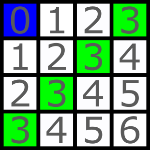
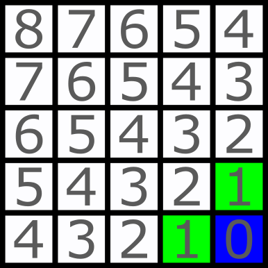
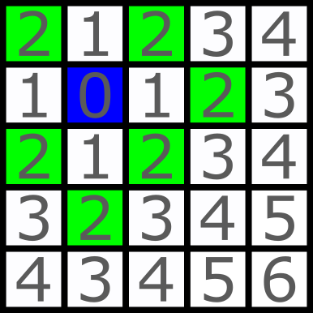
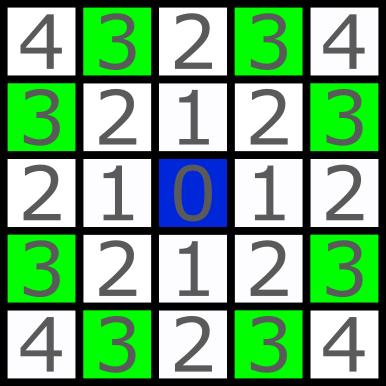

<h1 style='text-align: center;'> C. Find a Mine</h1>

<h5 style='text-align: center;'>time limit per test: 2 seconds</h5>
<h5 style='text-align: center;'>memory limit per test: 256 megabytes</h5>

This is an interactive problem.

You are given a grid with $n$ rows and $m$ columns. The coordinates $(x, y)$ represent the cell on the grid, where $x$ ($1 \leq x \leq n$) is the row number counting from the top and $y$ ($1 \leq y \leq m$) is the column number counting from the left. It is guaranteed that there are exactly $2$ mines in the grid at distinct cells, denoted as $(x_1, y_1)$ and $(x_2, y_2)$. You are allowed to make no more than $4$ queries to the interactor, and after these queries, you need to provide the location of one of the mines.

In each query, you can choose any grid cell $(x, y)$, and in return, you will receive the minimum Manhattan distance from both the mines to the chosen cell, i.e., you will receive the value $\min(|x-x_1|+|y-y_1|, |x-x_2|+|y-y_2|)$.

Your task is to determine the location of one of the mines after making the queries.

### Input

Each test contains multiple test cases. The first line of input contains a single integer $t$ ($1 \leq t \leq 3 \cdot 10^{3}$) — the number of test cases.

The only line of each test case contains two integers $n$ and $m$ ($2 \leq n \leq 10^{8}$, $2 \leq m \leq 10^{8}$) — the number of rows and columns.

## Interaction

For each test case, the interaction starts with reading $n$ and $m$.

Then you are allowed to make at most $4$ queries in the following way:

"? x y" ($1 \leq x \leq n$ and $1 \leq y \leq m$)

After each one, you should read an integer $d$ which is equal to $\min(|x-x_1|+|y-y_1|, |x-x_2|+|y-y_2|)$.

When you have found the location of any one of the mines, print a single line "! x y" (without quotes), representing the row and the column of one of the mines. #Outputting the answer does not count as a query.

After printing the answer, your program must then continue to solve the remaining test cases, or exit if all test cases have been solved.

The interactor for this problem is not adaptive: cells of mines are fixed before any queries are made.

After printing a query, do not forget to output the end of line and flush the output. Otherwise, you will get Idleness limit exceeded. To do this, use: 

* fflush(stdout) or cout.flush() in C++;
* System.out.flush() in Java;
* flush(output) in Pascal;
* stdout.flush() in Python;
* see the documentation for other languages.

Hacks:

To make a hack, use the following format:

The first line contains a single integer $t$ ($1 \leq t \leq 3 \cdot 10^{3}$) — the number of test cases.

The description of each test case should consist of three lines. 

The first line contains two integers $n$ and $m$ ($2 \leq n \leq 10^{8}$, $2 \leq m \leq 10^{8}$) — the number of rows and columns. 

The second line contains the coordinates of the first mine $x_1$ and $y_1$($1 \leq x_1 \leq n$, $1 \leq y_1 \leq m$).

The third line contains the coordinates of the second mine $x_2$ and $y_2$($1 \leq x_2 \leq n$, $1 \leq y_2 \leq m$).

The mines should be located at different positions.

## Example

### Input


```text
2
4 4

3

2

2

0

5 5

1

2

3
```
#Output
```text


? 1 1

? 1 4

? 4 1

? 2 3

! 2 3

? 5 5

? 2 2

? 3 3

! 1 1

```
## Note

In the first test case, we start by querying the upper-left corner $(1, 1)$ and get the result $3$, which means that there is a mine on the counter diagonal, and there is no mine above it. 

In the image below, each cell contains a number indicating the distance to the blue cell. The green cells are candidates to contain the nearest mine.

  Then we ask three cells on that diagonal, and at the last query, we get the result $0$, which means that a mine is found at the position $(2, 3)$.

The second mine was located at the position $(3, 2)$.

In the second test case, we start by asking the lower-right corner $(5, 5)$, and get the result $1$, which means that one of the two neighbours contains a mine, let's call it mine $1$.

  Then we ask cell $(2, 2)$. We can see that these green cells don't intersect with the green cells from the first query, so they contain the other mine, let's call it mine $2$.

  Query $3$ is cell $(3, 3)$. These cells contain mine $1$, but we still don't know where exactly. Nevertheless, we can determine that the only possible cell for mine $2$ is $(1, 1)$, because all other candidates are at a distance closer than $3$ for this query.

  

#### Tags 

#1700 #NOT OK #binary_search #constructive_algorithms #geometry #greedy #interactive #math 

## Blogs
- [All Contest Problems](../Codeforces_Round_931_(Div._2).md)
- [Announcement (en)](../blogs/Announcement_(en).md)
- [Tutorial (en)](../blogs/Tutorial_(en).md)
