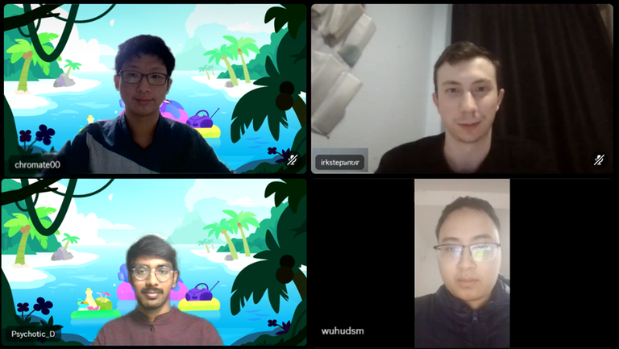

# Announcement_(en)

*"You are braver than you believe, stronger than you seem, and smarter than you think." — A.A. Milne*

Hello Codeforces!

I have the pleasure of inviting you to participate in [Codeforces Round 930 (Div. 1)](https://codeforces.com/contest/1936 "Codeforces Round 930 (Div. 1)") and [Codeforces Round 930 (Div. 2)](https://codeforces.com/contest/1937 "Codeforces Round 930 (Div. 2)"), which will start on [Thursday, February 29, 2024 at 20:35UTC+6](https://codeforces.com/https://www.timeanddate.com/worldclock/fixedtime.html?day=29&month=2&year=2024&hour=17&min=35&sec=0&p1=166).

You will be given **6 problems** and **2 hours** to solve them in both divisions.

One of the problems may be **interactive**. So, please refer to the guide on [interactive problems](https://codeforces.com/blog/entry/45307) if you are unfamiliar with them.

The problems were prepared and authored by [wuhudsm](https://codeforces.com/profile/wuhudsm "Candidate Master wuhudsm"), [chromate00](https://codeforces.com/profile/chromate00 "Expert chromate00"), [Psychotic_D](https://codeforces.com/profile/Psychotic_D "Master Psychotic_D") and [MagicalFlower](https://codeforces.com/profile/MagicalFlower "Legendary Grandmaster MagicalFlower").

We would like to thank :

 * [irkstepanov](https://codeforces.com/profile/irkstepanov "International Master irkstepanov") for coordinating the round;
* [BurnedChicken](https://codeforces.com/profile/BurnedChicken "Legendary Grandmaster BurnedChicken") for the only LGM testing;
* [amenotiomoi](https://codeforces.com/profile/amenotiomoi "International Grandmaster amenotiomoi"),[siganai](https://codeforces.com/profile/siganai "International Grandmaster siganai"), [vgtcross](https://codeforces.com/profile/vgtcross "Grandmaster vgtcross"), [amethyst0](https://codeforces.com/profile/amethyst0 "International Grandmaster amethyst0"), [dognotlike](https://codeforces.com/profile/dognotlike "Grandmaster dognotlike"), [alireza_kaviani](https://codeforces.com/profile/alireza_kaviani "International Grandmaster alireza_kaviani"), and [dorijanlendvaj](https://codeforces.com/profile/dorijanlendvaj "International Grandmaster dorijanlendvaj") for GM and IGM testing;
* [aryanc403](https://codeforces.com/profile/aryanc403 "International Master aryanc403"), [k1r1t0](https://codeforces.com/profile/k1r1t0 "International Master k1r1t0"), [Little_Sheep_Yawn](https://codeforces.com/profile/Little_Sheep_Yawn "Master Little_Sheep_Yawn"), [Amir_Parsa](https://codeforces.com/profile/Amir_Parsa "Master Amir_Parsa"), [blxst](https://codeforces.com/profile/blxst "Master blxst"), [pavlekn](https://codeforces.com/profile/pavlekn "Master pavlekn"), [Error_Yuan](https://codeforces.com/profile/Error_Yuan "Master Error_Yuan"), [IceKnight1093](https://codeforces.com/profile/IceKnight1093 "Master IceKnight1093"), [aufannn](https://codeforces.com/profile/aufannn "Master aufannn"), [Mingyu331](https://codeforces.com/profile/Mingyu331 "International Master Mingyu331"), [Akulyat](https://codeforces.com/profile/Akulyat "Master Akulyat"), [Arpa](https://codeforces.com/profile/Arpa "International Master Arpa"), and [mhtkrag](https://codeforces.com/profile/mhtkrag "Master mhtkrag") for M and IM testing;
* [O--O](https://codeforces.com/profile/O--O "Candidate Master O--O"), [Abhishek_Srivastava](https://codeforces.com/profile/Abhishek_Srivastava "Candidate Master Abhishek_Srivastava"), [MrDelrus](https://codeforces.com/profile/MrDelrus "Candidate Master MrDelrus"), [htetgm](https://codeforces.com/profile/htetgm "Candidate Master htetgm"), [Silver_Fox](https://codeforces.com/profile/Silver_Fox "Candidate Master Silver_Fox"), [dhyang24](https://codeforces.com/profile/dhyang24 "Candidate Master dhyang24"), and [milind0110](https://codeforces.com/profile/milind0110 "Candidate Master milind0110") for CM testing;
* [brave-kid](https://codeforces.com/profile/brave-kid "Expert brave-kid"), [adventofcode](https://codeforces.com/profile/adventofcode "Expert adventofcode"), [vikram108](https://codeforces.com/profile/vikram108 "Expert vikram108"), [mafailure](https://codeforces.com/profile/mafailure "Expert mafailure"), [AnanasClassic](https://codeforces.com/profile/AnanasClassic "Expert AnanasClassic"), [Yugandhar_Master](https://codeforces.com/profile/Yugandhar_Master "Expert Yugandhar_Master"), [FD..LH..lloyJ](https://codeforces.com/profile/FD..LH..lloyJ "Expert FD..LH..lloyJ"), [lemoncookie](https://codeforces.com/profile/lemoncookie "Expert lemoncookie"), and [flakes24](https://codeforces.com/profile/flakes24 "Expert flakes24") for Expert testing;
* [Banis](https://codeforces.com/profile/Banis "Specialist Banis"), [stepan.karpov](https://codeforces.com/profile/stepan.karpov "Specialist stepan.karpov"), [BF_OF_Priety](https://codeforces.com/profile/BF_OF_Priety "Specialist BF_OF_Priety"), and [ONEHUNDREDPUSHUPS](https://codeforces.com/profile/ONEHUNDREDPUSHUPS "Specialist ONEHUNDREDPUSHUPS") for Specialist testing;
* [HexShift](https://codeforces.com/profile/HexShift "Pupil HexShift") for the only Pupil testing;
* [JaberSH1](https://codeforces.com/profile/JaberSH1 "Newbie JaberSH1") for the Newbie testing;
* [tibinyte](https://codeforces.com/profile/tibinyte "Newbie tibinyte") for the Illegal newbie lying face testing;
* [MikeMirzayanov](https://codeforces.com/profile/MikeMirzayanov "Headquarters, MikeMirzayanov") for the great Codeforces and Polygon platforms;
* And **at last but not least**, [You](https://codeforces.com/profile/) for participating in the round!

Good luck, and may the code be with you!

**UPD:** Score distribution:

Div.1: 500−1000−1500−2000−2500−2750

Div.2: 500−1000−1500−2000−2500−3250

**UPD2:** Let's continue the streak of announcements with photos of the authors and coordinator.

**UPD3:** [Editorial](Tutorial_(en).md) is out.

**UPD4:** **Top Performers**

### Div.1

 

---

 

| Rank | Name |
| --- | --- |
| 1 | [Radewoosh](https://codeforces.com/profile/Radewoosh "Legendary Grandmaster Radewoosh") |
| 2 | [orzdevinwang](https://codeforces.com/profile/orzdevinwang "Legendary Grandmaster orzdevinwang") |
| 3 | [ugly2333](https://codeforces.com/profile/ugly2333 "Legendary Grandmaster ugly2333") |
| 4 | [tourist](https://codeforces.com/profile/tourist "Legendary Grandmaster tourist") |
| 5 | [998kover](https://codeforces.com/profile/998kover "International Grandmaster 998kover") |

### Div.2

 

---

 

| Rank | Name |
| --- | --- |
| 1 | [JiaY19](https://codeforces.com/profile/JiaY19 "Specialist JiaY19") |
| 2 | [kizaru](https://codeforces.com/profile/kizaru "Pupil kizaru") |
| 3 | [Midnights](https://codeforces.com/profile/Midnights "Unrated, Midnights") |
| 4 | [SATSKYnerfed](https://codeforces.com/profile/SATSKYnerfed "Expert SATSKYnerfed") |
| 5 | [VTloBong](https://codeforces.com/profile/VTloBong "Expert VTloBong") |

