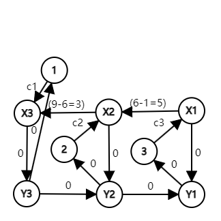

# Tutorial_(en)

Thank you for participation and we hope you enjoy this round :)

#### [D2A — Shuffle Party](https://mirror.codeforces.com/contest/1937/problem/A)

Idea : [chromate00](https://codeforces.com/profile/chromate00 "Expert chromate00")

 **Hint (for thinkers)**If you think in terms of k, it might be hard to find the solution. Maybe it will be helpful if you fix d and find the k which will be swapped with d.

 **Hint (for observers)**Try bruteforcing for, say, n≤20. Do you see a pattern?

 **Tutorial**On n=1, the answer is trivially 1.

On n=2, index 1 and 2 are swapped. The answer is therefore 2.

For n>2, let us assume the element 1 is on index a and it will be swapped with index k. Then, a must be k/2. We will prove this by contradiction. Let us assume that there is no divisor greater than a, and a is lesser than k/2. But then, as a is a multiple of 2 in the base condition, k must be a multiple of 2, and k/2 is a divisor of k. This contradicts the assumption. By induction we can see that a is always a multiple of 2, and this proof will always hold. The element 1 will move only when k/2=a.

Therefore, we can find the largest value of v such that 2v≤n. The answer turns out to be 2v.

 **solution**
```cpp
#include<bits/stdc++.h>
using namespace std;
using ll=long long;
 
int main()
{
    cin.tie(0)->sync_with_stdio(0);
    ll q;cin>>q;
    while(q--)
    {
        ll n,p=1;cin>>n;
        while(p*2<=n)p<<=1;
        cout<<p<<"n";
    }
}

```
Video editorial by [aryanc403](https://codeforces.com/profile/aryanc403 "International Master aryanc403") [https://www.youtube.com/watch?v=lLmVzA49BRM](https://codeforces.com/https://www.youtube.com/watch?v=lLmVzA49BRM)

#### [D2B — Binary Path](https://mirror.codeforces.com/contest/1937/problem/B)

Idea : [wuhudsm](https://codeforces.com/profile/wuhudsm "Candidate Master wuhudsm")

 **Hint1**Let’s call path (1,1)→…→(1,i)→(2,i)→…→(2,n) the i-th path. What's the difference between the i-th path and the (i+1)-th path?

 **Hint2**What if a2i=1 and a1(i+1)=0 ?

 **Hint3**What if a2i=0 and a1(i+1)=1 ?

 **Tutorial*** Let the string achieved by moving down on the i-th column be Si. Then, for any 1≤k<n, one can observe that Sk and Sk+1 can only differ by at most one index, which is index k+1. Thus, comparing Sk and Sk+1 lexicographically can be done in O(1), by comparing this one index.
* After finding the lexicographically smallest string, counting the occurrence of this string can be done straightforwardly in O(n).
* The implementation can differ for each participant, but the following method provides a clean implementation. Let the initial coordinate be (1,1), and maintain a counter which is initially reset to 1. Then repeat the following until we reach (2,n):

 1. If we are on row 2, move to the right.
2. If we are on column n, move downwards.
3. From here, let the character on the right be a, and one below be b.
4. If a>b, move downwards.
5. If a<b, move to the right and reset the counter to 1.
6. If a=b, move to the right and increment the counter.

 * In the end, the string on the path we passed through will be lexicographically smallest, and the integer on the counter will be the number of occurrences.
 **solution**
```cpp
#include <map>
#include <set>
#include <cmath>
#include <ctime>
#include <queue>
#include <stack>
#include <cstdio>
#include <cstdlib>
#include <vector>
#include <cstring>
#include <algorithm>
#include <iostream>
using namespace std;
typedef double db; 
typedef long long ll;
typedef unsigned long long ull;
const int N=1000010;
const int LOGN=28;
const ll  TMD=0;
const ll  INF=2147483647;
int  T,n;
char a[3][N];

int main()
{
	scanf("%d",&T);
	while(T--)
	{
    	        scanf("%d",&n);
		for(int i=1;i<=2;i++)
		{
		    scanf("n");
			for(int j=1;j<=n;j++)
				scanf("%c",&a[i][j]);
		}
		int max_down=n,min_down=1;
		for(int i=n;i>=2;i--)
			if(a[1][i]=='1'&&a[2][i-1]=='0') max_down=i-1;
		for(int i=1;i<max_down;i++)
			if(a[2][i]=='1'&&a[1][i+1]=='0') min_down=i+1;
		for(int i=1;i<=max_down;i++) printf("%c",a[1][i]);
		for(int i=max_down;i<=n;i++) printf("%c",a[2][i]);
		printf("n");
		printf("%dn",max_down-min_down+1);
	}
	
	return 0;
}

```
#### [D1A — Bitwise Operation Wizard](../problems/A._Bitwise_Operation_Wizard.md)

Idea : [wuhudsm](https://codeforces.com/profile/wuhudsm "Candidate Master wuhudsm")

 **Hint1**What's the maximum value of pi⊕pj?

 **Hint2**How to get i, such that pi=n−1?

 **Hint3**How to get j, such that pi⊕pj reaches the maximum value?

 **Tutorial**Step1:do queries ? x x y y like classic searching for the maximum value among n numbers to get pi=n−1;

Step2:do queries ? x i y i to find all index k such that pi|pk reaches the maximum value. We store all such indexes in a vector id .

Step3:do queries ? id[x] id[x] id[y] id[y] to find j in id such that pj reaches the minimum value.

 **solution**
```cpp
  
#include <map>
#include <set>
#include <cmath>
#include <ctime>
#include <queue>
#include <stack>
#include <cstdio>
#include <cstdlib>
#include <vector>
#include <cstring>
#include <algorithm>
#include <iostream>
using namespace std;
typedef double db; 
typedef long long ll;
typedef unsigned long long ull;
const int N=1000010;
const int LOGN=28;
const ll  TMD=0;
const ll  INF=2147483647;
int T,n;

char query(int a,int b,int c,int d)
{
	char x;
	printf("? %d %d %d %dn",a,b,c,d);
	fflush(stdout);
	cin>>x;
	fflush(stdout);
	return x;
}

int main()
{	
	scanf("%d",&T);
	while(T--)
	{
    	        scanf("%d",&n);
		int mx=0,ans1=0,ans2;
		vector<int> v;
		for(int i=1;i<n;i++)
		{
			int c=query(ans1,ans1,i,i);
			if(c=='<') ans1=i;
		}
		v.push_back(0);
		for(int i=1;i<n;i++)
		{
			int c=query(mx,ans1,i,ans1);
			if(c=='<')
			{
			    mx=i;
			    v.clear();
			    v.push_back(i);
			}
			else if(c=='=') v.push_back(i);
		}
		ans2=v[0];
		for(int i=1;i<v.size();i++)
		{
			int c=query(ans2,ans2,v[i],v[i]);
			if(c=='>') ans2=v[i];
		}
		printf("! %d %dn",ans1,ans2);
		fflush(stdout);
	}
	
	return 0;
}


```
Video editorial by [aryanc403](https://codeforces.com/profile/aryanc403 "International Master aryanc403") [https://www.youtube.com/watch?v=jfcx1Rs8I28](https://codeforces.com/https://www.youtube.com/watch?v=jfcx1Rs8I28)

#### [D1B — Pinball](../problems/B._Pinball.md)

Idea : [wuhudsm](https://codeforces.com/profile/wuhudsm "Candidate Master wuhudsm")

**UPD**: It conflicts with <https://mirror.codeforces.com/contest/733/problem/E>. This is a coincidence. There are no excuses. Very sorry for any inconvenience caused to everyone.

 **Hint1**Observe: which cells actually change the direction of the pinball placed at position p initially?

 **Hint2**These cells are the > to the left of p and the < to the right of p. Can you see the trace of the pinball?

 **Hint3**How to quickly calculate the time when a pinball leaves the grid?

 **Tutorial**We observe that, in fact, only the > to the left of p and the < to the right of p change the direction of the pinball placed at position p initially.

For convenience, let's assume sp is >, k=min(countright(1,p),countleft(p+1,n)), and the pinball leaves from the left boundary(for other situations, we can handle them in a similar way).

We can obtain right[1,…,k] and left[1,…,k] through prefix sum + binary search, where right represents the indices of > to the left of p (in decreasing order), and left represents the indices of < to the right of p (in increasing order).

We use right and left to describe the trace of the pinball:

The first segment: the pinball moves from right1 to left1;

The second segment: the pinball moves from left1 to right2;

The third segment: the pinball moves from right2 to left3;

…

The 2k-th segment: the pinball moves from leftk to the left boundary.

It is not difficult to observe that we can use prefix sum to store the sum of indices, and then quickly calculate the time when the pinball moves.

 **solution**
```cpp
#include <map>
#include <set>
#include <cmath>
#include <ctime>
#include <queue>
#include <stack>
#include <cstdio>
#include <cstdlib>
#include <vector>
#include <cstring>
#include <algorithm>
#include <iostream>
using namespace std;
typedef double db; 
typedef long long ll;
typedef unsigned long long ull;
const int N=1000010;
const int LOGN=28;
const ll  TMD=0;
const ll  INF=2147483647;
int  T,n;
ll   Sl[N],Sr[N],IDl[N],IDr[N];
char s[N];

int findpre(int x)
{
	int L=0,R=n+1,M;
	while(L+1!=R)
	{
		M=(L+R)>>1;
		if(Sr[M]<x) L=M;
		else R=M; 
	}
	return R;
}

int findsuf(int x)
{
	int L=0,R=n+1,M;
	while(L+1!=R)
	{
		M=(L+R)>>1;
		if(Sl[n]-Sl[M-1]<x) R=M;
		else L=M; 
	}
	return L;
}

int main()
{
	scanf("%d",&T);
	while(T--)
	{
    	        scanf("%d%s",&n,s);
		for(int i=1;i<=n;i++) 
		{
	  	  Sr[i]=Sr[i-1]+(s[i-1]=='>');
	  	  Sl[i]=Sl[i-1]+(s[i-1]=='<');
 		  IDr[i]=IDr[i-1]+i*(s[i-1]=='>'); 	
 		  IDl[i]=IDl[i-1]+i*(s[i-1]=='<'); 	
		}		
		for(int i=1;i<=n;i++)
		{
			if(s[i-1]=='>')
			{
				if(Sr[i]>Sl[n]-Sl[i])
				{
					int p=findpre(Sr[i]-(Sl[n]-Sl[i]));
					printf("%I64d ",2*((IDl[n]-IDl[i])-(IDr[i]-IDr[p-1]))+i+(n+1));
				}
				else
				{
					int p=findsuf((Sl[n]-Sl[i])-Sr[i]+1);
					printf("%I64d ",2*((IDl[p]-IDl[i])-(IDr[i]-IDr[0]))+i);
				}
			}
			else
			{
				if(Sr[i]>=Sl[n]-Sl[i-1])
				{
					int p=findpre(Sr[i]-(Sl[n]-Sl[i-1])+1);
					printf("%I64d ",2*((IDl[n]-IDl[i-1])-(IDr[i]-IDr[p-1]))-i+(n+1));
				}
				else
				{
					int p=findsuf((Sl[n]-Sl[i-1])-Sr[i]);
					printf("%I64d ",2*((IDl[p]-IDl[i-1])-(IDr[i]-IDr[0]))-i);
				}
			}
		}
		printf("n");
	}
	
	return 0;
}


```
#### [D1C — Pokémon Arena](../problems/C._Pokémon_Arena.md)

Idea : [wuhudsm](https://codeforces.com/profile/wuhudsm "Candidate Master wuhudsm")

 **Hint1**In fact, you don't need to hire the same Pokemon more than once.

 **Hint2**Consider graph building.

 **Hint3**How to reduce the number of edges in the graph?

 **Tutorial**Let's consider n Pokémon as nodes, and defeating Pokémon u by Pokémon v as the edge u→v. Then the problem is essentially finding the shortest path from n to 1.

If we brute force to construct the graph, the time complexity will be O(n2m), which is unacceptable. How can we find a better way to build the graph?

Recalling, we need to represent all processes like "Pokémon u increased attribute x by some value and defeated Pokémon v" using paths in the graph.

We will use the following graph building to achieve this. Overall, we consider each attribute separately. For the x-th attribute, we construct 2n virtual nodes X1,...,Xn and Y1,...,Yn, and connect each Pokémon based on the x-th attribute.

For example, n=3 and a1,1=9,a2,1=6,a3,1=1, we have the following graph building for attribute 1:



In this graph,for example,"Pokémon 3 increased attribute 1 by 8 and defeated Pokémon 1" can be represented as path 3→X1→X2→X3→Y3→1.

More generally, our graph building method is :

 * Consider each attribute separately. Assuming we are processing the i-th attribute, insert all 

Unable to parse markup [type=CF_MATHJAX]

 into val and sort it (for convenience, we assume that they are pairwise different).
* Construct 2n virtual nodes X1,...,Xn and Y1,...,Yn;
* Add edge Xi→Xi+1 with a value of (vali+1−vali) for 1≤i<n;
* Add edge Yi+1→Yi with a value of 0 for 1≤i<n;
* Add edge Xi→Yi with a value of 0 for 1≤i≤n;
* Add edge i→Xranki with a value of ci for 1≤i≤n;
* Add edge Yranki→i with a value of 0 for 1≤i≤n.

Then we just run Dijkstra algorithm in this graph. The time complexity is O(nmlog(nm)).

 **solution**
```cpp
  
#include <bits/stdc++.h>
#define int long long
#define fi first
#define se second

using namespace std;

const int INFF = 1e18;

int32_t main()
{
        ios_base::sync_with_stdio(false);
        cin.tie(NULL);
        
        int t;
        cin >> t;

        while (t --> 0) {
                int n, m;
                cin >> n >> m;

                vector<int> c(n + 1);
                for (int i = 1; i <= n; i++) cin >> c[i];

                vector<vector<int>> a(n + 1, vector<int>(m + 1));
                vector<vector<pair<int, int>>> b(m + 1);
                for (int i = 1; i <= n; i++) {
                        for (int j = 1; j <= m; j++) {
                                cin >> a[i][j];

                                b[j].push_back({a[i][j], i});
                        }
                }

                vector<vector<int>> rank(n + 1, vector<int>(m + 1));
                vector<vector<int>> dec(n + 1, vector<int>(m + 1));
                for (int j = 1; j <= m; j++) {
                        sort(b[j].begin(), b[j].end());

                        for (int i = 0; i < n; i++) {
                                auto [x, id] = b[j][i];
                                rank[id][j] = i + 1;
                                dec[i + 1][j] = id;
                        }
                }

                int ans = INFF;
                vector<int> vis(n + 1, 0);
                vector<vector<int>> dist(n + 1, vector<int>(m + 1, INFF));
                priority_queue<tuple<int, int, int>, vector<tuple<int, int, int>>, greater<tuple<int, int, int>>> pq;
                vis[1] = 1;
                for (int j = 1; j <= m; j++) dist[1][j] = 0, pq.push({dist[1][j], 1, j});
                while (!pq.empty()) {
                        auto [w, x, t] = pq.top();
                        pq.pop();

                        if (dist[x][t] < w) continue;

                        if (x == n) ans = min(ans, w + c[n]);

                        if (rank[x][t] < n) {
                                int z = dec[rank[x][t] + 1][t];
                                if (w < dist[z][t]) {
                                        dist[z][t] = w;
                                        pq.push({dist[z][t], z, t});
                                }
                        }

                        if (rank[x][t] > 1) {
                                int z = dec[rank[x][t] - 1][t];
                                if (w + a[x][t] - a[z][t] < dist[z][t]) {
                                        dist[z][t] = w + a[x][t] - a[z][t];
                                        pq.push({dist[z][t], z, t});
                                }
                        }

                        if (!vis[x]) {
                                vis[x] = 1;
                                for (int j = 1; j <= m; j++) {
                                        if (w + c[x] < dist[x][j]) {
                                                dist[x][j] = w + c[x];
                                                pq.push({dist[x][j], x, j});
                                        }
                                }
                        }
                }

                cout << ans << 'n';
        }
        
        return 0;
}

```
Video editorial by [aryanc403](https://codeforces.com/profile/aryanc403 "International Master aryanc403") [https://www.youtube.com/watch?v=ysdozposXkQ](https://codeforces.com/https://www.youtube.com/watch?v=ysdozposXkQ)

#### [D1D — Bitwise Paradox](../problems/D._Bitwise_Paradox.md)

Idea : [Psychotic_D](https://codeforces.com/profile/Psychotic_D "International Master Psychotic_D"), [MagicalFlower](https://codeforces.com/profile/MagicalFlower "Legendary Grandmaster MagicalFlower")

 **Tutorial**First we use the line segment tree to maintain sequence b. For the nodes [l,r] on each line segment tree, we maintain the first and last occurrence positions of each binary bit in the interval.

We need to merge the two intervals, whether it is modification or query. Suppose you want to use the information of [l,mid],[mid+1,r] to merge the information of [l,r]. Consider the answer that spans two intervals. If we want to make the i-th position of the interval OR 1, then there are two possibilities

 1. Select the last occurrence position P of the i-th bit in [l,mid].
2. Select the first occurrence position Q of the i-th bit in [mid+1,r].

Let x=max(a[P],a[P+1],…,a[mid]),y=max(a[mid+1],a[mid+2],…,a[Q]).

If x<=y, we can choose the position P greedily, because his price is smaller. If you choose Q, then you must also choose P, because choosing P does not increase max a. Otherwise, select Q on the contrary.

With the above greedy, then you can enumerate the first binary bit i that is larger than v. The i-th bit of the interval OR must be 1, and the i-th bit of v is 0. For the j-th (j>i) bit, if the j-th bit of v is 1, then the j-th bit must also be 1. The rest of the bits can be regarded as 0 or 1, you only need to deal with these bits that must be selected 1 greedily, and expand the interval.

You can use the st table O(1) to find the interval max of a, so you can merge the information of the two intervals in the time of O(logV). With the line segment tree, O(qlognlogV+nlogV) can be done.

 **solution**
```cpp
#include <bits/stdc++.h>
using namespace std;
constexpr int N = 5e5 + 10, V = 30, inf = INT_MAX, L = 18;
int n, q, S, a[N], b[N];
struct Rmq
{
   int st[L][N];
   void init()
   {
      for (int i = 1; i <= n; i++)
         st[0][i] = a[i];
      for (int i = 1; i < L; i++)
      {
         for (int j = 1; j <= n - (1 << i) + 1; j++)
         {
            st[i][j] = max(st[i - 1][j], st[i - 1][j + (1 << i - 1)]);
         }
      }
   }
   int qry(int l, int r)
   {
      int k = __lg(r - l + 1);
      return max(st[k][l], st[k][r - (1 << k) + 1]);
   }
} ds;
struct Info
{
   int pre[V], suf[V];
   int ans, l, r;
   Info()
   {
      memset(pre, 0, sizeof(pre));
      memset(suf, 0, sizeof(suf));
      ans = inf, l = r = 0;
   }
   Info(const Info &x, const Info &y)
   {
      for (int i = 0; i < V; i++)
      {
         pre[i] = x.pre[i] ? x.pre[i] : y.pre[i];
         suf[i] = y.suf[i] ? y.suf[i] : x.suf[i];
      }
      ans = inf, l = r = 0;
   }
   friend Info operator+(const Info &x, const Info &y)
   {
      Info z(x, y);
      z.ans = min(x.ans, y.ans), z.l = x.l, z.r = y.r;
      int pl = x.r, pr = y.l;
      if (!pl)
         return z;
      for (int i = V - 1; i >= 0; i--)
      {
         int u = x.suf[i], v = y.pre[i];
         if (u)
            u = min(u, pl);
         if (v)
            v = max(v, pr);
         int lans = u ? ds.qry(u, pr) : inf;
         int rans = v ? ds.qry(pl, v) : inf;
         if (lans < rans)
         {
            if (S >> i & 1)
            {
               if (lans < z.ans)
                  pl = u;
               else
                  break;
            }
            else
               z.ans = min(z.ans, lans);
         }
         else
         {
            if (S >> i & 1)
            {
               if (rans < z.ans)
                  pr = v;
               else
                  break;
            }
            else
               z.ans = min(z.ans, rans);
         }
      }
      return z;
   }
   void clear()
   {
      *this = Info();
   }
   void upd(int p)
   {
      l = r = p, ans = b[p] > S ? a[p] : inf;
      memset(pre, 0, sizeof(pre));
      memset(suf, 0, sizeof(suf));
      for (int j = 0; j < V; j++)
      {
         if (b[p] >> j & 1)
         {
            suf[j] = p;
            pre[j] = p;
         }
      }
   }
} ans;
void reply(const Info &cur)
{
   ans = ans + cur;
}
struct Node
{
   Node *ls, *rs;
   int l, r, mid;
   Info info;
   void up()
   {
      info = ls->info + rs->info;
   }
   void update(int p)
   {
      if (l == r)
         return info.upd(l);
      p <= mid ? ls->update(p) : rs->update(p);
      up();
   }
   void query(int ql, int qr)
   {
      if (l >= ql && r <= qr)
         return reply(info);
      if (ql <= mid)
         ls->query(ql, qr);
      if (qr > mid)
         rs->query(ql, qr);
   }
} mempool[N + 5 << 1], *cnt = mempool, *rt;
Node *build(int l, int r)
{
   Node *u = cnt++;
   int mid = l + r >> 1;
   u->l = l, u->r = r, u->mid = mid;
   if (l == r)
   {
      u->info.upd(l);
      return u;
   }
   u->ls = build(l, mid);
   u->rs = build(mid + 1, r);
   u->up();
   return u;
}
 
void solve()
{
   cin >> n >> S;
   S--;
   for (int i = 1; i <= n; i++)
      cin >> a[i];
   ds.init();
   for (int i = 1; i <= n; i++)
      cin >> b[i];
   rt = build(1, n);
   cin >> q;
   for (int i = 0; i < q; i++)
   {
      int opt;
      cin >> opt;
      if (opt == 1)
      {
         int p, x;
         cin >> p >> x;
         b[p] = x;
         rt->update(p);
      }
      else
      {
         int l, r;
         cin >> l >> r;
         ans.clear();
         rt->query(l, r);
         cout << (ans.ans == inf ? -1 : ans.ans) << ' ';
      }
   }
   cout << "n";
}
int main()
{
#ifndef ONLINE_JUDGE
   freopen("input.txt", "r", stdin);
   freopen("output.txt", "w", stdout);
#endif
   ios_base::sync_with_stdio(0);
   cin.tie(0);
   cout.tie(0);
   ios::sync_with_stdio(false), cin.tie(0);
   int t = 0;
   cin >> t;
   while (t--)
   {
      solve();
   }
 
   // 	cerr << 1.0 * clock() / CLOCKS_PER_SEC << 'n';
   return 0;
}

```
#### [D1E — Yet Yet Another Permutation Problem](../problems/E._Yet_Yet_Another_Permutation_Problem.md)

Idea : [wuhudsm](https://codeforces.com/profile/wuhudsm "Candidate Master wuhudsm")

 **Hint1**We found it difficult to directly calculate all valid permutations. How about calculating all invalid permutations?

 **Hint2**Can you come up with an O(n2) DP solution?

 **Hint3**How to optimize the O(n2) DP solution?

 **Tutorial**We found it difficult to directly calculate all valid permutations. Consider calculating all invalid permutations and subtract it from n!.

Let's first make some notes. We note Pi=max(p1,...,pi),Qi=max(q1,...,qi),and lasti=max(j)(Pj≠Pi).And note the values of all extreme points is val[1,...,m] and positions is pos[1,...,m].

For example,p=[3,1,4,2,6,5],we get m=3, val=[3,4,6] and pos=[1,3,5].

Let’s call a permutation q “i-invalid” if there’s an index j satisfying Qj=Pj=vali.

Note Si as the set of all “i-invalid” permutations.According to the Inclusion-Exclusion Principle,the answer is n!−(|S1|+|S2|+...)+(|S1∩S2|+|S1∩S3|+...)−...

Consider put vali in q to make q “i-invalid”.There’re 2 kinds of ways:

 * qj=vali(1≤j<posi) and Qposi=vali;
* qj=vali(posi≤j<posi+1) and Qposi=vali.

In both cases,we call the first max(j,posi) numbers are “determined”. In other words,they’re some numbers in [1,vali]. 

Then we can find an O(n2) DP. Note dpi,j — i stands for the first i numbers is “determined”,and j stands for j extreme values are “invalid”. In fact we only care about the parity of j,so j=0,1. Note for the first i numbers are “determined” automatically means Qi=Pi. In addition,qi=Pi(Pi=Pi−1) or qi<Pi(Pi≠Pi−1).

We get a DP formula dpi,j=Σlastik=0dpk,j⊕1⋅APi−k−1i−k−1⋅(Pi==Pi+1?1:i−k)

Here is a small trick to reduce the constant. If we note fi=dpi,0−dpi,1, we get a more concise formula fi=−Σlastij=0fj⋅APi−j−1i−j−1⋅(Pi==Pi+1?1:i−j)

We perform the following transformation on the formula.

① For i satisfying Pi=Pi−1, we get

fi=−Σlastij=0fj⋅APi−j−1i−j−1=−[(Pi−i)!]−1Σlastij=0fj⋅(Pi−j−1)!

② For i satisfying Pi≠Pi−1, we get

fi=−Σlastij=0fj⋅APi−j−1i−j−1⋅(i−j)=−i[(Pi−i)!]−1Σlastij=0fj⋅(Pi−j−1)!+[(Pi−i)!]−1Σlastij=0jfj⋅(Pi−j−1)!

After that, we have transformed the formula into a classical form f(i)=h(i)Σi−1j=0f(j)⋅g(i−j), which can be calculate in O(nlog2n) by D&C+FFT.

 **solution**
```cpp
#include<bits/stdc++.h>
using namespace std;

#define all(a) a.begin(),a.end()
#define pb push_back
#define sz(a) ((int)a.size())

using ll=long long;
using u32=unsigned int;
using u64=unsigned long long;
using i128=__int128;
using u128=unsigned __int128;
using f128=__float128;

using pii=pair<int,int>;
using pll=pair<ll,ll>;

template<typename T> using vc=vector<T>;
template<typename T> using vvc=vc<vc<T>>;
template<typename T> using vvvc=vc<vvc<T>>;

using vi=vc<int>;
using vll=vc<ll>;
using vvi=vc<vi>;
using vvll=vc<vll>;

#define vv(type,name,n,...) 
    vector<vector<type>> name(n,vector<type>(__VA_ARGS__))
#define vvv(type,name,n,m,...) 
    vector<vector<vector<type>>> name(n,vector<vector<type>>(m,vector<type>(__VA_ARGS__)))

template<typename T> using min_heap=priority_queue<T,vector<T>,greater<T>>;
template<typename T> using max_heap=priority_queue<T>;

// https://trap.jp/post/1224/
#define rep1(n) for(ll i=0; i<(ll)(n); ++i)
#define rep2(i,n) for(ll i=0; i<(ll)(n); ++i)
#define rep3(i,a,b) for(ll i=(ll)(a); i<(ll)(b); ++i)
#define rep4(i,a,b,c) for(ll i=(ll)(a); i<(ll)(b); i+=(c))
#define cut4(a,b,c,d,e,...) e
#define rep(...) cut4(__VA_ARGS__,rep4,rep3,rep2,rep1)(__VA_ARGS__)
#define per1(n) for(ll i=((ll)n)-1; i>=0; --i)
#define per2(i,n) for(ll i=((ll)n)-1; i>=0; --i)
#define per3(i,a,b) for(ll i=((ll)a)-1; i>=(ll)(b); --i)
#define per4(i,a,b,c) for(ll i=((ll)a)-1; i>=(ll)(b); i-=(c))
#define per(...) cut4(__VA_ARGS__,per4,per3,per2,per1)(__VA_ARGS__)
#define rep_subset(i,s) for(ll i=(s); i>=0; i=(i==0?-1:(i-1)&(s)))

template<typename T, typename S> constexpr T ifloor(const T a, const S b){return a/b-(a%b&&(a^b)<0);}
template<typename T, typename S> constexpr T iceil(const T a, const S b){return ifloor(a+b-1,b);}

template<typename T>
void sort_unique(vector<T> &vec){
    sort(vec.begin(),vec.end());
    vec.resize(unique(vec.begin(),vec.end())-vec.begin());
}

template<typename T, typename S> constexpr bool chmin(T &a, const S b){if(a>b) return a=b,true; return false;}
template<typename T, typename S> constexpr bool chmax(T &a, const S b){if(a<b) return a=b,true; return false;}

template<typename T, typename S> istream& operator >> (istream& i, pair<T,S> &p){return i >> p.first >> p.second;}
template<typename T, typename S> ostream& operator << (ostream& o, const pair<T,S> &p){return o << p.first << ' ' << p.second;}

#ifdef i_am_noob
#define bug(...) cerr << "#" << __LINE__ << ' ' << #__VA_ARGS__ << "- ", _do(__VA_ARGS__)
template<typename T> void _do(vector<T> x){for(auto i: x) cerr << i << ' ';cerr << "n";}
template<typename T> void _do(set<T> x){for(auto i: x) cerr << i << ' ';cerr << "n";}
template<typename T> void _do(unordered_set<T> x){for(auto i: x) cerr << i << ' ';cerr << "n";}
template<typename T> void _do(T && x) {cerr << x << endl;}
template<typename T, typename ...S> void _do(T && x, S&&...y) {cerr << x << ", "; _do(y...);}
#else
#define bug(...) 777771449
#endif

template<typename T> void print(vector<T> x){for(auto i: x) cout << i << ' ';cout << "n";}
template<typename T> void print(set<T> x){for(auto i: x) cout << i << ' ';cout << "n";}
template<typename T> void print(unordered_set<T> x){for(auto i: x) cout << i << ' ';cout << "n";}
template<typename T> void print(T && x) {cout << x << "n";}
template<typename T, typename... S> void print(T && x, S&&... y) {cout << x << ' ';print(y...);}

template<typename T> istream& operator >> (istream& i, vector<T> &vec){for(auto &x: vec) i >> x; return i;}

vvi read_graph(int n, int m, int base=1){
    vvi adj(n);
    for(int i=0,u,v; i<m; ++i){
        cin >> u >> v,u-=base,v-=base;
        adj[u].pb(v),adj[v].pb(u);
    }
    return adj;
}

vvi read_tree(int n, int base=1){return read_graph(n,n-1,base);}

template<typename T, typename S> pair<T,S> operator + (const pair<T,S> &a, const pair<T,S> &b){return {a.first+b.first,a.second+b.second};}

template<typename T> constexpr T inf=0;
template<> constexpr int inf<int> = 0x3f3f3f3f;
template<> constexpr ll inf<ll> = 0x3f3f3f3f3f3f3f3f;

template<typename T> vector<T> operator += (vector<T> &a, int val){for(auto &i: a) i+=val; return a;}

template<typename T> T isqrt(const T &x){T y=sqrt(x+2); while(y*y>x) y--; return y;}

#define ykh mt19937 rng(chrono::steady_clock::now().time_since_epoch().count())


#include <utility>

namespace atcoder {

namespace internal {

// @param m `1 <= m`
// @return x mod m
constexpr long long safe_mod(long long x, long long m) {
    x %= m;
    if (x < 0) x += m;
    return x;
}

// Fast modular multiplication by barrett reduction
// Reference: https://en.wikipedia.org/wiki/Barrett_reduction
// NOTE: reconsider after Ice Lake
struct barrett {
    unsigned int _m;
    unsigned long long im;

    // @param m `1 <= m < 2^31`
    barrett(unsigned int m) : _m(m), im((unsigned long long)(-1) / m + 1) {}

    // @return m
    unsigned int umod() const { return _m; }

    // @param a `0 <= a < m`
    // @param b `0 <= b < m`
    // @return `a * b % m`
    unsigned int mul(unsigned int a, unsigned int b) const {
        // [1] m = 1
        // a = b = im = 0, so okay

        // [2] m >= 2
        // im = ceil(2^64 / m)
        // -> im * m = 2^64 + r (0 <= r < m)
        // let z = a*b = c*m + d (0 <= c, d < m)
        // a*b * im = (c*m + d) * im = c*(im*m) + d*im = c*2^64 + c*r + d*im
        // c*r + d*im < m * m + m * im < m * m + 2^64 + m <= 2^64 + m * (m + 1) < 2^64 * 2
        // ((ab * im) >> 64) == c or c + 1
        unsigned long long z = a;
        z *= b;
#ifdef _MSC_VER
        unsigned long long x;
        _umul128(z, im, &x);
#else
        unsigned long long x =
            (unsigned long long)(((unsigned __int128)(z)*im) >> 64);
#endif
        unsigned int v = (unsigned int)(z - x * _m);
        if (_m <= v) v += _m;
        return v;
    }
};

// @param n `0 <= n`
// @param m `1 <= m`
// @return `(x ** n) % m`
constexpr long long pow_mod_constexpr(long long x, long long n, int m) {
    if (m == 1) return 0;
    unsigned int _m = (unsigned int)(m);
    unsigned long long r = 1;
    unsigned long long y = safe_mod(x, m);
    while (n) {
        if (n & 1) r = (r * y) % _m;
        y = (y * y) % _m;
        n >>= 1;
    }
    return r;
}

// Reference:
// M. Forisek and J. Jancina,
// Fast Primality Testing for Integers That Fit into a Machine Word
// @param n `0 <= n`
constexpr bool is_prime_constexpr(int n) {
    if (n <= 1) return false;
    if (n == 2 || n == 7 || n == 61) return true;
    if (n % 2 == 0) return false;
    long long d = n - 1;
    while (d % 2 == 0) d /= 2;
    constexpr long long bases[3] = {2, 7, 61};
    for (long long a : bases) {
        long long t = d;
        long long y = pow_mod_constexpr(a, t, n);
        while (t != n - 1 && y != 1 && y != n - 1) {
            y = y * y % n;
            t <<= 1;
        }
        if (y != n - 1 && t % 2 == 0) {
            return false;
        }
    }
    return true;
}
template <int n> constexpr bool is_prime = is_prime_constexpr(n);

// @param b `1 <= b`
// @return pair(g, x) s.t. g = gcd(a, b), xa = g (mod b), 0 <= x < b/g
constexpr std::pair<long long, long long> inv_gcd(long long a, long long b) {
    a = safe_mod(a, b);
    if (a == 0) return {b, 0};

    // Contracts:
    // [1] s - m0 * a = 0 (mod b)
    // [2] t - m1 * a = 0 (mod b)
    // [3] s * |m1| + t * |m0| <= b
    long long s = b, t = a;
    long long m0 = 0, m1 = 1;

    while (t) {
        long long u = s / t;
        s -= t * u;
        m0 -= m1 * u;  // |m1 * u| <= |m1| * s <= b

        // [3]:
        // (s - t * u) * |m1| + t * |m0 - m1 * u|
        // <= s * |m1| - t * u * |m1| + t * (|m0| + |m1| * u)
        // = s * |m1| + t * |m0| <= b

        auto tmp = s;
        s = t;
        t = tmp;
        tmp = m0;
        m0 = m1;
        m1 = tmp;
    }
    // by [3]: |m0| <= b/g
    // by g != b: |m0| < b/g
    if (m0 < 0) m0 += b / s;
    return {s, m0};
}

// Compile time primitive root
// @param m must be prime
// @return primitive root (and minimum in now)
constexpr int primitive_root_constexpr(int m) {
    if (m == 2) return 1;
    if (m == 167772161) return 3;
    if (m == 469762049) return 3;
    if (m == 754974721) return 11;
    if (m == 998244353) return 3;
    int divs[20] = {};
    divs[0] = 2;
    int cnt = 1;
    int x = (m - 1) / 2;
    while (x % 2 == 0) x /= 2;
    for (int i = 3; (long long)(i)*i <= x; i += 2) {
        if (x % i == 0) {
            divs[cnt++] = i;
            while (x % i == 0) {
                x /= i;
            }
        }
    }
    if (x > 1) {
        divs[cnt++] = x;
    }
    for (int g = 2;; g++) {
        bool ok = true;
        for (int i = 0; i < cnt; i++) {
            if (pow_mod_constexpr(g, (m - 1) / divs[i], m) == 1) {
                ok = false;
                break;
            }
        }
        if (ok) return g;
    }
}
template <int m> constexpr int primitive_root = primitive_root_constexpr(m);

}  // namespace internal

}  // namespace atcoder


#include <cassert>
#include <numeric>
#include <type_traits>

namespace atcoder {

namespace internal {

#ifndef _MSC_VER
template <class T>
using is_signed_int128 =
    typename std::conditional<std::is_same<T, __int128_t>::value ||
                                  std::is_same<T, __int128>::value,
                              std::true_type,
                              std::false_type>::type;

template <class T>
using is_unsigned_int128 =
    typename std::conditional<std::is_same<T, __uint128_t>::value ||
                                  std::is_same<T, unsigned __int128>::value,
                              std::true_type,
                              std::false_type>::type;

template <class T>
using make_unsigned_int128 =
    typename std::conditional<std::is_same<T, __int128_t>::value,
                              __uint128_t,
                              unsigned __int128>;

template <class T>
using is_integral = typename std::conditional<std::is_integral<T>::value ||
                                                  is_signed_int128<T>::value ||
                                                  is_unsigned_int128<T>::value,
                                              std::true_type,
                                              std::false_type>::type;

template <class T>
using is_signed_int = typename std::conditional<(is_integral<T>::value &&
                                                 std::is_signed<T>::value) ||
                                                    is_signed_int128<T>::value,
                                                std::true_type,
                                                std::false_type>::type;

template <class T>
using is_unsigned_int =
    typename std::conditional<(is_integral<T>::value &&
                               std::is_unsigned<T>::value) ||
                                  is_unsigned_int128<T>::value,
                              std::true_type,
                              std::false_type>::type;

template <class T>
using to_unsigned = typename std::conditional<
    is_signed_int128<T>::value,
    make_unsigned_int128<T>,
    typename std::conditional<std::is_signed<T>::value,
                              std::make_unsigned<T>,
                              std::common_type<T>>::type>::type;

#else

template <class T> using is_integral = typename std::is_integral<T>;

template <class T>
using is_signed_int =
    typename std::conditional<is_integral<T>::value && std::is_signed<T>::value,
                              std::true_type,
                              std::false_type>::type;

template <class T>
using is_unsigned_int =
    typename std::conditional<is_integral<T>::value &&
                                  std::is_unsigned<T>::value,
                              std::true_type,
                              std::false_type>::type;

template <class T>
using to_unsigned = typename std::conditional<is_signed_int<T>::value,
                                              std::make_unsigned<T>,
                                              std::common_type<T>>::type;

#endif

template <class T>
using is_signed_int_t = std::enable_if_t<is_signed_int<T>::value>;

template <class T>
using is_unsigned_int_t = std::enable_if_t<is_unsigned_int<T>::value>;

template <class T> using to_unsigned_t = typename to_unsigned<T>::type;

}  // namespace internal

}  // namespace atcoder

#include <cassert>
#include <numeric>
#include <type_traits>

#ifdef _MSC_VER
#include <intrin.h>
#endif

namespace atcoder {

namespace internal {

struct modint_base {};
struct static_modint_base : modint_base {};

template <class T> using is_modint = std::is_base_of<modint_base, T>;
template <class T> using is_modint_t = std::enable_if_t<is_modint<T>::value>;

}  // namespace internal

template <int m, std::enable_if_t<(1 <= m)>* = nullptr>
struct static_modint : internal::static_modint_base {
    using mint = static_modint;

  public:
    static constexpr int mod() { return m; }
    static mint raw(int v) {
        mint x;
        x._v = v;
        return x;
    }

    static_modint() : _v(0) {}
    template <class T, internal::is_signed_int_t<T>* = nullptr>
    static_modint(T v) {
        long long x = (long long)(v % (long long)(umod()));
        if (x < 0) x += umod();
        _v = (unsigned int)(x);
    }
    template <class T, internal::is_unsigned_int_t<T>* = nullptr>
    static_modint(T v) {
        _v = (unsigned int)(v % umod());
    }
    static_modint(bool v) { _v = ((unsigned int)(v) % umod()); }

    unsigned int val() const { return _v; }

    mint& operator++() {
        _v++;
        if (_v == umod()) _v = 0;
        return *this;
    }
    mint& operator--() {
        if (_v == 0) _v = umod();
        _v--;
        return *this;
    }
    mint operator++(int) {
        mint result = *this;
        ++*this;
        return result;
    }
    mint operator--(int) {
        mint result = *this;
        --*this;
        return result;
    }

    mint& operator+=(const mint& rhs) {
        _v += rhs._v;
        if (_v >= umod()) _v -= umod();
        return *this;
    }
    mint& operator-=(const mint& rhs) {
        _v -= rhs._v;
        if (_v >= umod()) _v += umod();
        return *this;
    }
    mint& operator*=(const mint& rhs) {
        unsigned long long z = _v;
        z *= rhs._v;
        _v = (unsigned int)(z % umod());
        return *this;
    }
    mint& operator/=(const mint& rhs) { return *this = *this * rhs.inv(); }

    mint operator+() const { return *this; }
    mint operator-() const { return mint() - *this; }

    mint pow(long long n) const {
        assert(0 <= n);
        mint x = *this, r = 1;
        while (n) {
            if (n & 1) r *= x;
            x *= x;
            n >>= 1;
        }
        return r;
    }
    mint inv() const {
        if (prime) {
            assert(_v);
            return pow(umod() - 2);
        } else {
            auto eg = internal::inv_gcd(_v, m);
            assert(eg.first == 1);
            return eg.second;
        }
    }

    friend mint operator+(const mint& lhs, const mint& rhs) {
        return mint(lhs) += rhs;
    }
    friend mint operator-(const mint& lhs, const mint& rhs) {
        return mint(lhs) -= rhs;
    }
    friend mint operator*(const mint& lhs, const mint& rhs) {
        return mint(lhs) *= rhs;
    }
    friend mint operator/(const mint& lhs, const mint& rhs) {
        return mint(lhs) /= rhs;
    }
    friend bool operator==(const mint& lhs, const mint& rhs) {
        return lhs._v == rhs._v;
    }
    friend bool operator!=(const mint& lhs, const mint& rhs) {
        return lhs._v != rhs._v;
    }

  private:
    unsigned int _v;
    static constexpr unsigned int umod() { return m; }
    static constexpr bool prime = internal::is_prime<m>;
};

template <int id> struct dynamic_modint : internal::modint_base {
    using mint = dynamic_modint;

  public:
    static int mod() { return (int)(bt.umod()); }
    static void set_mod(int m) {
        assert(1 <= m);
        bt = internal::barrett(m);
    }
    static mint raw(int v) {
        mint x;
        x._v = v;
        return x;
    }

    dynamic_modint() : _v(0) {}
    template <class T, internal::is_signed_int_t<T>* = nullptr>
    dynamic_modint(T v) {
        long long x = (long long)(v % (long long)(mod()));
        if (x < 0) x += mod();
        _v = (unsigned int)(x);
    }
    template <class T, internal::is_unsigned_int_t<T>* = nullptr>
    dynamic_modint(T v) {
        _v = (unsigned int)(v % mod());
    }
    dynamic_modint(bool v) { _v = ((unsigned int)(v) % mod()); }

    unsigned int val() const { return _v; }

    mint& operator++() {
        _v++;
        if (_v == umod()) _v = 0;
        return *this;
    }
    mint& operator--() {
        if (_v == 0) _v = umod();
        _v--;
        return *this;
    }
    mint operator++(int) {
        mint result = *this;
        ++*this;
        return result;
    }
    mint operator--(int) {
        mint result = *this;
        --*this;
        return result;
    }

    mint& operator+=(const mint& rhs) {
        _v += rhs._v;
        if (_v >= umod()) _v -= umod();
        return *this;
    }
    mint& operator-=(const mint& rhs) {
        _v += mod() - rhs._v;
        if (_v >= umod()) _v -= umod();
        return *this;
    }
    mint& operator*=(const mint& rhs) {
        _v = bt.mul(_v, rhs._v);
        return *this;
    }
    mint& operator/=(const mint& rhs) { return *this = *this * rhs.inv(); }

    mint operator+() const { return *this; }
    mint operator-() const { return mint() - *this; }

    mint pow(long long n) const {
        assert(0 <= n);
        mint x = *this, r = 1;
        while (n) {
            if (n & 1) r *= x;
            x *= x;
            n >>= 1;
        }
        return r;
    }
    mint inv() const {
        auto eg = internal::inv_gcd(_v, mod());
        assert(eg.first == 1);
        return eg.second;
    }

    friend mint operator+(const mint& lhs, const mint& rhs) {
        return mint(lhs) += rhs;
    }
    friend mint operator-(const mint& lhs, const mint& rhs) {
        return mint(lhs) -= rhs;
    }
    friend mint operator*(const mint& lhs, const mint& rhs) {
        return mint(lhs) *= rhs;
    }
    friend mint operator/(const mint& lhs, const mint& rhs) {
        return mint(lhs) /= rhs;
    }
    friend bool operator==(const mint& lhs, const mint& rhs) {
        return lhs._v == rhs._v;
    }
    friend bool operator!=(const mint& lhs, const mint& rhs) {
        return lhs._v != rhs._v;
    }

  private:
    unsigned int _v;
    static internal::barrett bt;
    static unsigned int umod() { return bt.umod(); }
};
template <int id> internal::barrett dynamic_modint<id>::bt = 998244353;

using modint998244353 = static_modint<998244353>;
using modint1000000007 = static_modint<1000000007>;
using modint = dynamic_modint<-1>;

namespace internal {

template <class T>
using is_static_modint = std::is_base_of<internal::static_modint_base, T>;

template <class T>
using is_static_modint_t = std::enable_if_t<is_static_modint<T>::value>;

template <class> struct is_dynamic_modint : public std::false_type {};
template <int id>
struct is_dynamic_modint<dynamic_modint<id>> : public std::true_type {};

template <class T>
using is_dynamic_modint_t = std::enable_if_t<is_dynamic_modint<T>::value>;

}  // namespace internal

}  // namespace atcoder


#include <algorithm>
#include <array>

#ifdef _MSC_VER
#include <intrin.h>
#endif

namespace atcoder {

namespace internal {

// @param n `0 <= n`
// @return minimum non-negative `x` s.t. `n <= 2**x`
int ceil_pow2(int n) {
    int x = 0;
    while ((1U << x) < (unsigned int)(n)) x++;
    return x;
}

// @param n `1 <= n`
// @return minimum non-negative `x` s.t. `(n & (1 << x)) != 0`
int bsf(unsigned int n) {
#ifdef _MSC_VER
    unsigned long index;
    _BitScanForward(&index, n);
    return index;
#else
    return __builtin_ctz(n);
#endif
}

}  // namespace internal

}  // namespace atcoder

#include <cassert>
#include <type_traits>
#include <vector>

namespace atcoder {

namespace internal {

template <class mint, internal::is_static_modint_t<mint>* = nullptr>
void butterfly(std::vector<mint>& a) {
    static constexpr int g = internal::primitive_root<mint::mod()>;
    int n = int(a.size());
    int h = internal::ceil_pow2(n);

    static bool first = true;
    static mint sum_e[30];  // sum_e[i] = ies[0] * ... * ies[i - 1] * es[i]
    if (first) {
        first = false;
        mint es[30], ies[30];  // es[i]^(2^(2+i)) == 1
        int cnt2 = bsf(mint::mod() - 1);
        mint e = mint(g).pow((mint::mod() - 1) >> cnt2), ie = e.inv();
        for (int i = cnt2; i >= 2; i--) {
            // e^(2^i) == 1
            es[i - 2] = e;
            ies[i - 2] = ie;
            e *= e;
            ie *= ie;
        }
        mint now = 1;
        for (int i = 0; i <= cnt2 - 2; i++) {
            sum_e[i] = es[i] * now;
            now *= ies[i];
        }
    }
    for (int ph = 1; ph <= h; ph++) {
        int w = 1 << (ph - 1), p = 1 << (h - ph);
        mint now = 1;
        for (int s = 0; s < w; s++) {
            int offset = s << (h - ph + 1);
            for (int i = 0; i < p; i++) {
                auto l = a[i + offset];
                auto r = a[i + offset + p] * now;
                a[i + offset] = l + r;
                a[i + offset + p] = l - r;
            }
            now *= sum_e[bsf(~(unsigned int)(s))];
        }
    }
}

template <class mint, internal::is_static_modint_t<mint>* = nullptr>
void butterfly_inv(std::vector<mint>& a) {
    static constexpr int g = internal::primitive_root<mint::mod()>;
    int n = int(a.size());
    int h = internal::ceil_pow2(n);

    static bool first = true;
    static mint sum_ie[30];  // sum_ie[i] = es[0] * ... * es[i - 1] * ies[i]
    if (first) {
        first = false;
        mint es[30], ies[30];  // es[i]^(2^(2+i)) == 1
        int cnt2 = bsf(mint::mod() - 1);
        mint e = mint(g).pow((mint::mod() - 1) >> cnt2), ie = e.inv();
        for (int i = cnt2; i >= 2; i--) {
            // e^(2^i) == 1
            es[i - 2] = e;
            ies[i - 2] = ie;
            e *= e;
            ie *= ie;
        }
        mint now = 1;
        for (int i = 0; i <= cnt2 - 2; i++) {
            sum_ie[i] = ies[i] * now;
            now *= es[i];
        }
    }

    for (int ph = h; ph >= 1; ph--) {
        int w = 1 << (ph - 1), p = 1 << (h - ph);
        mint inow = 1;
        for (int s = 0; s < w; s++) {
            int offset = s << (h - ph + 1);
            for (int i = 0; i < p; i++) {
                auto l = a[i + offset];
                auto r = a[i + offset + p];
                a[i + offset] = l + r;
                a[i + offset + p] =
                    (unsigned long long)(mint::mod() + l.val() - r.val()) *
                    inow.val();
            }
            inow *= sum_ie[bsf(~(unsigned int)(s))];
        }
    }
}

}  // namespace internal

template <class mint, internal::is_static_modint_t<mint>* = nullptr>
std::vector<mint> convolution(std::vector<mint> a, std::vector<mint> b) {
    int n = int(a.size()), m = int(b.size());
    if (!n || !m) return {};
    if (std::min(n, m) <= 60) {
        if (n < m) {
            std::swap(n, m);
            std::swap(a, b);
        }
        std::vector<mint> ans(n + m - 1);
        for (int i = 0; i < n; i++) {
            for (int j = 0; j < m; j++) {
                ans[i + j] += a[i] * b[j];
            }
        }
        return ans;
    }
    int z = 1 << internal::ceil_pow2(n + m - 1);
    a.resize(z);
    internal::butterfly(a);
    b.resize(z);
    internal::butterfly(b);
    for (int i = 0; i < z; i++) {
        a[i] *= b[i];
    }
    internal::butterfly_inv(a);
    a.resize(n + m - 1);
    mint iz = mint(z).inv();
    for (int i = 0; i < n + m - 1; i++) a[i] *= iz;
    return a;
}

template <unsigned int mod = 998244353,
          class T,
          std::enable_if_t<internal::is_integral<T>::value>* = nullptr>
std::vector<T> convolution(const std::vector<T>& a, const std::vector<T>& b) {
    int n = int(a.size()), m = int(b.size());
    if (!n || !m) return {};

    using mint = static_modint<mod>;
    std::vector<mint> a2(n), b2(m);
    for (int i = 0; i < n; i++) {
        a2[i] = mint(a[i]);
    }
    for (int i = 0; i < m; i++) {
        b2[i] = mint(b[i]);
    }
    auto c2 = convolution(move(a2), move(b2));
    std::vector<T> c(n + m - 1);
    for (int i = 0; i < n + m - 1; i++) {
        c[i] = c2[i].val();
    }
    return c;
}

std::vector<long long> convolution_ll(const std::vector<long long>& a,
                                      const std::vector<long long>& b) {
    int n = int(a.size()), m = int(b.size());
    if (!n || !m) return {};

    static constexpr unsigned long long MOD1 = 754974721;  // 2^24
    static constexpr unsigned long long MOD2 = 167772161;  // 2^25
    static constexpr unsigned long long MOD3 = 469762049;  // 2^26
    static constexpr unsigned long long M2M3 = MOD2 * MOD3;
    static constexpr unsigned long long M1M3 = MOD1 * MOD3;
    static constexpr unsigned long long M1M2 = MOD1 * MOD2;
    static constexpr unsigned long long M1M2M3 = MOD1 * MOD2 * MOD3;

    static constexpr unsigned long long i1 =
        internal::inv_gcd(MOD2 * MOD3, MOD1).second;
    static constexpr unsigned long long i2 =
        internal::inv_gcd(MOD1 * MOD3, MOD2).second;
    static constexpr unsigned long long i3 =
        internal::inv_gcd(MOD1 * MOD2, MOD3).second;

    auto c1 = convolution<MOD1>(a, b);
    auto c2 = convolution<MOD2>(a, b);
    auto c3 = convolution<MOD3>(a, b);

    std::vector<long long> c(n + m - 1);
    for (int i = 0; i < n + m - 1; i++) {
        unsigned long long x = 0;
        x += (c1[i] * i1) % MOD1 * M2M3;
        x += (c2[i] * i2) % MOD2 * M1M3;
        x += (c3[i] * i3) % MOD3 * M1M2;
        // B = 2^63, -B <= x, r(real value) < B
        // (x, x - M, x - 2M, or x - 3M) = r (mod 2B)
        // r = c1[i] (mod MOD1)
        // focus on MOD1
        // r = x, x - M', x - 2M', x - 3M' (M' = M % 2^64) (mod 2B)
        // r = x,
        //     x - M' + (0 or 2B),
        //     x - 2M' + (0, 2B or 4B),
        //     x - 3M' + (0, 2B, 4B or 6B) (without mod!)
        // (r - x) = 0, (0)
        //           - M' + (0 or 2B), (1)
        //           -2M' + (0 or 2B or 4B), (2)
        //           -3M' + (0 or 2B or 4B or 6B) (3) (mod MOD1)
        // we checked that
        //   ((1) mod MOD1) mod 5 = 2
        //   ((2) mod MOD1) mod 5 = 3
        //   ((3) mod MOD1) mod 5 = 4
        long long diff =
            c1[i] - internal::safe_mod((long long)(x), (long long)(MOD1));
        if (diff < 0) diff += MOD1;
        static constexpr unsigned long long offset[5] = {
            0, 0, M1M2M3, 2 * M1M2M3, 3 * M1M2M3};
        x -= offset[diff % 5];
        c[i] = x;
    }

    return c;
}

}  // namespace atcoder

using namespace atcoder;

using mint=modint998244353;
//using mint=modint1000000007;

template<int mod>
struct nCr{
    vector<static_modint<mod>> fac,inv,ifac;
    void calc(int n){
        fac.resize(n+1),inv.resize(n+1),ifac.resize(n+1);
        fac[0]=inv[1]=ifac[0]=1;
        for(int i=1; i<=n; ++i) fac[i]=fac[i-1]*static_modint<mod>::raw(i);
        for(int i=2; i<=n; ++i) inv[i]=inv[mod%i]*static_modint<mod>::raw(mod-mod/i);
        for(int i=1; i<=n; ++i) ifac[i]=ifac[i-1]*inv[i];
    }
    static_modint<mod> C(int n, int m){
        if(m<0||m>n) return 0;
        return fac[n]*ifac[m]*ifac[n-m];
    }
};

nCr<998244353> de;

void ahcorz(){
    // (a_i - j)! / (a_i - i)! (a_i = a_j)
    // (a_i - j - 1)! / (a_i - i)! * (i - j) (a_i != a_j)
    int n; cin >> n;
    de.calc(n+1);
    vi a; a.pb(0);
    rep(n){
        int x; cin >> x;
        a.pb(max(a.back(),x));
    }
    vc<mint> dp(n+1),aux(n+1);
    auto solve=[&](auto &self, int l, int r) -> void{
        if(l+1==r){
            if(l==0) dp[l]=-1;
            else dp[l]+=aux[l]*l;
            dp[l]*=de.ifac[a[l]-l];
            return;
        }
        int mid=l+r>>1;
        self(self,l,mid);
        if(a[mid]==a[mid-1]){
            int x=mid-1,y=mid;
            while(x-1>=l&&a[x-1]==a[mid]) x--;
            while(y+1<r&&a[y+1]==a[mid]) y++;
            mint tot,tot1,tot2;
            rep(i,x,mid) tot+=dp[i]*de.fac[a[mid]-i],tot1+=dp[i]*de.fac[a[mid]-i-1],tot2+=dp[i]*de.fac[a[mid]-i-1]*i;
            rep(i,mid,y+1) dp[i]-=tot-(tot1*i-tot2);
        }
        vc<mint> vec;
        rep(i,a[mid]-mid,a[r-1]-(l+1)+1) vec.pb(de.fac[i]);
        vc<mint> vec1,vec2;
        rep(i,l,mid) vec1.pb(dp[i]),vec2.pb(dp[i]*i);
        auto res1=convolution(vec,vec1),res2=convolution(vec,vec2);
        int base=a[mid]-mid+l+1;
        rep(i,mid,r) if(a[i]-base>=0&&a[i]-base<sz(res1)) aux[i]-=res1[a[i]-base],dp[i]+=res2[a[i]-base];
        self(self,mid,r);
    };
    solve(solve,0,n+1);
    print(dp[n].val());
}

signed main(){
    ios_base::sync_with_stdio(0),cin.tie(0);
    cout << fixed << setprecision(20);
    int t=1;
    cin >> t;
    while(t--) ahcorz();
}

```
#### [D1F — Grand Finale: Circles](../problems/F._Grand_Finale:_Circles.md)

Idea : [chromate00](https://codeforces.com/profile/chromate00 "Expert chromate00") 

**UPD**: The TL was a bit too loose, and unintended solutions with O(nlog2(1/ϵ)) complexity passed during the round. For the sake of the problem itself, I suggest that you try to solve assuming a 1 second time limit. 

 **Tutorial**For a given center coordinate (x,y), we can model the objective function r=f(x,y) to maximize as follows.

 f(x,y)=min1≤i≤n(ri−√(xi−x)2+(yi−y)2)Formally, this can be modeled as follows:

 max rs.t. √(xi−x)2+(yi−y)2≤ri−r  ∀ 1≤i≤nThis is a **second order cone program**. Generally, this is not as simple to solve as linear or quadratic programs. There are multiple solvers out there, but all of them are either commercial or simply unfit for use on Codeforces. And even if we use general approaches to second order cone programming, their time complexity is at least O(n3.5), so they cannot work. Almost all general approaches to convex programming do not help very much for this task also, because of the following reasons.

 * Gradient Descent cannot work in this task. The objective function is not smooth.
* Coordinate Descent also cannot work in this task for the same reason, and it is not hard to find a countercase.
* Subgradient methods can solve this task, but they take O(1/ϵ2) iterations to converge. This is a very big dependency on the precision, so they take too much time.
* We do not expect anyone to write Adaptive Coordinate Descent during contest time, but we still tested the PRAXIS algorithm and checked that it does not pass.
* Using nested ternary searches does not help very much. The time complexity will be O(nlog2(1/ϵ)), but the constants are large due to multiple function calls and floating point operations.
* Heuristics such as the Nelder-Mead method are not proven to converge. In many cases we found it not converging successfully.

In the editorial, we will explain a solution of expected O(n) time complexity, with constants depending on the number of dimensions (which is 2 in our case).

First, we observe that any answer can be described as a "basis" of at most 3 selected circles. For k=0,1,2,3, the basis is as follows.

 * Case 1: k=0

This is the case of no circles, which can be regarded as an "identity element" of bases. Some very huge circle that will enclose any given circle, for example the circle with 1018 as radius and (0,0) as center, can represent this case.

 * Case 2: k=1

This is the case of a single circle. The circle that represents this case is the one selected circle.

 * Case 3: k=2

This is the case of two circles, for which the basis is the largest circle in the intersection of two circles. We can find this by choosing the center as the midpoint of the two points A and B, where A and B are the points where the line segment between circle centers and the circle itself intersect.

 * Case 4: k=3

This is the case of three circles, and the most tricky of all four cases. It can be found as one solution to the following system of quadratic equations:

 (xA−x)2+(yA−y)2=(rA−r)2(xB−x)2+(yB−y)2=(rB−r)2(xC−x)2+(yC−y)2=(rC−r)2This can be solved algebraically. If you are used to solving geometry problems in Olympiads, you may know the [''Problem of Apollonius''](https://codeforces.com/https://en.wikipedia.org/wiki/Problem_of_Apollonius). This is one special case of the problem, which is not very often mentioned because often the three circles do not intersect with each other (thus most of the time one solution for r must be negative). Or if one does not know the problem, they can find that the locus of the circle center that meets with two circle edges (as in Case 3) is a conic section, precisely one side of a pair of hyperbola. By finding the intersections of two hyperbola, one can find the center of this circle. Thus, this circle can be found in O(1) time, with constants based on number of dimensions.

By the system of quadratic equations stated above, we see that there are at most 2 solutions. It is sufficient to take the one that happens to be inside the intersection. (If there are two such solutions, take the larger one. For the current version of the data this check is not necessary, but it does not hurt to try.) Thus, for some n>3, the bases can be represented with some k≤3 circles.

Do note that, already, we have an O(n3) solution based on this. We enumerate all possible bases, and find the smallest one out of them (since that one will be the one that satisfies the conditions). 

Now, for some basis circle (x,y,r), we can check whether some given circle (xi,yi,ri) is "violated" by this basis (i.e. this basis is not inside this circle) in O(1) by comparing the distance. We take an incremental approach. We add circles to the basis one by one, up to 3 circles. We choose to change the basis if only the next added circle is violated by the current basis. Of course, still this takes O(n3) time, and sorting the circles based on any argument will not help anyways.

However, adding the circles in **random order** will make it only take expected O(n) time. This can be analyzed by the probability that a new basis will be added. The precise analysis for the time complexity is left as a practice for the reader.

If you have seen the minimum enclosing circle problem, the Welzl's algorithm to solve that precise problem will seem very similar to this. In fact, the suggested algorithm itself is not very different from Welzl's algorithm. If you want, though, you may take an iterative approach instead of modifying Welzl's algorithm. Using three nested loops will do.

There is only two issues left. The first is the issue of numerical instability. Sometimes, due to numerical instability, the algorithm will return a NaN value. It is not that hard to solve, we can simply shuffle again and rerun the algorithm. The given time limit will be sufficient for doing this unless the constant is too big. The second is more tricky, and it is about hacks.

If you use a fixed seed for randomization (or time-based seeds to some extent), someone may hack you by adding an adversarial test case which makes the time complexity explode back to O(n3). This is very bad. How do we solve this? To intervent this, we will make the algorithm halt when the number of iterations exceed a certain limit. Formally, let us choose a constant c, and the algorithm will halt and rerun when the number of iterations exceeds c⋅n. Then, if the probability of the algorithm successfully running in this number of iterations is p, the expected number of reruns needed is O(1/p), and hacking is much harder. The algorithm will successfully find the solution in O((c/p)⋅n) time. Of course, the probability p depends on c, and you must tune the value as needed. Empirically c=30 runs very well, almost always taking no longer than 0.4 seconds under proper optimizations, and 1.5 seconds without.

 **solution**
```cpp
#include<bits/stdc++.h>
using namespace std;
using ll=long long;
 
using lf=long double;
using pt=pair<lf,lf>;
lf& real(pt& p){return p.first;}
lf& imag(pt& p){return p.second;}
pt midp(pt a,pt b){return pt{(real(a)+real(b))/2,(imag(a)+imag(b))/2};}
pt addi(pt a,pt b){return pt{(real(a)+real(b)),(imag(a)+imag(b))};}
pt subt(pt a,pt b){return pt{(real(a)-real(b)),(imag(a)-imag(b))};}
pt mult(pt a,lf b){return pt{real(a)*b,imag(a)*b};}
lf abs(pt a){return sqrtl(powl(real(a),2)+powl(imag(a),2));}
lf dist(pt a,pt b){return sqrtl(powl(real(a)-real(b),2)+powl(imag(a)-imag(b),2));}
 
struct circ{pt p;lf r;};
const lf inf=1e18;
 
circ basis0(){return {pt{0,0},inf};}
 
circ basis1(circ a){return a;}
 
circ basis2(circ a,circ b)
{
    pt aa=a.p,bb=b.p;
    pt ab=subt(bb,aa),ba=subt(aa,bb);
    lf aab=abs(ab),aba=abs(ba);
    real(ab)/=aab;
    imag(ab)/=aab;
    real(ba)/=aba;
    imag(ba)/=aba;
    pt ar=addi(aa,mult(ab,a.r)),br=addi(bb,mult(ba,b.r));
    
    return {midp(ar,br),dist(ar,br)/2.0L};
}
 
circ basis3(circ a,circ b,circ c)
{
    lf x1=real(a.p),y1=imag(a.p),r1=a.r;
    lf x2=real(b.p),y2=imag(b.p),r2=b.r;
    lf x3=real(c.p),y3=imag(c.p),r3=c.r;
    lf a2=x1-x2,a3=x1-x3,b2=y1-y2,b3=y1-y3,c2=r2-r1,c3=r3-r1;
    lf d1=x1*x1+y1*y1-r1*r1,d2=d1-x2*x2-y2*y2+r2*r2,d3=d1-x3*x3-y3*y3+r3*r3;
    lf ab=a3*b2-a2*b3;
    lf xa=(b2*d3-b3*d2)/(ab*2)-x1;
    lf xb=(b3*c2-b2*c3)/ab;
    lf ya=(a3*d2-a2*d3)/(ab*2)-y1;
    lf yb=(a2*c3-a3*c2)/ab;
    lf A=xb*xb+yb*yb-1;
    lf B=2*(r1+xa*xb+ya*yb);
    lf C=xa*xa+ya*ya-r1*r1;
    lf r=-(A?(B-sqrtl(B*B-4*A*C))/(2*A):C/B);
    return {pt{x1+xa+xb*r,y1+ya+yb*r},r};
}
 
bool viol(circ p,circ a)
{
    return a.r<p.r+dist(a.p,p.p);
}
 
circ solve(vector<circ>&v)
{
    lf _nan=nan("aaa");
    mt19937_64 mt(1999999);
    //shuffle(begin(v),end(v),mt);
    vector<circ>basis;
    auto trivial=[&]()
    {
        if(size(basis)==0)return basis0();
        if(size(basis)==1)return basis[0];
        if(size(basis)==2)return basis2(basis[0],basis[1]);
        return basis3(basis[0],basis[1],basis[2]);
    };
 
    int counter=0;
    
    auto rec=[&](auto rec,int n)->circ
    {
        if(n==0||size(basis)==3)return trivial();
        counter++;
        if(counter>30*size(v))return {pt{0,0},_nan};
        auto c=rec(rec,n-1);
        auto p=v[n-1];
        if(!viol(c,p)||isnan(c.r))return c;
        basis.push_back(p);
        c=rec(rec,n-1);
        basis.pop_back();
        return c;
    };
    auto c=rec(rec,size(v));
    while(isnan(c.r))
    {
        counter=0;
        shuffle(begin(v),end(v),mt);
        c=rec(rec,size(v));
    }
    return c;
}
 
int main()
{
    cin.tie(0)->sync_with_stdio(0);
    int n;cin>>n;
    vector<circ>v(n);
    for(auto&[p,r]:v)
    {
        ll x,y,rr;cin>>x>>y>>rr;
        p={x,y};r=rr;
    }
    auto ans=solve(v);
    cout<<setprecision(16)<<fixed<<real(ans.p)<<" "<<imag(ans.p)<<" "<<ans.r<<"n";
}

```
