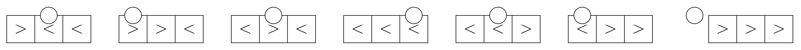

<h1 style='text-align: center;'> B. Pinball</h1>

<h5 style='text-align: center;'>time limit per test: 2 seconds</h5>
<h5 style='text-align: center;'>memory limit per test: 256 megabytes</h5>

There is a one-dimensional grid of length $n$. The $i$-th cell of the grid contains a character $s_i$, which is either '<' or '>'.

When a pinball is placed on one of the cells, it moves according to the following rules: 

* If the pinball is on the $i$-th cell and $s_i$ is '<', the pinball moves one cell to the left in the next second. If $s_i$ is '>', it moves one cell to the right.
* After the pinball has moved, the character $s_i$ is inverted (i. e. if $s_i$ used to be '<', it becomes '>', and vice versa).
* The pinball stops moving when it leaves the grid: either from the left border or from the right one.

You need to answer $n$ independent queries. In the $i$-th query, a pinball will be placed on the $i$-th cell. 
## Note

 that we always place a pinball on the initial grid.

For each query, calculate how many seconds it takes the pinball to leave the grid. It can be shown that the pinball will always leave the grid within a finite number of steps.

### Input

Each test contains multiple test cases. The first line contains the number of test cases $t$ ($1 \le t \le 10^5$). The description of the test cases follows.

The first line of each test case contains an integer $n$ ($1 \le n \le 5 \cdot 10^5$).

The second line of each test case contains a string $s_1s_2 \ldots s_{n}$ of length $n$ consisting of characters '<' and '>'.

It is guaranteed that the sum of $n$ over all test cases does not exceed $5 \cdot 10^5$.

### Output

For each test case, for each $i$ ($1 \le i \le n$) output the answer if a pinball is initially placed on the $i$-th cell.

## Example

### Input


```text
33><<4<<<<6<><<<>
```
### Output

```text

3 6 5 
1 2 3 4 
1 4 7 10 8 1 

```
## Note

In the first test case, the movement of the pinball for $i=1$ is shown in the following pictures. It takes the pinball $3$ seconds to leave the grid.

  The movement of the pinball for $i=2$ is shown in the following pictures. It takes the pinball $6$ seconds to leave the grid.

  

#### Tags 

#2000 #NOT OK #binary_search #data_structures #implementation #math #two_pointers 

## Blogs
- [All Contest Problems](../Codeforces_Round_930_(Div._1).md)
- [Announcement (en)](../blogs/Announcement_(en).md)
- [Tutorial (en)](../blogs/Tutorial_(en).md)
