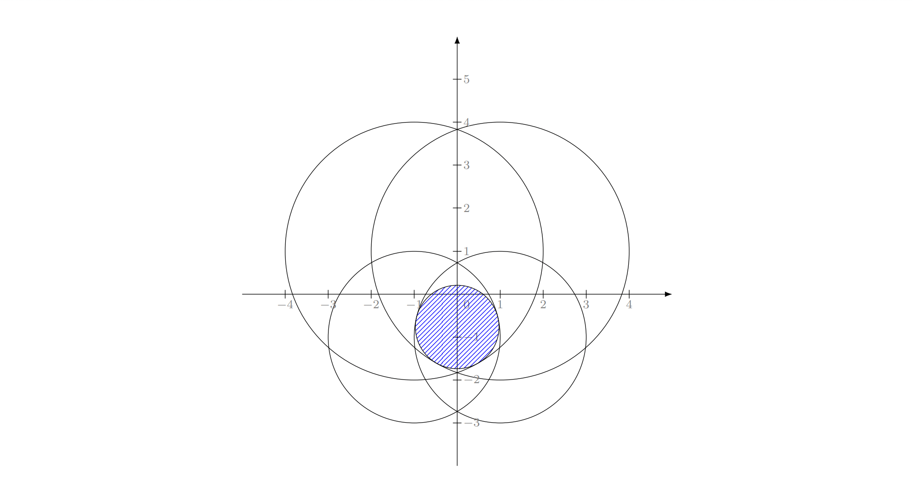

<h1 style='text-align: center;'> F. Grand Finale: Circles</h1>

<h5 style='text-align: center;'>time limit per test: 2 seconds</h5>
<h5 style='text-align: center;'>memory limit per test: 512 megabytes</h5>

You are given $n$ circles on the plane. The $i$-th of these circles is given by a tuple of integers $(x_i, y_i, r_i)$, where $(x_i, y_i)$ are the coordinates of its center, and $r_i$ is the radius of the circle.

Please find a circle $C$ which meets the following conditions:

* $C$ is contained inside all $n$ circles given in the input.
* Among all circles $C$ that meet the first condition, the radius of the circle is maximum.

Let the largest suitable circle have the radius of $a$.

Your output $C$, described as $(x,y,r)$, will be accepted if it meets the following conditions:

* For each $i$, $\sqrt{(x_i-x)^2+(y_i-y)^2}+ r \le r_i+\max(a,1)\cdot 10^{-7}$.
* The absolute or relative error of $r$ does not exceed $10^{-7}$. Formally, your answer is accepted if and only if $\frac{\left|r - a\right|}{\max(1, a)} \le 10^{-7}$.
#### Input

The first line contains a single integer $n$ ($1 \le n \le 10^5$) — the number of circles.

The $i$-th of the following $n$ lines contains three integers $x_i$, $y_i$, $r_i$ ($-10^6 \le x_i,y_i \le 10^6$, $1 \le r_i \le 2 \cdot 10^6$).

It is guaranteed that there is a circle with a radius of at least $10^{-6}$ which is contained inside all $n$ circles.

#### Output

#### Output

 three real values, $x$, $y$, and $r$ — the coordinates of the center and the radius of the circle.

## Examples

#### Input


```text
4
1 1 3
-1 1 3
1 -1 2
-1 -1 2
```
#### Output


```text
0.0000000000000000 -0.7637626158259733 0.9724747683480533
```
#### Input


```text
4
41580 -23621 95642
-41580 -23621 95642
0 47821 95642
0 0 109750
```
#### Output


```text
0.0000000000000000 0.0000000000000000 47821.0000000000000000
```
## Note

A two-dimensional plot depicting the first test case is given below. The output circle $C$ is dashed with blue lines.

  A two-dimensional plot depicting the second test case is given below. The output circle $C$ is dashed with blue lines.

  

#### Tags 

#3300 #NOT OK #binary_search #geometry 

## Blogs
- [All Contest Problems](../Codeforces_Round_930_(Div._1).md)
- [Announcement (en)](../blogs/Announcement_(en).md)
- [Tutorial (en)](../blogs/Tutorial_(en).md)
