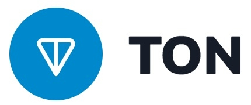

# Announcement_(en)

Hello Codeforcers!
==================

We are pleased to invite you to participate in [CodeTON Round 8 (Div. 1 + Div. 2, Rated, Prizes!)](https://codeforces.com/contest/1942). This round will start on [Saturday, March 30, 2024 at 20:35UTC+6](https://codeforces.com/https://www.timeanddate.com/worldclock/fixedtime.html?day=30&month=3&year=2024&hour=17&min=35&sec=0&p1=166) and will be **rated for all participants**. There will be 8 problems to be solved in 3 hours, with one divided into two subtasks. Similar to [USACO](https://codeforces.com/https://usaco.org/), you will help Farmer John and his cows resolve a series of first world problems. Be there or be square.

This round was cooked up by [smax](https://codeforces.com/profile/smax "Grandmaster smax"), [sum](https://codeforces.com/profile/sum "Master sum"), [oursaco](https://codeforces.com/profile/oursaco "International Master oursaco"), [cry](https://codeforces.com/profile/cry "Candidate Master cry"), and [buffering](https://codeforces.com/profile/buffering "Expert buffering").

We would like to thank the following people for making the round possible:

 * Our favorite cherry [TheScrasse](https://codeforces.com/profile/TheScrasse "Grandmaster TheScrasse") for the wonderful and speedy coordination.
* Our MVP testers, [Benq](https://codeforces.com/profile/Benq "Legendary Grandmaster Benq"), [Geothermal](https://codeforces.com/profile/Geothermal "Legendary Grandmaster Geothermal"), and [rainboy](https://codeforces.com/profile/rainboy "Master rainboy"), for dedicating so much time to reviewing problems, providing essential feedback, and perfecting the problemset.
* The rest of our testers for their unparalleled efforts: [errorgorn](https://codeforces.com/profile/errorgorn "International Grandmaster errorgorn"), [rqi](https://codeforces.com/profile/rqi "International Grandmaster rqi"), [hyforces](https://codeforces.com/profile/hyforces "International Grandmaster hyforces"), [LipArcanjo](https://codeforces.com/profile/LipArcanjo "Grandmaster LipArcanjo"), [MridulAhi](https://codeforces.com/profile/MridulAhi "Master MridulAhi"), [omeganot](https://codeforces.com/profile/omeganot "Master omeganot"), [darkkcyan](https://codeforces.com/profile/darkkcyan "International Master darkkcyan"), [Phi-001](https://codeforces.com/profile/Phi-001 "Master Phi-001"), [awesomeguy856](https://codeforces.com/profile/awesomeguy856 "Master awesomeguy856"), [JagguBandar](https://codeforces.com/profile/JagguBandar "Master JagguBandar"), [camc](https://codeforces.com/profile/camc "Master camc"), [drdilyor](https://codeforces.com/profile/drdilyor "Master drdilyor"), [lethan3](https://codeforces.com/profile/lethan3 "Master lethan3"), [rohit2593](https://codeforces.com/profile/rohit2593 "Master rohit2593"), [willy108](https://codeforces.com/profile/willy108 "Master willy108"), [WAtoAC2001](https://codeforces.com/profile/WAtoAC2001 "Master WAtoAC2001"), [jay_jayjay](https://codeforces.com/profile/jay_jayjay "Master jay_jayjay"), [-1e11](https://codeforces.com/profile/-1e11 "International Master -1e11"), [evenvalue](https://codeforces.com/profile/evenvalue "Master evenvalue"), [lunchbox](https://codeforces.com/profile/lunchbox "Master lunchbox"), [kaztayev](https://codeforces.com/profile/kaztayev "Master kaztayev"), [kondasujay2](https://codeforces.com/profile/kondasujay2 "Candidate Master kondasujay2"), [maxrgby](https://codeforces.com/profile/maxrgby "Candidate Master maxrgby"), [htetgm](https://codeforces.com/profile/htetgm "Candidate Master htetgm"), [thehunterjames](https://codeforces.com/profile/thehunterjames "Candidate Master thehunterjames"), [GlassesNerd](https://codeforces.com/profile/GlassesNerd "Expert GlassesNerd"), [SunShine11](https://codeforces.com/profile/SunShine11 "Expert SunShine11"), [wozhenshuai](https://codeforces.com/profile/wozhenshuai "Expert wozhenshuai"), [chromate00](https://codeforces.com/profile/chromate00 "Expert chromate00"), [I_FloPPed21](https://codeforces.com/profile/I_FloPPed21 "Expert I_FloPPed21"), [MrPavlito](https://codeforces.com/profile/MrPavlito "Expert MrPavlito"), [priyanshu.p](https://codeforces.com/profile/priyanshu.p "Expert priyanshu.p"), [ETL](https://codeforces.com/profile/ETL "Specialist ETL"), [yash_9a3b](https://codeforces.com/profile/yash_9a3b "Specialist yash_9a3b"), [Aurora__](https://codeforces.com/profile/Aurora__ "Specialist Aurora__"), [nelsi_sousa](https://codeforces.com/profile/nelsi_sousa "Specialist nelsi_sousa"), [susvant](https://codeforces.com/profile/susvant "Specialist susvant"), and [myvaluska](https://codeforces.com/profile/myvaluska "Pupil myvaluska").
* [Alexdat2000](https://codeforces.com/profile/Alexdat2000 "Master Alexdat2000") for translating the statements to Russian.
* [MikeMirzayanov](https://codeforces.com/profile/MikeMirzayanov "Headquarters, MikeMirzayanov") for developing Codeforces and Polygon, or else this contest literally wouldn't exist.
* You, for participating!

#### Score Distribution:

500−1000−(1250+750)−2250−2500−3000−3000−4500

#### [Editorial](Tutorial_(en).md)

**Congratulations to our Winners and First Solves!**

Top 5:

 1. [maroonrk](https://codeforces.com/profile/maroonrk "Legendary Grandmaster maroonrk")
2. [Radewoosh](https://codeforces.com/profile/Radewoosh "Legendary Grandmaster Radewoosh")
3. [ecnerwala](https://codeforces.com/profile/ecnerwala "Legendary Grandmaster ecnerwala")
4. [cnnfls_csy](https://codeforces.com/profile/cnnfls_csy "Legendary Grandmaster cnnfls_csy")
5. [orzdevinwang](https://codeforces.com/profile/orzdevinwang "Legendary Grandmaster orzdevinwang")

First Solves:

A. [A_G](https://codeforces.com/profile/A_G "Legendary Grandmaster A_G")   
 B. [jiangly](https://codeforces.com/profile/jiangly "Legendary Grandmaster jiangly")   
 C1. [ksun48](https://codeforces.com/profile/ksun48 "Legendary Grandmaster ksun48")   
 C2. [turmax](https://codeforces.com/profile/turmax "Legendary Grandmaster turmax")   
 D. [Omer223](https://codeforces.com/profile/Omer223 "Grandmaster Omer223")   
 E. [tourist](https://codeforces.com/profile/tourist "Legendary Grandmaster tourist")   
 F. [Radewoosh](https://codeforces.com/profile/Radewoosh "Legendary Grandmaster Radewoosh")   
 G. [tourist](https://codeforces.com/profile/tourist "Legendary Grandmaster tourist")   
 H. [ecnerwala](https://codeforces.com/profile/ecnerwala "Legendary Grandmaster ecnerwala")

And here is the information from our title sponsor:

*Hello, Codeforces!*

*We, the [TON Foundation](https://codeforces.com/https://ton.org/) team, are pleased to support CodeTON Round 8.*

*The Open Network (TON) is a fully decentralized layer-1 blockchain designed to onboard billions of users to Web3.*

*Since July 2022, [we have been supporting](https://codeforces.com/blog/entry/104544) Codeforces as a title sponsor. This round is another way for us to contribute to the development of the community.*

*The winners of CodeTON Round 8 will receive valuable prizes.*

*The first 1,023 participants will receive prizes in TON cryptocurrency:*

 * *1st place: 1,024 TON*
* *2–3 places: 512 TON each*
* *4–7 places: 256 TON each*
* *8–15 places: 128 TON each*
* *…*
* *512–1,023 places: 2 TON each*

*We wish you good luck at CodeTON Round 8 and hope you enjoy the contest!*

