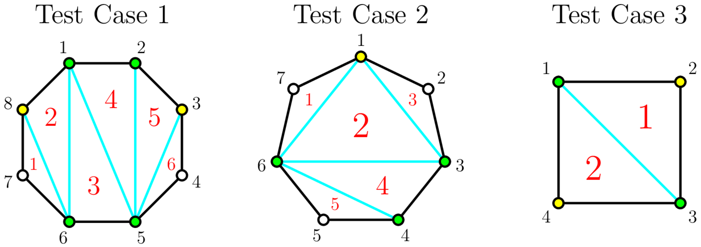

<h1 style='text-align: center;'> C2. Bessie's Birthday Cake (Hard Version)</h1>

<h5 style='text-align: center;'>time limit per test: 2 seconds</h5>
<h5 style='text-align: center;'>memory limit per test: 256 megabytes</h5>

[Proof Geometric Construction Can Solve All Love Affairs - manbo-p](https://soundcloud.com/alice-law-314125270/manbo-p-proof-geometric-construction-can-solve-all-love-affairs)⠀This is the hard version of the problem. The only difference between the two versions is the constraint on $y$. In this version $0 \leq y \leq n - x$. You can make hacks only if both versions are solved.

Bessie has received a birthday cake from her best friend Elsie, and it came in the form of a regular polygon with $n$ sides. The vertices of the cake are numbered from $1$ to $n$ clockwise. You and Bessie are going to choose some of those vertices to cut non-intersecting diagonals into the cake. In other words, the endpoints of the diagonals must be part of the chosen vertices.

Bessie would only like to give out pieces of cake which result in a triangle to keep consistency. The size of the pieces doesn't matter, and the whole cake does not have to be separated into all triangles (other shapes are allowed in the cake, but those will not be counted). 

Bessie has already chosen $x$ of those vertices that can be used to form diagonals. She wants you to choose no more than $y$ other vertices such that the number of triangular pieces of cake she can give out is maximized.

What is the maximum number of triangular pieces of cake Bessie can give out?

### Input

The first line contains a single integer $t$ ($1 \leq t \leq 10^4$) — the number of test cases.

The first line of each test case consists of three integers, $n$, $x$, and $y$ ($4 \leq n \leq 10^9$, $2 \leq x \leq \min(n, 2 \cdot 10^5)$, $0 \leq y \leq n - x$) — the number of sides of the polygon, number of vertices Bessie has chosen, and the maximum number of other vertices you can choose.

The second line consists of $x$ distinct integers from $1$ to $n$, representing the vertices Bessie has chosen.

It is guaranteed the sum of $x$ over all test cases does not exceed $2 \cdot 10^5$. 

### Output

For each test case, output a single integer: the maximum number of non-intersecting triangular pieces of cake she can give out.

## Example

### Input


```text
38 4 21 6 2 57 3 16 4 34 2 21 3
```
### Output

```text

6
5
2

```
## Note

In test cases $1$, $2$ and $3$, you can get $6$, $5$ and $2$ non-intersecting triangular pieces of cake, respectively. A possible construction is shown in the following pictures:

The green dots represent vertices that Bessie chose, the yellow dots represent vertices that you chose, the blue lines represent diagonals that are drawn, and the red numbers represent triangles that are counted.

  

#### Tags 

#1700 #OK #geometry #greedy #math 

## Blogs
- [All Contest Problems](../CodeTON_Round_8_(Div._1_+_Div._2,_Rated,_Prizes!).md)
- [Announcement (en)](../blogs/Announcement_(en).md)
- [Tutorial (en)](../blogs/Tutorial_(en).md)
