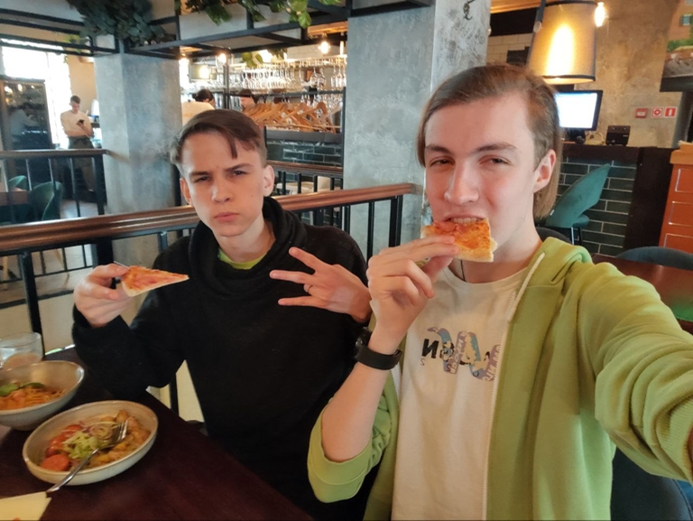

# Announcement

### **Hola, Codeforces!**

We are pleased to invite you to participate in [Codeforces Round 936 (Div. 2)](https://codeforces.com/contest/1946), which will start on [Friday, March 22, 2024 at 20:35UTC+6](https://codeforces.com/https://www.timeanddate.com/worldclock/fixedtime.html?day=22&month=3&year=2024&hour=17&min=35&sec=0&p1=166).

The round was prepared by [exhausted](https://codeforces.com/profile/exhausted "Master exhausted"), [max0000561](https://codeforces.com/profile/max0000561 "Master max0000561"), [azureglow](https://codeforces.com/profile/azureglow "Master azureglow") and myself.

This round will be **rated for participants whose rating is below 2100**. Participants with higher ratings may participate out of the competition.

You will be given **6 problems and 2 hours** to solve them. We hope you find them interesting.

We would like to thank:

 * [74TrAkToR](https://codeforces.com/profile/74TrAkToR "International Master 74TrAkToR") for coordinating the round.
* Our testers [A_G](https://codeforces.com/profile/A_G "Legendary Grandmaster A_G"), [teraqqq](https://codeforces.com/profile/teraqqq "International Grandmaster teraqqq"), [green_gold_dog](https://codeforces.com/profile/green_gold_dog "Grandmaster green_gold_dog"), [meowcneil](https://codeforces.com/profile/meowcneil "Grandmaster meowcneil"), [Noinoiio](https://codeforces.com/profile/Noinoiio "Master Noinoiio"), [sdyakonov](https://codeforces.com/profile/sdyakonov "Master sdyakonov"), [molney](https://codeforces.com/profile/molney "Master molney"), [IzhtskiyTimofey](https://codeforces.com/profile/IzhtskiyTimofey "Master IzhtskiyTimofey"), [zwezdinv](https://codeforces.com/profile/zwezdinv "International Master zwezdinv"), [Nickir](https://codeforces.com/profile/Nickir "Master Nickir"), [Kihihihi](https://codeforces.com/profile/Kihihihi "Master Kihihihi"), [sergeev.PRO](https://codeforces.com/profile/sergeev.PRO "Master sergeev.PRO"), [lerasimus](https://codeforces.com/profile/lerasimus "Master lerasimus"), [127.0.0.1](https://codeforces.com/profile/127.0.0.1 "Master 127.0.0.1"), [RomkaRS](https://codeforces.com/profile/RomkaRS "Master RomkaRS"), [makrav](https://codeforces.com/profile/makrav "International Master makrav"), [Vash_nick](https://codeforces.com/profile/Vash_nick "Master Vash_nick"), [pskobx](https://codeforces.com/profile/pskobx "Candidate Master pskobx"), [VitalyKo](https://codeforces.com/profile/VitalyKo "Candidate Master VitalyKo"), [marzipan](https://codeforces.com/profile/marzipan "Candidate Master marzipan"), [zarubin](https://codeforces.com/profile/zarubin "Candidate Master zarubin"), [lunaTu](https://codeforces.com/profile/lunaTu "Candidate Master lunaTu"), [moniMono](https://codeforces.com/profile/moniMono "Expert moniMono"), [xalwa](https://codeforces.com/profile/xalwa "Expert xalwa"), [Gmix_Ivan_Zolo_57](https://codeforces.com/profile/Gmix_Ivan_Zolo_57 "Expert Gmix_Ivan_Zolo_57"), [Lelyte](https://codeforces.com/profile/Lelyte "Expert Lelyte"), [KoT_OsKaR](https://codeforces.com/profile/KoT_OsKaR "Expert KoT_OsKaR"), [__Foam](https://codeforces.com/profile/__Foam "Expert __Foam"), [DamagedMoss5883](https://codeforces.com/profile/DamagedMoss5883 "Specialist DamagedMoss5883"), [Iron_Fenix](https://codeforces.com/profile/Iron_Fenix "Specialist Iron_Fenix"), [OR_LOVe](https://codeforces.com/profile/OR_LOVe "Specialist OR_LOVe"), [Sonya_2009](https://codeforces.com/profile/Sonya_2009 "Pupil Sonya_2009"), [tmari_sun](https://codeforces.com/profile/tmari_sun "Pupil tmari_sun"), [tfoppers](https://codeforces.com/profile/tfoppers "Newbie tfoppers"), [kuzyaa](https://codeforces.com/profile/kuzyaa "Newbie kuzyaa").
* [MikeMirzayanov](https://codeforces.com/profile/MikeMirzayanov "Headquarters, MikeMirzayanov") for Codeforces and Polygon platforms.

Special thanks to [KoT_OsKaR](https://codeforces.com/profile/KoT_OsKaR "Expert KoT_OsKaR") and [teraqqq](https://codeforces.com/profile/teraqqq "International Grandmaster teraqqq") for their help in creating tasks.

Good luck on the round and high rankings to everyone!

**Score Distribution**: *500−1000−1500−1750−2250−2750*.

**UPD:** The date of the round has been changed to avoid interference with a competition on another platform.

**UPD:** [Editorial](Tutorial_(en).md)

