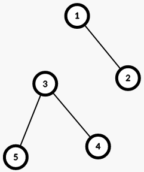

<h1 style='text-align: center;'> C. Tree Cutting</h1>

<h5 style='text-align: center;'>time limit per test: 3 seconds</h5>
<h5 style='text-align: center;'>memory limit per test: 512 megabytes</h5>

You are given a tree with $n$ vertices.

Your task is to find the maximum number $x$ such that it is possible to remove exactly $k$ edges from this tree in such a way that the size of each remaining connected component$^{\dagger}$ is at least $x$.

$^{\dagger}$ Two vertices $v$ and $u$ are in the same connected component if there exists a sequence of numbers $t_1, t_2, \ldots, t_k$ of arbitrary length $k$, such that $t_1 = v$, $t_k = u$, and for each $i$ from $1$ to $k - 1$, vertices $t_i$ and $t_{i+1}$ are connected by an edge.

### Input

Each test consists of several sets of input data. The first line contains a single integer $t$ ($1 \le t \le 10^4$) — the number of sets of input data. This is followed by a description of the sets of input data.

The first line of each set of input data contains two integers $n$ and $k$ ($1 \le k < n \le 10^5$) — the number of vertices in the tree and the number of edges to be removed.

Each of the next $n - 1$ lines of each set of input data contains two integers $v$ and $u$ ($1 \le v, u \le n$) — the next edge of the tree.

It is guaranteed that the sum of the values of $n$ for all sets of input data does not exceed $10^5$.

### Output

For each set of input data, output a single line containing the maximum number $x$ such that it is possible to remove exactly $k$ edges from the tree in such a way that the size of each remaining connected component is at least $x$.

## Example

### Input


```text
65 11 21 33 43 52 11 26 11 22 33 44 55 63 11 21 38 21 21 32 42 53 63 73 86 21 22 31 44 55 6
```
### Output

```text

2
1
3
1
1
2

```
## Note

The tree in the first set of input data:

  After removing the edge $1$ — $3$, the tree will look as follows:

  The tree has split into two connected components. The first component consists of two vertices: $1$ and $2$. The second connected component consists of three vertices: $3, 4$ and $5$. In both connected components, there are at least two vertices. It can be shown that the answer $3$ is not achievable, so the answer is $2$.


#### Tags 

#1600 #NOT OK #binary_search #dp #greedy #implementation #trees 

## Blogs
- [All Contest Problems](../Codeforces_Round_936_(Div._2).md)
- [Announcement](../blogs/Announcement.md)
- [Tutorial (en)](../blogs/Tutorial_(en).md)
