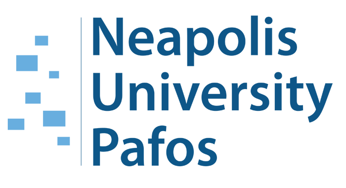

# Announcement_(en)

Hello Codeforces!

We are pleased to announce a new long-term partnership between Codeforces and [Neapolis University Pafos](https://codeforces.com/https://www.nup.ac.cy/). Now educational rounds will be supported by Neapolis University Pafos. Stay tuned and you will find out more soon.

On [Friday, March 15, 2024 at 20:35UTC+6](https://codeforces.com/https://www.timeanddate.com/worldclock/fixedtime.html?day=15&month=3&year=2024&hour=17&min=35&sec=0&p1=166) [Educational Codeforces Round 163 (Rated for Div. 2)](https://codeforces.com/contest/1948 "Educational Codeforces Round 163 (Rated for Div. 2)") will start.

This round will be **rated for the participants with rating lower than 2100**. It will be held on extended ICPC rules. The penalty for each incorrect submission until the submission with a full solution is 10 minutes. After the end of the contest, you will have 12 hours to hack any solution you want. You will have access to copy any solution and test it locally.

You will be given **6 or 7 problems** and **2 hours** to solve them.

The problems were invented and prepared by Adilbek [adedalic](https://codeforces.com/profile/adedalic "International Master adedalic") Dalabaev, Ivan [BledDest](https://codeforces.com/profile/BledDest "International Grandmaster BledDest") Androsov, Maksim [Neon](https://codeforces.com/profile/Neon "Candidate Master Neon") Mescheryakov, Roman [Roms](https://codeforces.com/profile/Roms "Master Roms") Glazov and me. Also, huge thanks to Mike [MikeMirzayanov](https://codeforces.com/profile/MikeMirzayanov "Headquarters, MikeMirzayanov") Mirzayanov for great systems Polygon and Codeforces.

Big thanks to the testers [shnirelman](https://codeforces.com/profile/shnirelman "International Grandmaster shnirelman") and [Optoed](https://codeforces.com/profile/Optoed "Specialist Optoed") for their valuable advice and suggestions! Special thanks to [Vladosiya](https://codeforces.com/profile/Vladosiya "Expert Vladosiya") for his help with the round.

Good luck to all the participants!

**UPD**: Unfortunately, there were issues with the problem E judgement during the contest. There were only 18 participants affected by it, so the round stays rated. Rated participants whose verdict on problem E changed may request unrated participation (they have received the directions on how to change their participation to unrated). If you have not received any personal notifications about it in the contest dashboard, you have not been affected.

**UPD2**: [Editorial is out](Tutorial.md)

