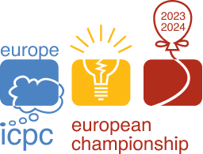

# Announcement_(en)

The [European Championship 2024](https://codeforces.com/https://euc.icpc.global/) will take place on the 24th of March in Prague. The top teams from the European ICPC regionals CERC, NWERC, SEERC, SWERC will compete for the title of European champions. It is the first edition of this ICPC super-regional.

The mirror contest [European Championship 2024 - Online Mirror (Unrated, ICPC Rules, Teams Preferred)](https://codeforces.com/contest/1949 "European Championship 2024 - Online Mirror (Unrated, ICPC Rules, Teams Preferred)") will be held on Codeforces at [Sunday, March 24, 2024 at 16:00UTC+6](https://codeforces.com/https://www.timeanddate.com/worldclock/fixedtime.html?day=24&month=3&year=2024&hour=13&min=0&sec=0&p1=166) and will last 5 hours. 

The mirror contest will contain the same problems as the official competition.

I am the chief judge for the competition and I want to thank:

 * The amazing set of judges who proposed and prepared the problems: [antontrygubO_o](https://codeforces.com/profile/antontrygubO_o "International Grandmaster antontrygubO_o"), [bicsi](https://codeforces.com/profile/bicsi "Grandmaster bicsi"), [Giove](https://codeforces.com/profile/Giove "Master Giove"), Martin Kacer, [MZuenni](https://codeforces.com/profile/MZuenni "Candidate Master MZuenni"), [Petr](https://codeforces.com/profile/Petr "Legendary Grandmaster Petr").
* Our beloved tester [ksun48](https://codeforces.com/profile/ksun48 "Legendary Grandmaster ksun48") who showed us that our perception of the difficulties was not exactly spot on...
* Our beloved proofreader [Philae](https://codeforces.com/profile/Philae "International Master Philae") for proofreading the statements.
* Everyone involved in the organization of EUC. In particular our director Boba Mannová, and Fernando Silva, Václav Herman, Ondřej Votava, Jan Kubr, Jan Baier.
* The developers of DOMjudge, the contest system used in the official contest.
* [MikeMirzayanov](https://codeforces.com/profile/MikeMirzayanov "Headquarters, MikeMirzayanov") for Polygon (that we used to prepare the problems) and for letting us host the mirror on Codeforces.

I invite you to participate in the contest and I hope that you will like the problems.

On the difficulty  
 The contest features problems with **difficulties from div1A to div1E**. It should be enjoyable for many, and challenging even for the strongest teams in the world.

Rules  

 1. The contest is unrated, so your codeforces rating will not be affected.
2. The scoring is ICPC-style: teams are first sorted by number of problems solved, then the time-penalty is used as a tie-break. An incorrect submission gives a 20 minutes penalty.
3. We encourage participation as a team.
4. If you are participating in a team, we encourage you to use only one computer for coding the solutions (as in an ICPC contest). Regarding using templates, googling, and copy-pasting code: feel free to do it.

 **Rationale of rule 4.**We decided to write explicitly rule 4 since there is always the doubt of how one should participate in this kind of mirrors. Not allowing the usage of templates and copy-pasting is a not-so-funny rule of icpc contests, so we decided not to include it for this mirror. On the other hand, using only one computer is a cool rule which makes this kind of contests unique, so we decided to include it.

UPDATE: We hope you liked the problems! 

Congratulations to the winners, and especially to the first two teams for AK:

 1. [dw my perception of the difficulties was not exactly spot on](https://codeforces.com/team/154128): [tourist](https://codeforces.com/profile/tourist "Legendary Grandmaster tourist"), [ecnerwala](https://codeforces.com/profile/ecnerwala "Legendary Grandmaster ecnerwala").
2. [xinyoudui](https://codeforces.com/team/144643): [PubabaOnO](https://codeforces.com/profile/PubabaOnO "Legendary Grandmaster PubabaOnO"), [orzdevinwang](https://codeforces.com/profile/orzdevinwang "Legendary Grandmaster orzdevinwang"), [jqdai0815](https://codeforces.com/profile/jqdai0815 "Legendary Grandmaster jqdai0815")
3. [MIPT: Yolki-palki](https://codeforces.com/team/120435): [Tikhon228](https://codeforces.com/profile/Tikhon228 "Grandmaster Tikhon228"), [Pechalka](https://codeforces.com/profile/Pechalka "Grandmaster Pechalka"), [Kapt](https://codeforces.com/profile/Kapt "International Grandmaster Kapt")
4. [Captain take me!](https://codeforces.com/team/154156): [crazy_sea](https://codeforces.com/profile/crazy_sea "International Grandmaster crazy_sea"), [A_zjzj](https://codeforces.com/profile/A_zjzj "Grandmaster A_zjzj"), [275307894a](https://codeforces.com/profile/275307894a "International Grandmaster 275307894a")
5. [Beyond Three Wolves](https://codeforces.com/team/135898): [Kevin114514](https://codeforces.com/profile/Kevin114514 "Legendary Grandmaster Kevin114514"), [CrTsIr](https://codeforces.com/profile/CrTsIr "Grandmaster CrTsIr"), [Atomic-Jellyfish](https://codeforces.com/profile/Atomic-Jellyfish "Grandmaster Atomic-Jellyfish")
6. [HSE: FFTilted](https://codeforces.com/team/107015): [Kirill22](https://codeforces.com/profile/Kirill22 "International Grandmaster Kirill22"), [Ormlis](https://codeforces.com/profile/Ormlis "Legendary Grandmaster Ormlis")

We uploaded the [editorial](Tutorial_(en).md) of the contest.

Tune in to [ICPCLive](https://codeforces.com/https://www.youtube.com/icpclive) to see the closing ceremony and find out how the onsite teams did at 18:00 CET!

UPDATE 2:

Congratulations to the medalists of the [onsite contest](https://codeforces.com/https://www.domjudge.org/scoreboard/euc2024/):

 1. Warsaw Eagles 2024 — University of Warsaw (the only team with 9 problems)
2. Zagreb 1 — University of Zagreb
3. KNU_0_GB_RAM — Taras Shevchenko National University of Kyiv
4. ELTE 1 — Eötvös Loránd University
5. UWr 1 — University of Wroclaw
6. ENS Ulm 1 — École Normale Supérieure de Paris
