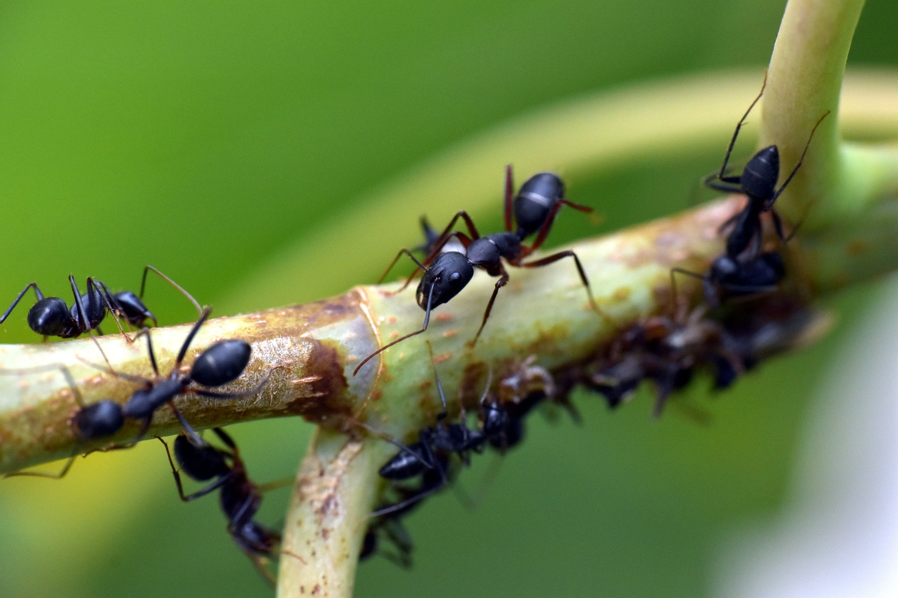

<h1 style='text-align: center;'> C. Annual Ants' Gathering</h1>

<h5 style='text-align: center;'>time limit per test: 2 seconds</h5>
<h5 style='text-align: center;'>memory limit per test: 256 megabytes</h5>

Deep within a forest lies an ancient tree, home to $n$ ants living in $n$ tiny houses, indexed from $1$ to $n$, connected by the branches of the tree.

  Once a year, all the ants need to gather to watch the EUC. For this, all ants move along the $n-1$ branches of the tree they live on to meet at the home of one ant.

However, this year the ants could not agree on where to meet and need your help to gather up. You can tell all the ants currently at house $u$ to move to house $v$ if there is a branch directly connecting those two houses. However, the ants ignore your command if there are fewer ants gathered in house $v$ than in house $u$, i.e., if it would be easier for the ants from house $v$ to move. This even holds true if no ant at all is currently in house $v$. You can give this kind of commands as many times as you want.

Is it possible for you to gather all the ants in a single house?

##### Input

The first line contains one integer $n$ ($1\leq n\leq 200\,000$) — the number of ant homes.

Each of the following $n-1$ lines contains two integers $u$ and $v$ ($1\leq u, v\leq n$) — there is a branch directly connecting the house $u$ and house $v$. It is guaranteed that every ant can reach the house of any other ant just by following the branches of the tree.

##### Output

Print $\texttt{YES}$ if it is possible to gather all the ants in a single house. Otherwise, print $\texttt{NO}$.

## Examples

##### Input


```text
75 13 24 63 67 11 3
```
##### Output

```text

YES

```
##### Input


```text
51 44 23 25 3
```
##### Output

```text

NO

```
##### Input


```text
64 55 66 12 63 2
```
##### Output

```text

YES

```
## Note

In the first sample, you can gather all the ants at house $3$ as follows: 

* You tell to the ant at house $4$ to move to house $6$.
* You tell to the ant at house $2$ to move to house $3$.
* You tell to the two ants at house $6$ to move to house $3$ (which already contains two ants).
* You tell to the ant at house $5$ to move to house $1$.
* You tell to the ant at house $7$ to move to house $1$ (which already contains two ants).
* You tell to the three ants at house $1$ to move to house $3$ (which already contains four ants).

In the second sample, it is impossible to gather all the ants in a single house.


#### Tags 

#1900 #NOT OK #dfs_and_similar #dp #greedy #trees 

## Blogs
- [All Contest Problems](../European_Championship_2024_-_Online_Mirror_(Unrated,_ICPC_Rules,_Teams_Preferred).md)
- [Announcement (en)](../blogs/Announcement_(en).md)
- [Tutorial (en)](../blogs/Tutorial_(en).md)
