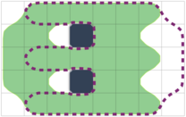

<h1 style='text-align: center;'> J. Amanda the Amoeba</h1>

<h5 style='text-align: center;'>time limit per test: 2 seconds</h5>
<h5 style='text-align: center;'>memory limit per test: 256 megabytes</h5>

This problem has an attachment. You can use it to simulate and visualize the movements of the amoeba.

Amoeba Amanda lives inside a rectangular grid of square pixels. Her body occupies some of these pixels. Other pixels may be either free or blocked. Amanda moves across the grid using the so-called amoeboid movement. In each step of such a movement, her body first shrinks by one pixel (one pixel of the body is removed and becomes free), and then grows at a different place (one previously-free pixel is added to the body).

To prevent structural damage, Amanda's body always occupies a connected region of pixels, which means that any pair of pixels forming the body can be connected by a sequence of adjacent pixels without ever leaving the body. Two pixels are considered adjacent if they share a common side (each pixel has at most 4 neighbours). The body remains connected even during the movement, including the moment after removing a pixel and before adding another one.

Your task is to help Amanda find her way around. Given her initial position and desired final position, suggest a sequence of valid moves leading from the former to the latter.

  Illustration of sample $1$: The filled shape is the initial position, the dotted region is the final position. 
#### Input

The first line contains two integers $r$ and $c$ ($1\le r,c \le 50$) — the size of the rectangular grid in pixels.

The next $r$ lines contain $c$ characters each, describing the initial position of Amanda. Each of those characters is either a dot $\texttt{.}$ denoting a free pixel, an asterisk $\texttt{*}$ denoting Amanda's body, or an $\texttt{X}$ denoting a blocked pixel which may never be occupied.

The next line is empty.

The next $r$ lines describe the desired final position in the same format as the initial position.

It is guaranteed that: 

* The number of pixels forming Amanda's body is the same in both positions, and it is at least 2.
* The body of Amanda is connected in the initial position.
* The body of Amanda is connected in the final position.
* The blocked pixels do not change between the descriptions of the initial and final position, their placement is exactly the same in both positions.
#### Output

Print $\texttt{YES}$ if it is possible for Amanda to go from the initial position to the final one. Otherwise, print $\texttt{NO}$.

If it is possible, on the next line print one integer $m$ ($0\le m\le 10\,000$) — the number of moves to execute.

The following $m$ lines must contain four integer coordinates each: $i_1$, $j_1$, $i_2$, $j_2$ ($1\le i_1,i_2\le r$, $1\le j_1,j_2\le c$). These four coordinates specify one move, meaning that the pixel at $i_1$-th row and $j_1$-th column is first removed from the body. Then, $(i_2,j_2)$ must designate a different location where one pixel is added.

The sequence should consist only of valid moves and after the last move, Amanda's body should occupy the desired final position.

If there are multiple solutions, print any of them.

Under the assumptions of this problem, it can be proven that if it is possible for Amanda to go from the initial position to the desired final one, then it is possible to do it with at most $10\,000$ moves.

## Examples

#### Input


```text
5 8.******.**.X**..*******.**.X**...******.  
.******....X****.*******...X****.******.
```
#### Output

```text

YES
5
3 1 3 8
2 1 2 8
4 1 4 8
2 2 4 7
4 2 2 7

```
#### Input


```text
2 5*.X..**X..  
..X**..X*.
```
#### Output

```text

NO

```
## Note

In the first sample, Amanda executes 5 moves to reach the final position, as shown in the figure below. 

  

#### Tags 

#2600 #NOT OK #graphs #implementation #trees #two_pointers 

## Blogs
- [All Contest Problems](../European_Championship_2024_-_Online_Mirror_(Unrated,_ICPC_Rules,_Teams_Preferred).md)
- [Announcement (en)](../blogs/Announcement_(en).md)
- [Tutorial (en)](../blogs/Tutorial_(en).md)
