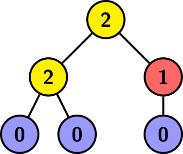

<h1 style='text-align: center;'> F. 0, 1, 2, Tree!</h1>

<h5 style='text-align: center;'>time limit per test: 2 seconds</h5>
<h5 style='text-align: center;'>memory limit per test: 256 megabytes</h5>

Find the minimum height of a rooted tree$^{\dagger}$ with $a+b+c$ vertices that satisfies the following conditions: 

* $a$ vertices have exactly $2$ children,
* $b$ vertices have exactly $1$ child, and
* $c$ vertices have exactly $0$ children.

 If no such tree exists, you should report it. The tree above is rooted at the top vertex, and each vertex is labeled with the number of children it has. Here $a=2$, $b=1$, $c=3$, and the height is $2$. 

$^{\dagger}$ A rooted tree is a connected graph without cycles, with a special vertex called the root. In a rooted tree, among any two vertices connected by an edge, one vertex is a parent (the one closer to the root), and the other one is a child. 

The distance between two vertices in a tree is the number of edges in the shortest path between them. The height of a rooted tree is the maximum distance from a vertex to the root.

### Input

The first line contains an integer $t$ ($1 \leq t \leq 10^4$) — the number of test cases.

The only line of each test case contains three integers $a$, $b$, and $c$ ($0 \leq a, b, c \leq 10^5$; $1 \leq a + b + c$).

The sum of $a + b + c$ over all test cases does not exceed $3 \cdot 10^5$.

### Output

For each test case, if no such tree exists, output $-1$. Otherwise, output one integer — the minimum height of a tree satisfying the conditions in the statement.

## Example

### Input


```text
102 1 30 0 10 1 11 0 21 1 33 1 48 17 924 36 481 0 00 3 1
```
### Output

```text

2
0
1
1
-1
3
6
-1
-1
3

```
## Note

The first test case is pictured in the statement. It can be proven that you can't get a height smaller than $2$.

In the second test case, you can form a tree with a single vertex and no edges. It has height $0$, which is clearly optimal.

In the third test case, you can form a tree with two vertices joined by a single edge. It has height $1$, which is clearly optimal.


#### Tags 

#1700 #NOT OK #bitmasks #brute_force #greedy #implementation #trees 

## Blogs
- [All Contest Problems](../Codeforces_Round_937_(Div._4).md)
- [Announcement (en)](../blogs/Announcement_(en).md)
- [Tutorial (en)](../blogs/Tutorial_(en).md)
