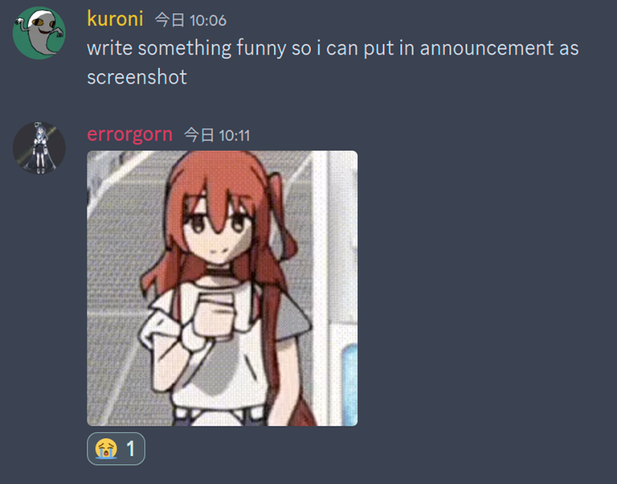

# Announcement_(en)

Xin chào Codeforces (・ω・)ﾉ

We are pleased to announce the resumption of the Global Rounds. Thanks to XTX Markets for supporting the initiative! In 2024, we will hold 4 such rounds. The series results will take into account the best 3 participations out of 4.

On [Saturday, April 6, 2024 at 20:35UTC+6](https://codeforces.com/https://www.timeanddate.com/worldclock/fixedtime.html?day=6&month=4&year=2024&hour=17&min=35&sec=0&p1=166) we will host [Codeforces Global Round 25](https://codeforces.com/contest/1951 "Codeforces Global Round 25"). ****

Codeforces Global Round 25 marks the first round in the 2024 series of Codeforces Global Rounds. These rounds are open and rated for everyone.

The prizes for this round are as follows:

 * The top 30 participants will receive a t-shirt.
* 20 t-shirts will be randomly distributed among participants ranked between 31 and 500, inclusive.

The prizes for the 4-round series in 2024:

 * In each round, the top-100 participants get points according to the [table](https://codeforces.com/https://pastebin.com/QT5sXEaT).
* A participant's final score will be the sum of the points they earned in their 3 highest-placing rounds.
* The top 20 participants across the series will receive sweatshirts and placement certificates.

We extend our gratitude to XTX Markets for supporting the global rounds initiative in 2024!

The problems were all marinated and cooked by [MofK](https://codeforces.com/profile/MofK "Гроссмейстер MofK") and [Kuroni](https://codeforces.com/profile/Kuroni "Международный гроссмейстер Kuroni").

Our sincerest gratitudes go to:

 * [errorgorn](https://codeforces.com/profile/errorgorn "Международный гроссмейстер errorgorn") for being the 🥶 and 😭 coordinator, and [TheScrasse](https://codeforces.com/profile/TheScrasse "Гроссмейстер TheScrasse") for being the 🧌 coordinator.
* [xuanquang1999](https://codeforces.com/profile/xuanquang1999 "Гроссмейстер xuanquang1999"), [gamegame](https://codeforces.com/profile/gamegame "Легендарный гроссмейстер gamegame"), [zeena.](https://codeforces.com/profile/zeena. "Специалист zeena."), [lanhf](https://codeforces.com/profile/lanhf "Мастер lanhf"), [Sana](https://codeforces.com/profile/Sana "Международный гроссмейстер Sana"), [TrungNotChung](https://codeforces.com/profile/TrungNotChung "Мастер TrungNotChung"), [lmqzzz](https://codeforces.com/profile/lmqzzz "Международный мастер lmqzzz"), [Umi](https://codeforces.com/profile/Umi "Гроссмейстер Umi"), [imsuck12](https://codeforces.com/profile/imsuck12 "Специалист imsuck12"), [Saacoota](https://codeforces.com/profile/Saacoota "Кандидат в мастера Saacoota"), [htetgm](https://codeforces.com/profile/htetgm "Кандидат в мастера htetgm"), [kodomo_tachi](https://codeforces.com/profile/kodomo_tachi "Специалист kodomo_tachi"), [shine_](https://codeforces.com/profile/shine_ "Мастер shine_"), [uocgimauxam](https://codeforces.com/profile/uocgimauxam "Эксперт uocgimauxam"), [Pemguimn](https://codeforces.com/profile/Pemguimn "Эксперт Pemguimn"), [Bananabread](https://codeforces.com/profile/Bananabread "Эксперт Bananabread"), [hphuong](https://codeforces.com/profile/hphuong "Эксперт hphuong"), [DeMen100ns](https://codeforces.com/profile/DeMen100ns "Мастер DeMen100ns"), [Kriz_Wu](https://codeforces.com/profile/Kriz_Wu "Эксперт Kriz_Wu"), [milind0110](https://codeforces.com/profile/milind0110 "Эксперт milind0110"), [YangJackie](https://codeforces.com/profile/YangJackie "Кандидат в мастера YangJackie"), [Vladithur](https://codeforces.com/profile/Vladithur "Мастер Vladithur"), [Ann](https://codeforces.com/profile/Ann "Мастер Ann"), [Endagorion](https://codeforces.com/profile/Endagorion "Международный гроссмейстер Endagorion"), [richzli](https://codeforces.com/profile/richzli "Кандидат в мастера richzli"), [BucketPotato](https://codeforces.com/profile/BucketPotato "Гроссмейстер BucketPotato"), and [_FireGhost_](https://codeforces.com/profile/_FireGhost_ "Мастер _FireGhost_") for testing and ensuring the balance of the round.
* [Alexdat2000](https://codeforces.com/profile/Alexdat2000 "Мастер Alexdat2000") for translating the statements to Russian.
* And of course, [MikeMirzayanov](https://codeforces.com/profile/MikeMirzayanov "Штаб, MikeMirzayanov") for Codeforces and Polygon.

Round Information:

 * Duration: 33 hours.
* Number of problems: 99 problems.
* Score distribution: 500−1000−1500−1750−2250−2750−3250−3500−4000500−1000−1500−1750−2250−2750−3250−3500−4000.

A tiny bit of personal note at the end, this is our first round on Codeforces in 3 years, and it feels a bit nostalgic to be back here again :) We eagerly anticipate your participation and let's all make it an awesome contest together!

 **Blooper**

**UPD**: Added score distribution.

**UPD**: The round has concluded. Congratulations to the winners!

 1. [Geothermal](https://codeforces.com/profile/Geothermal "Легендарный гроссмейстер Geothermal")
2. [ecnerwala](https://codeforces.com/profile/ecnerwala "Легендарный гроссмейстер ecnerwala")
3. [Um_nik](https://codeforces.com/profile/Um_nik "Легендарный гроссмейстер Um_nik")
4. [maroonrk](https://codeforces.com/profile/maroonrk "Легендарный гроссмейстер maroonrk")
5. [jqdai0815](https://codeforces.com/profile/jqdai0815 "Легендарный гроссмейстер jqdai0815")
6. [Benq](https://codeforces.com/profile/Benq "Легендарный гроссмейстер Benq")
7. [hos.lyric](https://codeforces.com/profile/hos.lyric "Легендарный гроссмейстер hos.lyric")
8. [antontrygubO_o](https://codeforces.com/profile/antontrygubO_o "Международный гроссмейстер antontrygubO_o")
9. [cmll02](https://codeforces.com/profile/cmll02 "Легендарный гроссмейстер cmll02")
10. [AlternatingCurrent](https://codeforces.com/profile/AlternatingCurrent "Международный гроссмейстер AlternatingCurrent")

Tutorial can be found [here](Tutorial_(en).md), and playlist of songs used in the problem statements can be found [here](https://codeforces.com/https://www.youtube.com/playlist?list=PLTVdHvnX6LZhAJre49E7M7tpGA30WlBM3).

