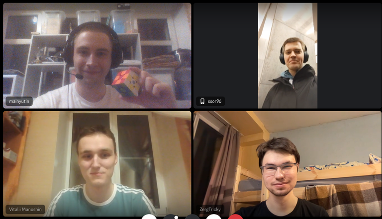

# Announcement

Hello! [Codeforces Round 938 (Div. 3)](https://codeforces.com/contest/1955 "Codeforces Round 938 (Div. 3)") will start at [Monday, April 8, 2024 at 20:35UTC+6](https://codeforces.com/https://www.timeanddate.com/worldclock/fixedtime.html?day=8&month=4&year=2024&hour=17&min=35&sec=0&p1=166). You will be offered 6-8 problems with expected difficulties to compose an interesting competition for participants with ratings up to 1600. However, all of you who wish to take part and have a rating of 1600 or higher, can register for the round unofficially.

The round will be hosted by rules of educational rounds (extended ICPC). Thus, solutions will be judged on preliminary tests during the round, and after the round, it will be a 12-hour phase of **open hacks**.

You will be given **6-8 problems** and **2 hours and 15 minutes** to solve them.

Note that the **penalty** for the wrong submission in this round is **10 minutes**.

[Remember](https://codeforces.com/blog/entry/59228) that only the trusted participants of the third division will be included in the official standings table. As it is written by link, this is a compulsory measure for combating unsporting behavior. To qualify as a *trusted participant of the third division*, you must:

 * take part in at least five rated rounds (and solve at least one problem in each of them)
* do not have a point of 1900 or higher in the rating.

**Regardless of whether you are a trusted participant of the third division or not, if your rating is less than 1600, then the round will be rated for you.**

Problems have been created and written by our team: [mainyutin](https://codeforces.com/profile/mainyutin "Expert mainyutin"), [vmanosin7](https://codeforces.com/profile/vmanosin7 "Expert vmanosin7"), [ssor96](https://codeforces.com/profile/ssor96 "Master ssor96") and [ZergTricky](https://codeforces.com/profile/ZergTricky "Master ZergTricky").

We would like to thank:

 1. [Vladosiya](https://codeforces.com/profile/Vladosiya "Expert Vladosiya") for help with ideas and great coordination of the round;
2. [FairyWinx](https://codeforces.com/profile/FairyWinx "Grandmaster FairyWinx"), [sevlll777](https://codeforces.com/profile/sevlll777 "International Grandmaster sevlll777") for red testing;
3. [ace5](https://codeforces.com/profile/ace5 "International Master ace5"), [Nickir](https://codeforces.com/profile/Nickir "Master Nickir"), [senjougaharin](https://codeforces.com/profile/senjougaharin "Master senjougaharin"), [vladmart](https://codeforces.com/profile/vladmart "Master vladmart") for yellow testing;
4. [natalina](https://codeforces.com/profile/natalina "Expert natalina") for blue testing;
5. [bitthal04](https://codeforces.com/profile/bitthal04 "Specialist bitthal04") for cyan testing;
6. [Alequisk](https://codeforces.com/profile/Alequisk "Pupil Alequisk"), [Mohamed_Hesham](https://codeforces.com/profile/Mohamed_Hesham "Pupil Mohamed_Hesham") for green testing;
7. [MikeMirzayanov](https://codeforces.com/profile/MikeMirzayanov "Headquarters, MikeMirzayanov") for Polygon and Codeforces platforms.

Good luck!

**UPD**: There was an issue with the validation of hacks for problem G, but it has now been resolved. All successful hacks will be rejudged. Pretests were not affected by the issue and remain unchanged.

**UPD2**: [Editorial](Tutorial_(en).md) is out.

