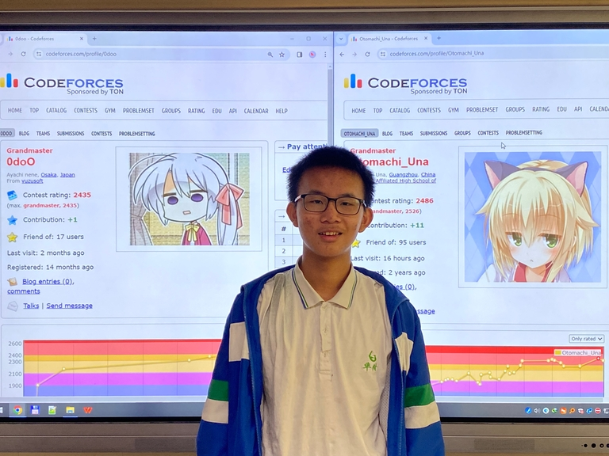

# Announcement_(en)

### Ciallo, codeforces～(∠・ω< )⌒☆

We are pleased to invite you to participate in [Codeforces Round 939 (Div. 2)](https://codeforces.com/contest/1956 "Codeforces Round 939 (Div. 2)"), which will start on [Saturday, April 13, 2024 at 20:35UTC+6](https://codeforces.com/https://www.timeanddate.com/worldclock/fixedtime.html?day=13&month=4&year=2024&hour=17&min=35&sec=0&p1=166).

The problems are from [Otomachi_Una](https://codeforces.com/profile/Otomachi_Una "Гроссмейстер Otomachi_Una") and me.

This round will be rated for participants whose rating is below 2100. Participants with higher ratings may participate out of the competition.

You will be given 6 problems and 2 hours to solve them. We hope you find them interesting.

We would like to thank:

 * [DaiRuiChen007](https://codeforces.com/profile/DaiRuiChen007 "Международный мастер DaiRuiChen007") and [lichenghan](https://codeforces.com/profile/lichenghan "Международный мастер lichenghan") for helping prepare this contest.
* [IgorI](https://codeforces.com/profile/IgorI "Гроссмейстер IgorI") and [irkstepanov](https://codeforces.com/profile/irkstepanov "Международный мастер irkstepanov") for coordinating the round.
* [A_G](https://codeforces.com/profile/A_G "Легендарный гроссмейстер A_G"), [NemanjaSo2005](https://codeforces.com/profile/NemanjaSo2005 "Мастер NemanjaSo2005"), [yeminghan](https://codeforces.com/profile/yeminghan "Гроссмейстер yeminghan"), [lunchbox](https://codeforces.com/profile/lunchbox "Кандидат в мастера lunchbox"), [Andreasyan](https://codeforces.com/profile/Andreasyan "Гроссмейстер Andreasyan"), [lsantire](https://codeforces.com/profile/lsantire "Мастер lsantire"), [RabbieWjy](https://codeforces.com/profile/RabbieWjy "Эксперт RabbieWjy"), [yurongyi0504](https://codeforces.com/profile/yurongyi0504 "Не в рейтинге, yurongyi0504"), [KKT_89](https://codeforces.com/profile/KKT_89 "Мастер KKT_89"), [MinaRagy06](https://codeforces.com/profile/MinaRagy06 "Эксперт MinaRagy06"), [carnation13](https://codeforces.com/profile/carnation13 "Кандидат в мастера carnation13"), [Romakolesn](https://codeforces.com/profile/Romakolesn "Эксперт Romakolesn"), [blitztage](https://codeforces.com/profile/blitztage "Мастер blitztage"), [qsc114](https://codeforces.com/profile/qsc114 "Новичок qsc114"), [Adam_GS](https://codeforces.com/profile/Adam_GS "Международный гроссмейстер Adam_GS"), [Evarine](https://codeforces.com/profile/Evarine "Не в рейтинге, Evarine") and [htetgm](https://codeforces.com/profile/htetgm "Кандидат в мастера htetgm") for testing.
* [MikeMirzayanov](https://codeforces.com/profile/MikeMirzayanov "Штаб, MikeMirzayanov") for Codeforces and Polygon platforms.

Score distribution: $500-750-1500-1750-(1500+750)-2500$

Good luck on the round and high rankings to everyone!

**UPD**: [Editorial](Tutorial_(en).md) out.

**UPD**: the winners

 

| Div. 1 | Div. 2 |
| --- | --- |
| [BurnedChicken](https://codeforces.com/profile/BurnedChicken "Легендарный гроссмейстер BurnedChicken") | [zjy114514](https://codeforces.com/profile/zjy114514 "Новичок zjy114514") |
| [StarSilk](https://codeforces.com/profile/StarSilk "Международный гроссмейстер StarSilk") | [King_of_Beggars](https://codeforces.com/profile/King_of_Beggars "Кандидат в мастера King_of_Beggars") |
| [maspy](https://codeforces.com/profile/maspy "Легендарный гроссмейстер maspy") | [_MyGO_Tomori_](https://codeforces.com/profile/_MyGO_Tomori_ "Эксперт _MyGO_Tomori_") |
| [415411](https://codeforces.com/profile/415411 "Гроссмейстер 415411") | [LegendaryGrandmasterLjm](https://codeforces.com/profile/LegendaryGrandmasterLjm "Мастер LegendaryGrandmasterLjm") |
| [Rubikun](https://codeforces.com/profile/Rubikun "Международный гроссмейстер Rubikun") | [naniak](https://codeforces.com/profile/naniak "Эксперт naniak") |

Photo of authors (unfortunately, I can't come, so my profile is shown in the picture): 

**UPD**: The rating changes for Educational Codeforces Round 164 will be applied after this round.

