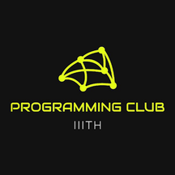

# Announcement_(en)

Hello Codeforces!
-----------------

We're glad to invite everyone to participate in [Codeforces Round 940 (Div. 2) and CodeCraft-23](https://codeforces.com/contest/1957 "Codeforces Round 940 (Div. 2) and CodeCraft-23"), which will start on [Sunday, April 21, 2024 at 20:35UTC+6](https://codeforces.com/https://www.timeanddate.com/worldclock/fixedtime.html?day=21&month=4&year=2024&hour=17&min=35&sec=0&p1=166). The contest will be rated for all the Div. 2 participants (Rating < 2100).

The [Programming Club at IIIT-H](https://codeforces.com/https://iiit-programming-club.github.io/) organizes this event as a part of our techno-cultural fest Felicity @ IIIT Hyderabad.

You will have 6 problems to solve in the duration of ~~2 hours~~ 2 hours and 15 minutes. One of the problems is divided into 2 subtasks. Do ensure you read all of the problems!

There have been a bunch of people that have helped us in making this contest a (hopefully) great one!

 * [ScarletS](https://codeforces.com/profile/ScarletS "Master ScarletS") and [KAN](https://codeforces.com/profile/KAN "Legendary Grandmaster KAN") for their wonderful coordination.
* [Alexdat2000](https://codeforces.com/profile/Alexdat2000 "International Master Alexdat2000") for translating the problem statements to Russian.
* [akcube](https://codeforces.com/profile/akcube "Master akcube"), [fangahawk](https://codeforces.com/profile/fangahawk "Master fangahawk"), [GenghizKhan](https://codeforces.com/profile/GenghizKhan "Candidate Master GenghizKhan"), [JadeReaper](https://codeforces.com/profile/JadeReaper "Candidate Master JadeReaper"), [kevaljain](https://codeforces.com/profile/kevaljain "Candidate Master kevaljain"), [keyurchd_11](https://codeforces.com/profile/keyurchd_11 "Master keyurchd_11"), [lezirtin](https://codeforces.com/profile/lezirtin "Expert lezirtin"), [ppt1524](https://codeforces.com/profile/ppt1524 "Candidate Master ppt1524"), [Prakul_Agrawal](https://codeforces.com/profile/Prakul_Agrawal "Expert Prakul_Agrawal"), [SilverTongue1729](https://codeforces.com/profile/SilverTongue1729 "Candidate Master SilverTongue1729"), [shakr](https://codeforces.com/profile/shakr "Expert shakr"), [TheRaja](https://codeforces.com/profile/TheRaja "Candidate Master TheRaja") who helped with brainstorming problem ideas and preparing them.
* [A_G](https://codeforces.com/profile/A_G "Legendary Grandmaster A_G"), [dorijanlendvaj](https://codeforces.com/profile/dorijanlendvaj "Legendary Grandmaster dorijanlendvaj"), [Andreasyan](https://codeforces.com/profile/Andreasyan "International Grandmaster Andreasyan"), [MridulAhi](https://codeforces.com/profile/MridulAhi "Grandmaster MridulAhi"), [codelegend](https://codeforces.com/profile/codelegend "Grandmaster codelegend"), [prvocislo](https://codeforces.com/profile/prvocislo "Grandmaster prvocislo"), [satyam343](https://codeforces.com/profile/satyam343 "Grandmaster satyam343"), [shiven](https://codeforces.com/profile/shiven "International Master shiven"), [mwen](https://codeforces.com/profile/mwen "International Master mwen"), [JagguBandar](https://codeforces.com/profile/JagguBandar "Master JagguBandar"), [fishy15](https://codeforces.com/profile/fishy15 "Master fishy15"), [islingr](https://codeforces.com/profile/islingr "Master islingr"), [nor](https://codeforces.com/profile/nor "Master nor"), [golions](https://codeforces.com/profile/golions "Master golions"), [WAtoAC2001](https://codeforces.com/profile/WAtoAC2001 "Master WAtoAC2001"), [hackerbhaiya](https://codeforces.com/profile/hackerbhaiya "Master hackerbhaiya"), [carnation13](https://codeforces.com/profile/carnation13 "Candidate Master carnation13"), [Murinh0](https://codeforces.com/profile/Murinh0 "Expert Murinh0"), [AbhijnanVegi](https://codeforces.com/profile/AbhijnanVegi "Specialist AbhijnanVegi"), [freaksier](https://codeforces.com/profile/freaksier "Specialist freaksier") for testing the round, and giving useful advice regarding problem preparation to make the contest better.
* And [MikeMirzayanov](https://codeforces.com/profile/MikeMirzayanov "Headquarters, MikeMirzayanov") for the amazing platforms, Codeforces and Polygon, which has made contest preparation an even greater experience.

**Score Distribution:** 500−1000−1500−1750−2250−(2250+1250)500−1000−1500−1750−2250−(2250+1250)

Hope you enjoy the problems!

**UPD**: The editorial can be found [here](Tutorial_(en).md).

**UPD**: The Winners

#### Official

 1. [Alphaqwq_](https://codeforces.com/profile/Alphaqwq_ "Specialist Alphaqwq_")
2. [misfits](https://codeforces.com/profile/misfits "Newbie misfits")
3. [Monkey1ng](https://codeforces.com/profile/Monkey1ng "Expert Monkey1ng")
4. [Nanani_fan](https://codeforces.com/profile/Nanani_fan "Candidate Master Nanani_fan")
5. [lmq3z](https://codeforces.com/profile/lmq3z "Candidate Master lmq3z")

#### Unofficial

 1. [BurnedChicken](https://codeforces.com/profile/BurnedChicken "Legendary Grandmaster BurnedChicken")
2. [maspy](https://codeforces.com/profile/maspy "Legendary Grandmaster maspy")
3. [kotatsugame](https://codeforces.com/profile/kotatsugame "International Grandmaster kotatsugame")
4. [zdc123456](https://codeforces.com/profile/zdc123456 "International Master zdc123456")
5. [zjy2008](https://codeforces.com/profile/zjy2008 "Grandmaster zjy2008")
