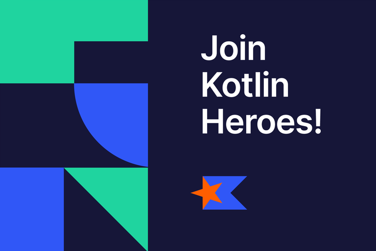

# Announcement_(en)

Greetings Codeforces!

First things first, we would like to thank everyone who participated in the previous nine Kotlin Heroes competitions: [Episode 1](https://codeforces.com/contests/1170,1171), [Episode 2](https://codeforces.com/contests/1211,1212), [Episode 3](https://codeforces.com/contests/1297,1298), [Episode 4](https://codeforces.com/contests/1346,1347), [Episode 5: ICPC Round](https://codeforces.com/contests/1432,1431), [Episode 6](https://codeforces.com/contests/1488,1489), [Episode 7](https://codeforces.com/contests/1533,1532), [Episode 8](https://codeforces.com/contests/1571,1570) and [Episode 9](https://codeforces.com/contests/1911,1910).

Kotlin Heroes is a great way to play around with Kotlin’s features, learn something new, and practice using the language by solving fun problems. It is great for programmers of any level! 

We invite you to **join the** [practice round](https://codeforces.com/contests/1959), where you can improve your algorithmic problem-solving skills and complete training problems. In this round, all the solutions are open and you can request hints if you’re stuck.

Here are some things you can do to help you refresh your knowledge of Kotlin and learn more about competitive programming while you practice:

 * Review our Kotlin solutions for the [Advent of Code algorithmic puzzles](https://codeforces.com/https://kotlinlang.org/docs/advent-of-code.html).
* Read our [competitive programming tutorial](https://codeforces.com/https://kotlinlang.org/docs/competitive-programming.html).
* Watch the videos from our [Kotlin in Competitive Programming](https://codeforces.com/https://www.youtube.com/playlist?list=PLlFc5cFwUnmyQA0l15nAfE1-pnu6fSvvG) YouTube playlist.
* Look at the problems from the [previous practice rounds](https://codeforces.com/contests/1532,1570,1911).

On **May 13, 2024**, the real challenge begins! [Kotlin Heroes: Episode 10](https://codeforces.com/contests/1958) will last **2 hours 30 minutes** and will feature a set of problems ranging from simple ones, which are designed to be solvable by anyone, to some really tricky ones for seasoned competitive programmers.

  

 [REGISTER →](https://codeforces.com/contests/1958)  You can solve Codeforces challenges directly from your JetBrains IDE using its smart features. Just enable the [JetBrains Academy plugin](https://codeforces.com/https://plugins.jetbrains.com/plugin/10081-jetbrains-academy) and follow the instructions in the [Getting started with Codeforces guide](https://plugins.jetbrains.com/plugin/10081-jetbrains-academy/docs/codeforces-contests.html#f69edaa9).

**Prizes:**

**The top three winners will receive cash prizes of $512, $256, and $128 (or rewards of equivalent value), respectively. The top 50 participants will win a Kotlin Heroes T-shirt and an exclusive Kotlin sticker, and all competitors who solve at least one problem will be entered into a raffle for one of 50 Kotlin Heroes T-shirts.**

Please note that we are not able to ship prizes to any country, state, province, or territory subject to comprehensive OFAC sanctions, including Belarus, Cuba, Iran, North Korea, Russia, Syria, or the Crimea, Donetsk, or Luhansk regions. To see the list of sanctioned countries and regions, please visit [this page](https://codeforces.com/https://ofac.treasury.gov/sanctions-programs-and-country-information).

Best of luck to everyone!

