# Tutorial_(en)

[1966A - Card Exchange](../problems/A._Card_Exchange.md "Codeforces Round 941 (Div. 2)")

 **Solution**
### [1966A - Card Exchange](../problems/A._Card_Exchange.md "Codeforces Round 941 (Div. 2)")

If you don't initially have at least k copies of any number, you can't perform any operations, so the answer is n.

Otherwise, we can show that we can always get down to k−1 cards, with the following algorithm:

1. Choose any card that you have k copies of, and remove those k copies
2. If you have no more cards, take any k−1 cards and end the process.
3. Otherwise, let x be the number on any card you have. Take k−1 copies of x. Now, you have at least k copies of x, so return to step 1.

Since the total number of cards decreases at each step, this process will always terminate, so you will always end up with k−1 cards. 

Also, since the total number of cards decreases by exactly 1 at each step, and you can't do any operations if you have less than k cards, it is impossible to do better than k−1, so our solution of k−1 is optimal.

Complexity: O(n) or O(nlogn) depending on implementation.

 **Code**
```cpp
t = int(input())

for tc in range(t):
    n, k = map(int, input().split())

    cards = list(map(int, input().split()))
    ct = {}

    ans = n

    for c in cards:
        if c in ct:
            ct.update({c: ct[c] + 1})
        else:
            ct.update({c: 1})
        if ct[c] >= k:
            ans = k - 1

    print(ans)
```
[1966B - Rectangle Filling](../problems/B._Rectangle_Filling.md "Codeforces Round 941 (Div. 2)")

 **Solution**
### [1966B - Rectangle Filling](../problems/B._Rectangle_Filling.md "Codeforces Round 941 (Div. 2)")

If either pair of opposite corners is the same color, then we can choose those corners to make everything the same color in one operation.

Otherwise, we have four cases for the colors of the corners:

 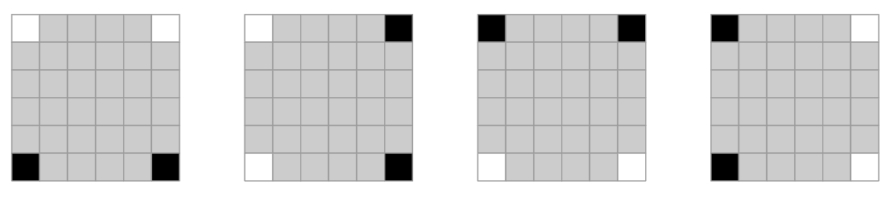 Notice that these are all essentially rotations of each other, so we can only consider the first case by symmetry:

 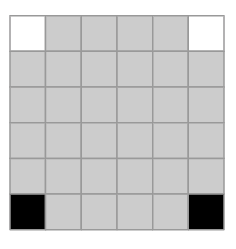 If any of the squares in the first row are black, then we can color everything black in two operations:

 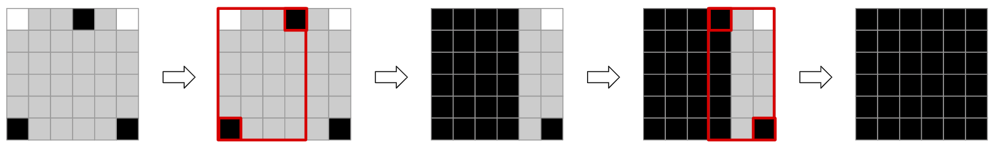 In the same way, if any of the squares in the last row are white, then we can color everything white in two operations.

Otherwise, the grid looks like this:

 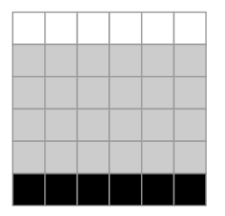 Notice that no matter how many operations we do, all squares in the top row will remain white, and all squares in the bottom row will remain black, so we can never make everything the same color.

So, considering the four cases from earlier, the solution is:

NO if all squares in the top row are the same color, all squares in the bottom row are the same color, and these two colors are different

NO if all squares in the leftmost column are the same color, all squares in the rightmost column are the same color, and these two colors are different

YES otherwise

Complexity: O(nm)

 **Code**
```cpp
t = int(input())

for tc in range(t):
    n, m = map(int, input().split())
    gr = []

    for i in range(n):
        gr.append(input())

    ans = "YES"

    if gr[0][0] != gr[n - 1][m - 1]:

        impossible = True
        for j in range(m - 1):
            if gr[0][j] != gr[0][j + 1] or gr[n - 1][j] != gr[n - 1][j + 1]:
                impossible = False

        if impossible:
            ans = "NO"

        impossible = True
        for i in range(n - 1):
            if gr[i][0] != gr[i + 1][0] or gr[i][m - 1] != gr[i + 1][m - 1]:
                impossible = False

        if impossible:
            ans = "NO"

    print(ans)
```
[1965A - Everything Nim](https://codeforces.com/contest/1965/problem/A "Codeforces Round 941 (Div. 1)")

 **Solution**
### [1965A - Everything Nim](https://codeforces.com/contest/1965/problem/A "Codeforces Round 941 (Div. 1)")

If the smallest pile is of size 1, then Alice must choose k=1 in her first move. Therefore, we can imagine subtracting 1 from all piles, and determining who wins given that Bob goes first. We can repeat this process, switching the first player back and forth, until there is no longer a pile of size 1. At this point, we are in one of two states:

1. If there are no piles remaining, the first player loses, because they cannot make any moves
2. Otherwise, the smallest pile is of size x≥2. We can show that the first player will always win. To do this, consider what happens if the first player chooses k=x:
	* If this would create a losing state for the next player, then the first player can choose k=x and win.
	* Otherwise, the state reached by choosing k=x is a winning state for the next player to move. So the first player can choose k=x−1, forcing the second player to choose k=1. The first player will now be in the winning state and can proceed to win the game.

To implement this solution, we only need to keep track of the largest pile size a, and the smallest positive integer b that is not a pile size (essentially the MEX of the pile sizes, excluding 0).

If b>a, then Alice and Bob will be forced to choose k=1 until the end of the game, so the parity of a determines the winner. Otherwise, they will eventually reach a state with minimum pile size at least 2, so the parity of b determines the winner.

Complexity: O(n) or O(nlogn) depending on implementation

 **Code**
```cpp
t = int(input())

for tc in range(t):

    n = int(input())
    a = list(map(int, input().split()))

    maxsize = max(a)

    a.sort()
    mexsize = 1
    for sz in a:
        if sz == mexsize:
            mexsize = mexsize + 1

    if mexsize > maxsize:
        print("Alice" if maxsize % 2 == 1 else "Bob")
    else:
        print("Alice" if mexsize % 2 == 1 else "Bob")
```
[1965B - Missing Subsequence Sum](https://codeforces.com/contest/1965/problem/B "Codeforces Round 941 (Div. 1)")

 **Solution**
### [1965B - Missing Subsequence Sum](https://codeforces.com/contest/1965/problem/B "Codeforces Round 941 (Div. 1)")

Notice that for a fixed k, a solution for n=c is also a solution for all n<c. So we can ignore the value of n and just assume it's always 106.

If we didn't have the restriction that no subsequence can add up to k, the most natural solution would be [1,2,4,8,⋯219]. Every value from 1 to 106 appears as the sum of the subsequence given by its binary representation. We will use a modified version of this array to solve the problem.

Let i be the largest integer such that 2i≤k. We will use this array (of size 22):

a=[k−2i,k+1,k+1+2i,1,2,4,...2i−1,2i+1,...219]

To prove that no subsequence of a adds up to k, consider the list of all elements in the array that are at most k, since these are the only ones that could be present in a subsequence adding to k. These are

k−2i,1,2,4,...2i−1

Since these add up to k−1, no subsequence can add up to k.

To prove that for all 1≤v≤n where v≠k, there is a subsequence adding up to v, we consider several cases:

* If v<2i, we can simply use the binary representation of v.
* If 2i≤v<k, we can first take all of the elements that are at most k as part of our subsequence. We then need to remove elements with a sum equal to k−1−v. Because 2i≤v<k<2i+1, k−1−v is less than 2i, so we can simply remove its binary representation.
* If v>k, we can take k+1 along with the binary representation of v−k−1. The one edge case is when the 2i bit is set in v−k−1. In this case, we replace k+1 with k+1+2i.

So in all cases, we can form a subsequence adding up to v.

Complexity: O(logn)

 **Code**
```cpp
t = int(input())

for tc in range(t):
    n, k = map(int, input().split())

    i = 0
    while (1 << (i + 1)) <= k:
        i = i + 1

    ans = [k - (1 << i), k + 1, k + 1 + (1 << i)]

    for j in range(20):
        if j != i:
            ans.append(1 << j);

    print(len(ans))
    print(*ans)
```
[1965C - Folding Strip](https://codeforces.com/contest/1965/problem/C "Codeforces Round 941 (Div. 1)")

 **Solution**
### [1965C - Folding Strip](https://codeforces.com/contest/1965/problem/C "Codeforces Round 941 (Div. 1)")

Define the pattern of a (validly) folded strip to be the set of characters, in order, seen from above after all folds are made.

It is always possible to fold the strip in such a way that no two adjacent characters in the pattern are equal. If we fold in between every pair of equal characters, and don't fold in between every pair of distinct characters, we will achieve this. This diagram shows one example of this (the red lines indicate where to fold, and the final pattern is 10101):

 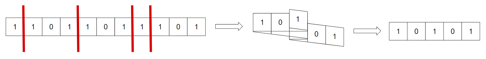 This set of folds will always be valid because it ensures that all 1s in the original string are on odd indices and all 0s are on even indices (or vice versa).

Also, there is only one obtainable pattern (up to reversal) that is alternating in this way. It is never possible to fold in between two adjacent different characters, because that can never be part of a valid folding, and if there exists a pair of adjacent equal characters that you don't fold in between, the pattern will not be alternating.

We can also show that the pattern formed by this process is always optimal. Let t be any pattern obtained from a valid folding of s. Notice that if we perform a valid fold on t, that corresponds to a valid fold on s, because we can essentially "compose" the valid folding of s into t and the valid folding of t into one valid folding.

So we can fold t using the process above, which will yield a pattern with alternating characters of length at most len(t). Because the alternating pattern is unique for a given s, it must be the same (up to reversal) as the one described above. So the above pattern is of size at most len(t) for any valid pattern t, and is therefore optimal.

We can simulate the folding process to determine the final length.

Complexity: O(n)

 **Code**
```cpp
t = int(input())

for tc in range(t):
    n = int(input())
    s = input()
    mn = 0
    mx = 0
    cur = 0

    for c in s:

        if (cur % 2 == 0) == (c == '1'):
            cur = cur + 1
        else:
            cur = cur - 1

        mn = min(mn, cur)
        mx = max(mx, cur)

    print(mx - mn)
```
[1965D - Missing Subarray Sum](https://codeforces.com/contest/1965/problem/D "Codeforces Round 941 (Div. 1)")

 **Solution**
### [1965D - Missing Subarray Sum](https://codeforces.com/contest/1965/problem/D "Codeforces Round 941 (Div. 1)")

Let's first look at the set of subarray sums of a palindromic array a of n positive integers. Because a is a palindrome, the sum of the subarray with indices in the range [l,r] is the same as the sum of the subarray with indices in the range [n+1−r,n+1−l]. So if we ignore all subarrays where l+r=n+1 (subarrays centered at the center of a), each sum must appear an even number of times.

Also, every "centered" subarray [l,n+1−l] must have a unique sum. This is because all elements of a are strictly positive, and if the "centered" subarrays are ordered by length, each one contains all elements in the previous one, along with two new elements, so its sum must be strictly greater.

Therefore, the set of subarray sums that appear an odd number of times is exactly the set of sums of subarrays centered at the center of a. For example, in the array a=[1,2,3,2,1], the sums that appear an odd number of times are:

* 3 ([3], [1,2], [2,1])
* 7 ([2,3,2])
* 9 ([1,2,3,2,1])

 Note that they can appear more than once.So if we have all n(n+1)2 subarray sums of a, we can then use the "centered" sums to reconstruct a itself. The smallest "centered" sum is either the middle element or the sum of the middle two (equal) elements, depending on the parity of n, and for each "centered" sum in ascending order after that, its difference with the previous sum must be the sum of the next two (equal) elements closest to the center of a.

Now, let's find out how to reconstruct the missing sum. We consider two cases:

1. If the missing sum is for a "centered" subarray, then there will be exactly ⌈n2⌉−1 sums that appear an odd number of times in the input. We can use these sums to construct a palindromic array b of size n−2 as described above.We can then remove all sums of subarrays of b from the initial input list, and look at what is remaining. If we let [l,r] be the indices of the missing subarray, the largest remaining sum in the list must be the sum of [1,r] in a (or equivalently [l,n]). Let this sum be x and the sum of b be y.

If l>1 (and therefore r<n), the missing sum must be 2x−y, because the 2x part includes everything in the missing subarray twice, and everything else once, and y includes everything once. l=1, r=n initially seems like it will be an edge case, but the same equation works there as well, since 2x includes everything in the missing array (all of a) once, and everything in b once, and y includes everything in b once.
2. If the missing sum is not for a "centered" subarray, then there will be exactly ⌈n2⌉+1 sums that appear an odd number of times in the input. We can use these sums to construct a palindromic array b of size n+2 as described above.In a similar way to the previous case, we can then remove all sums from the initial input list from the set of subset sums of b. If we let [l,r] be the indices of the extra "centered" subarray in b, the largest remaining sum in the list must be the sum of [1,r] in b (or equivalently [l,n+2]). If we let x be this largest sum, and y be the sum of b, we can use similar logic to the previous case to determine that the missing sum is 2x−y.

So we can determine the missing sum, using the number of sums that appear an odd number of times in the input to determine which case we are in. Once we have found the missing sum, we just need to reconstruct a using the process above. Also, notice that by the construction we have followed so far, the solution is always unique.

Complexity: O(n2logn)

 **Code**
```cpp
def getSubarraySums(a):

    cts = []
    for i in range(len(a)):
        sm = 0
        for j in range(i, len(a)):
            sm = sm + a[j]
            cts.append(sm)

    cts.sort()
    return cts

def getOddOccurringElements(cts):

    odds = []

    for ct in cts:
        if len(odds) > 0 and ct == odds[-1]:
            odds.pop()
        else:
            odds.append(ct)
    return odds

def getPalindrome(odds, n):

    a = [0] * n
    prev = 0
    idx = (n - 1) // 2
    
    for x in odds:
        if idx == n - 1 - idx:
            a[idx] = x
        else:
            a[idx] = (x - prev) // 2
            a[n - 1 - idx] = (x - prev) // 2
        prev = x
        idx = idx - 1
    
    return a

def getLargestExcluded(bigList, smallList):

    while len(smallList) > 0 and bigList[-1] == smallList[-1]:
        bigList.pop()
        smallList.pop()
    return bigList[-1]

t = int(input())

for tc in range(t):

    n = int(input())
    
    subarraySums = list(map(int, input().split()))
    subarraySums.sort()
    odds = getOddOccurringElements(subarraySums)
    
    missingSum = -1
    
    if len(odds) > (n + 1) // 2:
    
        oddvals = []
        evenvals = []
        for x in odds:
            if x % 2 == 1:
                oddvals.append(x)
            else:
                evenvals.append(x)

        if len(evenvals) > 0 and len(oddvals) > 0:

            missingSum = evenvals[0] if len(evenvals) == 1 else oddvals[0]

        else:

            b = getPalindrome(odds, n + 2)
            bSums = getSubarraySums(b)
            y = bSums[-1]
            x = getLargestExcluded(bSums, subarraySums)
            missingSum = 2 * x - y
    
    else:
        
        b = getPalindrome(odds, n - 2)
        bSums = getSubarraySums(b)
        y = bSums[-1]
        x = getLargestExcluded(subarraySums, bSums)
        missingSum = 2 * x - y

    odds.append(missingSum)
    odds.sort()
    odds = getOddOccurringElements(odds)
    
    ans = getPalindrome(odds, n)
    print(*ans)
```
[1965E - Connected Cubes](https://codeforces.com/contest/1965/problem/E "Codeforces Round 941 (Div. 1)")

 **Solution**
### [1965E - Connected Cubes](https://codeforces.com/contest/1965/problem/E "Codeforces Round 941 (Div. 1)")

We can show that a solution always exists. This example with n=3, m=5, k=4 will demonstrate the construction we will use:

 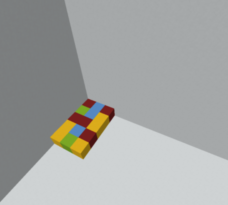 First, extend each of the even columns up by n+k−1 spaces, keeping all cubes in a given vertical column the same color:

 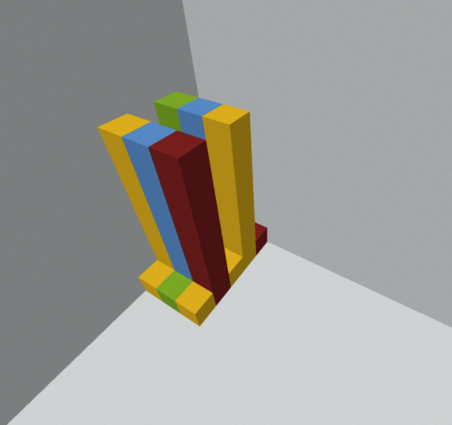 Then, for the odd columns, do something similar, except we use the bottom n−1 rows to "bend" them around so the tops point out to the right:

 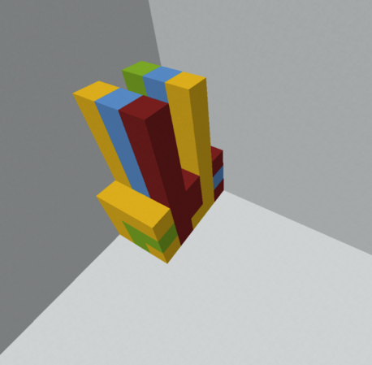 After that, extend each of these new "bent" rows (each of which corresponds to an input cube in an odd column) to the right by k:

 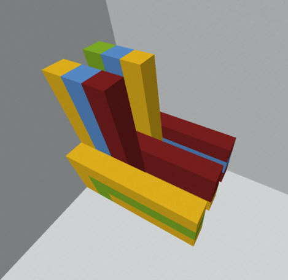 Now, each initial cube in the n by m grid corresponds to one of these extended rows or columns, each of which is a connected group. Fill in the remaining columns between the even columns with k rows each. The i-th of these should be color i.

 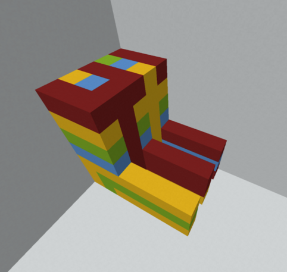 Now do the same for the odd columns:

  At this point, each cell of a given color is connected to at least one of the rows/columns we added in the last two steps. Now, we want to connect all of those by color. Start by adding these k rows:

  Followed by these k−1 rows:

  Once again, at this point, each cube of a given color is connected to one of the rows of that color we added in the last two steps. So the last remaining step is to connect them:

 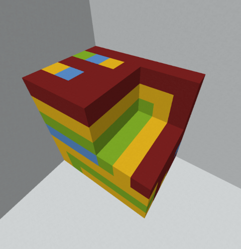 Now, all cubes of each color are connected.

This construction uses exactly (n+k)2m−(k−1)2(m−1)−nm additional cubes. Since n,m,k≤50, this is at most 379,851, which fits within the bounds of the problem.

Complexity: O((n+k)2m)

 **Code**
```cpp
n, m, k = map(int, input().split())
a = []

for i in range(n):
    a.append(list(map(int, input().split())))

ans = []

for x in range(n):
    for y in range(m):
        for z in range(1, n + 1):
            if y % 2 == 1:
                ans.append([x, y, z, a[x][y]])
            else:
                ans.append([x, y, z, a[min(x, n - z)][y]])
        for z in range(n + 1, n + k + 1):
            if y % 2 == 1:
                ans.append([x, y, z, a[x][y]])
            else:
                ans.append([x, y, z, z - n])

for x in range(n, n + k):
    for y in range(m):
        for z in range(1, n + 1):
            if y % 2 == 1:
                ans.append([x, y, z, x - n + 1])
            else:
                ans.append([x, y, z, a[n - z][y]])
        ans.append([x, y, n + 1, x - n + 1])

for y in range(m):
    for z in range(n + 2, n + k + 1):
        ans.append([n, y, z, z - n])

for x in range(n + 1, n + k):
    for z in range(n + 2, n + k + 1):
        ans.append([x, 0, z, max(x - n + 1, z - n)])

print(len(ans))

for cube in ans:
    print(cube[0] + 1, cube[1] + 1, cube[2] + 1, cube[3])
```
[1965F - Conference](https://codeforces.com/contest/1965/problem/F "Codeforces Round 941 (Div. 1)")

 **Solution**
### [1965F - Conference](https://codeforces.com/contest/1965/problem/F "Codeforces Round 941 (Div. 1)")

For a segment of days, how can we tell if there's a way to assign a lecturer to each day of the segment? Consider a bipartite graph: the first part consists of the days in the segment, the second part consists of all lecturers, an edge between a day and a lecturer exists if that lecturer is available on that day. We need to check if the maximum matching covers all vertices in the first part. If this is the case, we'll call the segment of days valid.

A common way to check if a segment is valid is to use Hall's marriage theorem. In our case, we can formulate it as follows: 

* If for each subset of days s, the number of lecturers available on at least one day of that subset is at least |s|, then this segment of days is valid.

It might be tempting to only consider subsets which form contiguous subsegments. However, consider the following test case: 


```cpp
  
3  
1 3  
2 2  
2 2  

```
For a segment of days [1;3], the only subset that violates the Hall's marriage theorem condition is {1,3}, which is not contiguous.

Let's try to fix that.

Suppose there are two lecturers with equal li: let their availability segments be [a;b] and [a;c], where b≤c. Then, if we replace [a;c] with [a+1;c], the answer does not change. This can be easily seen if you consider the set of all pairs of days that these two lecturers can cover, and notice that this set stays the same after the [a;c]→[a+1;c] transformation.

(Note that when a=b=c, replacing [a;c] with [a+1;c] is effectively equivalent to removing one of the lecturers: their segment becomes empty.)

We can keep applying this operation until all li are distinct (potentially removing some lecturers in the process). This process can be simulated in O(nlogn) time by going left to right using a priority queue.

Why is this transformation useful? Consider a subset of days t that violates the Hall's marriage theorem condition. Suppose it's non-contiguous: say, days x and y (x+1<y) belong to t, while none of days x+1,x+2,…,y−1 belong to t. Then, if we include days x+1,x+2,…,y−1 into t, then t will still violate the condition! (proof left as an exercise)

As a consequence, if we include all "gaps" in t, we'll still get a violating subset, but this time, it will be contiguous.

We have described a transformation that makes all li distinct. Similarly, we can apply it in the same way to make all ri distinct. After that, we'll get another useful property: monotonicity. Specifically, if t=[l;r] is a violating subset, then [l−1;r] and [l;r+1] are violating subsets as well.

Now we can see that a segment of days is valid iff it is not a violating subset itself (i.e. instead of checking all subsets of the segment, it's enough to just check the whole segment).

To finish the solution, we can use the two pointers technique to find all valid segments in linear time.

Bonus: solve the problem for 1≤li≤ri≤1012.

 **Code**
```cpp
/**
 *    author:  tourist
 *    created: 26.11.2023 09:36:38       
**/
#include <bits/stdc++.h>
 
using namespace std;
 
#ifdef LOCAL
#include "algo/debug.h"
#else
#define debug(...) 42
#endif
 
const long long inf = (long long) 1e18;
 
int main() {
  ios::sync_with_stdio(false);
  cin.tie(0);
  int n;
  cin >> n;
  vector<long long> l(n), r(n);
  for (int i = 0; i < n; i++) {
    cin >> l[i] >> r[i];
  }
  int original_n = n;
  for (int rot = 0; rot < 2; rot++) {
    // make all left ends distinct
    map<long long, vector<long long>> mp;
    for (int i = 0; i < n; i++) {
      mp[l[i]].push_back(r[i]);
    }
    vector<long long> new_l, new_r;
    auto it = mp.begin();
    multiset<long long> s;
    long long T = -inf;
    while (true) {
      if (s.empty()) {
        if (it == mp.end()) {
          break;
        }
        T = it->first;
      }
      while (it != mp.end() && T == it->first) {
        s.insert(it->second.begin(), it->second.end());
        ++it;
      }
      assert(!s.empty());
      new_l.push_back(T);
      new_r.push_back(*s.begin());
      s.erase(s.begin());
      T += 1;
      while (!s.empty() && *s.begin() < T) {
        s.erase(s.begin());
      }
    }
    swap(l, new_l);
    swap(r, new_r);
    n = (int) l.size();
    for (int i = 0; i < n; i++) {
      l[i] *= -1;
      r[i] *= -1;
      swap(l[i], r[i]);
    }
  }
  sort(l.begin(), l.end());
  sort(r.begin(), r.end());
  vector<long long> ans(original_n + 1);
  long long lx = -inf, rx = -inf;
  int pl = 0, pr = 0;
  int k = 0;
  while (pl < n || pr < n) {
    long long wait = min(pl < n ? l[pl] - lx : inf, pr < n ? r[pr] - rx : inf);
    ans[k] += wait;
    lx += wait;
    rx += wait;
    while (pl < n && l[pl] == lx) {
      k += 1;
      lx += 1;
      pl += 1;
    }
    while (pr < n && r[pr] == rx) {
      ans[k] += 1;
      k -= 1;
      rx += 1;
      pr += 1;
    }
  }
  for (int i = n; i > 1; i--) {
    ans[i - 1] += ans[i];
  }
  for (int i = 1; i <= original_n; i++) {
    cout << ans[i] << 'n';
  }
  return 0;
}
```
