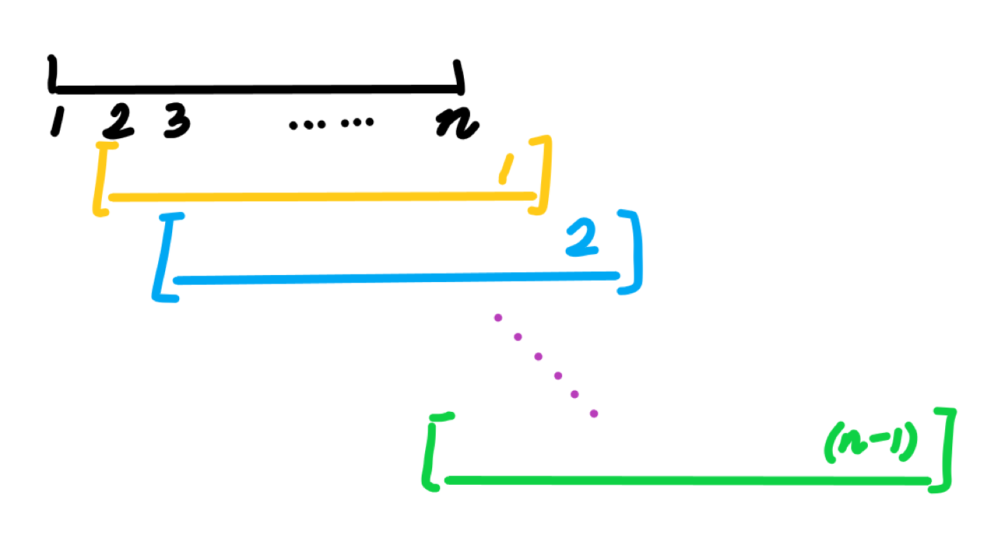
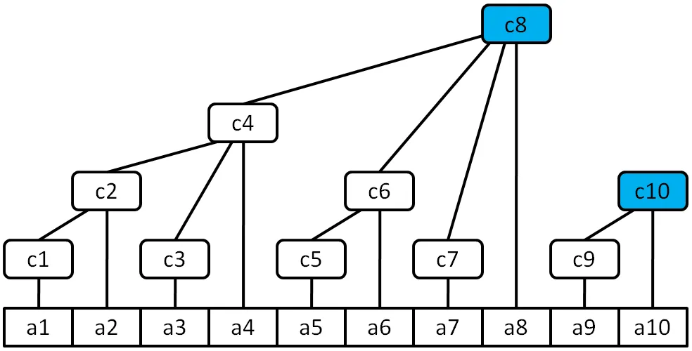

# Tutorial_(en)

[1972A - Contest Proposal](https://codeforces.com/contest/1972/problem/A "Codeforces Round 942 (Div. 2)")

 **Hint 1**Only add problems when they are needed.

 **Tutorial**
### [1972A - Предложение контеста](https://codeforces.com/contest/1972/problem/A "Codeforces Round 942 (Div. 2)")

Enumerate through the array a, if ai>bi at some index i, then propose a problem with difficulty bi.

Time complexity: O(n2) for each test case.

It can also be solved in O(n) if we record the problems we've added.

 **Solution**
```cpp
//By: OIer rui_er
#include <bits/stdc++.h>
#define rep(x, y, z) for(int x = (y); x <= (z); ++x)
#define per(x, y, z) for(int x = (y); x >= (z); --x)
#define endl 'n'
using namespace std;
typedef long long ll;
 
const int N = 105;
 
int T, n, a[N], b[N];
 
int main() {
    ios::sync_with_stdio(false);
    cin.tie(0); cout.tie(0);
    for(cin >> T; T; --T) {
        cin >> n;
        rep(i, 1, n) cin >> a[i];
        rep(i, 1, n) cin >> b[i];
        int diff = 0, ans = 0;
        rep(i, 1, n) {
            if(a[i - diff] > b[i]) {
                ++ans;
                ++diff;
            }
        }
        cout << ans << endl;
    }
    return 0;
}
```
[1972B - Coin Games](https://codeforces.com/contest/1972/problem/B "Codeforces Round 942 (Div. 2)")

 **Hint 1**Is there anything that *never* / *always* changes after each operation?

 **Hint 2**The parity.

 **Tutorial**
### [1972B - Игры с монетками](https://codeforces.com/contest/1972/problem/B "Codeforces Round 942 (Div. 2)")

It can be proved that Alice will win the game if and only if the number of facing-up coins is odd.

Time complexity: O(n) for each case.

Proof:

Consider all possible operations:

* ...UUU... -> ...DD...: The number of U decreases by 3.
* ...UUD... -> ...DU...: The number of U decreases by 1.
* ...DUU... -> ...UD...: The number of U decreases by 1.
* ...DUD... -> ...UU...: The number of U increases by 1.

It can be seen that the parity always changes.

It's obvious that if the number of U is equal to 0, the player loses because there aren't any available operations. So Alice wins if and only if the number of U is odd.

 **Solution**
```cpp
//By: OIer rui_er
#include <bits/stdc++.h>
#define rep(x, y, z) for(int x = (y); x <= (z); ++x)
#define per(x, y, z) for(int x = (y); x >= (z); --x)
#define endl 'n'
using namespace std;
typedef long long ll;
 
int T, n;
string s;
 
int main() {
    ios::sync_with_stdio(false);
    cin.tie(0); cout.tie(0);
    for(cin >> T; T; --T) {
        cin >> n >> s;
        int cntU = 0;
        for(char c : s) if(c == 'U') ++cntU;
        if(cntU & 1) cout << "YES" << endl;
        else cout << "NO" << endl;
    }
    return 0;
}
```
[1967A - Permutation Counting](../problems/A._Permutation_Counting.md "Codeforces Round 942 (Div. 1)")

 **Hint 1**What's the answer if a1=a2=⋯=an and k=0?

 **Hint 2**What's the answer if k=0?

 **Hint 3**You've already known the O(k) solution. How to improve it?

 **Tutorial**
### [1967A - Подсчет перестановок](../problems/A._Permutation_Counting.md "Codeforces Round 942 (Div. 1)")

If a1=a2=⋯=an and k=0, it's obvious that the optimal rearrangement is [1,2,⋯,n,1,2,⋯,n,⋯,1,2,⋯,n], because every subarray of length n is a permutation of 1∼n.

WLOG, assume that a1≥a2≥⋯an=w. If k=0, we can insert more numbers at the back and form more permutations. But because an is the minimum number, we can only make these subarrays become permutations:



The remaining cards can be placed arbitrarily. This won't always be satisfied (if an−1=w, the green subarray won't exist). But this will only happen if an−1=w is also minimum. It's the same for an−2 etc. So we can calculate the answer:

ans=nw−n∑i=1[ai=w]+1

Considering k>0 cases, we find that every time we choose a minimum ai and increase it by 1, the answer will be increased. And the answer won't change if we increase some other ai. So we have two different approaches:

* Sort the array a, enumerate the range where the minimum number will be, and check if it's possible. If so, we can just calculate by using the above equation.
* Binary search the w after buying cards. After calculating the array a after buying cards, we will be able to calculate the answer.

Time complexity: O(nlogn) or O(nlogai).

 **Solution**
```cpp
#include<bits/stdc++.h>
using namespace std;
void solve()
{
    int n;long long k;
    cin>>n>>k;
    vector<long long>a(n);
    for(int x=0;x<n;x++)
    cin>>a[x];
    sort(a.begin(),a.end());
    reverse(a.begin(),a.end());
    long long lst=a.back(),cnt=1;
    a.pop_back();
    while(!a.empty()&&lst==a.back())a.pop_back(),cnt++;
    while(!a.empty())
    {
        long long delta=a.back()-lst;
        if(k<delta*cnt)break;
        k-=delta*cnt;
        lst=a.back();
        while(!a.empty()&&lst==a.back())a.pop_back(),cnt++;
    }
    lst+=k/cnt;
    k%=cnt;
    cnt-=k;
    cout<<lst*n-cnt+1<<endl;
}
main()
{
    ios::sync_with_stdio(false),cin.tie(0);
    int t;
    cin>>t;
    while(t--)solve();
}
```
[1967B1 - Reverse Card (Easy Version)](../problems/B1._Reverse_Card_(Easy_Version).md "Codeforces Round 942 (Div. 1)")

 **Hint 1**Denote gcd(a,b) as d.

 **Hint 2**Did you notice that b∣a? How to prove that?

 **Tutorial**
### [1967B1 - Переворотная карта (простая версия)](../problems/B1._Reverse_Card_(Easy_Version).md "Codeforces Round 942 (Div. 1)")

Denote gcd(a,b) as d. Assume that a=pd and b=qd, then we know that gcd(p,q)=1.

(b⋅gcd(a,b))∣(a+b)⟺(qd2)∣(pd+qd)⟺(qd)∣(p+q).

Assume that p+q=kqd, then p=(kd−1)q. We know q=1 because gcd(p,q)=1.

Enumerate d from 1 to m, we know p+1=kd≤⌊nd⌋+1, so we add ⌊⌊nd⌋+1d⌋ to answer.

In this method, p=0,k=1,d=1 will also be included in the answer, so we should subtract 1 from the answer.

Time Complexity: O(∑m).

 **Solution**
```cpp
#include<bits/stdc++.h>
using namespace std;
typedef long long ll;
const int N=2000005;
int tc,n,m; ll ans;
inline void solve(){
	cin>>n>>m; ans=0;
	for(int i=1;i<=m;i++)
		ans+=(n+i)/(1ll*i*i);
	cout<<ans-1<<'n';
}
int main(){
	ios::sync_with_stdio(0); cin.tie(0); cout.tie(0);
	cin>>tc; while(tc--) solve();
	return 0;
}
```
[1967B2 - Reverse Card (Hard Version)](../problems/B2._Reverse_Card_(Hard_Version).md "Codeforces Round 942 (Div. 1)")

 **Hint 1**Denote gcd(a,b) as d. Assume that a=pd and b=qd.

 **Hint 2**gcd(p,q)=1.

 **Hint 3**How large could p and q be?

 **Tutorial**
### [1967B2 - Переворотная карта (сложная версия)](../problems/B2._Reverse_Card_(Hard_Version).md "Codeforces Round 942 (Div. 1)")

Denote gcd(a,b) as d. Assume that a=pd and b=qd, then we know that gcd(p,q)=1.

(a+b)∣(b⋅gcd(a,b))⟺(pd+qd)∣(qd2)⟺(p+q)∣(qd).

We know that gcd(p+q,q)=gcd(p,q)=1, so (p+q)∣d.

We also know that p≥1,q≥1, so p<d=ap≤np and thus p2<n. Similarly, we can prove q2<m.

So the number of (p,q) is O(√nm)=O(n+m). We can enumerate each (p,q) such that gcd(p,q)=1 and calculate the answer. (p+q)∣d is required, so we add ⌊min{⌊np⌋,⌊mq⌋}p+q⌋.

Time Complexity: O(∑n+∑m).

 **Solution**
```cpp
#include <bits/stdc++.h>
using namespace std;
 
#define nl "n"
#define nf endl
#define ll long long
#define pb push_back
#define _ << ' ' <<
 
#define INF (ll)1e18
#define mod 998244353
#define maxn 110
 
int main() {
    ios::sync_with_stdio(0);
    cin.tie(0);
 
    #if !ONLINE_JUDGE && !EVAL
        ifstream cin("input.txt");
        ofstream cout("output.txt");
    #endif
    int t;
    cin>>t;
    while(t--)
    {
        ll n,m; cin >> n>>m;
        ll sq = sqrt(n) + 2,sqm=sqrt(m)+2;
    
        vector bad(sq + 1, vector<bool>(sqm+1, 0));
        for (ll i = 2; i <= min(sq,sqm); i++) {
            for (ll a = i; a <= sq; a += i) {
                for (ll b = i; b <= sqm; b += i) {
                    bad[a][b] = true;
                }
            }
        }
    
        ll ans = 0;
        for (ll a = 1; a * a <= n; a++) {
            for (ll b = 1; b * b <= m; b++) {
                if (bad[a][b]) continue;
                ans += min(n/(a+b)/a,m/(a+b)/b);
            }
        }
        cout << ans << nl;
    }
 
    return 0;
}
```
[1967C - Fenwick Tree](../problems/C._Fenwick_Tree.md "Codeforces Round 942 (Div. 1)")

 **Hint 1**The height of a Fenwick Tree is O(logn), so operations like enumerating ancestors of each vertex will be acceptable.

 **Hint 2**What's the coefficient of au in each b value of its ancestors?

 **Tutorial**
### [1967C - Дерево Фенвика](../problems/C._Fenwick_Tree.md "Codeforces Round 942 (Div. 1)")

It's well-known that Fenwick Tree is the data structure shown in the image below, and the sum of each subtree is stored at each vertex (i.e. c=f(a) and cu=∑v in subtree of uav).



Denote the depth of a vertex u as dep(u). Assume that b=fk(a). Consider a vertex u and one of its ancestors v. Let Δd=dep(u)−dep(v). It can be easily proved (by using the stars and bars method or generating functions) that the coefficient of au in bv is \binom{\Delta d+k-1}{\Delta d}.

Obviously, a_u=b_u is satisfied for each leaf u. Enumerate each vertex u whose a value is already known (just in the increasing order is fine), and all its ancestors v, remove the \textrm{coefficient}\cdot a_u part from b_v, and we can calculate the a value of each vertex.

Time complexity is \mathcal O(n\log n) because the height of a Fenwick Tree is \mathcal O(\log n).

 **Solution**
```cpp
//By: OIer rui_er
#include <bits/stdc++.h>
#define rep(x, y, z) for(int x = (y); x <= (z); ++x)
#define per(x, y, z) for(int x = (y); x >= (z); --x)
#define debug(format...) fprintf(stderr, format)
#define fileIO(s) do {freopen(s".in", "r", stdin); freopen(s".out", "w", stdout);} while(false)
#define endl 'n'
using namespace std;
typedef long long ll;
 
mt19937 rnd(std::chrono::duration_cast<std::chrono::nanoseconds>(std::chrono::system_clock::now().time_since_epoch()).count());
int randint(int L, int R) {
    uniform_int_distribution<int> dist(L, R);
    return dist(rnd);
}
 
template<typename T> void chkmin(T& x, T y) {if(x > y) x = y;}
template<typename T> void chkmax(T& x, T y) {if(x < y) x = y;}
 
template<int mod>
inline unsigned int down(unsigned int x) {
	return x >= mod ? x - mod : x;
}
 
template<int mod>
struct Modint {
	unsigned int x;
	Modint() = default;
	Modint(unsigned int x) : x(x) {}
	friend istream& operator>>(istream& in, Modint& a) {return in >> a.x;}
	friend ostream& operator<<(ostream& out, Modint a) {return out << a.x;}
	friend Modint operator+(Modint a, Modint b) {return down<mod>(a.x + b.x);}
	friend Modint operator-(Modint a, Modint b) {return down<mod>(a.x - b.x + mod);}
	friend Modint operator*(Modint a, Modint b) {return 1ULL * a.x * b.x % mod;}
	friend Modint operator/(Modint a, Modint b) {return a * ~b;}
	friend Modint operator^(Modint a, int b) {Modint ans = 1; for(; b; b >>= 1, a *= a) if(b & 1) ans *= a; return ans;}
	friend Modint operator~(Modint a) {return a ^ (mod - 2);}
	friend Modint operator-(Modint a) {return down<mod>(mod - a.x);}
	friend Modint& operator+=(Modint& a, Modint b) {return a = a + b;}
	friend Modint& operator-=(Modint& a, Modint b) {return a = a - b;}
	friend Modint& operator*=(Modint& a, Modint b) {return a = a * b;}
	friend Modint& operator/=(Modint& a, Modint b) {return a = a / b;}
	friend Modint& operator^=(Modint& a, int b) {return a = a ^ b;}
	friend Modint& operator++(Modint& a) {return a += 1;}
	friend Modint operator++(Modint& a, int) {Modint x = a; a += 1; return x;}
	friend Modint& operator--(Modint& a) {return a -= 1;}
	friend Modint operator--(Modint& a, int) {Modint x = a; a -= 1; return x;}
	friend bool operator==(Modint a, Modint b) {return a.x == b.x;}
	friend bool operator!=(Modint a, Modint b) {return !(a == b);}
};
 
const int N = 1e6 + 100, mod = 998244353;
typedef Modint<mod> mint;
 
int T, n, k;
mint a[N], inv[N];
 
inline int lowbit(int x) {return x & -x;}
 
int main() {
    ios::sync_with_stdio(false);
    cin.tie(0); cout.tie(0);
    inv[0] = inv[1] = 1;
    rep(i, 2, N - 1) inv[i] = (mod - mod / i) * inv[mod % i];
    for(cin >> T; T; --T) {
        cin >> n >> k;
        rep(i, 1, n) cin >> a[i];
        rep(i, 1, n) {
            mint mul = 1;
            for(int u = i + lowbit(i), d = 1; u <= n; u += lowbit(u), ++d) {
                mul *= (d + k - 1) * inv[d];
                a[u] -= mul * a[i];
            }
        }
        rep(i, 1, n) cout << a[i] << " n"[i == n];
    }
    return 0;
}
```
[1967D - Long Way to be Non-decreasing](../problems/D._Long_Way_to_be_Non-decreasing.md "Codeforces Round 942 (Div. 1)")

 **Hint 1**Binary search on the answer of magics.

 **Hint 2**You may come up with many \mathcal O(m\log m + n\log^2 m) solutions with heavy data structures. Unfortunately, none of them is helpful.

 **Hint 3**The key is to judge \mathcal O(m\log n) times whether vertex u is reachable from vertex v in k steps, instead of querying the minimal value or something else.

 **Tutorial**
### [1967D - Длинный путь к неубыванию](../problems/D._Long_Way_to_be_Non-decreasing.md "Codeforces Round 942 (Div. 1)")

If we separately consider each operation, it could be really hard.

Thus, binary search on the answer of magics. Greedily, we want a_1 as small as possible, and then a_2, etc.

Enumerate i from 1 to n. Enumerate a_i = w for w from 1 to m. If it is possible for a_i = w after k steps, i \gets i + 1; Otherwise, w \gets w + 1. If i gets to n + 1 first, it's valid. If w gets to m + 1 first, it's invalid.

The last question is how to judge whether vertex u is reachable from vertex v in k steps in \mathcal O(1) time.

Build a graph with edges i \to p_i. Assume that the graph is a tree, now the condition is equivalent to

* dep_u - dep_v \leq k;
* u is in the subtree of v. We can simply check the DFS order and size: dfn_v < dfn_u < dfn_v + sz_v.

However, the graph contains n vertices and n edges, so it turns out to be a pseudo forest. One of the processing ways is to cut one edge on the cycle of each pseudo tree. If the path from u to v doesn't contain the edge, we process the above method. Otherwise, let the cut edge be s \Rightarrow t (In fact, s is exactly the root of the tree), and we want u \to s \Rightarrow t \to v, so

* dep_s - dep_u + dep_v - dep_t + 1 \leq k;
* u is in the subtree of s, while t is in the subtree of v.

It takes a little time to implement, but be patient and clear-minded, and you are sure to get Accepted.

 **Solution**
```cpp
#include <bits/stdc++.h>
 
namespace FastIO {
	template <typename T> inline T read() { T x = 0, w = 0; char ch = getchar(); while (ch < '0' || ch > '9') w |= (ch == '-'), ch = getchar(); while ('0' <= ch && ch <= '9') x = x * 10 + (ch ^ '0'), ch = getchar(); return w ? -x : x; }
	template <typename T> inline void write(T x) { if (!x) return; write<T>(x / 10), putchar(x % 10 ^ '0'); }
	template <typename T> inline void print(T x) { if (x < 0) putchar('-'), x = -x; else if (x == 0) putchar('0'); write<T>(x); }
	template <typename T> inline void print(T x, char en) { if (x < 0) putchar('-'), x = -x; else if (x == 0) putchar('0'); write<T>(x), putchar(en); }
}; using namespace FastIO;
 
#define MAXM 1000001
int dep[MAXM], id[MAXM], dfn[MAXM], to[MAXM], sz[MAXM], tot = 0;
std::vector<int> ch[MAXM];
void dfs(int u) {
	sz[u] = 1, dfn[u] = ++tot;
	for (int v : ch[u]) {
		dep[v] = dep[u] + 1, id[v] = id[u];
		dfs(v), sz[u] += sz[v];
	}
}
inline bool inSub(int u, int v) /* v in u ? */ { return dfn[u] <= dfn[v] && dfn[v] < dfn[u] + sz[u]; }
constexpr int INF = 0x3f3f3f3f;
inline int query(int u, int v) /* u -> v */ {
	if (u == v) return 0;
	if (id[u] != id[v]) return INF;
	int res = INF;
	if (inSub(v, u)) res = dep[u] - dep[v];
	if (inSub(v, to[id[u]])) res = std::min(dep[u] - dep[v] + dep[to[id[u]]] + 1, res);
	// printf("query(%d, %d) = %dn", u, v, res);
	return res;
}
 
#define MAXN 1000001
int a[MAXN], N, M;
bool check(int val) {
	// printf("check %dn", val);
	int lst = 1;
	for (int i = 1; i <= N; ++i) {
		while (lst <= M && query(a[i], lst) > val) ++lst;
		if (lst > M) return false;
		// printf("a[%d] = %dn", i, lst);	
	}
	return true;
}
 
namespace DSU {
	int fa[MAXM];
	void inis(int n) { for (int i = 1; i <= n; ++i) fa[i] = i; }
	inline int find(int x) { return x == fa[x] ? x : fa[x] = find(fa[x]); }
	inline bool merge(int x, int y) { if (find(x) == find(y)) return false; fa[fa[x]] = fa[y]; return true; }
}; using namespace DSU;
 
int main() {
	int T = read<int>();
	while (T--) {
		N = read<int>(), M = read<int>(), inis(M);
		for (int i = 1; i <= N; ++i) a[i] = read<int>();
		for (int x = 1; x <= M; ++x) dep[x] = id[x] = dfn[x] = to[x] = sz[x] = 0, ch[x].clear();
		tot = 0;
		for (int i = 1, p; i <= M; ++i) {
			p = read<int>();
			if (merge(i, p)) ch[p].push_back(i); else to[i] = p;
		}
		for (int i = 1; i <= M; ++i) if (to[i] > 0) id[i] = i, dfs(i);
		if (!check(M)) { puts("-1"); continue; }
		int L = 0, R = M;
		while (L < R) {
			int mid = L + R >> 1;
			if (check(mid)) R = mid; else L = mid + 1;
		}
		print<int>(R, 'n');
	}
}
```
[1967E1 - Again Counting Arrays (Easy Version)](../problems/E1._Again_Counting_Arrays_(Easy_Version).md "Codeforces Round 942 (Div. 1)")

 **Hint 1**Use the simplest way to judge if an a is valid.

 **Hint 2**We've got a \mathcal O(nm) solution. Our target time complexity is \mathcal O(n\sqrt{n}).

 **Hint 3**It can be boiled down to a grid path counting problem.

 **Tutorial**Tutorial is loading... **Solution**
```cpp
#include <bits/stdc++.h>
 
namespace FastIO {
	template <typename T> inline T read() { T x = 0, w = 0; char ch = getchar(); while (ch < '0' || ch > '9') w |= (ch == '-'), ch = getchar(); while ('0' <= ch && ch <= '9') x = x * 10 + (ch ^ '0'), ch = getchar(); return w ? -x : x; }
	template <typename T> inline void write(T x) { if (!x) return; write<T>(x / 10), putchar(x % 10 ^ '0'); }
	template <typename T> inline void print(T x) { if (x < 0) putchar('-'), x = -x; else if (x == 0) putchar('0'); write<T>(x); }
	template <typename T> inline void print(T x, char en) { if (x < 0) putchar('-'), x = -x; else if (x == 0) putchar('0'); write<T>(x), putchar(en); }
}; using namespace FastIO;
 
#define MAXN 2000001
namespace Maths {
	constexpr int MOD = 998244353;
	long long qpow(long long a, long long x) { long long ans = 1; while (x) (x & 1) && (ans = ans * a % MOD), a = a * a % MOD, x >>= 1; return ans; }
	long long frac[MAXN << 1 | 1], prac[MAXN << 1 | 1];
	inline void inis(int V = MAXN * 2) { frac[0] = prac[0] = 1; for (int i = 1; i <= V; ++i) frac[i] = frac[i - 1] * i % MOD; prac[V] = qpow(frac[V], MOD - 2); for (int i = V - 1; i; --i) prac[i] = prac[i + 1] * (i + 1) % MOD; }
	inline long long C(int N, int M) { if (N < 0 || M < 0 || N < M) return 0; return frac[N] * prac[M] % MOD * prac[N - M] % MOD; }
}; using namespace Maths;
 
struct Point {
	int x, y;
	Point () {}
	Point (int X, int Y) : x(X), y(Y) {}
	inline void flip(int b) { x += b, y -= b, std::swap(x, y); }
	inline int calc() { return C(x + y, y); }
} pA, pB;
 
inline void add(int& x, int y) { (x += y) >= MOD && (x -= MOD); }
inline void del(int& x, int y) { (x -= y) < 0 && (x += MOD); }
 
int calc(int p, int q, int b1, int b2) {
	pA = pB = Point(p, q);
	int ans = pA.calc();
	while (pA.x >= 0 && pA.y >= 0) 
		pA.flip(b1), del(ans, pA.calc()), pA.flip(b2), add(ans, pA.calc());
	while (pB.x >= 0 && pB.y >= 0) 
		pB.flip(b2), del(ans, pB.calc()), pB.flip(b1), add(ans, pB.calc());
	return ans;
}
 
int dp[2][3001], powm[MAXN];
void solve() {
	int N = read<int>(), M = read<int>(), b0 = read<int>();
	if (b0 >= M) return (void)print<int>(qpow(M, N), 'n');
	powm[0] = 1; for (int i = 1; i <= N; ++i) powm[i] = 1ll * M * powm[i - 1] % MOD;
	if (1ll * M * M <= N) { // dp
		for (int k = 0; k < M; ++k) dp[0][k] = (int)(k == b0), dp[1][k] = 0;
		int ans = 1ll * dp[0][M - 1] * (M - 1) % MOD * powm[N - 1] % MOD;
		for (int i = 1; i <= N; ++i) {
			auto now = dp[i & 1], lst = dp[(i & 1) ^ 1];
			now[0] = 0; for (int k = 0; k + 1 < M; ++k) now[k + 1] = 1ll * lst[k] * (M - 1) % MOD;
			for (int k = 1; k < M; ++k) add(now[k - 1], lst[k]);
			if (i < N) add(ans, 1ll * now[M - 1] * (M - 1) % MOD * powm[N - i - 1] % MOD);
		}
		for (int k = 0; k < M; ++k) add(ans, dp[N & 1][k]);
		print<int>(ans, 'n');
	} else { // reflective inclusion-exclusion
		const int B1 = M - b0, B2 = -1 - b0; int ans = qpow(M, N);
		for (int x = b0, y = 0, k = 1, p = b0; p < N; p += 2, ++x, ++y, k = 1ll * k * (M - 1) % MOD) 
			del(ans, 1ll * calc(x, y, B1, B2) * k % MOD * powm[N - p - 1] % MOD);
		print<int>(ans, 'n');
	}
}
 
int main() { int T = read<int>(); inis(); while (T--) solve(); return 0; }
```
[1967E2 - Again Counting Arrays (Hard Version)](../problems/E2._Again_Counting_Arrays_(Hard_Version).md "Codeforces Round 942 (Div. 1)")

Thanks [A_G](https://codeforces.com/profile/A_G "Legendary Grandmaster A_G") for discovering that E2 is possible!

 **Hint 1**Solve E1 with \mathcal O(n\sqrt{n}) solution first (The \mathcal O(n\log^2n) solution doesn't help much in E2).

 **Hint 2**For a single round of inclusion-exclusion, write down the form of the answer as simple as possible.

 **Tutorial**
### [1967E2 - Снова считаем массивы (сложная версия)](../problems/E2._Again_Counting_Arrays_(Hard_Version).md "Codeforces Round 942 (Div. 1)")

The definition of the function f is the same as that in G1 editorial. Please read that first.

Consider the process of the reflection method. We don't need to enumerate the place from where the contribution is 0. We can just consider the contribution of each path. Note that each step is either x\gets x+1 or y\gets y\pm 1 here, instead of rotating it by 45^\circ.

Denote \tt X as touching y=m and \tt Y as touching y=-1. Then we need to calculate the paths that either are empty or begin with \tt X. We can write down the equation of the answer: f(\varnothing) - f(\texttt{Y}) + f(\texttt{XY}) - f(\texttt{YXY}) + f(\texttt{XYXY}) - \dots.

Let's consider how to calculate f(\varnothing). We can represent it as:

\sum_{x=b-n}^{b+n} (m - 1)^{(x - b + n)/2} {n \choose (x - b + n) / 2}

A point (n,k) will be flipped at (n,-2-k) after \tt Y, and will be flipped at (n,2m+2+k) after \tt XY. So we only need to calculate:

\sum_{p \geq 0} \sum_{x = b - n}^{b + n} (m - 1)^{(x - b + n)/2} {n \choose (x - b + n + p(2m + 2))/2}\\\\-\sum_{p \geq 0} \sum_{x =b-n}^{b+n} (m - 1)^{(x - b + n)/2} {n \choose (-2 - x - b + n + p(2m + 2))/2}

There are still some small problems. The reflection method points out that, if the targeted point T is between the two lines, then we can keep reflecting T and get T', every path to T' bijects to a path to T which contains reflections. But what if T is not between the two lines? We must solve a problem — the path to T' maybe doesn't touch the two lines at all and there won't be reflections, and these should not be included in the answer. So we should consider x\ge 0 part and x\le -1 part separately. The above equation is for the x\ge 0 part. For the x\le -1 part, we are sure that \tt Y will occur, so the path should begin with \tt X, then it will be f(\texttt{X})-f(\texttt{YX})+f(\texttt{XYX})-\dots and can be calculated in the same way.

The combinatorial number is hard to deal with, so let's maintain a coefficient sequence c_0\cdots c_n, that the answer is \sum_i c_i\binom{n}{i}. The sequence c_i can be calculated using differentiation.

Time Complexity: \mathcal O(n).

 **Solution**
```cpp
#include <bits/stdc++.h>
using namespace std;
 
const int MOD = 998244353;
const int N = 2e6+5;
int inv[N];
 
int inversemod(int p, int q) {
  // assumes p > 0
  // https://codeforces.com/blog/entry/23365
  return (p > 1 ? q-1LL*inversemod(q%p, p)*q/p : 1);
}
 
void add(int& x, int y) {
  x += y;
  if (x >= MOD) x -= MOD;
}
 
void sub(int& x, int y) {
  x -= y;
  if (x < 0) x += MOD;
}
 
int solve(int n, int m, int b0) {
  // let X = hit -1, Y = hit m
  // f(S) = count of sequences that end up in [0, infty] while containing the pattern S
  // g(S) = count of sequences that end up in [-infty, -1] while containing the pattern S
  // we want f() - f(X) + f(YX) - f(XYX) + f(YXYX) - f(XYXYX) + ...
  //             + g(Y) - g(XY) + g(YXY) - g(XYXY) + g(YXYXY) - ...
  vector<int> pw(n+1);
  pw[0] = 1;
  for (int i = 1; i <= n; i++) pw[i] = 1LL*pw[i-1]*(m-1) % MOD;
 
  // final ans will be sum from i = 0 to n of (n choose i) a_i
  vector<int> a(n+2);
  auto work = [&] (int c, int pw_coeff, int sgn_x) -> bool {
    // let RANGE = [-infty, -1] if sgn_x == -1 and [0, infty] if sgn_x == 1
    // for all x in RANGE such that (n+x+c)/2 is between 0 and n inclusive,
    // add pw_coeff*pw[(n+x-b0)/2] to a[(n+x+c)/2]
 
    // return 0 to signal that we are out of bounds and should exit, otherwise 1
    int l = 0;
    if (sgn_x == 1) l = max(l, (n+c+1)>>1);
    int r = n;
    if (sgn_x == -1) r = min(r, (n+c-1)>>1);
    if (l > r) return 0;
    add(a[l], 1LL*pw_coeff*pw[l-(b0+c)/2] % MOD);
    sub(a[r+1], 1LL*pw_coeff*pw[r+1-(b0+c)/2] % MOD);
    return 1;
  };
 
  int ans = 0;
  // f(k*YX)
  // after reflection trick, end up in x + 2*(m+1)*k
  for (int k = 0; work(2*(m+1)*k - b0, 1, 1); k++);
 
  // f(X + k*YX)
  // after reflection trick, end up in -2-x - 2*(m+1)*k
  for (int k = 0; work(2*(m+1)*k+2+b0, MOD-1, 1); k++);
 
  // g(Y + k*XY)
  // after reflection trick, end up in 2*m-x + 2*(m+1)*k
  for (int k = 0; work(-2*m -2*(m+1)*k + b0, 1, -1); k++);
 
  // g(k*XY)
  // after reflection trick, end up in x - 2*(m+1)*k
  for (int k = 1; work(-2*(m+1)*k - b0, MOD-1, -1); k++);
 
  for (int i = 1; i <= n; i++) {
    add(a[i], 1LL*a[i-1]*(m-1) % MOD);
  }
 
  // do the binomial stuff without precalculated factorials because why not
  int coeff = 1;
  for (int i = 0; i <= n; i++) {
    add(ans, 1LL * coeff * a[i] % MOD);
    coeff = 1LL * coeff * (n-i) % MOD * inv[i+1] % MOD;
  }
 
  return ans;
}
 
int main () {
  ios_base::sync_with_stdio(0); cin.tie(0);
  inv[1] = 1;
  for (int i = 2; i < N; i++) inv[i] = 1LL*(MOD-MOD/i)*inv[MOD % i] % MOD;
 
  int T;
  cin >> T;
  while (T--) {
    int n, m, b0;
    cin >> n >> m >> b0;
    if (b0 >= m) {
      int ans = 1;
      for (int i = 0; i < n; i++) ans = 1LL*ans*m % MOD;
      cout << ans << 'n';
      continue;
    }
    cout << solve(n, m, b0) << 'n';
  }
}
```
[1967F - Next and Prev](../problems/F._Next_and_Prev.md "Codeforces Round 942 (Div. 1)")

 **Hint 1**How to maintain \sum\min(nxt_i-pre_i,x)? Try \sum\min(nxt_i-i,x)+\min(i-pre_i,x).

 **Hint 2**To maintain \sum\min(nxt_i-i,x), we can use chunking. Just +1 and \operatorname{chkmin}.

 **Hint 3**To finish it, consider what we do in segment-beats.

 **Tutorial**
### [1967F - Следующий и предыдущий](../problems/F._Next_and_Prev.md "Codeforces Round 942 (Div. 1)")

Consider an array with length n+x-1. For each integer k from n to 1, consider i s.t. p_i = k, we tag the untagged (that is, a position will not be tagged for a second time) positions in the range [i, i + x)\cap \mathbb{Z}. By examining the total number of positions tagged, we have

 \begin{aligned} n + x - 1 &= \sum_{i=1}^n \max(\min(i + x, nxt_i) - \max(pre_i + x, i), 0) \\\ &= \sum_{i=1}^n \max(\min(x, nxt_i - i) + \min(i - pre_i, x) - x, 0) \\\ &= \sum_{i=1}^n \min(x, nxt_i - i) + \min(i - pre_i, x) -\min(x, \min(x, nxt_i - i) + \min(i - pre_i, x)) \\\ &= \sum_{i=1}^n \min(x, nxt_i - i) + \min(i - pre_i, x) - \min(x, nxt_i - pre_i) \\\ \end{aligned} 

Symmetrically on the other side, we only have to compute \displaystyle \sum_{i=1}^n \min(x, nxt_i - i). We want to maintain all nxt_i - i in a sorted order, so that queries can be done using binary search.

This can be done with the help of chunking. Let the length of each block be B. In each block, we divide the positions into two categories: Positions with the maximum nxt_i (hereinafter referred to as \tt A) and positions without the maximum nxt_i (hereinafter referred to as \tt B). We sort the positions by nxt_i - i for A and for B respectively.

How does an update affect the nxt_i - i values? For the block that the new number is inserted, we brutely reconstruct it. For an affected complete block, the update is +1(nxt_i\gets nxt_i+1) or \operatorname{chkmin}(nxt_i \gets \min(nxt_i, pos)). A +1 operation can just be handled with a lazy tag.

For a \operatorname{chkmin} operation, if it only affects the elements with maximum nxt_i, it can be done lazily, otherwise you can reconstruct the whole block.

Let the potential of a block \Phi:= \text{Numbers of different } nxt_i \text{ values in the block}. Similar to the segment tree beats, each insertion increases \sum \Phi by at most 1, and each brute reconstruction takes \mathcal O(B) time and decreases \sum \Phi by at least 1. Therefore the overall time complexity for the insertion part would be \mathcal O(nB + \frac{n^2}{B}).

To answer a query, we iterate over all the different blocks. If we precalculate the prefix sums of nxt_i - i in the sorted order, with a simple binary search, this part can be done easily in \mathcal O(\frac{nk\log B}{B}).

Let B = \mathcal O(\sqrt{n}). The time complexity would be \mathcal O(n\sqrt{n} + k\sqrt{n}\log n), while the space complexity is \mathcal O(n). Merge sorting or fractional cascading will make the time complexity \mathcal O((n + k)\sqrt{n}), but it runs slower than the previously mentioned solution.

 **Solution**
```cpp
#include<bits/stdc++.h>
using namespace std;
 
constexpr int maxn=300010,maxq=100010,B=400;
 
int n,bn,a[maxn],b[maxn],idx[maxn],nxt[maxn],add[maxn/B+5],mxadd[maxn/B+5],mx[maxn/B+5],se[maxn/B+5],t[maxn];
long long ans[maxq];
vector<int>val[maxn/B+5],mxval[maxn/B+5],pre[maxn/B+5],mxpre[maxn/B+5],pos[maxn/B+5],ks[maxn];
 
void vAdd(int i)
{
	for(;i<=n;i+=(i&-i)) t[i]++;
}
 
int nQuery(int i)
{
	int s=0;
	for(;i;i-=(i&-i)) s+=t[i];
	return s;
}
 
void vWork()
{
	int i,j,tot=0;
	for(i=1;i<=n;i++) b[a[i]]=i;
	for(i=1;i<=n;i++)
	{
		int p=b[i],bp=(p-1)/B+1;
		val[bp].clear();
		mxval[bp].clear();
		auto radixsort=[](vector<int>&v)
		{
			if(v.empty()) return;
			static int buc[1024],res[B+5];
			auto tmp=minmax_element(v.begin(),v.end());
			int mn=*tmp.first,rg=*tmp.second-mn;
			if(!rg) return;
			int lv=__lg(rg)/2+1,len=1<<lv,i;
			memset(buc,0,len*4);
			for(int &it:v) it-=mn,buc[it&(len-1)]++;
			for(i=1;i<len;i++) buc[i]+=buc[i-1];
			for(int it:v) res[--buc[it&(len-1)]]=it;
			memset(buc,0,len*4);
			for(int it:v) buc[it>>lv]++;
			for(i=1;i<len;i++) buc[i]+=buc[i-1];
			for(i=v.size()-1;i>=0;i--) v[--buc[res[i]>>lv]]=res[i]+mn;
		};
		auto getpre=[&](vector<int>&pre,const vector<int>&ori)
		{
			pre.resize(ori.size());
			if(ori.empty()) return;
			pre[0]=ori[0];
			for(int i=1;i<(int)ori.size();i++) pre[i]=pre[i-1]+ori[i];
		};
		int lstmx=mx[bp];
		vAdd(p);
		idx[p]=nQuery(p);
		mx[bp]=nxt[p]=n*2;
		se[bp]=0;
		auto it=pos[bp].begin();
		for(;it<pos[bp].end();it++)
		{
			j=*it;
			if(j>p) break;
			nxt[j]+=add[bp];
			if(nxt[j]>lstmx) nxt[j]+=mxadd[bp];
			nxt[j]=min(nxt[j],idx[p]);
			idx[j]+=add[bp];
			if(nxt[j]>mx[bp]) se[bp]=mx[bp],mx[bp]=nxt[j];
			else if(nxt[j]>se[bp]) se[bp]=nxt[j];
		}
		it=pos[bp].insert(it,p);
		for(it++;it!=pos[bp].end();it++)
		{
			j=*it;
			nxt[j]+=add[bp];
			if(nxt[j]>lstmx) nxt[j]+=mxadd[bp];
			nxt[j]++;
			idx[j]+=add[bp]+1;
			if(nxt[j]>mx[bp]) se[bp]=mx[bp],mx[bp]=nxt[j];
			else if(nxt[j]>se[bp]) se[bp]=nxt[j];
		}
		for(int j:pos[bp])
		{
			if(nxt[j]==mx[bp]) mxval[bp].push_back(nxt[j]-idx[j]);
			else val[bp].push_back(nxt[j]-idx[j]);
		}
		add[bp]=mxadd[bp]=0;
		radixsort(val[bp]);
		getpre(pre[bp],val[bp]);
		radixsort(mxval[bp]);
		getpre(mxpre[bp],mxval[bp]);
		for(j=bp+1;j<=bn;j++) add[j]++,mx[j]++,se[j]++;
		for(j=1;j<bp;j++)
		{
			if(mx[j]<=idx[p]) continue;
			if(se[j]<idx[p])
			{
				mxadd[j]+=idx[p]-mx[j],mx[j]=idx[p];
				continue;
			}
			val[j].clear();
			mxval[j].clear();
			lstmx=mx[j];
			mx[j]=idx[p],se[j]=0;
			for(int x:pos[j])
			{
				nxt[x]+=add[j];
				idx[x]+=add[j];
				if(nxt[x]>lstmx) nxt[x]+=mxadd[j];
				if(nxt[x]>=idx[p])
				{
					nxt[x]=idx[p];
					mxval[j].push_back(nxt[x]-idx[x]);
				}
				else
				{
					if(nxt[x]>se[j]) se[j]=nxt[x];
					val[j].push_back(nxt[x]-idx[x]);
				}
			}
			add[j]=mxadd[j]=0;
			radixsort(val[j]);
			getpre(pre[j],val[j]);
			radixsort(mxval[j]);
			getpre(mxpre[j],mxval[j]);
		}
		for(int ki:ks[i])
		{
			tot++;
			for(j=1;j<=bn;j++)
			{
				auto it=lower_bound(val[j].begin(),val[j].end(),ki);
				ans[tot]+=(val[j].end()-it)*ki;
				if(it!=val[j].begin()) ans[tot]+=pre[j][it-val[j].begin()-1];
				it=lower_bound(mxval[j].begin(),mxval[j].end(),ki-mxadd[j]);
				ans[tot]+=(mxval[j].end()-it)*ki;
				if(it!=mxval[j].begin()) ans[tot]+=(it-mxval[j].begin())*mxadd[j]+mxpre[j][it-mxval[j].begin()-1];
			}
		}
	}
}
 
int main()
{
	ios::sync_with_stdio(false),cin.tie(0);
	int T;
	cin>>T;
	while(T--)
	{
    	int i,ki,tot=0;
    	cin>>n;
    	bn=(n-1)/B+1;
    	for(i=1;i<=n;i++) cin>>a[i];
    	for(i=1;i<=n;i++)
    	{
    		cin>>ki;
    		ks[i].resize(ki);
    		for(int &it:ks[i])
    		{
    			cin>>it;
    			ans[++tot]=-(i+it-1);
    		}
    	}
    	vWork();
    	reverse(a+1,a+n+1);
    	for(int x=1;x<=n;x++)
    	t[x]=0;
    	for(i=1;i<=bn;i++) mx[i]=0,se[i]=0,val[i].clear(),mxval[i].clear(),pos[i].clear();
    	vWork();
    	for(int x=1;x<=n;x++)
    	t[x]=0;
    	for(i=1;i<=bn;i++) mx[i]=0,se[i]=0,val[i].clear(),mxval[i].clear(),pos[i].clear();
    	for(i=1;i<=tot;i++) cout<<ans[i]<<'n';
    	tot=0;
	}
	return 0;
}
```
